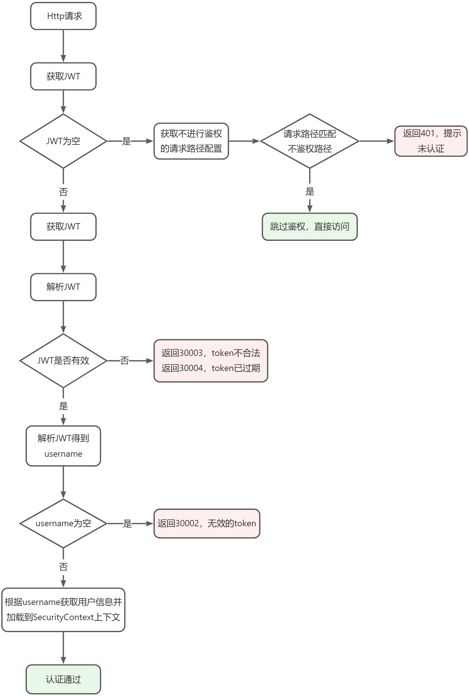
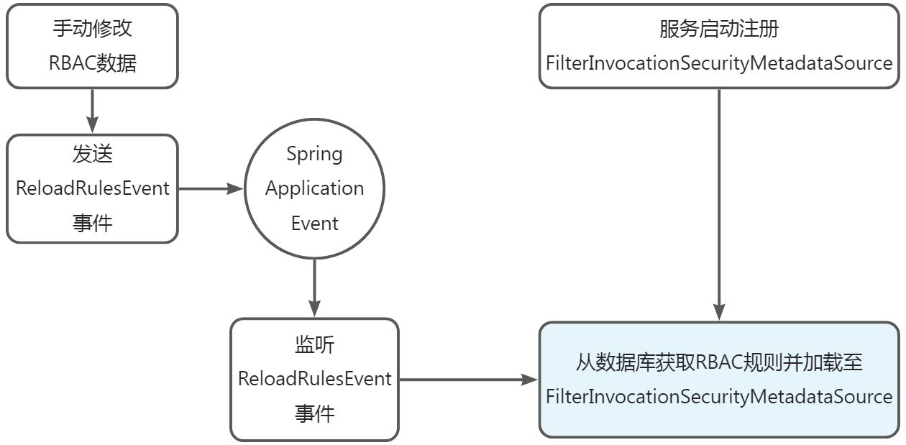

# yutool-auth 认证授权

当前流行的分布式系统、微服务架构由于可以更好地应对日益庞大的用户群体和业务规模，渐渐成为后端主流的架构设计模式。JWT的认证方式，具有服务端不需要存储session的优点，使得服务端认证鉴权业务可以方便扩展，避免为存储session而必须引入Redis等组件，降低了系统架构复杂度。在服务端部署实例的数量和规模逐渐扩大的背景下，可以大大节省服务端存储资源的消耗。
yutool-auth认证授权使用spring-security作为基础框架，通过spring-boot-starter-security接入认证授权及鉴权能力。
## 认证授权流程



## 定制认证鉴权逻辑
编写WebSecurityConfigurerAdapter的子类WebSecurityAutoConfigure定制JWT的认证鉴权流程。
```java
@Configuration
@ConditionalOnBean(annotation = EnableAuthBiz.class)
@AutoConfigureAfter(AuthBizAutoConfigure.class)
@EnableGlobalMethodSecurity(prePostEnabled = true)
public class WebSecurityAutoConfigure extends WebSecurityConfigurerAdapter {
    private final ObjectMapper objectMapper;
    private final IgnoreAuthProperties ignoreAuthProperties;
    private final JwtProps jwtProps;
    private final JwtHelper jwtHelper;
    private final UserDetailsService userDetailsService;
    private final PasswordEncoder passwordEncoder;
    private final UserMapper userMapper;
    private final PermissionService permissionService;

    @Autowired
    public WebSecurityAutoConfigure(ObjectMapper objectMapper, JwtProps jwtProps, IgnoreAuthProperties ignoreAuthProperties,
                                    JwtHelper jwtHelper, UserDetailsService userDetailsService, PasswordEncoder passwordEncoder,
                                    UserMapper userMapper, PermissionService permissionService) {
        this.objectMapper = objectMapper;
        this.jwtProps = jwtProps;
        this.ignoreAuthProperties = ignoreAuthProperties;
        this.jwtHelper = jwtHelper;
        this.userDetailsService = userDetailsService;
        this.passwordEncoder = passwordEncoder;
        this.userMapper = userMapper;
        this.permissionService = permissionService;
    }

    @Bean
    public TokenAuthFilter tokenAuthFilter() {
        return new TokenAuthFilter(objectMapper, ignoreAuthProperties, jwtProps, jwtHelper, userDetailsService);
    }

    @Bean
    public DynamicSecurityMetadataSource dynamicSecurityMetadataSource() {
        return new DynamicSecurityMetadataSource(permissionService, ignoreAuthProperties);
    }

    @Bean
    public ApiAccessDecisionManager apiAccessDecisionManager() {
        return new ApiAccessDecisionManager();
    }

    @Override
    protected void configure(HttpSecurity http) throws Exception {
        http.csrf().disable()
                .headers().frameOptions().disable()
                .and()
                .sessionManagement().sessionCreationPolicy(SessionCreationPolicy.STATELESS)
                .and()
                .exceptionHandling()
                .accessDeniedHandler(((request, response, accessDeniedException) -> {
                    failCodeResult(response, ResultCode.FORBIDDEN);
                }))
                .and()
                .addFilterBefore(tokenAuthFilter(), BasicAuthenticationFilter.class)
                .authorizeRequests()
                .antMatchers(ignoreAuthProperties.getIgnorePaths()).permitAll()
                .withObjectPostProcessor(new ObjectPostProcessor<FilterSecurityInterceptor>() {
                    @Override
                    public <O extends FilterSecurityInterceptor> O postProcess(O fsi) {
                        fsi.setSecurityMetadataSource(dynamicSecurityMetadataSource());
                        fsi.setAccessDecisionManager(apiAccessDecisionManager());
                        return fsi;
                    }
                })
                .anyRequest().authenticated()
                .and()
                .formLogin()
                .loginPage("/login")
                .loginProcessingUrl("/login")
                .successHandler(((request, response, authentication) -> {
                    UserDetailsImpl userDetails = (UserDetailsImpl) authentication.getPrincipal();
                    //记录此用户最近登录时间
                    User user = userMapper.selectById(userDetails.getUserId());
                    if (user != null) {
                        user.setLastSignInTime(LocalDateTime.now(DateTimeConstants.ZONE_ID));
                        userMapper.updateById(user);
                    }
                    //返回JWT
                    Map<String, Object> claims = Maps.newHashMap();
                    claims.put(JwtConstants.SUBJECT, userDetails.getUsername());
                    claims.put(JwtConstants.USER_ID, userDetails.getUserId());
                    String token = jwtHelper.generateToken(claims);
                    successResult(response, token);
                }))
                .failureHandler(((request, response, exception) -> {
                    if (exception instanceof DisabledException) {
                        response.setContentType(MediaType.APPLICATION_JSON_UTF8_VALUE);
                        objectMapper.writeValue(response.getWriter(), ResultWrapper.fail(ResultCode.LOGIN_FAIL.getCode(), "当前用户状态不允许登录"));
                    } else {
                        failCodeResult(response, ResultCode.LOGIN_FAIL);
                    }
                }))
                .permitAll();
    }

    @Override
    protected void configure(AuthenticationManagerBuilder auth) throws Exception {
        auth.userDetailsService(userDetailsService).passwordEncoder(passwordEncoder);
    }

    /**
     * 将返回数据写入response
     * @param response 响应体
     * @param data 返回数据
     * @throws IOException 抛出IOException
     */
    private void successResult(HttpServletResponse response, Object data) throws IOException {
        response.setContentType(MediaType.APPLICATION_JSON_UTF8_VALUE);
        objectMapper.writeValue(response.getWriter(), ResultWrapper.success(data));
    }

    /**
     * 将失败码写入response
     * @param response 响应体
     * @param resultCode 响应码内容
     * @throws IOException 抛出IOException
     */
    private void failCodeResult(HttpServletResponse response, IResultCode resultCode) throws IOException {
        response.setContentType(MediaType.APPLICATION_JSON_UTF8_VALUE);
        objectMapper.writeValue(response.getWriter(), ResultWrapper.fail(resultCode));
    }
}

```
重点关注spring security的这几个拓展点的定制：

- `sessionManagement`要设置为`SessionCreationPolicy.STATELESS`策略（无状态策略，该策略不会创建会话，适配JWT不需要服务端存储session的特性）
- 改写`accessDeniedHandler`为返回包含错误信息的JSON数据，而不是跳转页面
- `TokenAuthFilter`过滤器需要在`BasicAuthenticationFilter`之前，否则会在`BasicAuthenticationFilter`中由于获取不到`UsernamePasswordAuthenticationToken`而判定为认证失败
- `.antMatchers(ignoreAuthProperties.getIgnorePaths()).permitAll()`用于配置不需要进行认证即可访问的地址
- 改写登录成功`successHandler`用于返回包含JWT的JSON数据，还可以增加其他逻辑，例如记录登录时间等信息
- 改写登录失败`failureHandler`用于返回包含错误信息的JSON数据，而不是跳转页面

`@EnableGlobalMethodSecurity(prePostEnabled = true)`注解用于启用spring security内置的pre和post注解，例如：`@PreAuthorize`、`@PostAuthorize`、`@PreFilter`、`@PostFilter`。
## 动态加载鉴权配置
除了使用spring security注解，还可以通过动态加载鉴权配置的方式来鉴权。上文的`ObjectPostProcessor<FilterSecurityInterceptor>`就实现了动态加载鉴权配置。重写并设置`FilterSecurityInterceptor`的`securityMetadataSource`和`accessDecisionManager`，实现自定义的动态加载鉴权配置和鉴权逻辑。
动态加载鉴权配置流程如下：

