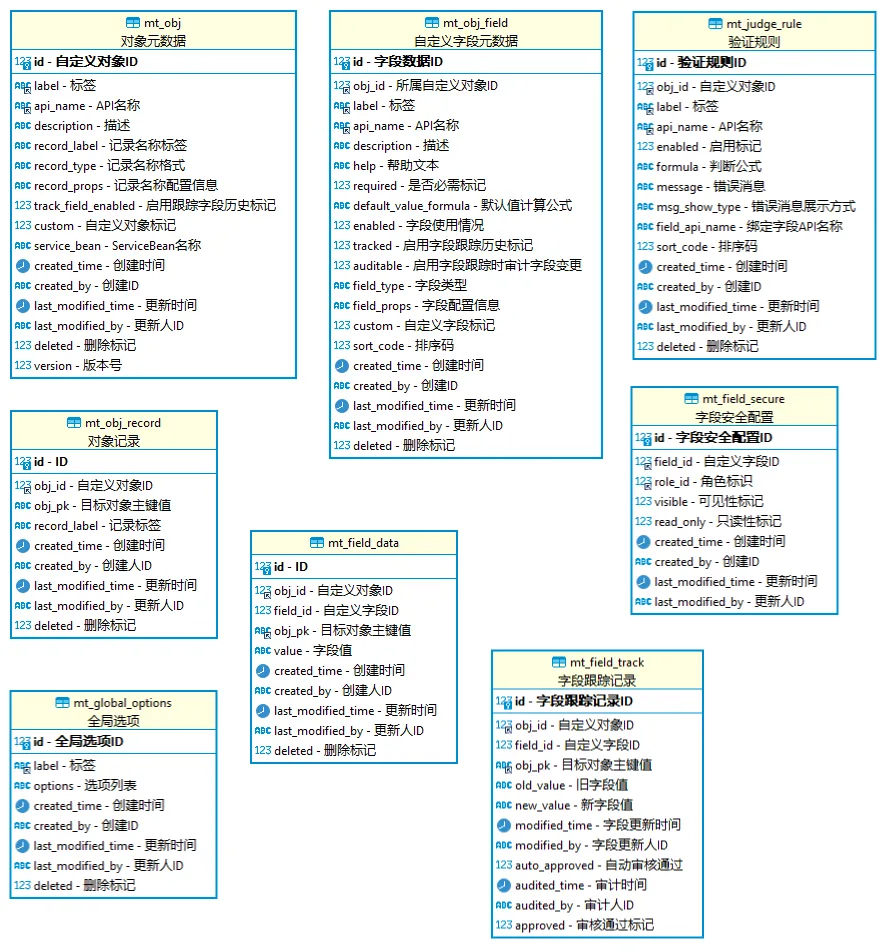
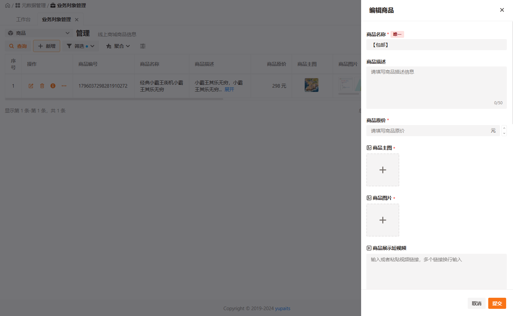
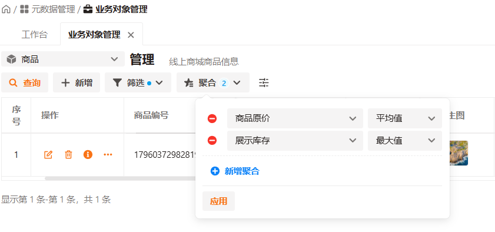
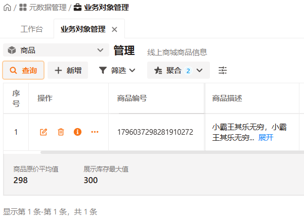
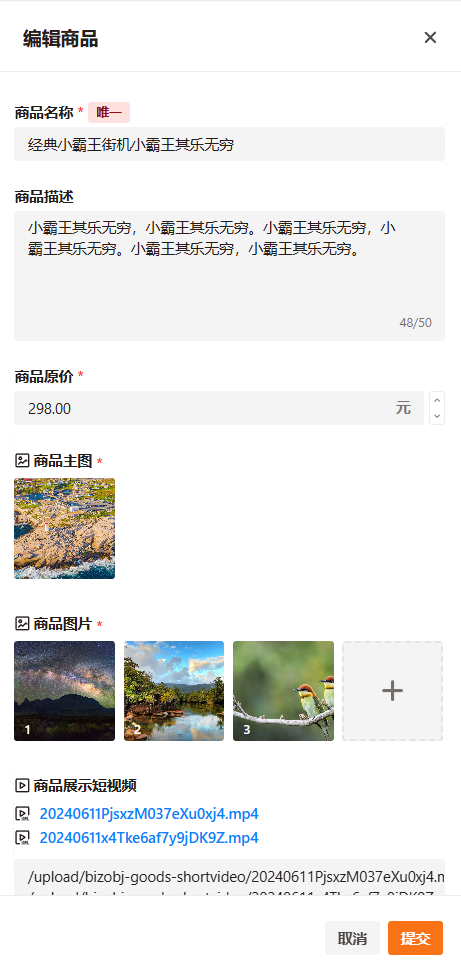
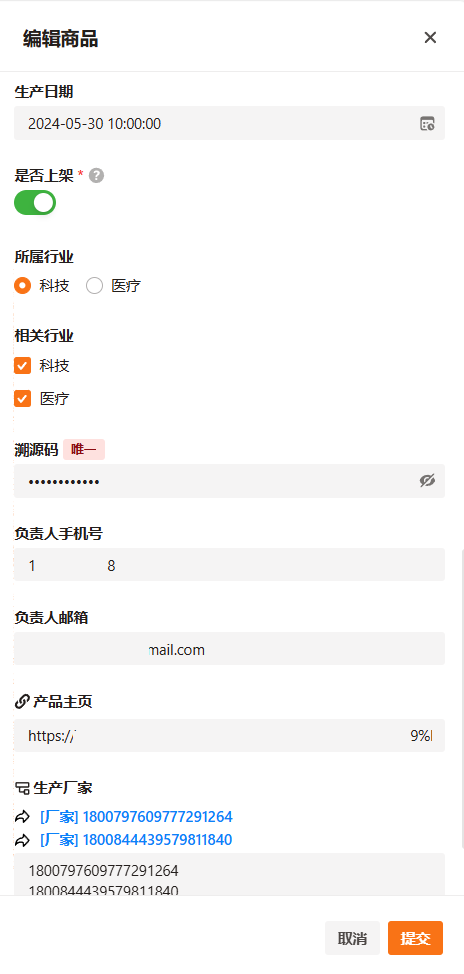
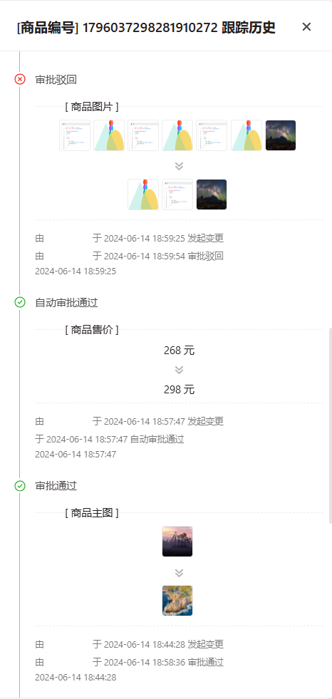

# 自定义对象核心功能设计及实现

通过[元数据自定义对象管理设计](./元数据自定义对象管理设计.md)的相关说明，自定义对象核心实体和字段信息如下：

## 界面展示

前端页面使用[React](https://react.dev/) + [semi design](https://semi.design/)进行开发。

- 分页查询表格展示

- 新增对象

- 筛选条件

- 聚合查询设置

- 聚合查询结果

- 表单编辑1

- 表单编辑2

- 跟踪历史

- 关联对象信息

## 分页查询

- 功能说明：获取指定自定义对象的分页数据
- 用到的表：`mt_field_data`
- 实现思路：在`mt_field_data`表中查询出`obj_id = #{objId}`的所有`obj_pk`，根据分页参数截取目标范围内`obj_pk`的集合`targetPks`，再使用`obj_id = #{objId} and obj_pk in #{targetPks}`条件获取分页数据。

## 条件筛选

- 功能说明：按条件筛选自定义对象数据
- 用到的表：`mt_field_data`
- 实现思路：由于自定义对象字段的不确定性，无法对每个字段制定个性化的匹配策略，因此只实现了对数据的创建时间进行范围查询、对文本和数字相关类型的字段进行模糊或者精准匹配。具体查询参数及类型为：`startTime(数据创建时间范围-开始时间): LocalDateTime`、`endTime(数据创建时间范围-结束时间): LocalDateTime`、`fieldConditions(字段匹配条件): [{fieldId(自定义字段ID): Long, exactMatch(是否精准匹配): boolean, keyword(查找关键字): String}]`。

## 字段聚合查询

- 功能说明：对数字相关类型的字段进行聚合查询
- 用到的表：`mt_field_data`
- 实现思路：在进行分页查询的时候携带聚合查询参数，返回的分页数据使用`AggregatePage`类型，将字段聚合查询的结果写入返回数据中。字段聚合查询使用这个sql：``select ${aggregateType}(`value`) from mt_field_data where obj_id = #{objId} and field_id = #{fieldId}``。

## 新增对象初始化

- 功能说明：新增对象数据时，能使用已经初始化数据
- 用到的表：`mt_obj_field`
- 实现思路：使用雪花算法生成新增对象的主键`objPk`，推荐用Hutool的`IdUtil.getSnowflakeNextIdStr()`方法。使用字段设置的默认值作为新增对象数据的初始值，字段默认值获取优先级为：字段的默认值`BaseMetaField#getDefaultValue` > 字段默认值计算公式`MetaObjField.defaultValueFormula`计算出的值。

## 编辑保存对象数据

编辑保存对象数据的主要步骤为：

1. 表单编辑数据
2. 字段校验
3. 字段编辑过滤
4. 对象记录生成和保存
5. 字段数据保存
6. 字段跟踪历史数据保存

### 1. 表单编辑数据

- 用到的表：`mt_obj_field`
- 实现思路：针对不同字段的类型和配置信息，构建表单组件用于编辑数据，表单打开之后字段默认填充**新增对象的字段初始值**或是**已有对象的字段当前值**。

### 2. 字段校验

- 用到的表：`mt_obj_field` `mt_judge_rule` `mt_field_data`
- 实现思路：请求参数校验（必填参数校验、主键有效性校验）。字段校验：必填字段非空校验，字段取值范围校验，字段值有效性校验，字段唯一性校验。对象验证规则校验。

### 3. 字段编辑过滤

- 用到的表：`mt_field_secure`
- 实现思路：字段的可见性和只读性跟角色关联，默认为**可见非只读**。当用户包含的**所有角色关联到的字段权限都是不可见或者只读**时，用户就不能修改字段的值，具体为用户修改了该字段的值，保存的时候字段值不会更新。

### 4. 对象记录的生成和保存

- 用到的表：`mt_obj_record`
- 实现思路：对象记录会在新增对象数据保存的时候自动生成，**用于被其他对象数据关联的时候作为数据记录标签进行展示**。当记录类型为“文本”，使用对象数据的主键`objPk`作为数据的记录标签；如果记录类型是“自动编号”，则会自动生成一个编号作为数据的记录标签。

### 5. 字段数据保存

- 用到的表：`mt_obj_field` `mt_field_data`
- 实现思路：计算型字段（公式字段、自动编号字段）会自动计算字段值保存，不需要用户手动输入。其他类型字段保存用户手动输入的内容。

### 6. 字段跟踪历史数据保存

- 用到的表：`mt_object` `mt_obj_field` `mt_field_data` `mt_field_track`
- 实现思路：如果自定义对象没有启用跟踪历史功能，就不会保存跟踪历史数据。如果用户修改了字段的值，在自定义对象**启用跟踪历史**功能，且字段也**启用了字段跟踪历史**功能的情况下，会出现以下情形：1、如果**字段没有启用审计字段变更**，则字段的值会直接更新为修改后的值，并且新增一条包含修改前后字段值的字段跟踪历史数据；2、如果字段**启用了审计字段变更**，字段的值不会直接更新，同时新增一条包含修改前后字段值的字段跟踪历史数据，当用户在数据的跟踪历史界面对此次变更**审批通过之后字段才会更新为修改后的值，审批驳回的话字段的值仍为修改前的值**。

## 删除对象数据

- 功能说明：将指定自定义对象的一条或多条对象数据进行删除
- 用到的表：`mt_field_data` `mt_obj_field`
- 实现思路：根据`objId`和`objPk`删除对象记录数据。根据`objId`和`objPk`删除对象字段数据。当对象中存在关联对象类型字段时，如果关联对象字段设置为联动删除，则会将关联到的对象数据也进行删除。

## 字段查询过滤

- 功能说明：在查询数据的时候，如果**用户包含的所有角色关联到的字段权限都是不可见**时，则不返回该字段的信息。
- 用到的表：`mt_field_data` `mt_obj_field` `mt_field_secure`
- 实现思路：字段的可见性跟角色关联，默认为**可见**。当用户包含的所有角色关联到的字段权限都是不可见时，在查询结果中将字段过滤掉不返回。

## 字段跟踪历史查看和审批

- 功能说明：查看字段跟踪历史数据，对待审批的跟踪历史数据进行审批操作
- 用到的表：`mt_field_track` `mt_field_data`
- 实现思路：启用了字段跟踪历史功能的字段在修改值的时候会生成字段跟踪历史数据，这些数据可以在界面上进行查看。同时还启用了字段变更审批功能的话，用户需要在界面上进行审批才能决定是否修改字段值。

## 自动编号

- 功能说明：根据指定格式生成一个编号
- 实现思路：自动编号包含**自动编号格式**和**起始编号**。自动编号格式是一个字符串模板，可替换的变量有：当前的年份、月份、当前月的第几天、序列编号。其中，序列编号不是固定值，自动编号首次生成的时候序列编号的值为起始编号，后续每次生成序列编号的时候，序列编号的值都会自增。考虑到应用可能存在**多实例**或是运行在**分布式环境**中，由于各实例的序列编号相互不能重复且**序列编号在应用重启后不能重置回起始编号**，以避免数据冲突问题，因此采用`RedisAtomicLong`类型对序列编号进行存储；又考虑到序列编号的时效性，会**根据自动编号格式中最细粒度的替换变量（如同时存在年、月、天时，天为最细粒度；同时存在年、月时，月为最细粒度）确定`RedisAtomicLong`的过期时间**。

## 公式计算

- 功能说明：根据公式计算出结果
- 用到的表：`mt_object` `mt_obj_field` `mt_field_data`
- 实现思路：使用[Aviator](https://github.com/killme2008/aviatorscript)表达式引擎作为公式的计算引擎，将自定义对象信息、自定义字段信息、当前日期时间、用户名、用户ID、当前对象数据信息作为表达式引擎变量参与计算，得到公式计算的结果。