# Java线程池实现原理及其业务实践

> 引用自[Java线程池实现原理及其在美团业务中的实践](https://tech.meituan.com/2020/04/02/java-pooling-pratice-in-meituan.html)

随着计算机行业的飞速发展，摩尔定律逐渐失效，多核CPU成为主流。使用多线程并行计算逐渐成为开发人员提升服务器性能的基本武器。J.U.C提供的线程池：ThreadPoolExecutor类，帮助开发人员管理线程并方便地执行并行任务。了解并合理使用线程池，是一个开发人员必修的基本功。<br />本文开篇简述线程池概念和用途，接着结合线程池的源码，帮助读者领略线程池的设计思路，最后回归实践，通过案例讲述使用线程池遇到的问题，并给出了一种动态化线程池解决方案。
## 一、写在前面
### 1.1 线程池是什么
线程池（Thread Pool）是一种基于池化思想管理线程的工具，经常出现在多线程服务器中，如MySQL。<br />线程过多会带来额外的开销，其中包括创建销毁线程的开销、调度线程的开销等等，同时也降低了计算机的整体性能。线程池维护多个线程，等待监督管理者分配可并发执行的任务。这种做法，一方面避免了处理任务时创建销毁线程开销的代价，另一方面避免了线程数量膨胀导致的过分调度问题，保证了对内核的充分利用。<br />而本文描述线程池是JDK中提供的ThreadPoolExecutor类。<br />当然，使用线程池可以带来一系列好处：

- **降低资源消耗**：通过池化技术重复利用已创建的线程，降低线程创建和销毁造成的损耗。
- **提高响应速度**：任务到达时，无需等待线程创建即可立即执行。
- **提高线程的可管理性**：线程是稀缺资源，如果无限制创建，不仅会消耗系统资源，还会因为线程的不合理分布导致资源调度失衡，降低系统的稳定性。使用线程池可以进行统一的分配、调优和监控。
- **提供更多更强大的功能**：线程池具备可拓展性，允许开发人员向其中增加更多的功能。比如延时定时线程池ScheduledThreadPoolExecutor，就允许任务延期执行或定期执行。
### 1.2 线程池解决的问题是什么
线程池解决的核心问题就是资源管理问题。在并发环境下，系统不能够确定在任意时刻中，有多少任务需要执行，有多少资源需要投入。这种不确定性将带来以下若干问题：

1. 频繁申请/销毁资源和调度资源，将带来额外的消耗，可能会非常巨大。
2. 对资源无限申请缺少抑制手段，易引发系统资源耗尽的风险。
3. 系统无法合理管理内部的资源分布，会降低系统的稳定性。

为解决资源分配这个问题，线程池采用了“池化”（Pooling）思想。池化，顾名思义，是为了最大化收益并最小化风险，而将资源统一在一起管理的一种思想。
> Pooling is the grouping together of resources (assets, equipment, personnel, effort, etc.) for the purposes of maximizing advantage or minimizing risk to the users. The term is used in finance, computing and equipment management.——wikipedia

“池化”思想不仅仅能应用在计算机领域，在金融、设备、人员管理、工作管理等领域也有相关的应用。<br />在计算机领域中的表现为：统一管理IT资源，包括服务器、存储、和网络资源等等。通过共享资源，使用户在低投入中获益。除去线程池，还有其他比较典型的几种使用策略包括：

1. 内存池(Memory Pooling)：预先申请内存，提升申请内存速度，减少内存碎片。
2. 连接池(Connection Pooling)：预先申请数据库连接，提升申请连接的速度，降低系统的开销。
3. 实例池(Object Pooling)：循环使用对象，减少资源在初始化和释放时的昂贵损耗。

在了解完“是什么”和“为什么”之后，下面我们来一起深入一下线程池的内部实现原理。
## 二、线程池核心设计与实现
在前文中，我们了解到：线程池是一种通过“池化”思想，帮助我们管理线程而获取并发性的工具，在Java中的体现是ThreadPoolExecutor类。那么它的的详细设计与实现是什么样的呢？我们会在本章进行详细介绍。
### 2.1 总体设计
Java中的线程池核心实现类是ThreadPoolExecutor，本章基于JDK 1.8的源码来分析Java线程池的核心设计与实现。我们首先来看一下ThreadPoolExecutor的UML类图，了解下ThreadPoolExecutor的继承关系。<br />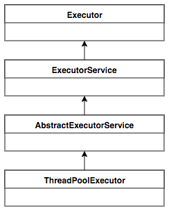<br />图1 ThreadPoolExecutor UML类图<br />ThreadPoolExecutor实现的顶层接口是Executor，顶层接口Executor提供了一种思想：将任务提交和任务执行进行解耦。用户无需关注如何创建线程，如何调度线程来执行任务，用户只需提供Runnable对象，将任务的运行逻辑提交到执行器(Executor)中，由Executor框架完成线程的调配和任务的执行部分。ExecutorService接口增加了一些能力：（1）扩充执行任务的能力，补充可以为一个或一批异步任务生成Future的方法；（2）提供了管控线程池的方法，比如停止线程池的运行。AbstractExecutorService则是上层的抽象类，将执行任务的流程串联了起来，保证下层的实现只需关注一个执行任务的方法即可。最下层的实现类ThreadPoolExecutor实现最复杂的运行部分，ThreadPoolExecutor将会一方面维护自身的生命周期，另一方面同时管理线程和任务，使两者良好的结合从而执行并行任务。<br />ThreadPoolExecutor是如何运行，如何同时维护线程和执行任务的呢？其运行机制如下图所示：<br />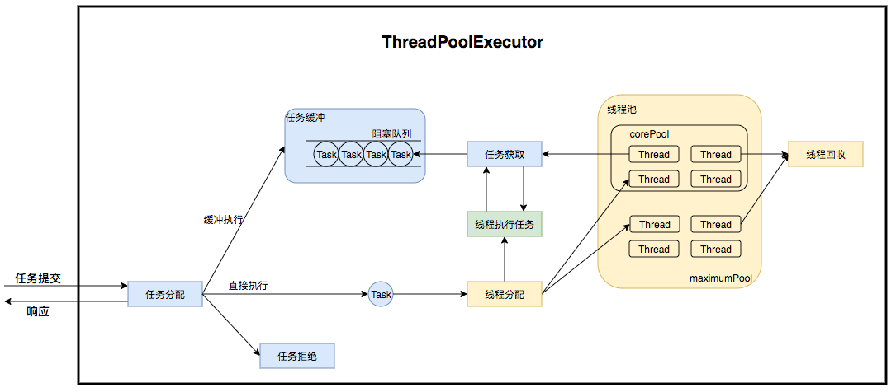<br />图2 ThreadPoolExecutor运行流程<br />线程池在内部实际上构建了一个生产者消费者模型，将线程和任务两者解耦，并不直接关联，从而良好的缓冲任务，复用线程。线程池的运行主要分成两部分：任务管理、线程管理。任务管理部分充当生产者的角色，当任务提交后，线程池会判断该任务后续的流转：（1）直接申请线程执行该任务；（2）缓冲到队列中等待线程执行；（3）拒绝该任务。线程管理部分是消费者，它们被统一维护在线程池内，根据任务请求进行线程的分配，当线程执行完任务后则会继续获取新的任务去执行，最终当线程获取不到任务的时候，线程就会被回收。<br />接下来，我们会按照以下三个部分去详细讲解线程池运行机制：

1. 线程池如何维护自身状态。
2. 线程池如何管理任务。
3. 线程池如何管理线程。
### 2.2 生命周期管理
线程池运行的状态，并不是用户显式设置的，而是伴随着线程池的运行，由内部来维护。线程池内部使用一个变量维护两个值：运行状态(runState)和线程数量 (workerCount)。在具体实现中，线程池将运行状态(runState)、线程数量 (workerCount)两个关键参数的维护放在了一起，如下代码所示：
```java
private final AtomicInteger ctl = new AtomicInteger(ctlOf(RUNNING, 0)); 
```
ctl这个AtomicInteger类型，是对线程池的运行状态和线程池中有效线程的数量进行控制的一个字段， 它同时包含两部分的信息：线程池的运行状态 (runState) 和线程池内有效线程的数量 (workerCount)，高3位保存runState，低29位保存workerCount，两个变量之间互不干扰。用一个变量去存储两个值，可避免在做相关决策时，出现不一致的情况，不必为了维护两者的一致，而占用锁资源。通过阅读线程池源代码也可以发现，经常出现要同时判断线程池运行状态和线程数量的情况。线程池也提供了若干方法去供用户获得线程池当前的运行状态、线程个数。这里都使用的是位运算的方式，相比于基本运算，速度也会快很多。<br />关于内部封装的获取生命周期状态、获取线程池线程数量的计算方法如以下代码所示：
```java
private static int runStateOf(int c)     { return c & ~CAPACITY; } //计算当前运行状态
private static int workerCountOf(int c)  { return c & CAPACITY; }  //计算当前线程数量
private static int ctlOf(int rs, int wc) { return rs | wc; }   //通过状态和线程数生成ctl
```
 <br />ThreadPoolExecutor的运行状态有5种，分别为：<br /><br />其生命周期转换如下入所示：<br /><br />图3 线程池生命周期
### 2.3 任务执行机制
**2.3.1 任务调度**<br />任务调度是线程池的主要入口，当用户提交了一个任务，接下来这个任务将如何执行都是由这个阶段决定的。了解这部分就相当于了解了线程池的核心运行机制。<br />首先，所有任务的调度都是由execute方法完成的，这部分完成的工作是：检查现在线程池的运行状态、运行线程数、运行策略，决定接下来执行的流程，是直接申请线程执行，或是缓冲到队列中执行，亦或是直接拒绝该任务。其执行过程如下：

1. 首先检测线程池运行状态，如果不是RUNNING，则直接拒绝，线程池要保证在RUNNING的状态下执行任务。
2. 如果workerCount < corePoolSize，则创建并启动一个线程来执行新提交的任务。
3. 如果workerCount >= corePoolSize，且线程池内的阻塞队列未满，则将任务添加到该阻塞队列中。
4. 如果workerCount >= corePoolSize && workerCount < maximumPoolSize，且线程池内的阻塞队列已满，则创建并启动一个线程来执行新提交的任务。
5. 如果workerCount >= maximumPoolSize，并且线程池内的阻塞队列已满, 则根据拒绝策略来处理该任务, 默认的处理方式是直接抛异常。

其执行流程如下图所示：<br />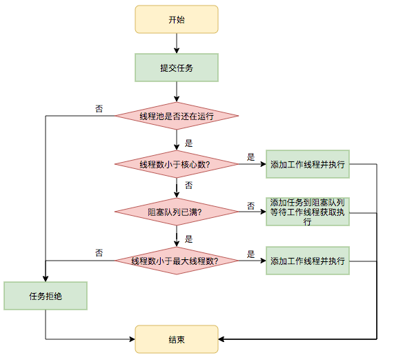<br />图4 任务调度流程<br />**2.3.2 任务缓冲**<br />任务缓冲模块是线程池能够管理任务的核心部分。线程池的本质是对任务和线程的管理，而做到这一点最关键的思想就是将任务和线程两者解耦，不让两者直接关联，才可以做后续的分配工作。线程池中是以生产者消费者模式，通过一个阻塞队列来实现的。阻塞队列缓存任务，工作线程从阻塞队列中获取任务。<br />阻塞队列(BlockingQueue)是一个支持两个附加操作的队列。这两个附加的操作是：在队列为空时，获取元素的线程会等待队列变为非空。当队列满时，存储元素的线程会等待队列可用。阻塞队列常用于生产者和消费者的场景，生产者是往队列里添加元素的线程，消费者是从队列里拿元素的线程。阻塞队列就是生产者存放元素的容器，而消费者也只从容器里拿元素。<br />下图中展示了线程1往阻塞队列中添加元素，而线程2从阻塞队列中移除元素：<br /><br />图5 阻塞队列<br />使用不同的队列可以实现不一样的任务存取策略。在这里，我们可以再介绍下阻塞队列的成员：<br /><br />**2.3.3 任务申请**<br />由上文的任务分配部分可知，任务的执行有两种可能：一种是任务直接由新创建的线程执行。另一种是线程从任务队列中获取任务然后执行，执行完任务的空闲线程会再次去从队列中申请任务再去执行。第一种情况仅出现在线程初始创建的时候，第二种是线程获取任务绝大多数的情况。<br />线程需要从任务缓存模块中不断地取任务执行，帮助线程从阻塞队列中获取任务，实现线程管理模块和任务管理模块之间的通信。这部分策略由getTask方法实现，其执行流程如下图所示：<br />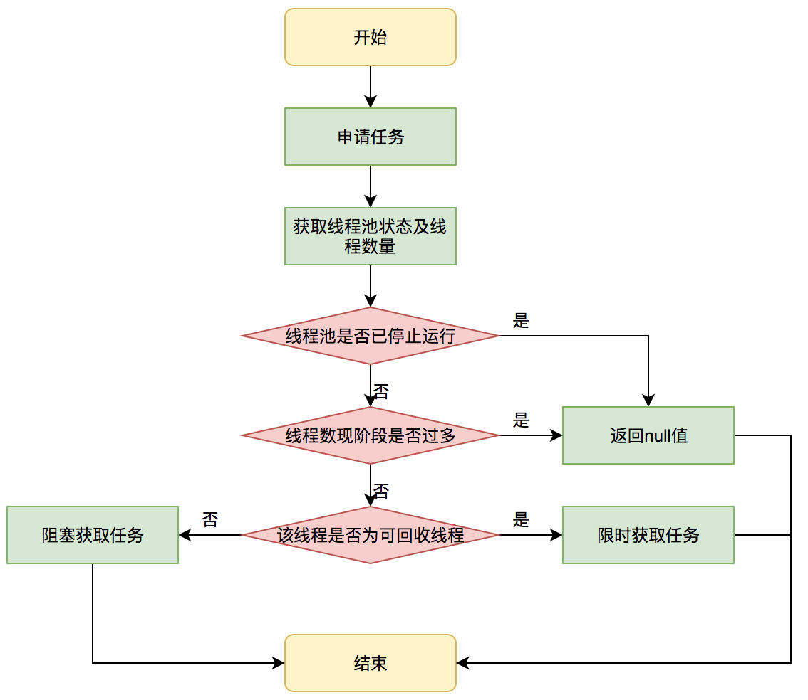<br />图6 获取任务流程图<br />getTask这部分进行了多次判断，为的是控制线程的数量，使其符合线程池的状态。如果线程池现在不应该持有那么多线程，则会返回null值。工作线程Worker会不断接收新任务去执行，而当工作线程Worker接收不到任务的时候，就会开始被回收。<br />**2.3.4 任务拒绝**<br />任务拒绝模块是线程池的保护部分，线程池有一个最大的容量，当线程池的任务缓存队列已满，并且线程池中的线程数目达到maximumPoolSize时，就需要拒绝掉该任务，采取任务拒绝策略，保护线程池。<br />拒绝策略是一个接口，其设计如下：
```java
public interface RejectedExecutionHandler {
    void rejectedExecution(Runnable r, ThreadPoolExecutor executor);
} 
```
用户可以通过实现这个接口去定制拒绝策略，也可以选择JDK提供的四种已有拒绝策略，其特点如下：<br />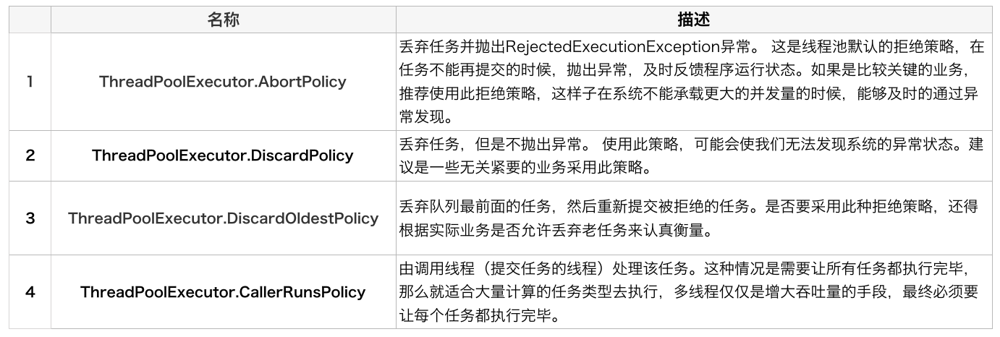<br />2.4 Worker线程管理<br />2.4.1 Worker线程<br />线程池为了掌握线程的状态并维护线程的生命周期，设计了线程池内的工作线程Worker。我们来看一下它的部分代码：
```java
private final class Worker extends AbstractQueuedSynchronizer implements Runnable{
    final Thread thread;//Worker持有的线程
    Runnable firstTask;//初始化的任务，可以为null
}
```
Worker这个工作线程，实现了Runnable接口，并持有一个线程thread，一个初始化的任务firstTask。thread是在调用构造方法时通过ThreadFactory来创建的线程，可以用来执行任务；firstTask用它来保存传入的第一个任务，这个任务可以有也可以为null。如果这个值是非空的，那么线程就会在启动初期立即执行这个任务，也就对应核心线程创建时的情况；如果这个值是null，那么就需要创建一个线程去执行任务列表（workQueue）中的任务，也就是非核心线程的创建。<br />Worker执行任务的模型如下图所示：<br />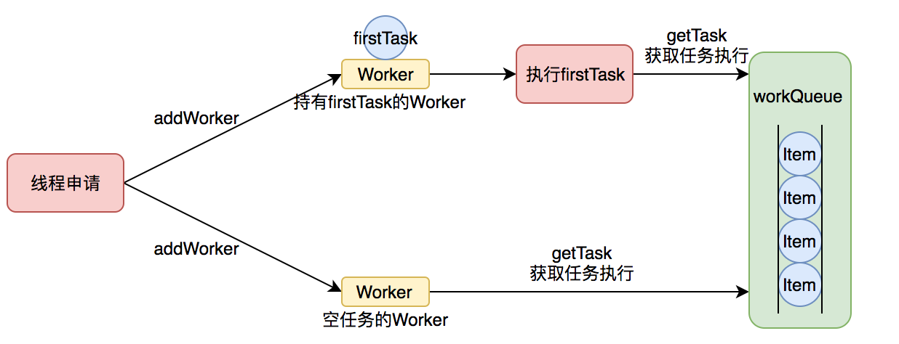<br />图7 Worker执行任务<br />线程池需要管理线程的生命周期，需要在线程长时间不运行的时候进行回收。线程池使用一张Hash表去持有线程的引用，这样可以通过添加引用、移除引用这样的操作来控制线程的生命周期。这个时候重要的就是如何判断线程是否在运行。<br />Worker是通过继承AQS，使用AQS来实现独占锁这个功能。没有使用可重入锁ReentrantLock，而是使用AQS，为的就是实现不可重入的特性去反应线程现在的执行状态。<br />1.lock方法一旦获取了独占锁，表示当前线程正在执行任务中。 2.如果正在执行任务，则不应该中断线程。 3.如果该线程现在不是独占锁的状态，也就是空闲的状态，说明它没有在处理任务，这时可以对该线程进行中断。 4.线程池在执行shutdown方法或tryTerminate方法时会调用interruptIdleWorkers方法来中断空闲的线程，interruptIdleWorkers方法会使用tryLock方法来判断线程池中的线程是否是空闲状态；如果线程是空闲状态则可以安全回收。<br />在线程回收过程中就使用到了这种特性，回收过程如下图所示：<br />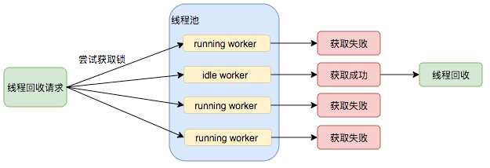<br />图8 线程池回收过程<br />**2.4.2 Worker线程增加**<br />增加线程是通过线程池中的addWorker方法，该方法的功能就是增加一个线程，该方法不考虑线程池是在哪个阶段增加的该线程，这个分配线程的策略是在上个步骤完成的，该步骤仅仅完成增加线程，并使它运行，最后返回是否成功这个结果。addWorker方法有两个参数：firstTask、core。firstTask参数用于指定新增的线程执行的第一个任务，该参数可以为空；core参数为true表示在新增线程时会判断当前活动线程数是否少于corePoolSize，false表示新增线程前需要判断当前活动线程数是否少于maximumPoolSize，其执行流程如下图所示：<br />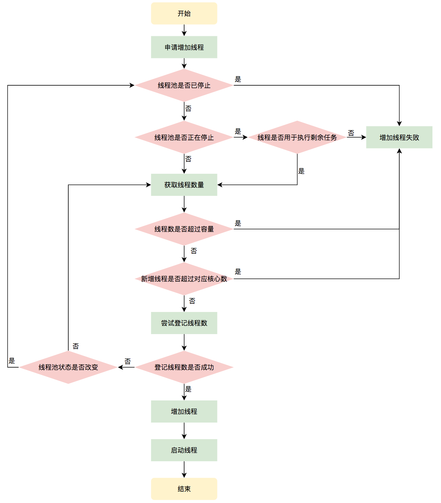<br />图9 申请线程执行流程图<br />**2.4.3 Worker线程回收**<br />线程池中线程的销毁依赖JVM自动的回收，线程池做的工作是根据当前线程池的状态维护一定数量的线程引用，防止这部分线程被JVM回收，当线程池决定哪些线程需要回收时，只需要将其引用消除即可。Worker被创建出来后，就会不断地进行轮询，然后获取任务去执行，核心线程可以无限等待获取任务，非核心线程要限时获取任务。当Worker无法获取到任务，也就是获取的任务为空时，循环会结束，Worker会主动消除自身在线程池内的引用。
```java
try {
  while (task != null || (task = getTask()) != null) {
    //执行任务
  }
} finally {
  processWorkerExit(w, completedAbruptly);//获取不到任务时，主动回收自己
}
```
线程回收的工作是在processWorkerExit方法完成的。<br /><br />图10 线程销毁流程<br />事实上，在这个方法中，将线程引用移出线程池就已经结束了线程销毁的部分。但由于引起线程销毁的可能性有很多，线程池还要判断是什么引发了这次销毁，是否要改变线程池的现阶段状态，是否要根据新状态，重新分配线程。<br />**2.4.4 Worker线程执行任务**<br />在Worker类中的run方法调用了runWorker方法来执行任务，runWorker方法的执行过程如下：<br />1.while循环不断地通过getTask()方法获取任务。 2.getTask()方法从阻塞队列中取任务。 3.如果线程池正在停止，那么要保证当前线程是中断状态，否则要保证当前线程不是中断状态。 4.执行任务。 5.如果getTask结果为null则跳出循环，执行processWorkerExit()方法，销毁线程。<br />执行流程如下图所示：<br />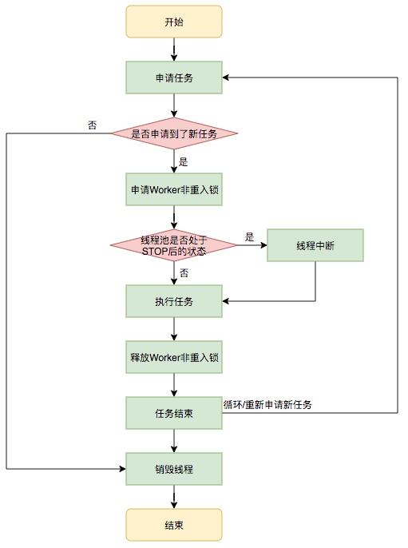<br />图11 执行任务流程
## 三、线程池在业务中的实践
### 3.1 业务背景
在当今的互联网业界，为了最大程度利用CPU的多核性能，并行运算的能力是不可或缺的。通过线程池管理线程获取并发性是一个非常基础的操作，让我们来看两个典型的使用线程池获取并发性的场景。<br />**场景1：快速响应用户请求**<br />**描述**：用户发起的实时请求，服务追求响应时间。比如说用户要查看一个商品的信息，那么我们需要将商品维度的一系列信息如商品的价格、优惠、库存、图片等等聚合起来，展示给用户。<br />**分析**：从用户体验角度看，这个结果响应的越快越好，如果一个页面半天都刷不出，用户可能就放弃查看这个商品了。而面向用户的功能聚合通常非常复杂，伴随着调用与调用之间的级联、多级级联等情况，业务开发同学往往会选择使用线程池这种简单的方式，将调用封装成任务并行的执行，缩短总体响应时间。另外，使用线程池也是有考量的，这种场景最重要的就是获取最大的响应速度去满足用户，所以应该不设置队列去缓冲并发任务，调高corePoolSize和maxPoolSize去尽可能创造多的线程快速执行任务。<br /><br />图12 并行执行任务提升任务响应速度<br />**场景2：快速处理批量任务**<br />**描述**：离线的大量计算任务，需要快速执行。比如说，统计某个报表，需要计算出全国各个门店中有哪些商品有某种属性，用于后续营销策略的分析，那么我们需要查询全国所有门店中的所有商品，并且记录具有某属性的商品，然后快速生成报表。<br />**分析**：这种场景需要执行大量的任务，我们也会希望任务执行的越快越好。这种情况下，也应该使用多线程策略，并行计算。但与响应速度优先的场景区别在于，这类场景任务量巨大，并不需要瞬时的完成，而是关注如何使用有限的资源，尽可能在单位时间内处理更多的任务，也就是吞吐量优先的问题。所以应该设置队列去缓冲并发任务，调整合适的corePoolSize去设置处理任务的线程数。在这里，设置的线程数过多可能还会引发线程上下文切换频繁的问题，也会降低处理任务的速度，降低吞吐量。<br />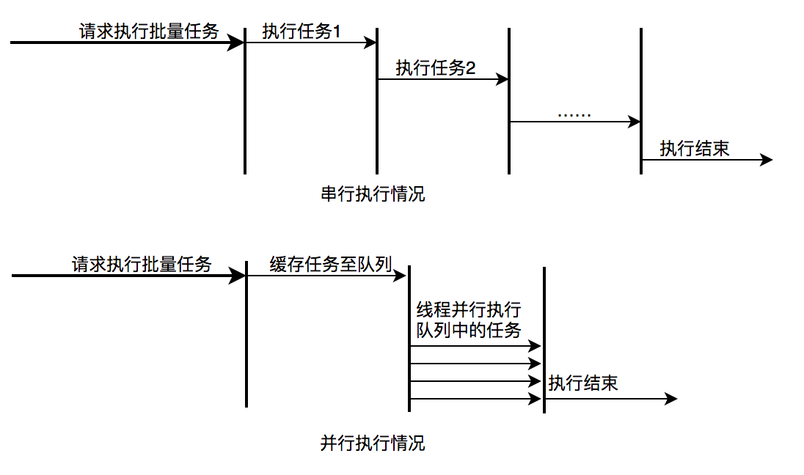<br />图13 并行执行任务提升批量任务执行速度
### 3.2 实际问题及方案思考
线程池使用面临的核心的问题在于：**线程池的参数并不好配置**。一方面线程池的运行机制不是很好理解，配置合理需要强依赖开发人员的个人经验和知识；另一方面，线程池执行的情况和任务类型相关性较大，IO密集型和CPU密集型的任务运行起来的情况差异非常大，这导致业界并没有一些成熟的经验策略帮助开发人员参考。<br />关于线程池配置不合理引发的故障，公司内部有较多记录，下面举一些例子：<br />**Case1**：2018年XX页面展示接口大量调用降级：<br />**事故描述**：XX页面展示接口产生大量调用降级，数量级在几十到上百。<br />**事故原因**：该服务展示接口内部逻辑使用线程池做并行计算，由于没有预估好调用的流量，导致最大核心数设置偏小，大量抛出RejectedExecutionException，触发接口降级条件，示意图如下：<br />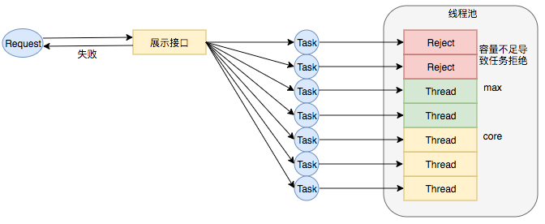<br />图14 线程数核心设置过小引发RejectExecutionException<br />**Case2**：2018年XX业务服务不可用S2级故障<br />**事故描述**：XX业务提供的服务执行时间过长，作为上游服务整体超时，大量下游服务调用失败。<br />**事故原因**：该服务处理请求内部逻辑使用线程池做资源隔离，由于队列设置过长，最大线程数设置失效，导致请求数量增加时，大量任务堆积在队列中，任务执行时间过长，最终导致下游服务的大量调用超时失败。示意图如下：<br />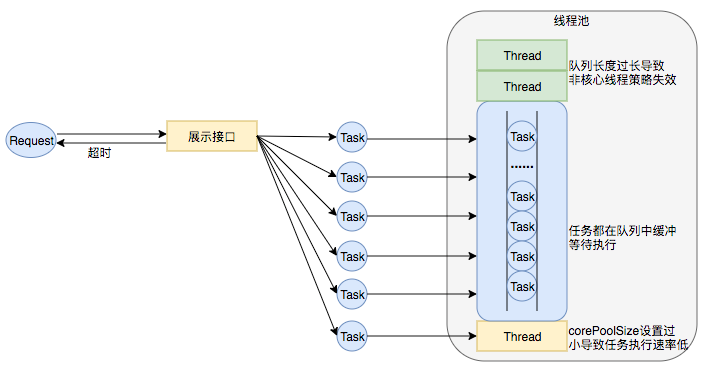<br />图15 线程池队列长度设置过长、corePoolSize设置过小导致任务执行速度低<br />业务中要使用线程池，而使用不当又会导致故障，那么我们怎样才能更好地使用线程池呢？针对这个问题，我们下面延展几个方向：<br />**1. 能否不用线程池?**<br />回到最初的问题，业务使用线程池是为了获取并发性，对于获取并发性，是否可以有什么其他的方案呢替代？我们尝试进行了一些其他方案的调研：<br />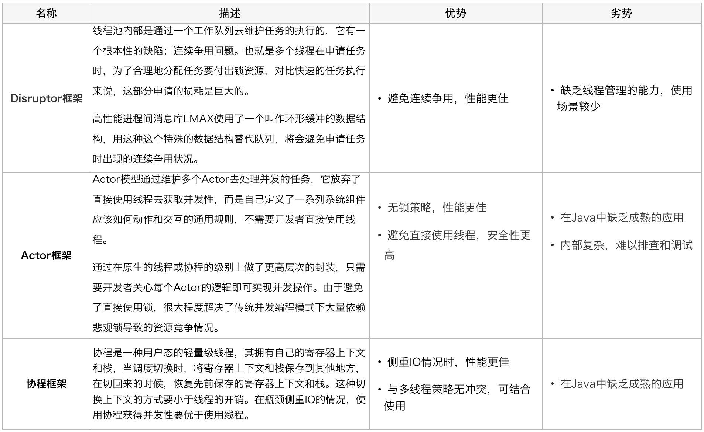<br />综合考虑，这些新的方案都能在某种情况下提升并行任务的性能，然而本次重点解决的问题是如何更简易、更安全地获得的并发性。另外，Actor模型的应用实际上甚少，只在Scala中使用广泛，协程框架在Java中维护的也不成熟。这三者现阶段都不是足够的易用，也并不能解决业务上现阶段的问题。<br />**2. 追求参数设置合理性？**<br />有没有一种计算公式，能够让开发同学很简易地计算出某种场景中的线程池应该是什么参数呢？<br />带着这样的疑问，我们调研了业界的一些线程池参数配置方案：<br />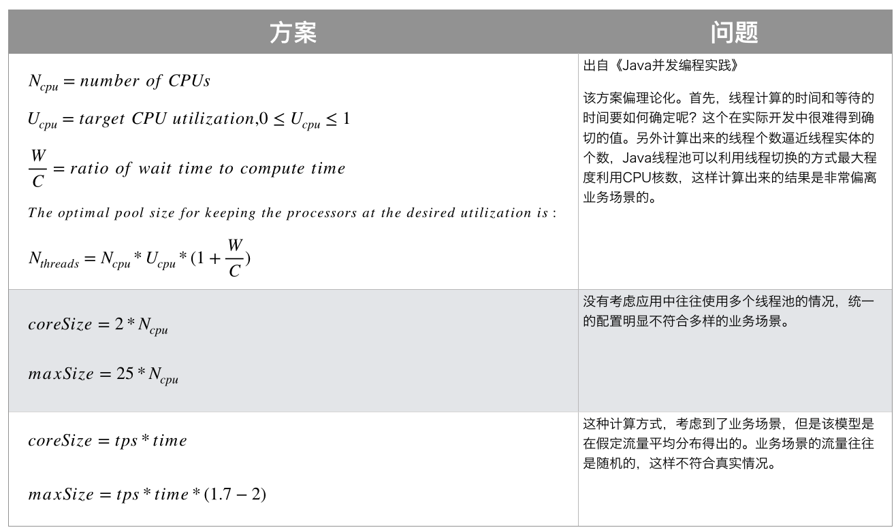<br />调研了以上业界方案后，我们并没有得出通用的线程池计算方式。并发任务的执行情况和任务类型相关，IO密集型和CPU密集型的任务运行起来的情况差异非常大，但这种占比是较难合理预估的，这导致很难有一个简单有效的通用公式帮我们直接计算出结果。<br />**3. 线程池参数动态化？**<br />尽管经过谨慎的评估，仍然不能够保证一次计算出来合适的参数，那么我们是否可以将修改线程池参数的成本降下来，这样至少可以发生故障的时候可以快速调整从而缩短故障恢复的时间呢？基于这个思考，我们是否可以将线程池的参数从代码中迁移到分布式配置中心上，实现线程池参数可动态配置和即时生效，线程池参数动态化前后的参数修改流程对比如下：<br /><br />图16 动态修改线程池参数新旧流程对比<br />基于以上三个方向对比，我们可以看出参数动态化方向简单有效。
### 3.3 动态化线程池
**3.3.1 整体设计**<br />动态化线程池的核心设计包括以下三个方面：

1. 简化线程池配置：线程池构造参数有8个，但是最核心的是3个：corePoolSize、maximumPoolSize，workQueue，它们最大程度地决定了线程池的任务分配和线程分配策略。考虑到在实际应用中我们获取并发性的场景主要是两种：（1）并行执行子任务，提高响应速度。这种情况下，应该使用同步队列，没有什么任务应该被缓存下来，而是应该立即执行。（2）并行执行大批次任务，提升吞吐量。这种情况下，应该使用有界队列，使用队列去缓冲大批量的任务，队列容量必须声明，防止任务无限制堆积。所以线程池只需要提供这三个关键参数的配置，并且提供两种队列的选择，就可以满足绝大多数的业务需求，Less is More。
2. 参数可动态修改：为了解决参数不好配，修改参数成本高等问题。在Java线程池留有高扩展性的基础上，封装线程池，允许线程池监听同步外部的消息，根据消息进行修改配置。将线程池的配置放置在平台侧，允许开发同学简单的查看、修改线程池配置。
3. 增加线程池监控：对某事物缺乏状态的观测，就对其改进无从下手。在线程池执行任务的生命周期添加监控能力，帮助开发同学了解线程池状态。

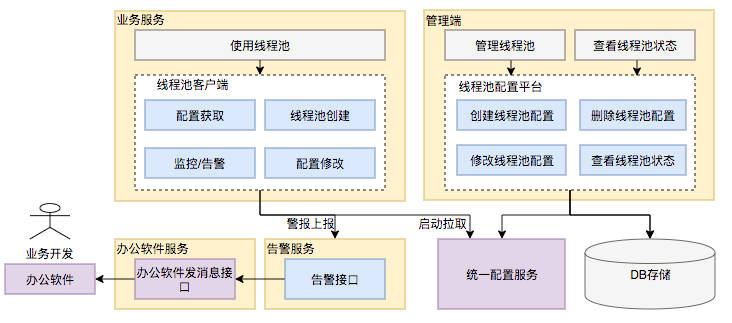<br />图17 动态化线程池整体设计<br />**3.3.2 功能架构**<br />动态化线程池提供如下功能：<br />**动态调参**：支持线程池参数动态调整、界面化操作；包括修改线程池核心大小、最大核心大小、队列长度等；参数修改后及时生效。 **任务监控**：支持应用粒度、线程池粒度、任务粒度的Transaction监控；可以看到线程池的任务执行情况、最大任务执行时间、平均任务执行时间、95/99线等。 **负载告警**：线程池队列任务积压到一定值的时候会通过大象（美团内部通讯工具）告知应用开发负责人；当线程池负载数达到一定阈值的时候会通过大象告知应用开发负责人。 **操作监控**：创建/修改和删除线程池都会通知到应用的开发负责人。 **操作日志**：可以查看线程池参数的修改记录，谁在什么时候修改了线程池参数、修改前的参数值是什么。 **权限校验**：只有应用开发负责人才能够修改应用的线程池参数。<br /><br />图18 动态化线程池功能架构<br />**参数动态化**<br />JDK原生线程池ThreadPoolExecutor提供了如下几个public的setter方法，如下图所示：<br /><br />图19 JDK 线程池参数设置接口<br />JDK允许线程池使用方通过ThreadPoolExecutor的实例来动态设置线程池的核心策略，以setCorePoolSize为方法例，在运行期线程池使用方调用此方法设置corePoolSize之后，线程池会直接覆盖原来的corePoolSize值，并且基于当前值和原始值的比较结果采取不同的处理策略。对于当前值小于当前工作线程数的情况，说明有多余的worker线程，此时会向当前idle的worker线程发起中断请求以实现回收，多余的worker在下次idel的时候也会被回收；对于当前值大于原始值且当前队列中有待执行任务，则线程池会创建新的worker线程来执行队列任务，setCorePoolSize具体流程如下：<br />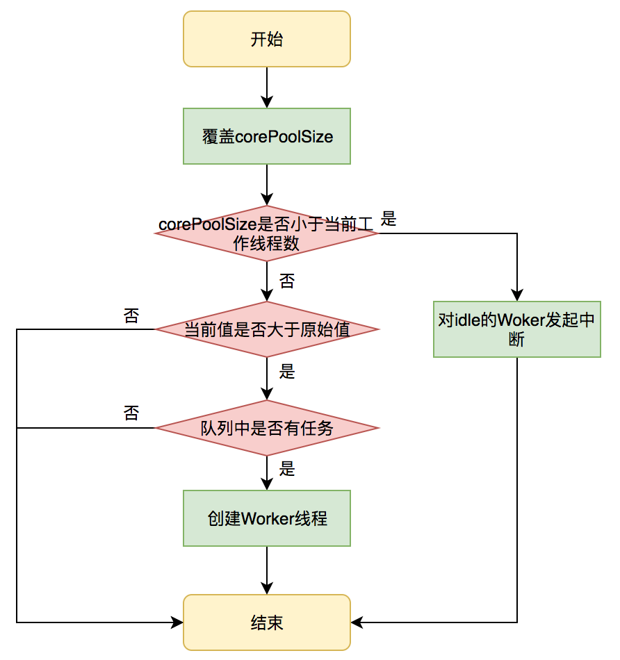<br />图20 setCorePoolSize方法执行流程<br />线程池内部会处理好当前状态做到平滑修改，其他几个方法限于篇幅，这里不一一介绍。重点是基于这几个public方法，我们只需要维护ThreadPoolExecutor的实例，并且在需要修改的时候拿到实例修改其参数即可。基于以上的思路，我们实现了线程池参数的动态化、线程池参数在管理平台可配置可修改，其效果图如下图所示：<br />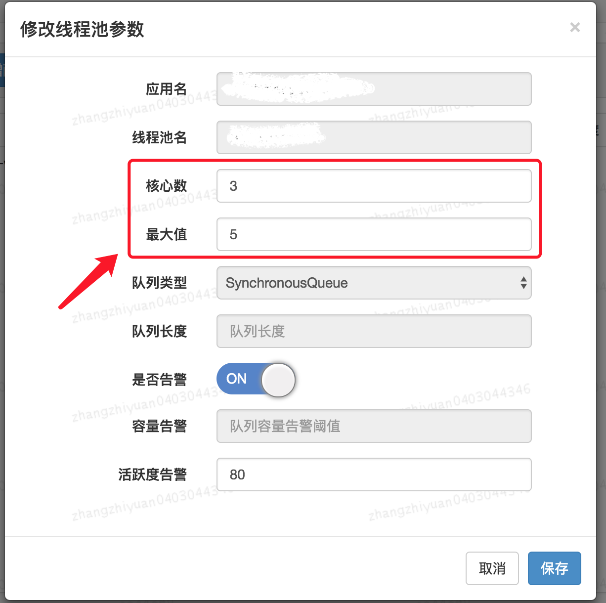<br />图21 可动态修改线程池参数<br />用户可以在管理平台上通过线程池的名字找到指定的线程池，然后对其参数进行修改，保存后会实时生效。目前支持的动态参数包括核心数、最大值、队列长度等。除此之外，在界面中，我们还能看到用户可以配置是否开启告警、队列等待任务告警阈值、活跃度告警等等。关于监控和告警，我们下面一节会对齐进行介绍。<br />**线程池监控**<br />除了参数动态化之外，为了更好地使用线程池，我们需要对线程池的运行状况有感知，比如当前线程池的负载是怎么样的？分配的资源够不够用？任务的执行情况是怎么样的？是长任务还是短任务？基于对这些问题的思考，动态化线程池提供了多个维度的监控和告警能力，包括：线程池活跃度、任务的执行Transaction（频率、耗时）、Reject异常、线程池内部统计信息等等，既能帮助用户从多个维度分析线程池的使用情况，又能在出现问题第一时间通知到用户，从而避免故障或加速故障恢复。
#### 1. 负载监控和告警
线程池负载关注的核心问题是：基于当前线程池参数分配的资源够不够。对于这个问题，我们可以从事前和事中两个角度来看。事前，线程池定义了“活跃度”这个概念，来让用户在发生Reject异常之前能够感知线程池负载问题，线程池活跃度计算公式为：线程池活跃度 = activeCount/maximumPoolSize。这个公式代表当活跃线程数趋向于maximumPoolSize的时候，代表线程负载趋高。事中，也可以从两方面来看线程池的过载判定条件，一个是发生了Reject异常，一个是队列中有等待任务（支持定制阈值）。以上两种情况发生了都会触发告警，告警信息会通过大象推送给服务所关联的负责人。<br />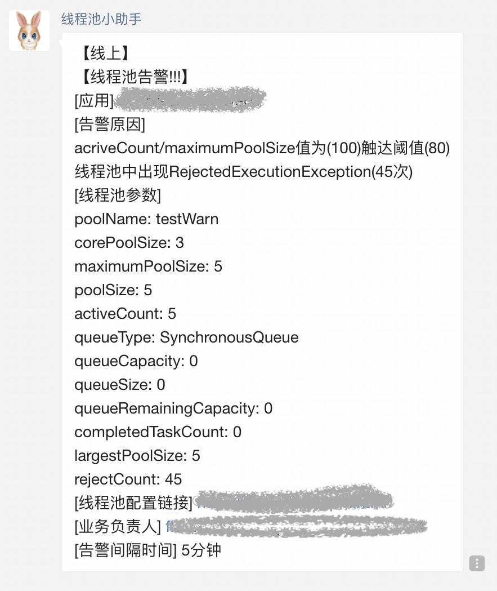<br />图22 大象告警通知
#### 2. 任务级精细化监控
在传统的线程池应用场景中，线程池中的任务执行情况对于用户来说是透明的。比如在一个具体的业务场景中，业务开发申请了一个线程池同时用于执行两种任务，一个是发消息任务、一个是发短信任务，这两类任务实际执行的频率和时长对于用户来说没有一个直观的感受，很可能这两类任务不适合共享一个线程池，但是由于用户无法感知，因此也无从优化。动态化线程池内部实现了任务级别的埋点，且允许为不同的业务任务指定具有业务含义的名称，线程池内部基于这个名称做Transaction打点，基于这个功能，用户可以看到线程池内部任务级别的执行情况，且区分业务，任务监控示意图如下图所示：<br /><br />图23 线程池任务执行监控
#### 3. 运行时状态实时查看
用户基于JDK原生线程池ThreadPoolExecutor提供的几个public的getter方法，可以读取到当前线程池的运行状态以及参数，如下图所示：<br />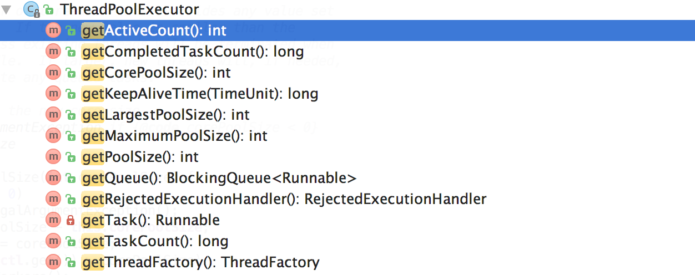<br />图24 线程池实时运行情况<br />动态化线程池基于这几个接口封装了运行时状态实时查看的功能，用户基于这个功能可以了解线程池的实时状态，比如当前有多少个工作线程，执行了多少个任务，队列中等待的任务数等等。效果如下图所示：<br />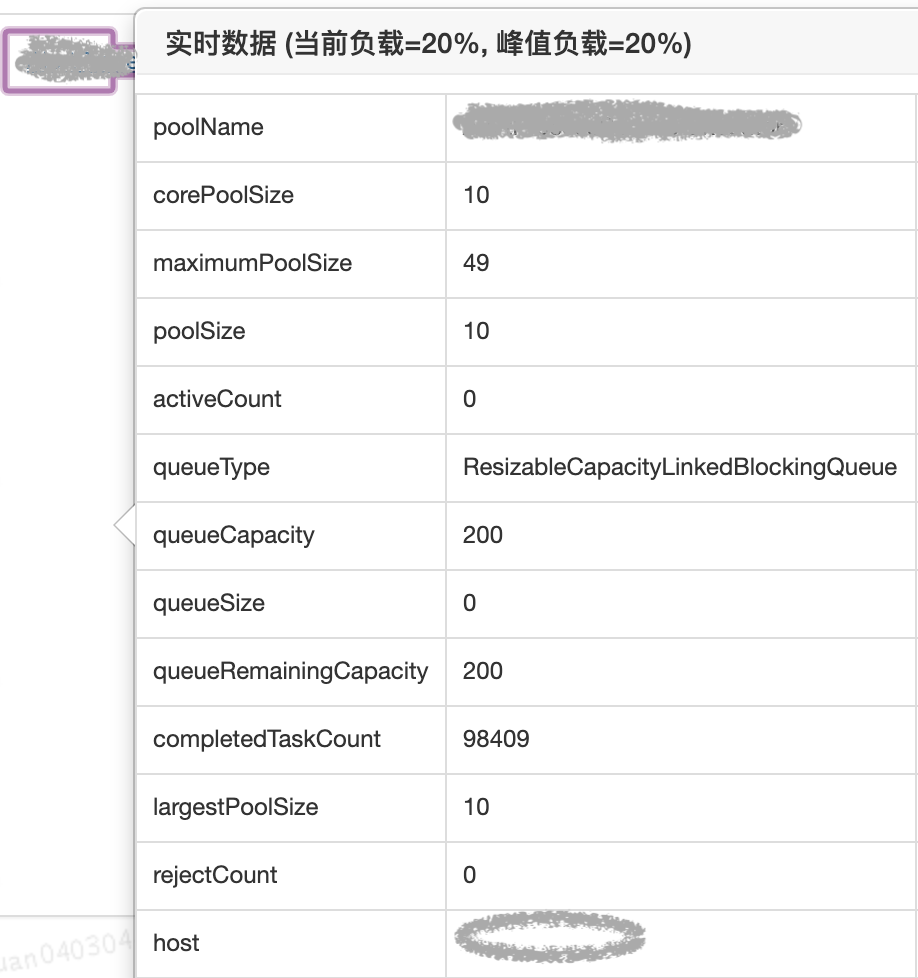<br />图25 线程池实时运行情况
### 3.4 实践总结
面对业务中使用线程池遇到的实际问题，我们曾回到支持并发性问题本身来思考有没有取代线程池的方案，也曾尝试着去追求线程池参数设置的合理性，但面对业界方案具体落地的复杂性、可维护性以及真实运行环境的不确定性，我们在前两个方向上可谓“举步维艰”。最终，我们回到线程池参数动态化方向上探索，得出一个且可以解决业务问题的方案，虽然本质上还是没有逃离使用线程池的范畴，但是在成本和收益之间，算是取得了一个很好的平衡。成本在于实现动态化以及监控成本不高，收益在于：在不颠覆原有线程池使用方式的基础之上，从降低线程池参数修改的成本以及多维度监控这两个方面降低了故障发生的概率。希望本文提供的动态化线程池思路能对大家有帮助。
## 四、参考资料

- [1] JDK 1.8源码
- [2] [维基百科-线程池](https://zh.wikipedia.org/wiki/%E7%BA%BF%E7%A8%8B%E6%B1%A0)
- [3] [更好的使用Java线程池](https://my.oschina.net/andylucc/blog/648127)
- [4] [维基百科Pooling(Resource Management)](https://en.wikipedia.org/wiki/Pooling_(resource_management))
- [5] [深入理解Java线程池：ThreadPoolExecutor](http://www.ideabuffer.cn/2017/04/04/%E6%B7%B1%E5%85%A5%E7%90%86%E8%A7%A3Java%E7%BA%BF%E7%A8%8B%E6%B1%A0%EF%BC%9AThreadPoolExecutor/)
- [6]《Java并发编程实践》
