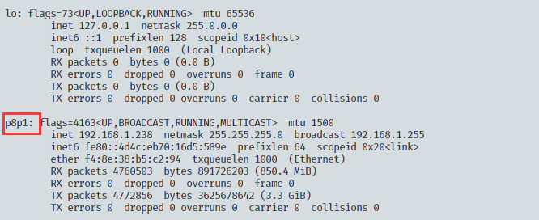

# Linux系统设置静态IP

在日常工作中，常常会由于动态IP分配导致指定主机或者服务器的内网IP发生变化，造成很多不便，通过设置静态IP可以有效解决此问题。本文简单介绍如何在CentOS 7和Ubuntu 18.04系统中设置静态IP。
## CentOS 7
### 1. 通过ifconfig命令查看当前的网络设置

### 2. 修改网卡配置
找到 `/etc/sysconfig/network-scripts/` 目录下网卡xxx的配置文件并修改为如下内容：<br />
```toml
TYPE="Ethernet"
PROXY_METHOD="none"
BROWSER_ONLY="no"
BOOTPROTO="static"
DEFROUTE="yes"
IPV4_FAILURE_FATAL="no"
IPV6INIT="yes"
IPV6_AUTOCONF="yes"
IPV6_DEFROUTE="yes"
IPV6_FAILURE_FATAL="no"
IPV6_ADDR_GEN_MODE="stable-privacy"
NAME="p8p1"
UUID="d7fcxxxx-xxxx-xxxx-xxxx-xxxx4d87xxxx"
DEVICE="p8p1"
ONBOOT="yes"
IPADDR="192.168.1.101"
NETMASK="255.255.255.0"
DNS1="114.114.114.114"
DNS2="192.168.1.1"
PREFIX="24"
IPV6_PRIVACY="no"
ZONE=
```
其中 `IPADDR` 即是我们设置的静态IP地址。
### 3. 重启network服务
修改配置文件之后，执行 `service network restart` 命令重启network服务即可让配置生效。
## Ubuntu 18.04
### 1. 修改网卡配置
找到 `/etc/netplan/` 目录下的 `yaml` 格式配置文件，修改配置文件内容为：
```yaml
networK:
    ethernets:
        p8p1:
            dhcp4: no
            addresses: [192.168.1.101/24]
            optional: true
            gateway4: 192.168.1.1
            nameservers:
                addresses: [114.114.114.114, 192.168.1.1]
    version: 2
```
### 2. 配置生效
执行 `sudo netplan apply` 命令使配置生效。
