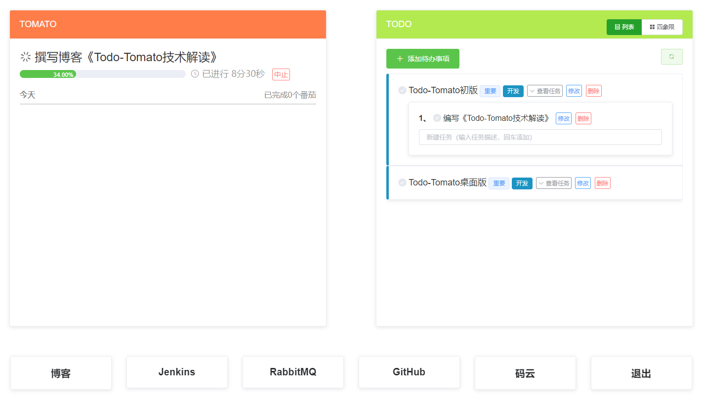

# Todo-Tomato技术解读

Todo-Tomato 是一款融合待办事项管理和番茄工作法，用于高效处理工作事务的工作利器，本文对 Todo-Tomato 使用的技术进行简要解读。<br />话不多说，先放上Todo-Tomato的界面截图。<br /><br />本文的技术解读基于[Todo-Tomato v1.0.0版本](https://gitee.com/yupaits/todo-tomato/tree/v1.0.0/)。
## 技术选型
使用目前比较流行的前后端分离进行开发：

-  前端技术栈：Vue.js + vue-router + vuex + axios + element-ui 
-  后端技术栈：Spring Boot + Spring JPA + MySQL + druid + Redis 
-  部署：阿里云ECS + Ubuntu16.04 + Nginx + OpenJDK8 + HTTPS 

由于使用的技术比较繁杂，这里选取一些个人觉得比较有记录价值的技术点进行说明。
## 后端技术点
### Log4j2日志配置
```yaml
Configuration:
  status: warn

  Properties:
    Property:
      - name: log.level.console
        value: info
      - name: log.level.com.yupaits.todotomato
        value: info
      - name: log.base
        value: /root/logs
      - name: project.name
        value: todo-tomato
      - name: log.pattern
        value: "%d - ${project.name} - %p [%t] [%C{0}:%M] - %c - %m%n"

  Appenders:
    Console:
      name: CONSOLE
      target: SYSTEM_OUT
      ThresholdFilter:
        level: ${sys:log.level.console}
        onMatch: ACCEPT
        onMismatch: DENY
      PatternLayout:
        pattern: ${log.pattern}
    RollingFile:
      - name: ROLLIING_FILE
        ignoreExceptions: false
        fileName: ${log.base}/${project.name}.log
        filePattern: "${log.base}/${project.name}.%d{yyyy-MM-dd}.%i.log"
        PatternLayout:
          pattern: ${log.pattern}
        Policies:
          TimeBasedTriggeringPolicy:
            interval: 1
            modulate: true
          SizeBasedTriggeringPolicy:
            size: "10 MB"
        DefaultRolloverStrategy:
          max: 1000

  Loggers:
    Root:
      level: info
      AppenderRef:
        - ref: CONSOLE
        - ref: ROLLIING_FILE
    Logger:
      - name: log.level.com.yupaits.todotomato
        additivity: false
        level: ${sys:log.level.com.yupaits.todotomato}
        AppenderRef:
          - ref: CONSOLE
          - ref: ROLLIING_FILE
```
**注意：** `filePattern` 和 `PatternLayout.pattern` 配置，当存在 `%d`、`%i` 等日志专用变量地时候，yaml配置文件需要加上 ""，否则配置不会被正确读取。
### AuthorizationInterceptor鉴权拦截器

- WebConfig.java
```java
@Configuration
public class WebConfig extends WebMvcConfigurerAdapter {

    @Autowired
    private ObjectMapper objectMapper;

    @Override
    public void addInterceptors(InterceptorRegistry registry) {
    registry.addInterceptor(new AuthorizationInterceptor(objectMapper)).addPathPatterns("/api/**");
    }
}
```

- AuthorizationInterceptor.java
```java
public class  AuthorizationInterceptor implements HandlerInterceptor {

    private ObjectMapper objectMapper;

    public AuthorizationInterceptor(ObjectMapper objectMapper) {
    this.objectMapper = objectMapper;
    }

    @Override
    public boolean preHandle(HttpServletRequest httpServletRequest, HttpServletResponse httpServletResponse, Object o) throws Exception {
    Boolean authorized = (Boolean) httpServletRequest.getSession().getAttribute(Constants.AUTHORIZED_KEY);
    boolean hasAuth = authorized != null && authorized;
    if (!hasAuth) {
        httpServletResponse.setStatus(HttpStatus.UNAUTHORIZED.value());
        httpServletResponse.setContentType(MediaType.APPLICATION_JSON_UTF8_VALUE);
        objectMapper.writeValue(httpServletResponse.getWriter(), ResultCode.UNAUTHORIZED.getMsg());
    }
    return hasAuth;
    }

    @Override
    public void postHandle(HttpServletRequest httpServletRequest, HttpServletResponse httpServletResponse, Object o, ModelAndView modelAndView) throws Exception {

    }

    @Override
    public void afterCompletion(HttpServletRequest httpServletRequest, HttpServletResponse httpServletResponse, Object o, Exception e) throws Exception {

    }
}
```
### BaseEntity JPA实体类基类

- BaseEntity.java
```java
@Data
@EntityListeners(AuditingEntityListener.class)
@MappedSuperclass
public abstract class BaseEntity<ID extends Serializable> implements Serializable {

    @Id
    @GeneratedValue(strategy = GenerationType.AUTO)
    private ID id;

    @Column(name = "create_at")
    @CreatedDate
    private Date createAt;

    @Column(name = "create_by")
    @CreatedBy
    private String createBy;

    @Column(name = "last_modified_at")
    @LastModifiedDate
    private Date lastModifiedAt;

    @Column(name = "last_modified_by")
    @LastModifiedBy
    private String lastModifiedBy;

    @PrePersist
    protected void onCreate() {
    createAt = new Date();
    lastModifiedAt = createAt;
    }

    @PreUpdate
    protected void onUpdate() {
    lastModifiedAt = new Date();
    }
}
```

- EntityAuditorAware.java
```java
@Component
public class EntityAuditorAware implements AuditorAware<String> {

    @Override
    public String getCurrentAuditor() {
    return Constants.ADMINISTRATOR;
    }
}
```

- Task.java
```java
@Data
@EqualsAndHashCode(callSuper = false)
@ToString(callSuper = true)
@Entity
@Table(name = "tdtmt_task")
public class Task extends BaseEntity<Integer> {
    private static final long serialVersionUID = 1L;

    @Column( name = "todo_id")
    private Integer todoId;

    @Column(name = "task_desc")
    private String taskDesc;

    @Column(name = "is_done")
    private Boolean done = Boolean.FALSE;

    public boolean isValid(boolean withPk) {
    boolean isValid = ValidateUtils.validId(todoId) && StringUtils.isNotBlank(taskDesc);
    return withPk ? ValidateUtils.validId(this.getId()) && isValid : isValid;
    }
}
```
## 前端技术点
### axios自定义实例配置
```javascript
import axios from 'axios'
import router from '../router'
import store from '../store'

const Api = axios.create({
  baseURL: 'https://***.***.com'
});

Api.interceptors.response.use(res => {
  return res.data;
}, error => {
  if (error.response.status === 401) {
    store.dispatch('logout');
    router.push('/login');
  }
  return Promise.reject(error.response);
});

export default Api
```
### router.beforeEach路由钩子
前端项目主观上只有两个界面，登录页和主页。因此在路由 **beforeEach** 钩子函数中的鉴权逻辑比较简单。
```javascript
router.beforeEach((to, from, next) => {
  const hasAuth = store.getters.hasAuth;
  if (to.path === '/') {
    if (!hasAuth) {
      next('/login');
    }
  } else {
    if (hasAuth) {
      next('/');
    }
  }
  next();
})
```
### 全局Api
在 `main.js` 中加入如下代码，将自定义的axios实例 **Api** 注入到**全局Vue**对象中，之后在Vue组件中就可以使用 `this.Api.get()` 的方式进行http请求。
```javascript
import Api from './api'

Vue.prototype.Api = Api
```
## 部署技术点
### 申请免费SSL证书用于站点HTTPS化
[Let's Encrypt](https://letsencrypt.org/getting-started/) 提供了免费SSL证书的申请服务。推荐使用With Shell Access方式，使用命令行工具 [Certbot](https://certbot.eff.org/) 申请证书。<br />完成证书申请之后，使用 `certbot renew --dry-run` 测试更新证书，可以正常更新的话，添加如下的 **cron** 任务定期更新证书。
```
# 每天3:00更新证书
0 3 * * * certbot renew >> ~/cron/cert.log --renew-hook "/usr/sbin/nginx -s reload"
```
使用 `--renew-hook` 才能保证使用的是最新的证书。
### Nginx HTTPS反向代理
Nginx配置如下：
```nginx
http {
    
  sendfile on;
  tcp_nopush on;
  tcp_nodelay on;
  keepalive_timeout 65;
  types_hash_max_size 2048;
    
  include /etc/nginx/mime.types;
  default_type application/octet-stream;

  ssl_protocols TLSv1 TLSv1.1 TLSv1.2; # Dropping SSLv3, ref: POODLE
  ssl_prefer_server_ciphers on;
    
  access_log /var/log/nginx/access.log;
  error_log /var/log/nginx/error.log;
    
  gzip on;
  gzip_disable "msie6";
    
  gzip_types text/plain text/css application/json application/javascript text/xml application/xml application/xml+rss text/javascript;

  include /etc/nginx/conf.d/*.conf;
  include /etc/nginx/sites-enabled/*;

  server {
    listen 443 ssl;
    server_name jenkins.***.com;

    ssl_certificate /etc/letsencrypt/live/jenkins.***.com-0001/fullchain.pem;
    ssl_certificate_key /etc/letsencrypt/live/jenkins.***.com-0001/privkey.pem;

    ssl_session_timeout 5m;

    location / {
      proxy_pass http://127.0.0.1:8080;
    }
  }

  server {
    listen 443 ssl;
    server_name rabbit.***.com;

    ssl_certificate /etc/letsencrypt/live/rabbit.***.com/fullchain.pem;
    ssl_certificate_key /etc/letsencrypt/live/rabbit.***.com/privkey.pem;

    ssl_session_timeout 5m;

    location / {
        proxy_pass http://127.0.0.1:15672;
    }
  }
  
  server {
    listen 443 ssl;
    server_name todo-tomato.***.com;

    ssl_certificate /etc/letsencrypt/live/todo-tomato.***.com/fullchain.pem;
    ssl_certificate_key /etc/letsencrypt/live/todo-tomato.***.com/privkey.pem;

    ssl_session_timeout 5m;

    root /usr/share/todo-tomato;
    index index.html;

    location /api {
      proxy_pass http://127.0.0.1:***;
    }
    
    location /checkVisitCode {
      proxy_pass http://127.0.0.1:***;
    }
    
    location /signOut {
      proxy_pass http://127.0.0.1:***;
    }
  }
}
```
该配置同时将服务器上的 `Jenkins` 和 `RabbitMQ` 也进行了HTTPS反向代理。
