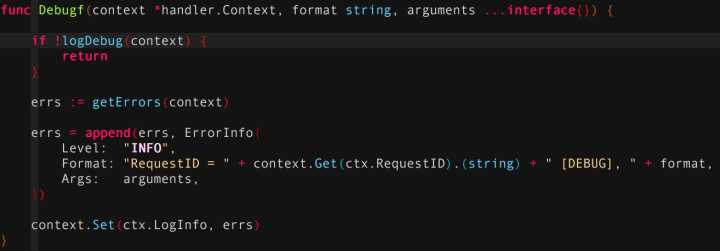

# 最佳日志实践

> 引用自[最佳日志实践（v2.0）](https://zhuanlan.zhihu.com/p/27363484)

## 什么是日志
日志用来记录用户操作、系统运行状态等，是一个系统的重要组成部分。然而，由于日志通常不属于系统的核心功能，所以常常不被团队成员所重视。对于一些简单的小程序，可能并不需要在如何记录日志的问题上花费太多精力。但是对于作为基础平台为很多产品提供服务的后端程序，就必须要考虑如何依靠良好的日志来保证系统可靠的运行了。

好的日志可以帮助系统的开发和运维人员：

1. 了解线上系统的运行状态
2. 快速准确定位线上问题
3. 发现系统瓶颈
4. 预警系统潜在风险
5. 挖掘产品最大价值
6. ……

不好的日志导致：

1. 对系统的运行状态一知半解，甚至一无所知
2. 系统出现问题无法定位，或者需要花费巨大的时间和精力
3. 无法发现系统瓶颈，不知优化从何做起
4. 无法基于日志对系统运行过程中的错误和潜在风险进行监控和报警
5. 对挖掘用户行为和提升产品价值毫无帮助
6. ……
## 日志的分类
日志从功能来说，可分为诊断日志、统计日志、审计日志。

**诊断日志， 典型的有：**

- 请求入口和出口
- 外部服务调用和返回
- 资源消耗操作: 如读写文件等
- 容错行为： 如云硬盘的副本修复操作
- 程序异常： 如数据库无法连接
- 后台操作：定期执行删除的线程
- 启动、关闭、配置加载

**统计日志：**

- 用户访问统计：用户IP、上传下载的数据量，请求耗时等
- 计费日志（如记录用户使用的网络资源或磁盘占用，格式较为严格，便于统计）

**审计日志：**

- 管理操作

对于简单的系统，可以将所有的日志输出到同一个日志文件中，并通过不同的关键字进行区分。而对于复杂的系统，将不同需求的日志输出到不同的日志文件中是必要的，通过对不同类型的文件采用不同的日志格式（例如对于计费日志可以直接输出为Json格式），可以方便接入其他的子系统。
## 日志中记录什么
理想的日志中应该记录**不多不少**的信息。

所谓不多，是指不要在日志中记录无用的信息。实践中常见到的无用的日志有：

1. 能够放在一条日志里的东西，放在多条日志中输出；
2. 预期会发生且能够被正常处理的异常，打印出一堆无用的堆栈；
3. 开发人员在开发过程中为了调试方便而加入的“临时”日志

所谓不少，是指对于日志的使用者，能够从日志中得到所有需要的信息。在实践中经常发生日志不够的情况，例如：

1. 请求出错时不能通过日志直接来定位问题，而需要开发人员再临时增加日志并要求请求的发送者重新发送同样的请求才能定位问题；
2. 无法确定服务中的后台任务是否按照期望执行；
3. 无法确定服务的内存数据结构的状态；
4. 无法确定服务的异常处理逻辑（如重试）是否正确执行；
5. 无法确定服务启动时配置是否正确加载；
6. 等等等等

输出日志时要考虑日志的使用者，例如如果日志主要由系统的运维人员来看，那就不能输出：
```
[INFO] RequestID:b1946ac92492d2347c6235b4d2611184, ErrorCode:1426
```
至少应该是：
```
[INFO] RequestID:b1946ac92492d2347c6235b4d2611184, ErrorCode:1426, Message: callback request (to http://example.com/callback) failed due to socket timeout
```
这样运维人员一眼就能清楚问题的原因，而不需要再通过开发来查看ErrorCode对应的具体错误。

整理一下通常情况下会遗漏的日志：

1.  系统的配置参数：系统在启动过程中通常会首先读启动参数，可以在系统启动后将这些参数输出到日志中，方便确认系统是按照期望的参数启动的； 
2.  后台定期执行的任务：如定期更新缓存的任务，可以记录任务开始时间，任务结束时间，更新了多少条缓存配置等等，这样可以掌握定期执行的任务的状态； 
3.  异常处理逻辑：如对于分布式存储系统来说，当系统在一个存储节点上读数据失败时，需要去另一个数据节点上进行重试，可以将读数据失败这件事情记录下来，之后可以通过对日志的分析确认是否某些节点的磁盘可能存在故障。再比如，如果系统需要请求一个外部资源，可以将请求这个外部资源偶尔失败又重试成功这件事情记录下来，具体来说： 
```
[INFO] RequestID:b1946ac92492d2347c6235b4d2611184, auth request (to http://auth1.example.com/v2) timeout ... 1 try
[INFO] RequestID:b1946ac92492d2347c6235b4d2611184, auth request (to http://auth1.example.com/v2) timeout ... 2 try
[INFO] RequestID:b1946ac92492d2347c6235b4d2611184, auth request (to http://auth1.example.com/v2) success
```
要好于 
```
[INFO] RequestID:b1946ac92492d2347c6235b4d2611184, auth request (to http://auth1.example.com/v2) success
```


因为前者可以让我们预判被依赖的服务器服务质量有风险，也许需要进行扩容； 

4.  日志中需要记录关键参数，出错时的关键原因等。例如： 
```
[INFO] RequestID:b1946ac92492d2347c6235b4d2611184, auth failed
[INFO] RequestID:b1946ac92492d2347c6235b4d2611185, content digest does not match
[INFO] RequestID:b1946ac92492d2347c6235b4d2611186, request ip not in whitelist
```


就不如：  
```
[INFO] RequestID:b1946ac92492d2347c6235b4d2611184, auth failed due to token expiration
[INFO] RequestID:b1946ac92492d2347c6235b4d2611185, content digest does not match, expect 7b3f050bfa060b86ba781151c563c953, actual f60645e7107917250a6408f2f302d048
[INFO] RequestID:b1946ac92492d2347c6235b4d2611186, request ip(=202.17.34.1) not in whitelist
```
## 关于日志级别
我们通常使用的日志库，将日志基本分为以下几类（从低到高）：

- **TRACE** – The TRACE Level designates finer-grained informational events than the DEBUG
- **DEBUG** – The DEBUG Level designates fine-grained informational events that are most useful to debug an application.
- **INFO** – The INFO level designates informational messages that highlight the progress of the application at coarse-grained level.
- **WARN** – The WARN level designates potentially harmful situations.
- **ERROR** – The ERROR level designates error events that might still allow the application to continue running.
- **FATAL** – The FATAL level designates very severe error events that will presumably lead the application to abort.

开发人员对于何种日志输出为何种级别通常有自己的理解，那在实践中，是否所有的日志级别都有必要存在，哪些操作需要记入日志，哪种错误应该记为WARN级别，而哪种错误又为ERROR级别呢？关于该问题，可以参考StackOverflow上的一个[讨论](https://stackoverflow.com/questions/2031163/when-to-use-the-different-log-levels)。

此处对贴子中的一些观点，加上我们在平时运维过程中遇到的相关问题进行归纳：

-  一个项目各个日志级别的定义应该是清楚明确的，需要团队的每个开发人员共同遵守； 
-  即使是TRACE或者DEBUG级别的日志，也应该有一定的规范，要保证除了开发人员自己以外，包括测试人员和运维人员都可以方便地通过日志定位问题； 
-  对于日志级别的分类，有以下参考： 
   - **FATAL** — 表示需要立即被处理的系统级错误。当该错误发生时，表示服务已经出现了某种程度的不可用，系统管理员需要立即介入。这属于最严重的日志级别，因此该日志级别必须慎用，如果这种级别的日志经常出现，则该日志也失去了意义。通常情况下，一个进程的生命周期中应该只记录一次FATAL级别的日志，即该进程遇到无法恢复的错误而退出时。当然，如果某个系统的子系统遇到了不可恢复的错误，那该子系统的调用方也可以记入FATAL级别日志，以便通过日志报警提醒系统管理员修复；
   - **ERROR** — 该级别的错误也需要马上被处理，但是紧急程度要低于FATAL级别。当ERROR错误发生时，已经影响了用户的正常访问。从该意义上来说，实际上ERROR错误和FATAL错误对用户的影响是相当的。FATAL相当于服务已经挂了，而ERROR相当于好死不如赖活着，然而活着却无法提供正常的服务，只能不断地打印ERROR日志。特别需要注意的是，ERROR和FATAL都属于服务器自己的异常，是需要马上得到人工介入并处理的。而对于用户自己操作不当，如请求参数错误等等，是绝对不应该记为ERROR日志的；
   - **WARN** — 该日志表示系统可能出现问题，也可能没有，这种情况如网络的波动等。对于那些目前还不是错误，然而不及时处理也会变为错误的情况，也可以记为WARN日志，例如一个存储系统的磁盘使用量超过阀值，或者系统中某个用户的存储配额快用完等等。对于WARN级别的日志，虽然不需要系统管理员马上处理，也是需要及时查看并处理的。因此此种级别的日志也不应太多，能不打WARN级别的日志，就尽量不要打；
   - **INFO** — 该种日志记录系统的正常运行状态，例如某个子系统的初始化，某个请求的成功执行等等。通过查看INFO级别的日志，可以很快地对系统中出现的 WARN,ERROR,FATAL错误进行定位。INFO日志不宜过多，通常情况下，INFO级别的日志应该不大于TRACE日志的10%；
   - **DEBUG** or **TRACE** — 这两种日志具体的规范应该由项目组自己定义，该级别日志的主要作用是对系统每一步的运行状态进行精确的记录。通过该种日志，可以查看某一个操作每一步的执 行过程，可以准确定位是何种操作，何种参数，何种顺序导致了某种错误的发生。可以保证在不重现错误的情况下，也可以通过DEBUG（或TRACE）级别的日志对问题进行诊断。需要注意的是，DEBUG日志也需要规范日志格式，应该保证除了记录日志的开发人员自己外，其他的如运维，测试人员等也可以通过 DEBUG（或TRACE）日志来定位问题；
## 不断优化日志
有一点可以肯定，好的日志就像好的文章一样，绝不是一遍就可以写好的，而需要在实际的运维过程中，结合线上问题的定位，不断地进行优化。最关键的一点是，团队要重视日志优化这件事情，不要让日志的质量持续降低（当项目变大时，项目的代码也存在一样的问题，越写越乱）。

此处有以下几个比较好的实践：

- 在定位问题的过程中完善日志，如果定位问题花费了很长时间，那就说明系统日志还存在问题，需要进一步完善和优化；
- 需要思考是否可以通过优化日志，来提前预判该问题是否可能发生（如某种资源耗尽而导致的错误，可以对资源的使用情况进行记录）
- 定义好整个团队记录日志的规范，保证每个开发记录的日志格式统一；特别需要说明的是，对于DEBUG/TRACE级别的日志，也需要定义好清晰的格式，而不是由开发人员自由发挥；
- 整个团队（包括开发，运维和测试）定期对记录的日志内容进行Review；
- 开发做运维，通过在查问题的过程来优化日志记录的方式；

运维或测试在日志中发现的问题，都需要及时向开发人员反映；
## 关于RequestID
### RequestID的作用
一个系统通常通过RequestID来对请求进行唯一的标记，目的是可以通过RequestID将一个请求在系统中的执行过程串联起来。该RequestID通常会随着响应返回给调用者，如果调用出现问题，调用者也可以通过提供RequestID帮助服务提供者定位问题。
### RequestID的生成
需要根据实际的使用场景来选择：

-  对于简单的系统，可以简单采用一个随机数即可，例如 
```
RequestID = md5(time.Now() + random.Int())
```
这样简单的方式在一定的时间内是不用担心会冲突的 

-  对于复杂的系统，需要在RequestID中编码更多的内容，例如：可以将处理请求的服务器IP，接收到请求的时间等信息编码到RequestID中，这样通过RequestID可以快速的了解请求属于哪台机器，然后进一步定位： 
```
./decode.sh 4b2c009a0a7800000142789f42b8ca96
Thu Nov 21 11:06:12 CST 2013
10.120.202.150
4b2c009a
```

-  对于一些特别的系统，RequestID也可以进行针对性的调整，例如在我实现的一个直播服务里，RequestID由两部分组成，第一部分是一个随机字符串（通过MD5生成），第二部分是一个不断在自增的整数：


对于直播系统，这样做的好处是通过RequestID的第一部分，可以快速搜索到一路直播流所有的日志，而第二部分自增的整数可以帮助快速定位一段时间的日志。 
### RequestID串联起来的日志系统
通常一个服务由若干个子系统组成，拿网易对象存储举例，它包含了前端负载均衡节点、存储逻辑服务器、元数据集群、分布式存储集群、图片处理集群、音视频处理集群、缓存集群等。通常一个请求需要由若干个子系统，甚至所有的子系统的协同处理。这时，如果某个请求出错，再要定位到具体的出错原因就比较复杂了，因为常常需要到数十台机器上去定位日志。

当时的思路在负载均衡节点接收到请求后，就为请求生成一个全局唯一的RequestID，该请求所经过所有子系统系统，均基于该RequestID记录日志，这样通过将所有的日志收集起来，就可以通过这一个RequestID来得到完整的系统处理日志了。

然而这并不是一件容易做的事情：所有的系统间调用都需要进行改造，所有的日志输出的地方都要统一格式，而我们采用的有些开源组件实际上很难支持这种做法。

不过，有了这样的认识，我们组在开发新的底层分布式文件系统时，接口传入的第一个参数就是RequestID了。
## 动态日志输出
上文已经讨论过，DEBUG日志和INFO日志的一个重要的区别是，INFO日志用于记录常规的系统运行状态，请求的基本的输入和输出等，对于定位一般的问题已经足够了。而DEBUG日志则详细的记录了一个请求的处理过程，甚至是每一个函数的输入和输出结果，遇到一些隐藏比较深的问题时，必须要依赖DEBUG日志。

然而，由于DEBUG级别的日志数量比INFO级别的数量多很多（通常差一个数量级），如果长期在线上服务器开启DEBUG级别的日志输出，日志量太大。再比如，有时候仅仅是由于某一个用户的访问模式比较特殊导致了问题，如果将整个服务（特别是一个服务部署了很多台节点时）都临时调整为DEBUG级别日志输出，也非常不方便。

下面介绍一种我采用的方式：

我们的系统采用如下的业务架构（简化版）：


在业务处理层的Proxy中，实现如下逻辑：当接收到的HTTP请求的QueryString中包含"DEBUG=ON"参数时，就将所有的DEBUG级别的日志也输出：



在负载均衡层的Openresty中，实现如下接口：管理员可以配置将哪个用户的哪个桶的哪个对象的哪种操作（注：这是对象存储中的几个概念）输出为DEBUG日志，Openresty会对每个请求进行过滤，当发现请求和配置的DEBUG日志输出条件相匹配时，则在请求的QueryString中新增"DEBUG=ON"参数。

通过这种方式，管理员可以随时配置哪些请求需要输出为DEBUG级别的日志，可以大大提高线上定位问题的效率。
## 慢操作日志
服务在接收到一个请求的时候，记录请求的接收时间（T1），在请求处理完成待发送的时候，会记录请求发送时间（T2），通常一个请求的日志都记为INFO级别，然而当出现请求处理时间（T2-T1）超过一定时间（如10s）时，可以将该日志提升为WARN级别。通过该方法，可以预先发现系统可能存在的一些问题。

同样的慢操作日志还可以用来记录系统一些外部依赖的处理时间，如一个服务可能依赖外部认证服务器来进行认证授权。通过记录每次认证请求的时间并将超出预期时间的请求日志采用WARN级别输出，可以尽早发现认证服务器是不是需要扩容等问题。

慢日志的时间阈值应该是可以动态调整的，这样在进行系统优化时，可以将该报警时间阈值逐渐调小，不断地对系统进行优化。
## 日志监控
通过对日志中的关键字进行监控，可以及时发现系统故障并报警，这对于保证服务的SLA至关重要。

服务的监控和报警是一个很大的话题，此处只说日志监控报警需要注意的一些问题：

1. 能不报警的就不报警，只有需要运维马上处理的错误才需要发送报警。这样做的原因是避免长期的报警骚扰让运维人员对报警不再敏感，最后真的报警来了时，变成了狼来了的传说；
2. 明确报警关键字，例如用ERROR作为报警的关键字，而不是各种各样的复杂规则。这样做的原因是日志监控本质上是不断的进行字符串匹配操作，如果规则太多太复杂，就可能对线上服务产生影响；
3. 对于一些预警操作，例如某个服务需要重试多次才能成功，或者某个用户的配额快用完等等，可以通过每天一封报警邮件的方式来反馈；
4. 每一次系统出现故障，都需要及时检查日志报警是否灵敏，日志报警的描述是否准确等，不断优化日志报警；
## 其他的注意事项

-  上线后日志观察

每一次上线完成后，除了对系统进行完整的回归测试外，还需要对日志进行观察，特别是当上线新功能以后，可以通过日志确认新功能是否工作正常。 
-  日志输出到不同的文件

在性能测试时遇到的另一个问题是，当并发量很大时，可能会有一些请求处理失败（如0.5%），为了对这些错误进行分析，需要去查这些错误请求的日志。而由于这种情况下日志量巨大，使得对错误日志的分析变得困难。

这种情况下可以将所有的错误日志同时输出到一个单独的文件之中。 
-  日志文件的大小

日志文件不宜过大，过大的日志文件对于日志监控，问题定位等都会带来不便。因此需要进行日志文件的切分，日志文件应该按天来分割，还是按照小时来分割，应该根据日志量来决定，原则就是方便开发或运维人员能快速查找日志。

为了防止日志文件将整个磁盘空间占满，需要定期对日志文件进行删除。例如，在收到磁盘报警时，可以将两个月以前的日志文件删除。此处比较好的实践是： 
   - 将所有日志文件收集起来，这样即使在记录日志的机器上删除，也可以通过收集的日志对之前的问题进行定位；
   - 每天通过定时任务来删除过期日志，如每天在凌晨4点删除60天前的日志
## 总结
对文中提出的所有建议总结如下：

- 充分认识到日志对于一个可靠的后端系统的关键作用
- 整个团队（包括运维人员）需要对日志级别有明确的规定，什么日志输出为什么级别，什么级别的错误出现要如何处理等
- 需要定期对日志内容进行优化更新，目的就是通过日志快速准确地定位问题
- 要明确不同日志的用途，对日志内容进行分类
- 绝不要打印没有用的日志，防止无用日志淹没重要信息
- 日志信息要准确全面，努力做到仅凭日志就可以定位问题
- 日志的优化是一件需要持续不断投入精力的事，需要不断从错误中学习
- 根据不同的目的生成RequestID，必要时在RequestID中尽量编码更多的信息
- 将一个请求的整个处理流程和唯一的RequestID关联起来
- 支持动态日志输出，方便线上问题定位
- 新上线服务器后一定要对日志进行观察，特别地，开发人员可以通过观察日志来确认新功能是否工作正常
- 通过日志级别的提升来发现潜在问题
- 对日志进行监控报警，比客户先发现系统问题
- 通过日志中的关键字来确定系统的运行状态
- 日志格式要统一规范
- 将错误日志输出到一个单独的文件中进行分析
- 要把日志的大小，如何切分，如何删除等作为规范建立起来
