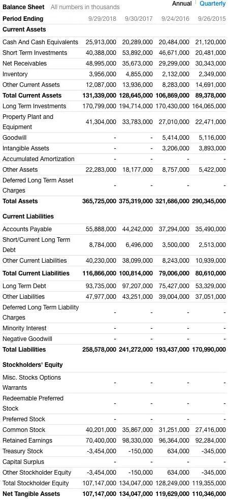
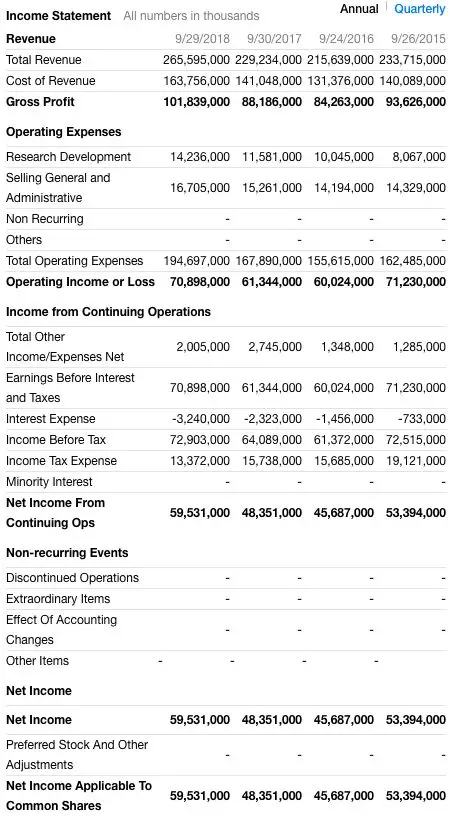
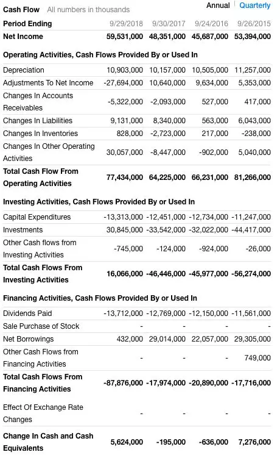
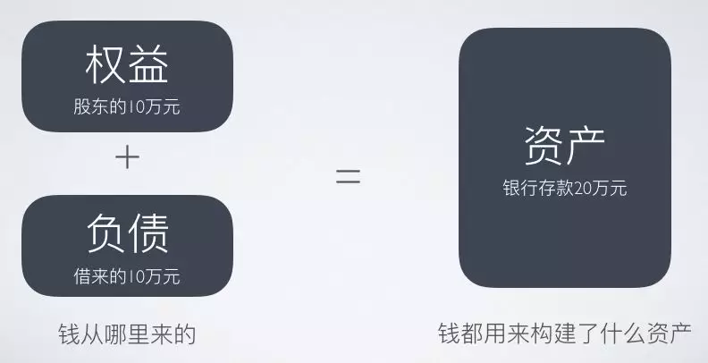
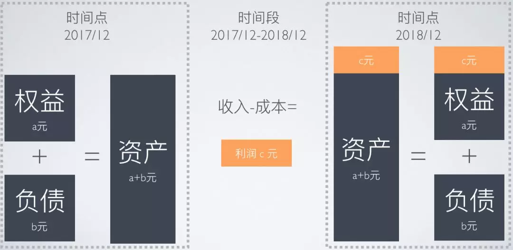

# 三大报表：财务界的通用语言

> 原文地址：[三大报表：财务界的通用语言](https://mp.weixin.qq.com/s/KY_FgC1-joFaACL0fjU2Ag)

你问一名程序员：世界上最好的语言是什么，你可能会得到各种答案。但如果你问一名财务人员，想要了解一家公司，什么是必不可少的？他们的回答会非常一致：三张报表。 资产负债表、利润表、现金流量表，这三张报表跨越了国别与行业，无论你是美国的炼油厂，还是巴西的农贸公司，这三张报表的编制与格式却是大同小异的。这当然不是一个巧合，而是因为任何一家商业公司，都可以抽象成一个用钱生钱的过程：融资拿到钱，投资花掉钱，经营赚回钱。而三张报表，则是这个过程的忠实记录者。

- 资产负债表

- 利润表

- 现金流量表

## 一、资产负债表
资产负债表反映的是企业的融资和投资过程。 先说说融资，顾名思义，融资就是找到成立和运营公司需要的钱。而一家公司拿到的钱，又可以分为股权融资和债权融资，这两者有什么不同呢？同样是给企业注入资金，但两者承担的风险和收益是完全不同的。 股权融资的收益，是和企业的发展息息相关的。如果企业发展得特别好，每年赚到的净利润都是属于股东的，而如果发展得不好，你同样需要承担亏损，决定是否追加资本，甚至就算是倒闭，也是优先补偿债权人后，才将剩余的清算价值分配给股东。 债权融资很好理解，就像你借钱给同事，会跟他谈清楚每年的利息是多少，借多久之后还给你本金。而他用这个钱，最后是赚大钱了还是亏光了，你并不在意，也无权干涉，你只要求他按约定的时间偿还利息和本金就可以。不过，借钱给你的人也不傻，他当然也会评估一家公司的偿债能力、信用水平，至少，你不能空手套白狼，这家公司首先肯定得有股东愿意投钱吧。 因此，股东先通过股权融资成立一家企业并向其中注入资金，然后，看公司发展需要和外界是否有人愿意借钱给公司，从而再通过债权融资获得资金。 在财务报表上，股权融资的钱体现为所有者权益（又称为净资产），债权融资的钱体现为负债。 那么现在有了这些钱，如何花钱，就是投资构建资产的过程。 比如说，我打算创建一家「存银行赚利息公司」，个人作为股东投入了 10 万元，同事借给了这家公司 10 万元。而公司的经营方式就是将融资得到的钱，存入银行赚取利息。这时候我的投资决策，就是将所有融到的钱，都投资存在银行里，作为银行存款。 这就是一张最简单的资产负债表，也就是所谓的会计恒等式之一：所有者权益 + 负债 = 资产。  当然，不太可能真的有公司的商业模式是拿到钱存到银行赚利息。21 世纪初，互联网刚刚兴起的时候，媒体都喜欢给互联网公司贴上轻资产的标签，那是因为，相比起传统企业需要购买厂房、知识产权、原材料等等资产，互联网公司只要买上几台电脑，就能开干了。无论如何，当企业把融到的钱转换成了资产，下一步就可以盘活利用这些资产去赚钱。而反映赚钱的这个过程，则是利润表。
## 二、利润表
利润表的概念相对较简单，无非就是「收入 - 成本 = 利润」。这个过程反映的就是企业的经营，即如何利用资产负债表上的资产端，为企业创造收入，在扣减掉各项成本开支后，剩下的利润就是这一年赚到的钱。 不过，这个看似简单的概念，在利润表上，你却会发现好多个不同的「利润」，它们其实反映的是企业不同经营层面的盈利能力。 以一家餐饮为例，毛利润实际上反映了最小经营单位的盈利能力，比如对一家餐饮来说，这个最小经营单位，往往是客人吃一桌饭。如果这顿饭客人吃了 3000 元，而相对应的，餐馆专门为了这顿饭有哪些变动成本呢？各种原材料食品的成本、一次性餐具的成本……扣减掉这些成本，就是企业的毛利润。 那么进一步的，经营一家餐饮，还需要给厨师/服务员/餐厅经理发基本工资，交房租，打广告，还银行贷款的利息……这些成本，无论你今天是 100 位客人，还是 200 位客人，花出去的钱都是一样的。这些就是所谓的固定成本，扣减掉他们，得到的就是营业利润，反映了企业在一定规模下经营的总体盈利能力。 不过，在企业的日常经营过程中，总会发生一些不常规的情况。例如，当地发生了洪灾，你作为餐厅的老板，决定以餐厅的名义捐款 100 万元，这笔钱就是正常经营外的支出。最后，缴纳完企业所得税，最终得到了餐厅这一年来真正赚到手的钱：净利润。 一般来说，我们在分析一家企业的盈利能力时，都会想方设法去除掉营业外损益的影响，因为我们假设这些事情是一次性的。不过，你也不能拿到利润表，就不管三七二十一先把营业外损益剔除掉，很多时候，企业也会想方设法通过一些会计手段来调整自己的利润水平，把很多非一次性的东西，打包放在营业外损益中。比如这家餐饮的老板特别乐善好施，每年都喜欢以餐厅的名义捐钱，这时候你就不能把它再简单地看成营业外损益了。  对于净利润来说，它最终又会回到资产负债表上，表示完成了一次企业经营周期的周转。在最简单的情况下，企业今年的净利润 c 元全部已经以现金的方式存入到了资产端的银行存在当中，那么，在不分红、不回购的情况下，c 元的净利润同时也作为留存收益，使所有者权益增加了。 这就是一个完整的周期，企业通过融资获得资金，去投资经营所需要的资产，然后通过一定时间段内的经营产生收入，最终产生的净利润，使最初股东投入的所有者权益增值了，实现了用钱生钱的过程。 
## 三、现金流量表
至此，企业的融资、投资、经营三个过程都已经完成了。那么，还有一张现金流量表，是做什么的呢？其实，现金流量表和前两张资产负债表与利润表，最大的不同，是两者的编撰视角。 在会计上，资产负债表与利润表是基于权责发生制的。什么意思呢？比如说两家公司之间签定了合同，A 公司向 B 公司售卖了 100 万元的手机，合同已经签定，手机已经交付收货，哪怕这时候 B 公司还没有付钱，A 公司已经可以确认收入了。也就是说，在这种视角下，权利和责任都已经产生了，剩下付钱只是迟早的一个步骤而已，企业统计资产、确认收入，都是以权利和责任确认的时间点为基础的。 而现金流量表则不同，它是基于收付实现制的，也就是说，它是以真的有钱进账，或钱款汇出的时间点进行统计的。在这个视角下，它会将经营、投资、融资三者按实际进入与流出的现金流进行调整，像之前提到的 100 万元只要还没有实际收到，都会从经营活动的现金流中剔除。 现金流量表的必要性，实际上是提供了一个额外的视角来观察企业。从现金的视角出发，首先能够辅助判断企业经营成果的真实性。想像一下，如果一个企业的利润表非常好看，但如果我们想知道这些利润到底只是账面上的数字，还是有实际的钱款进账，则可以使用现金流量表判断。其次，它有助于我们更好地审视企业的财务风险和短期偿债能力，毕竟，当别人向你要钱的时候，是需要你真金白银地掏出去的。 这三张报表，就是财务界的通用语言。当然，如果深挖下去，你又会发现，这门通用语言好像也不是那么通用，就像同样是中文，我们有各种各样的方言一样，不同类型和行业的公司，往往又有不同的解读视角和关注指标，感兴趣的话，可以自行多多了解。
