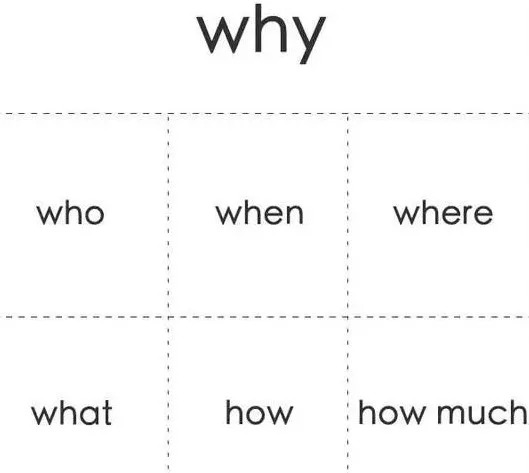
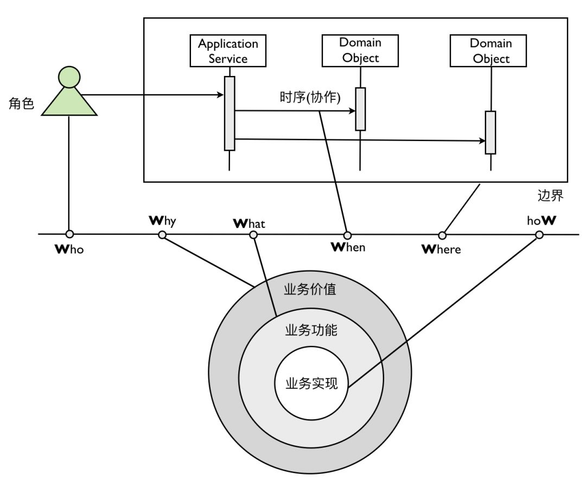
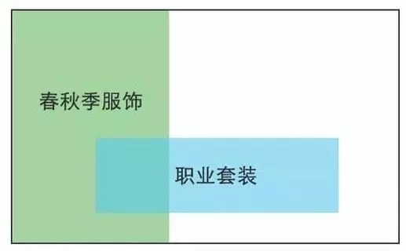
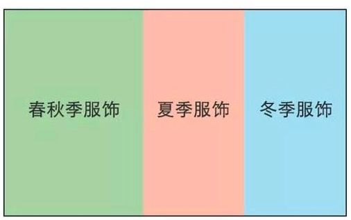
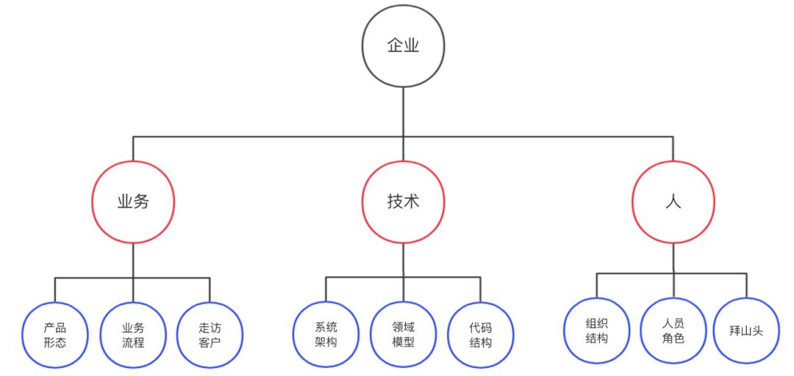

# 技术人具备“结构化思维”意味着什么？

> 原文地址：[技术人具备“结构化思维”意味着什么？](https://mp.weixin.qq.com/s/Veh8labc35JQTNyavTfBpQ)

> 阿里妹导读：在日常工作中，我们时常会碰到这样的情况，有的人讲事情逻辑非常混乱，罗列了很多事项，却把握不到重点，无法把一件事情说清楚。这种思维混乱是典型的缺少结构化思维的表现。结构化思维非常重要，不仅仅体现在表达上，也体现在在我们分析问题的过程中。具备结构化思维，才能将问题分析地更全面、更深刻。

## 什么是结构化思维？
那么到底是什么是结构化思维呢？简单来说，结构化思维的定义就是：逻辑+套路。
### 表达要有逻辑
所谓逻辑是指我们的结构之间必须是有逻辑关系的。例如，你说话的时候用“第一、第二、第三”这个逻辑顺序是合理的，但是，用“第一，第二，第四”就会显得很奇怪。当然，即使你用了”一、二、三”，也不一定就意味着你的内容有逻辑关系。想让内容有逻辑关系，我们要学会四种组织思想的逻辑关系： 1）**演绎（因果）顺序**：“大前提、小前提、结论”的演绎推理方式就是演绎顺序。比如，经典三段论：所有人都要死，苏格拉底是人，苏格拉底要死。 2）**时间（步骤）顺序**：“第一、第二、第三”，“首先、然后、再者”等，很多的时间顺序同时也是因果顺序。 3）**空间（结构）顺序**：“前端、后端、数据”，“波士顿、纽约、华盛顿”，化整为零（将整体分解为部分）等都是空间顺序。 4）**程度（重要性）顺序**：比如“最重要、次重要、不重要”等。 实际上，所有的逻辑关系都在这四种顺序之内。只要我们的思想和表达在这四种逻辑顺序之内，就是有逻辑的，否则就会显得没有逻辑性。
### 做事要有套路
**套路是指我们解决问题的方法论，这个也非常重要**。比如，5W2H 分析法就是一个非常好的，可以帮助我们分析问题的一个“套路”。试想一下，面对任何一个问题，你都能从 Why、Who、When、Where、What、How 和 How much（如下图所示），七个方面去思考。是不是比不知道这个方法论的人，用点状的思考，5W2H 分析法就全面得多。  例如，我们在对问题域进行分析和领域知识提炼的时候，就可以用上5W2H。5W2H模型给出了具有指导意义的约束，要求我们提炼的领域知识必须具备模型的六个要素。这就好比两位侃侃而谈的交谈者，因为有了确定的主题与话题边界，一场本来是漫无目的野鹤闲云似的闲聊就变成了一次深度交流的专题高端对话。  逻辑是一种能力，而套路是方法论，是经验。逻辑是道的东西，而方法论是术的东西。二者都很重要，只有熟练的掌握二者我们才能更好的进行结构化思考。
## 如何进行结构化思考？
逻辑性和方法论是结构化思维的底层，那么如何进行结构化思考呢？这也是有方法论的，总的来说是有两个步骤，首先是“建立中心”，然后再进行“分解”。
### 建立中心
**建立中心也就是要定义清楚要解决的问题，要明确目标**。是我们结构的顶层节点，也是一种以终为始的思考方式。也就是说，我们首先要搞清楚 why，然后再进行 how。 建立中心有两种方式：

1. **自上而下**：适用于问题比较明确的情况，我们只需要找到问题的核心要素即可，然后进行展开即可。
2. **自下而上**：对于问题不够明确的情况，我们需要对多种杂乱的内容，进行分类、剪枝、归纳汇总成一个中心。

建立中心通常不会是一次成型的，随着对问题理解的变化，对中心的抽象也会进行相应的调整。不同的抽象层次其面对的问题宽度是不一样的。具体要用哪个层次的抽象作为“中心”，要视具体情况而定。 比如面对“系统 bug 多”的问题，向上抽象是“提升代码质量”，向下抽象是“加强测试”，都可以作为中心，选择哪个为中心取决于你当前要解决的问题是什么。 
### 结构化分解
确定完中心之后，我们需要构建一个结构，使用结构化的思维对问题进行分解。分解的策略就是我们上文提到的四种逻辑顺序，即演绎顺序、时间顺序、空间顺序和程度顺序。 在做空间分解的时候，要注意满足 MECE（Mutually Exclusive Collectively Exhaustive，相互独立，完全穷尽）原则。 比如我们要对衣服进行分类，如果按照季节和风格进行分类，就会出现互相重叠，并且不能穷尽的情况，也就不满足 MECE。这种分类是逻辑混乱的。  我们可以按季节分：春秋装，冬装，夏装。除了这3类之外，没有其他季节了，这个就是「不遗漏」。 
## 结构化思维应用
### 如何落地新团队？
想象这样一个场景，你刚刚入职一家新公司，或者转岗到一个新团队，作为一个技术人，你将如何落地开展你的工作呢？ 这里，我们就能用上结构化思维来帮我们理清思路，从而有条不紊的开展工作了。我们要知道对一个企业来说，核心要素无外乎就是业务、技术和人，也就是说这三个要素是我们要建立的中心。基于这个中心，我们可以进行进一步拆解，形成子结构。然后对子结构再进行分析找到应对策略。这样一步步递进，我们就已经在用结构化思维解决如何落地新团队的问题了。 
#### 1. 熟悉业务
1）**了解产品**：任何一个团队都有自己要负责的产品，申请一个测试账号去用一下产品，是熟悉产品比较好的方式。 2）**了解流程**：任何业务都有自己的业务流程，而业务流里面最核心的是信息流。我们可以通过人员采访，了解关键节点的信息输入和信息输出；可以画一些泳道活动图，理清楚系统的主要角色，以及他们之间的交互关系。 3）**客户走访**：通过走访客户，我们可以更加获得业务的第一手资料，更加贴近业务和客户诉求。
#### 2. 熟悉技术
1）**了解系统架构**：可以让团队的技术人员介绍下他们当初系统设计和架构的思路。 2）**了解领域模型**：查看关键的核心表结构和系统 API，这样可以快速了解系统的领域模型。 3）**了解代码结构**：下载系统工程，熟悉整个工程结构和模块职责。以一个最重要的流程为入手点，阅读代码，看清楚核心的执行逻辑。做一个小需求，掌握相关的流程和权限。
#### 3. 熟悉人
1）**了解组织结构**：查看公司的组织树，知道公司大概是如何运作的，以及哪些是KP（Key Person，关键人）。比如，一个典型的电商公司会包括产品部、运营部、销售部、技术部、人力资源部、财务部、法务部等。 2）**了解人员角色**：了解公司都有哪些岗位，以及各岗位的职责范围。 3）**拜山头**：找到和自己工作息息相关的岗位人员，比如产品和运营。积极和他们沟通，向他们请教业务问题，多多交流。这样一方面可以建立更好的人际关系，另一方面也可以更快地熟悉业务。
### 打造极客文化
我最近刚刚转岗到新部门，新部门的老板抛给我一个命题：如何帮助技术团队打造极客文化？ 这个问题的中心很明确，接下来，看看我是如何使用结构化思维来解这个问题的。首先我们从空间顺序进行分解，也就是打造极客文化，我们可以去做哪些事情。  确定完要做的事情，我们还可以按照时间顺序对如何落地这些事情进行分解。  这样把按照这两个维度进行结构化拆解的方案给到老板，老板就会很清晰地知道你的规划和落地策略了。
### 如何做晋升述职
作者在阿里巴巴已经做了好几年的晋升评委，发现很多同学都缺乏结构化思维，冗长的 PPT 里，却不能把价值说清楚，不能把推导过程说清楚。实际上，我们需要有一些方法论来指导我们进行关键述职。 接下来，我主要说一下述职中存在的两个典型问题：“罗列事情”和“价值的背后”
#### 1.罗列事情
对自己做过的事情进行简单罗列，也许你的确做了不少事情。但是不能体现你对问题思考的深度和做这个事情带来的价值。这样的述职很难打动评委，更结构化的表达应该是：**“提出问题，定义问题，分析问题，解决问题，最后是展望未来”**。 这是一个经典的表述问题的结构，也是麦肯锡推荐的问题解决的框架。  类似的框架还有 zoom in/zoom out。 我们说事情时，应该像电影镜头一样，先从远拉近，再由近拉远。zoom in 是先从宏观背景开始，首先让大家知道你的事情发生的背景，为什么这事重要？然后讲到具体细节，怎么做成的？解决了什么问题？背后的思考是什么？最后 Zoom out，再从细节调回到整体，结果是什么，带来的客户价值是什么，你对未来的思考是什么。
#### 2.价值的背后
把价值说清楚的确很重要，正所谓：路走对了，就不怕远。如果你连价值都不明确，后面做的再多也是白搭。但是，仅仅阐述价值也是不够的，会让人觉得你有邀功之嫌。 比如你说：“我主导研发的风控系统把公司的坏账率从5%降低到2%”。这样的表述是不够的，你还需要把价值背后的过程和思考说清楚。对于这个结果，评委可能会问：

1. 之前为什么那么高？
2. 为什么你的方法可以降低？是如何归因的？
3. 具体解决了什么问题？
4. 是否可以总结出一套办法，以后别人也能用这个办法解决这些问题？

如果你在评委提问之前，就能对这些问题进行深入思考和适当呈现。那么你就是既有结果又有过程了。 通过这些案例，我们可以看到具备结构化思维，可以帮助我们快速的理清处理问题的思路，提升工作效率。经常锻炼结构化思维，可以极大的提升我们职场竞争力，让工作有条不紊，事半功倍。
