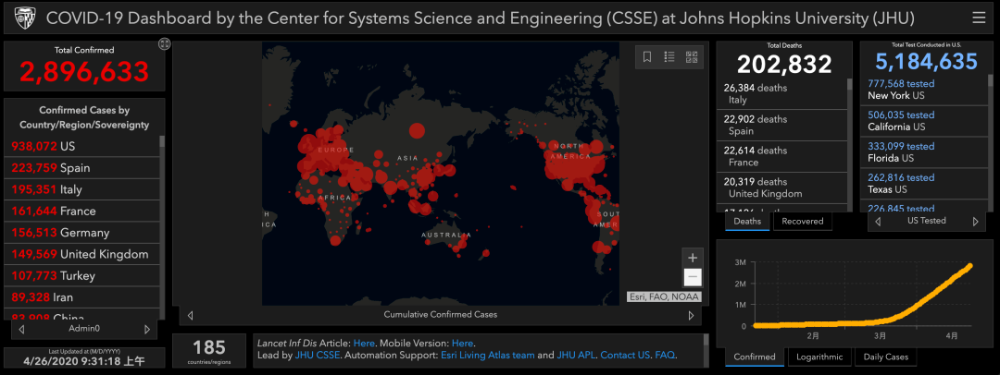
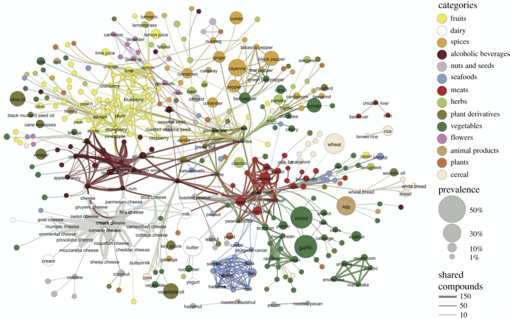
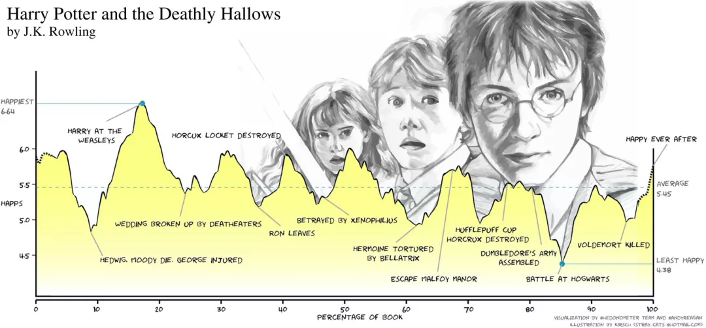
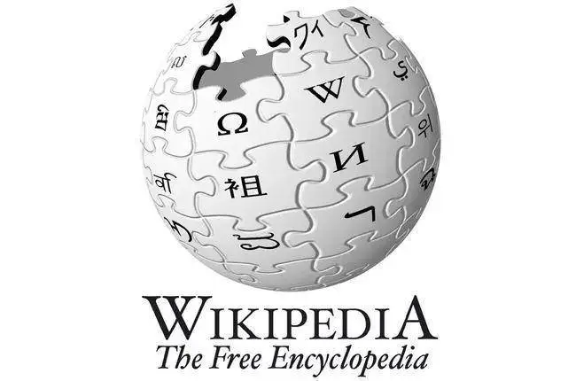
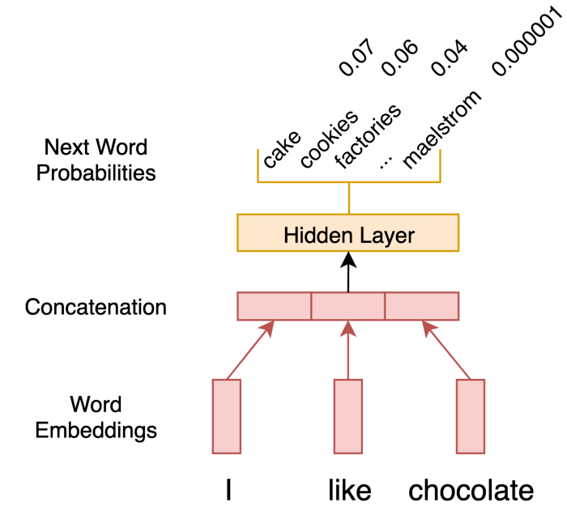
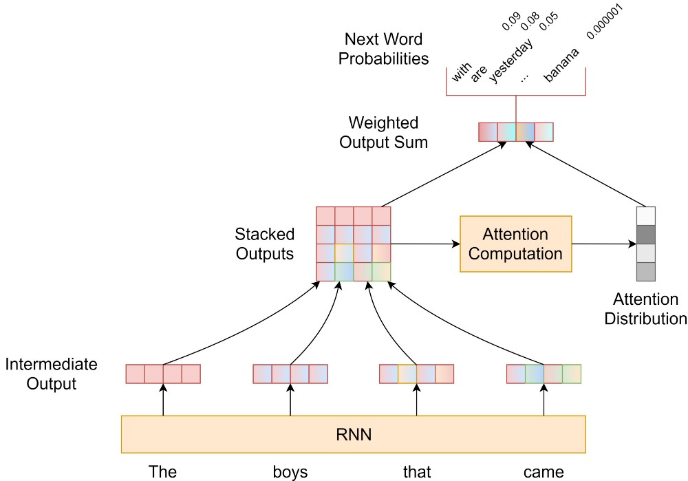
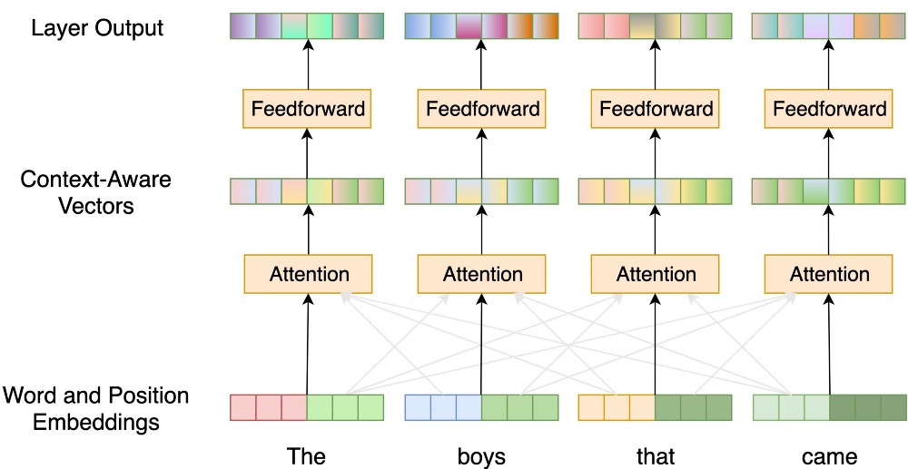

# 智能写作v2.0

> 引用自：[智能写作v2.0](https://mp.weixin.qq.com/s/SbyL7elFFhXDGv4yOkT7iQ)

> **computational literature**
> 如何看待文科渐渐「计算化」的趋势？

近年随着算力和数据科学的发展，不少文科开始出现「计算XX学」的分支，跟写作相关的比如，**计算文学、计算语言学、计算美学**。本文大量的工作基于《人工智能写作指南v1.0》，结合近些年作者的实践研究及国内外行业进展，整理而成，主要包括知识点、产品、技术栈等内容。

版本记录：

- 2019-02-14 v1.0
- 2020-04-26 v2.0
## 背景
这是一个机器人写稿的时代，智能写作应用的行业涉及非常广，有新闻业、媒体业、广告业、自媒体行业、政府公文等等，跟文字生产有关的都有所应用。

**应用场景上下游**主要分为上游的生产端，表现为创作工具（诸如编辑器、笔记类产品），中间环节主要是内容的审核、发布、培训（主要产品比如文本风险、版权检测、多平台自动发布），下游主要是内容的消费，比如广告变现、知识付费等。

最典型的产品是**机器人记者**，是不是意味着“人类记者即将失业”？其实不然，目前，新闻机器人主要用于以数据为基础的报道领域，例如公司年报、股票市场简报、地震报道和体育报道等等数据类的新闻。

还有文学类的产品也备受关注，例如**互动小说、小说生成**之类的。甚至是书籍的生成，有一个做法是通过浏览维基百科，**算法自动生成教科书**。
## 相关概念

- 程序写作

Program Writing

使用计算机程序来生成文字，包含的范围非常广。
- 电脑生成文学

Computer-Generated Literary Art

主要是计算机与文学方面的结合，偏艺术创作。
- 智能写手

artificial intelligence writer

主要是使用机器学习、深度学习等算法来生成文章或辅助写作。应用有写稿机器人、写作辅助工具、智能写诗、写春联等。
- 机器人记者

robo-journalist

主要用于写新闻报道，甚至能够对事实进行评论。比如在体育报道方面，它能够充分理解“反败为胜”“团队努力”之类的专业术语，同时根据自己的判断对体育比赛最重要的方面进行报道。它不会单纯地复述事实，而是会给文章加入一些不同的元素。
- 互动小说

Interactive Fiction

通常缩写成IF，指在软件模拟的环境中，读者通过输入纯文字命令来控制人物和影响环境，从而完成故事讲述。通俗一点的理解，可以将它看作是文字版的冒险或RPG游戏。
- 非线性叙事

由于是涉及到文学作品的生成、创作，计算机、人工智能改变了以往的叙事逻辑，我们可以技术的帮助下，进行非线性的叙事创作。
- 计算美学

Computational Aesthetics

计算美学研究审美对象的种种量化关系。其思想根源早在20世纪上半叶就已经诞生。当时美国数学家 George D. Birkhoff 提出，秩序与复杂度之间的比值作可以作为一种美学度量。因此，计算美学的主要任务就是发展新的科学方法来量化美，并建立人类审美感知的模型。
## 人工智能写作基本能力

1. 第一是总结能力，分析大量数据，从而总结事实；
2. 第二是解构重组能力，从大量数据中提取所需内容，并通过排列、组合形成文档。
3. 第三是美学能力，能够分别出成文的句子、段落、篇章的艺术特点，具体表现为一套评分系统
> (目前市面上还没看到一款有美学能力的智能产品,欢迎读者提供线索)

## 典型的技术思路
使用创新的创作技巧撰写非凡的文本，专注于新的写作方法，而不是传统的抒情或叙事手法。下面分别从新闻生产、新媒体内容生成、文学作品、书籍内容生成来介绍。

- 新闻编码的理论

来源于《纽约时报》研究与发展实验室提出的「Particles理论」，这套理论核心是：**给新闻编码**。

以“积木式”的编辑模式改变新闻生产、分发全部环节，并最大限度释放媒体人的生产力。

最核心的是把可能会被重复使用的部分识别出来并加以注释，这一过程被称为Particles。

从而，所有的资讯内容都被转化为了可供拼装的“颗粒”，每个部分都被重新编码，添加标签，而且是可以被嵌入的。

- 算法新闻的制作方法

首先，选定主题；

其次，编写爬虫爬取题材对应的文章数据；

第三，清洗数据，整理数据，去除无效信息；

第四，探索数据，发现其中有价值的信息；

最后，编写机器学习算法完成创作。



**表现形式一般是可视化的web页面，这次疫情尤其凸显出此类新闻的重要性**。

机器学习可以帮助记者完成日常任务，比如

寻找新闻；

捕捉图片和影像；

在社交媒体上编辑和发布新闻作品；

自动转录，使用图像识别技术来识别照片中的人，以及给视频加上字幕；

从社交媒体的海量内容中寻找特定信息；

- 机器自动生成新媒体内容

用机器完成内容的生成，思路来源于一款叫「新闻七点钟News at Seven」的应用，利用现有的网络资源、外部文本、多媒体资料库和用户偏好，来为用户创建个性化的音频和视频内容。

具体流程：

首先，根据用户偏好在系统中找到相关的文本

其次，处理文本

第三，补充图像、视频和相关的网友回复

第四，输出一个在线Flash短片，用卡通人物形象模仿传统的晚间新闻广播形式，来向用户播放内容。

- 文学作品创作思路

举一个撰写「关于饮食习惯」的文学作品的例子。

首先介绍一种**量化美食**的思路，下图是一个**美食风味网络**，每个节点代表一种食材，颜色代表所归属食物种类。节点大小反映了一种食材在菜谱中的普遍性。如果两种配料有显著数量风味的化合物共享，则表示它们之间有关联，链接的粗细代表两种配料之间共享化合物的数量。



美食风味网络

回到我们的文学作品的构建思路，首先，收集微博文本内容；

其次，提取出用户饮食习惯等数据，主要使用分词、词性标注和依存句法分析等NLP技术。那么如何抽取出用户饮食习惯呢？主要是由三个条件组成的规则：
> 一条微博里含有词语“吃”；
> 与“吃”相关的句法关系为动宾关系；
> “吃”的宾语为名词；

就可以判断发生饮食行为，进而提取出“吃”的宾语就是相关的食物，从而形成饮食习惯数据。

最后，重新组织语言，把用户的饮食习惯数据书写出来。

- 情感弧线

emotional arcs

此项技术可以帮助我们**分析故事的主要高潮和低谷**。



作者使用了三种主要方法进行《哈利·波特》的情感弧线分析：奇异值分解（singular value decomposition）；以 Ward 的方法产生故事的分层聚类；以及自组织映射机器学习方法来聚类情感弧线。**情感弧线是通过使用 hedonom.org 和 labMT 数据集分析滑动10000字窗口的情绪而构建的**。

另外 hedonometer.org 网站还提供了许多其他书籍、故事、电影剧本以及Twitter的交互可视化情感弧线。

- 新型书籍的自动生成

在没有人工参与的情况下，自动生成整本维基教科书；

这部分是来源于Wikibook-bot的一项技术，是由以色列内盖夫本古里安大学的沙哈尔阿德马蒂Shahar Admati 及其同事开发的；



主要的流程如下：

首先，准备一组现有的维基教科书，用作训练数据集，数量级在6000本以上。

其次，进行数据清洗，规则是：

1 关注浏览量超过 1000 次的教科书；

2 涵盖超过十个章节

第三，生成标题，该标题用以描述某种概念。

第四，文章清洗，规则类似于pagerank的原理，文章通常通过超链接指向其他文章，在网络上搜集出通过点击超链接三次以内得到的所有文章作为优质的文章。每本人工维基教科书都有自己的网络结构，其决定因素包括，引用该文的文章链接数量、指向其他文章的链接数量、所包含文章的页面排名列表等。

第五，文章分类，对所有维基百科文章进行分类；

第六，每一个类别主题对应的文章的再次清洗，该算法会查看每一篇给定主题筛选出来的文章，接着判断如果将其添加到维基教科书中是否会使该书的网络结构与人工创作的书籍更相似。如果不相似，那么该文章就会排除在外。

第七，将每一个类别主题对应的文章组织成章节。主要借助聚类算法，结合由整组文章组成的网络，找出如何将其划分为连贯的集群。

第八，确定文章在每个章节中的出现顺序。使用的是枚举，然后排序的思路，通过给文章成对分组，对所有文章枚举所有组合，然后使用网络模型来计算排序逻辑，最终计算出更为理想的文章顺序以及章节顺序。

感兴趣可以详细阅读论文：

[https://arxiv.org/pdf/1812.10937v1](https://arxiv.org/pdf/1812.10937v1)
## 主要涉及的NLP技术
### NLP 自然语言处理
为了实现写作类的应用，需要对文本进行大量的处理，NLP是一种让机器能够像我们平常那样阅读和理解语言的技术。常常会结合知识图谱来使用，以提升产品效果。

我们需要掌握NLP的常见任务及算法。

- 主要的NLP任务

文本分类、情感分析、分词、依存句法分析、实体识别等；

- 深度学习算法

目前深度学习有以下典型的算法，可以一一详细了解掌握；

参考地址 [https://github.com/graykode/nlp-tutorial](https://github.com/graykode/nlp-tutorial)

- GPT2

这里要举一个例子，在大受欢迎的 reddit 社区中，一个名为 SubSimulatorGPT2 的子讨论小组格外引人注目：**其内容完全由人工智能聊天机器人模仿各种讨论小组的风格生成后发布**。

SubSimulatorGPT2

[https://www.reddit.com/r/SubSimulatorGPT2/](https://www.reddit.com/r/SubSimulatorGPT2/)

早期的SubredditSimulator（[https://www.reddit.com/r/SubredditSimulator/）的机器人使用**马尔科夫链**，这是一种成熟的生成序列的技术。](https://www.reddit.com/r/SubredditSimulator/%EF%BC%89%E7%9A%84%E6%9C%BA%E5%99%A8%E4%BA%BA%E4%BD%BF%E7%94%A8**%E9%A9%AC%E5%B0%94%E7%A7%91%E5%A4%AB%E9%93%BE**%EF%BC%8C%E8%BF%99%E6%98%AF%E4%B8%80%E7%A7%8D%E6%88%90%E7%86%9F%E7%9A%84%E7%94%9F%E6%88%90%E5%BA%8F%E5%88%97%E7%9A%84%E6%8A%80%E6%9C%AF%E3%80%82)

- 马尔可夫链和N-gram

**马尔科夫链的假设（第一性原理）**。基于马尔可夫链的模型假定句子中的每个单词仅取决于其前面的几个单词。因此，给定任意句子的概率为组成该句子的所有n-gram（n个单词的序列）的组合概率。下图说明了该概念:


以Python 语言为例，采用字典(Dictionary)的数据结构。
```python
d = {key1 : value1, key2 : value2 }
```
键名是当前的单词，键值是一个列表List，存储当前单词的下一个单词。
```python
d = {word1 : [word2,word3], word2 : [word3,word4,word5] }
```
具体的例子，有这么两句话：
```
I like to eat oranges
You eat apples
```
我们希望通过**马尔科夫链**来学习以上数据，经过计算，模型为：
```
{
'START': ['i','you'],
'i': ['like'],
'like': ['to'],
'to': ['eat'],
'you': ['eat'],
'eat': ['apples','oranges'],
'END': ['apples','oranges']
}
```
**我们不需要计算下一个单词出现的概率，因为如果它们出现的概率较大，那么他们会在选取下个单词的列表中出现好几次。采用适当的数据结构，问题也得到了简化的处理。**

- 词嵌入和神经语言模型

词嵌入是当今NLP中任何人都必学的第一项技术：将词投射到多维空间中。它的优势在于，具有相似用法/含义的单词会获得相似的向量（按余弦相似度衡量）。因此，涉及相似单词的单词向量的矩阵乘法趋于给出相似的结果。

**何为余弦相似度？** 在NLP的任务里，会对生成两个词向量进行相似度的计算，常常采用余弦相似度公式计算。余弦相似度用向量空间中两个向量夹角的余弦值作为衡量两个个体间差异的大小。余弦值越接近1，就表明夹角越接近0度，也就是两个向量越相似，这就叫”余弦相似性”。

这是基于神经网络的语言模型的基础。有趣的是，**神经模型不计算出现次数来确定概率，而是学习可以为任何输入计算出它们的参数（权重矩阵和偏差）**。这样，甚至可以为我们从未见过的n个语法之后的下一个单词计算一个合理的概率分布。下图是一个最简单的神经网络：MLP (multilayer perceptron) 多层感知器。



- 递归神经网络

随着递归神经网络（RNN）的出现，特别是长短期记忆（LSTM）的出现，语言生成方面获得了更大进步。与之前提到的最简单的神经网络不同，RNN的上下文不仅限于n个单词；它甚至没有理论上的限制。

RNN的主要改进在于保留了内部状态。因此，RNN可以不停地逐字读取单词，从而更新其内部状态以反映当前上下文，而不是只看固定的窗口（n个单词）。

**使用RNN的文本生成以自回归方式遵循与马尔可夫链相似的原理**。RNN对第一个单词进行采样，将其送到神经网络以获取下一个单词的概率，然后再对下一个单词进行采样，依此类推，直到句子结束为止。如下图所示，依次学习The、boys、that、came单词的过程。


Internal State类似于大脑（黑箱），记录了所有复杂的文本信息。

- 注意力机制

**在产生下一个输出之前，先回顾所有先前的单词**。计算注意力本质上是指计算过去单词的某种分布，然后将这些单词的向量与接收到的注意力成比例地进行聚合。下图说明了该概念。



注意机制使RNN可以回顾先前单词的输出，而不必将所有内容压缩为隐藏状态。中间输出之前的压缩RNN块与不注意时的块相同。

- Transformer

Transformer是一种神经网络架构，于2017年推出，旨在解决RNN的缺点。它的关键思想是**完全依靠注意力，以至根本不需要内部状态或循环**。下图是Transformer的简化的描述。实际的架构非常复杂，您可以在查阅相关文章找到更详细的解释 。



- GPT模型

回到前文所提到的GPT2，GPT全称Generative Pre-Training，出自2018年OpenAI的论文《Improving Language Understandingby Generative Pre-Training》，论文地址：

[https://www.cs.ubc.ca/~amuham01/LING530/papers/radford2018improving.pdf](https://www.cs.ubc.ca/~amuham01/LING530/papers/radford2018improving.pdf)

GPT是一种半监督学习方法，它致力于用大量无标注数据让模型学习“常识”，以缓解标注信息不足的问题。详细可以阅读论文深入了解。
## 人工智能辅助写作
一些相关产品。

- Grammarly在线写作网站

Grammarly是一款全自动英文写作工具， 可以实时检查语法，一边写一边改，语法问题和修改意见会以标注的形式显示在文档的右侧，方便用户去一一查看，而且在每条批注下面都会配有详细的解释，告诉用户哪里错了，为什么要这样修改。

- 百度创作大脑

百度人工智能写作辅助平台“创作大脑”，智能助手可以为人类创作者提供纠错、提取信息等各种辅助工作。

- GET智能写作

一站式智能写作服务平台。全网热点追踪、推荐海量素材、提升原创质量。

[揭秘 GET人工智能写作的前世今生](http://mp.weixin.qq.com/s?__biz=MzA3MDgyMjMwMA==&mid=2649936256&idx=1&sn=44ec5149a73c8ef5ae0deff52bb08851&chksm=87308173b0470865c38cc2e4a972174775f456e4fb69c6a19a73d84e1f3c673888c87844fb3f&scene=21#wechat_redirect)
## 算法新闻、机器人记者
目前在这个领域领先的有国外的2家公司：

1. 自动化洞察力公司 Automated Insights
2. 叙述科学公司 Narrative Science

我们先来了解下算法新闻的简史。

- 算法新闻简史

_国外的早期创业公司，如今的佼佼者_

早在2007年，美国的「自动化洞察力」Automated Insights公司成立；

2009年，美国西北大学研发的StatsMonkey「统计猴子」系统就撰写了一篇关于美国职业棒球大联盟季后赛的新闻稿件；

2010年，「叙述科学」公司Narrative Science成立；

_由机器人记者主导的新闻行业正在迅速崛起_

在2014年，美联社与Automated Insight公司达成协议，成为机器人记者的早期的采用者。

2014年3月，第一条完全由计算机程序生产的新闻报道产生。作为首家“聘用”机器人记者的主流媒体，《洛杉矶时报（LA Times）》在地震发生后3分钟就发布了首条相关新闻。

在这一年，机器人写稿技术研发公司Automated Insight全年生产了10亿条新闻。

在2015年，新华社推出可以批量编写新闻的写作机器人「快笔小新」；

同年9月，腾讯财经发布写作机器人「Dreamwriter」；

1年后，中国湖北广播电视台长江云新闻客户端就派出两会机器人记者“云朵”进行采访。

第一财经也发布写作机器人「DT稿王」

同年，国外挪威新闻社NTB启动机器人，开始着手制作自动化足球新闻报道项目；

_自动化新闻已经通过自动新闻写作和发行进入新闻编辑室_

2017年1月，南方都市报社写作机器人「小南」正式上岗，推出第一篇共300余字的春运报道。

……

以上为算法新闻简史。

我们需要知道「机器人记者」并不是真正的职业记者，而是一种新闻报道软件，拥有自动撰写新闻故事的功能。相类似的概念有算法新闻、自动新闻。

媒体一般都会形象地，描述机器人记者在媒体单位“上班”，机器人具备“真人记者”所有的采编功能，不会出错，不用休息，所写的文章不仅时效性强，质量也高，工作效率比“真人记者”高出好几倍。

- 经典产品「机器人记者」

由美国叙述科学公司Narrative Science发明的写作软件；这个软件拥有自动撰写新闻故事的功能。

基于选题和新闻热点追踪，通过平台授权，结构化采集、处理、分类、分析原始数据素材，快速抓取，生成新闻关键词或线索，然后，利用文本分析和信息抽取技术，以模板和规则知识库的方式，自动生成完整的新闻报道。

尤其在体育赛事，金融经济，财报数据等方面作用突出。

- 2018年数据新闻创新奖《搜索侦察机》

记者彼得•奥尔德乌斯Peter Aldhous，开发了这个项目，他使用了机器学习——特别是「随机森林random forest」算法，从大量的飞机飞行数据中，建立了一个模型，可以根据以下数据：
> 飞机的转弯速率
> 飞行速度
> 飞行高度
> 每条飞行路径周围的矩形区域
> 飞行持续时间

识别出可能是“隐藏身份的侦察机”。

- 各大报社、杂志社的应用

国内有人民日报「小端」、光明日报「小明」、今日头条「张小明」、南方都市报「小南」等等。近期新华智云的更新是业内比较大的动作。

新华智云

作为新华社和阿里巴巴集团共同投资成立的大数据人工智能科技公司，于2019年发布了“媒体大脑3.0”。以区块链技术和AI审核为显著特征，为内容工作者提供“策、采、编、发、审、存”全流程赋能，为媒体机构、宣传部门、企业单位各类融媒体中心提供便捷、高效、智能的数据中台和内容生产平台。

新华社「快笔小新」

「快笔小新」的写稿流程由数据采集、数据分析、生成稿件、编发四个环节组成，这一机器人适用于体育赛事、经济行情、证券信息等快讯、简讯类稿件的写作。

腾讯「DREAMWRITER」

腾讯在2015年9月推出了一个叫 Dreamwriter 自动化新闻写作机器人。最开始，这项技术主要用在财经领域，现在它在体育赛事的快速报道中也有很成功的应用案例了。

2016年里约奥运会期间，Dreamwriter 就自动撰写了3000多篇实时战报，是奥运媒体报道团的“效率之王”。

在“2017腾讯媒体+峰会”现场，Dreamwriter 平均单篇成文速度仅为0.5秒，一眨眼的时间就写了14篇稿件。

国外的应用主要如下：

《卫报》

使用机器人辅助写作，并发表了一篇名为《Political donations plunge to $16.7m – down from average $25m a year》

《华盛顿邮报》

Heliograf机器人记者，在报道2016年夏季奥运会和2016年选举时证明了它的有用性；

还帮助《华盛顿邮报》在一年一度的全球大奖中获得了「巧妙使用机器人奖Excellence in Use of Bots」

《 Guardian》

2014年，英国《 Guardian》进行了纸质测试计划，安排“机器人”统计分析社交网络上的共享热点和注意力加热，然后内容过滤、编辑排版和打印，最后制作一份报纸。

《华尔街日报》

应用于金融投资研究报告片段的摘录，网站会提醒读者那一段摘录是由机器人完成的，哪些是由人类完成的。主要摘录类似于以下的文字：
> 第二季度的现金结余8.3亿美元，这意味着在第一季度减少1.4亿美元之后，第二季度又消耗了8000万美元
> Q2 cash balance expectation of $830m implies ~$80m of cash burn in Q2 after a $140m reduction in cash balance in Q1

这句话实际上只包含了三个数据点，并使用特定的语法合并在一起，而且不包含任何巧合的成分。

《洛杉矶时报》

《洛杉矶时报》靠「机器人写手」，第一时间报道了美国加州2014年3月18日当地时间早晨发生4.4级地震；还应用于对犯罪时间错误归类的分析。

《纽约时报》

《纽约时报》对美国国会议员的图像识别；还应用机器人编辑Blossom预测哪些文章有可能会在社交网站上引起传播，相应地给版面责任编辑提出建议；

《福布斯》

2011年，开始使用叙述科学公司 Narrative Science 的自动写稿程序来撰写新闻；

彭博社

应用机器人系统Cyborg，帮助记者在每个季度进行大量的文章撰写，数量达到数千篇，包括各公司的财报文章等。机器人可以在财报出现的一瞬间就对其进行详细的剖析，并且提供包含这些相关事实和数据的实时新闻报道，速度非常迅速。

美联社

从2014年7月开始使用语言大师 Wordsmith 软件，利用自动化技术来写公司财务报表。几毫秒的时间，软件就能写出一篇美联社风格的完整报道。

- 技术进展

从早些年的以摘选稿件中句子为主，过渡到现在全流程的方式。

- 人形机器人

结合硬件，还有人形机器人版本的机器人记者的出现，例如中国智能机器人佳佳作为新华社特约记者越洋采访了美国著名科技观察家凯文·凯利。这是全球首次由高仿真智能机器人作为记者与人进行交互对话，专家认为具有标志性意义。
## 新媒体与人工智能写作
按照美国新媒体艺术理论家马诺维奇（Lev Manovich）在《新媒体语言》一书中对新媒体技术所下的定义：
> 所有现存媒体通过电脑转换成数字化的数据、照片、动态形象、声音、形状空间和文本，且都可以计算，构成一套电脑数据的，这就是新媒体。

这是一个艺术与科技跨界结合的领域，我们可以关注国外的大牛：

MIT的Nick Montfort教授

国际上被公认为诗人和通过计算探索语言的人

他撰写了大量互动小说文章，发布在博客Grand Text Auto上，同时也开发了许多数字诗和文本生成器。他最近的着作是「The Future」和「The Truelist」，有兴趣可以去了解下他的研究。

下面给大家介绍典型的案例。

_互动小说与新型文学作品的创作_

2016年，人工智能创作的小说在日本「星新一文学奖」上被评委称为「情节无破绽」。人工智能应用于文学创作领域，为文学作品带来了新鲜血液，与文学作品的结合还增添了作品的互动性，与游戏、电影产生了跨界交融。

_互动故事平台_

加拿大多伦多的互动故事平台Wattpad

其产品包括匹配创作者和读者的机器写作，识别故事“趋势”，根据主题进行创意写作等；还开发了视频讲故事的应用「Raccoon」；

这是一个故事版的YouTube，专注于非虚构的，基于视频的，连接全球各地愿意分享、观看视频故事的用户。作者用视频的形式讲一段故事，用户可以收藏或分享。

_社交媒体文学作品_

对社交媒体上信息的重组，从而产生了新的文学形式。这时候机器类似于记者，采编社交媒体上的用户发言，而生成报道。

_全球日常活动日记_

阿姆斯特丹的Moniker设计工作室编写了一个针对推特信息的简单查询，

它搜索类似“这是 + 点 + 分 + 上午/下午 + 和 + ”这类结构的句子，构成一份包含全球日常活动的日记。

这种“这是几点和我是”句式，可以反映社交媒体上用户的日常活动状态，下面是生成的报道效果：
> “这是12:29而我需要点饮料”
> “这是1:00pm而我还没有离开我的床”
> “这是11:00pm我终于得到了一杯咖啡。”

_《推傲慢与推偏见》

Twide and Twejudice_

把推特中的内容，按照奥斯汀原文中的对话的风格，来重新生成。原理是替换相似内容的用词，让对话看起来“更接地气”：
> Is he/she overrun 0r single?
> What _a fineee thingi 4my rageaholics girls!

_类似于游戏的互动小说_

案例一个互动小说，《The Hitchhiker’s Guide to the Galaxy（银河系漫游指南）》；小说讲述的是一个名叫阿瑟尔·登特的地球人，因为遭遇外星人修路拆迁，被卷入星际探险的故事。

它是根据同名科幻小说改编的互动版，虽然开头部分与原小说非常类似，但随着故事的开展。及用户的参与，出现了很多新的故事情节和从而产生了各种不同的结局。

体验地址：[www.bbc.co.uk/h2g2game](http://www.bbc.co.uk/h2g2game)

_更游戏化的体验

IOS平台互动小说「florence」_

是一款漫画风格的互动故事书式的手机游戏，出自《纪念碑谷》首席设计师之手，讲述了女主人公Florence Yeoh的初恋故事。

灵感来源于”Slice of Life”漫画小说和网络漫画；

但其故事是线性的，不存在选择与剧情分支。

_互动电影

《黑镜：潘达斯奈基》_

这部电影拥有一万亿种不同的情节排列组合，和五个截然不同的结局。凭借互动版《黑镜》，Netflix再次向世界证明自己“用技术打破传统、引领内容创新”的价值观。观众用触屏、鼠标、遥控器等就可以自己控制剧情走向和主角命运；选择不同，每个观众看到的内容就不同、故事结局也因人而异。

_NaNoGenMo比赛_

花一个月写代码，生成一个50k字的小说，最后分享小说和代码。是 Darius Kazemi 在美国「全国小说写作月 National Novel Writing Month：NaNoWriMo」的基础上延伸出的一个项目；

NaNoGenMo的目的更多的是娱乐自己和他人；

Github地址[https://nanogenmo.github.io](https://nanogenmo.github.io/)

_World Clock

世界钟_

是2013年的冠军，它由MIT数字媒体方向的Nick Montfort教授完成；他用165行Python代码将字符、位置信息以及一天之中每分钟的动作设计排列为新的序列。

_Teens Wander Around a House小说_

围绕某个话题的对话，但对话的内容毫无意义。设定了一大堆的智能代理，让它们随机的穿过房间，程序会记录下它们的行动。当两个同时来到一间屋子的时候，程序会从Twitter上摘取对话内容。一个微博内容也许就能成为一个问题，比如“明天晚饭吃什么？”那么紧接着的对话中也要包含“晚饭”这个词，“一天之中我最喜欢的就是晚饭”。

_Generated Detective_

这是一部黑色喜剧，生成的漫画有时不连贯，有如梦幻式的叙述；编写的程序从「Project Gutenberg古腾堡项目」的侦探小说中搜寻包含下列一系列单词的语句：问题、凶手、证人、目击、场景、杀手、武器、线索、指责、揭示。随后，程序用采集的每个语句检索Flickr，并把图像拼接成漫画的形式，合成对话框，最后以一个怪异而神秘的黑色故事作为结尾。
## 机器的工作方式
我们已潜移默化地理解机器的工作方式，用机器所习惯的语言与机器沟通。例如，我们在适用搜索的时候，是不是跟我们日常的语言所不一样，我们习惯了不断变换关键字，不断组合关键字来与机器沟通。
### 机器风格
以文章是否读起来像人类作品作为评判电脑作品的依据是迂腐的，因为什么样的语言能够被称作“自然语言”的标准是相对的，而不是绝对的。

机器生成文章，以人类作家的标准去评判，是目前大众所认为的“正确”的事，然而，正是由于是机器生成的，有机器自身的独特风格，那有没有一种评判标准，脱离人类的评判标准，但符合机器的特点？

机器生成文本是另外一种文学风格，是机器所擅长的。

- 能力1「节选」
   - 按句式，例如：

`A认为…`

   - 或按人物，例如：

`翟天临事件调查组`

`翟天临导师名字`

`北大回应翟天临事件`

`人民日报谈翟天临`

- 能力2「组装」
   - 把结构化数据，填充入语句中比如A，B 字段的数据，填充如句子：

`A可能造成B`

- 能力3「解构重组」
   - 情感分析，按照情感的设定重组章节

这里介绍2个案例：
> 《搜索者》
> The Seeker
> [https://github.com/thricedotted/theseeker](https://github.com/thricedotted/theseeker)

NaNoGenMo 2014年的作品。一本试图“通过阅读WikiHow来了解人类行为”的机器的自传。The Seeker的每次运行都是独一无二的，因为它依赖于外部随机性（在本例中为WikiHow）。

搜索者既是算法，也是代理人，主角，叙述者。

从本质上讲，它是一个解析，解构和重构文本的实体。此算法的输出是其执行此操作的“日志”，搜集关于人类活动的概念。

另一个是：
> 我在清水中淌过
> I Waded in Clear Water

作者使用了情绪分析算法，根据文本的情绪特征对其进行分级，并据此规则改写Gustavus Hindman Miller的《10000个梦的解释》。

主要的句式是：

- **“行为”+“含义”**
- **action + denotation结构**

例如：
> 行为：“看到橡树结满橡果”
> 含义：“意味着升职加薪”

首先将行为部分转换为第一人称，简单的将句子重新处理成：
> “我看到橡树结满橡果”

然后根据情绪分析算法所得出的结果，将“含义”部分按照从梦中最坏到最好的顺序重新排列。情绪分数创建了短的章节比如：
> “我将车开到浑水中。我看到别人在除草”

和由一系列不相干的行动组成的长章节：
> “我走下一层楼梯。
> 我看到一个瘸子。
> 我看到我的爱人喝鸦片酒解愁。
> 我听见嘲笑声。
> 我停在窗台。
> 我身上有虱子。
> 我看到。
> 我丢掉了它。
> 无论如何我都感到忧郁。
> 我发出一条信息……”

### 人机协作
机器有其特定的风格，而人机协作，可以产生更为丰富、有创意的成果，一个典型的人机协作思路是：机器生成若干结果，人从中选择一个结果，不断重复此过程，以完成某项任务。

这是Kazemi在2015年的NaNoGenMo作品中加入这种新的人机交流形式，让人和算法一起“合作”写小说；算法会起草十个句子，然后他作为人类从中选择他认为最好的那句。算法写作了文章中的每一个字，而作者则决定了整本小说的形式。

**10年后，人们对机器学习/人工智能的看法将与我们今天对Excel、Word的看法一样。它只是我们用来完成某些任务的工具。**

**不要想我们可以在哪里可以使用人工智能，**

**反而应该想想我们每天都要面对哪些问题，**

**然后评估人工智能是否可以解决这些问题。**

以上为全文。
