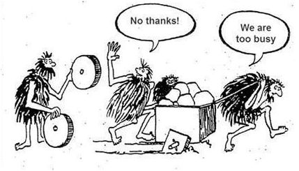

# 遇到问题后的本能反应，会决定职场发展的高度？

> 原文地址：[遇到问题后的本能反应，会决定职场发展的高度？](https://mp.weixin.qq.com/s/ic1Yqh4TgKNW3bks7jKqSg)

怎么通俗的理解认知？ 认知，是对待一个问题，本能的思考方式。 举个例子，老板抛出了一个问题，群里的Team Leader，本能之下可能有这样几类回复：
> 画外音：Team Leader，后文统一使用TL简写。

（1）这不是一个问题，不影响；
> 画外音：可能是怕给自己部门找麻烦。

（2）不是我部门的问题，另一个部门请看一下；
> 画外音：可能是怕老板追责，先把锅甩出去。

（3）我们先看一下，稍后反馈；
> 画外音：高下立判，不喜欢怎样的TL，就别做那样的TL。

**管理认知，对待问题的本能反应，有可能决定一个管理者职场能够到达的高度。** 职场人，常见的有这几类认知，对待同一个问题，ta们往往本能的做出不同的反应。
## 第一类：“抱怨型”
这类员工/管理者，**遇到问题，往往归咎外因，以“抱怨”为本能的应对**。 例如：晋升没有成功，ta会认为，评委都是傻X，没有人是伯乐。 又例如：系统出了线上问题，ta的本能反应是，QA没有测试到位。 再例如：绩效不符合预期，ta会认为是TL的支持不够，同事不配合，下属不给力。 ta们充满负能量，不喜欢从自己身上找原因。他们不但自己不积极，还容易将负能量扩散给团队，引导团队和公司进行对抗，这类员工一旦发现，一定要及时T出团队。
## 第二类：“积极行动型”
这类员工/管理者，**遇到问题，往往归因于，自己行动不够，努力不够**，以此为默认的思维方式。 例如：没有涨工资，ta会认为，是自己不够努力，需要再晚几个小时下班。 又例如：线上告警没有及时发现，ta会认为，是自己应该更频繁的check线上日志。 ta们态度端正，工作积极，会从自己身上找原因。**这种正能量大概率会引导ta们走向成功。** 但是，有少部分人，努力却没有成功，就有可能是方法不对，导致效率低下。  **努力是成功的必要条件**，但并不是努力，一切问题就能够解决。遇到这类员工，要帮助和引导他们往更高的认知上走。
## 第三类：“找方法型”
这类员工/管理者，**遇到问题，本能反应是，方法比问题多**。 例如：项目频繁延期，ta会思考，可能是流程不合理，配合不顺畅，需求总变更等。 又例如：提测质量差，ta会思考，是不是员工能力不足需要培养，或者是不是能借助工具去提高代码质量等。 这类员工，愿意思考问题的多种解决方案，最终找到优化的方案，把事情持续推动优化。ta们 **不但态度端正，而且解决问题能力很强**。有态度，有能力，他们有潜力成为团队一线、二线管理者，需要重点培养。 这里，我们作为员工，同时作为管理者，需要反思，每当我们遇到问题，我们的潜在认知： （1）是，态度端正，在自己能够掌控的范围寻找问题的解决方法？ （2）还是，下意识的解释，下意识的defence呢？
> 画外音：认知决定高度。

**在什么情况下，“有方法”也解决不了问题呢？** 此时，很可能是，找错了问题！！！ “有方法”解决“正确的做事”。 然而，**“做正确的事”更加重要**。
## 第四类：“找方向型”
> 画外音：或者理解为，战略型思维。

例如：当项目做不过来时，有战略思维的产品经理，不会立刻说“研发人不够，要加资源”，也不会立刻说“必须加班加点多做几个项目”，ta会思考： （1）产品的核心指标，工作方向，工作目标； （2）为了达成目标，可能有100个产品项目要做； （3）这100个项目的投入产出，ROI分别如何； （4）在有限资源的情况下，应该先做哪些，后做哪些；
> 画外音：对接这样的PM，是幸福的。

管理者需要有经营思维，一味强调“人不够”只能说明缺乏成本意识，试想如果你是公司的CEO，你会无限的招人么？ 这类员工/管理者，他们往往具备很强的 **逻辑性思维，系统性思维**，而不是想到一出是一出。遇到问题时，他们本能反应是，目标是什么，达成目标的路径是什么，工作的方向是什么，当前的 **主要矛盾是什么**，最终找到当前“正确的事情”是什么。 这里，我们作为员工，同时作为管理者，需要反思，每当我们遇到问题，我们的潜在认知： （1）是，找到当前的主要矛盾？ （2）还是，盲目的执行呢？
> 画外音：认知决定高度。

## 总结
新晋的管理者，**需要认同的第一件事，就是从专家到TL的角色转变**；需要思考的第一件事，就是 **认知的升级**： （1）拒绝抱怨； （2）态度上，保持正能量； （3）能力上，找到问题的解决方案； （4）方向上，具备逻辑性思维，系统性思维，找到主要矛盾，为团队设定目标并达成；
