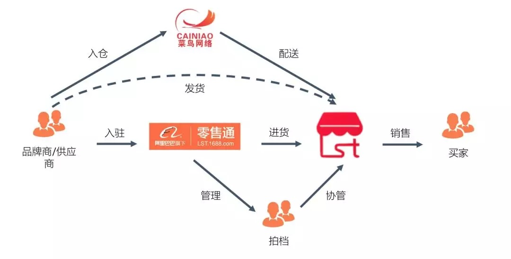
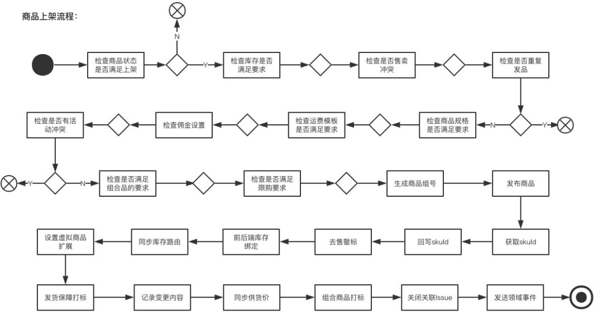
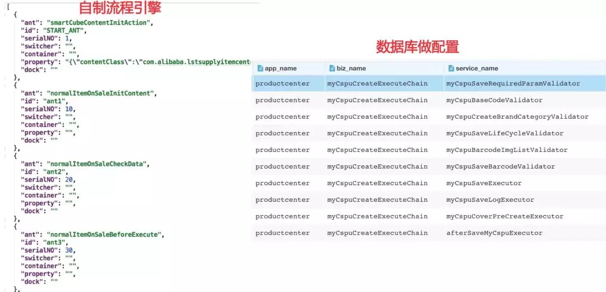
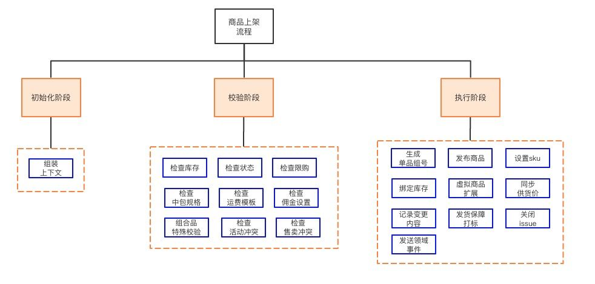
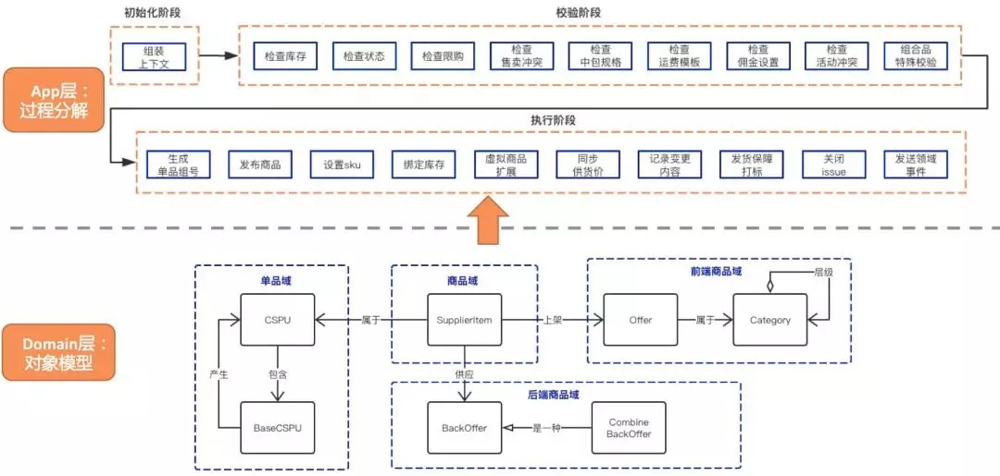
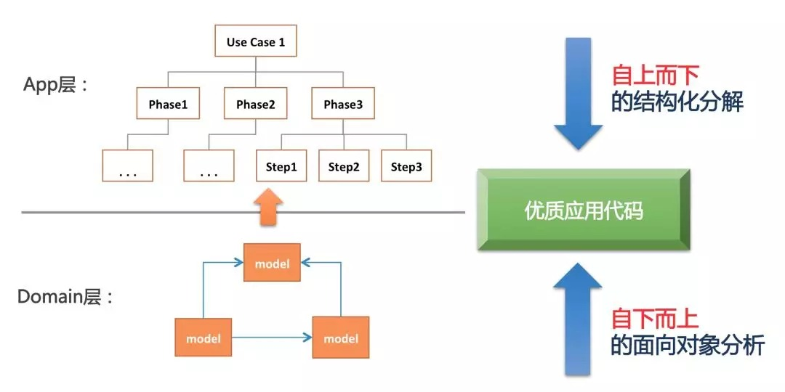
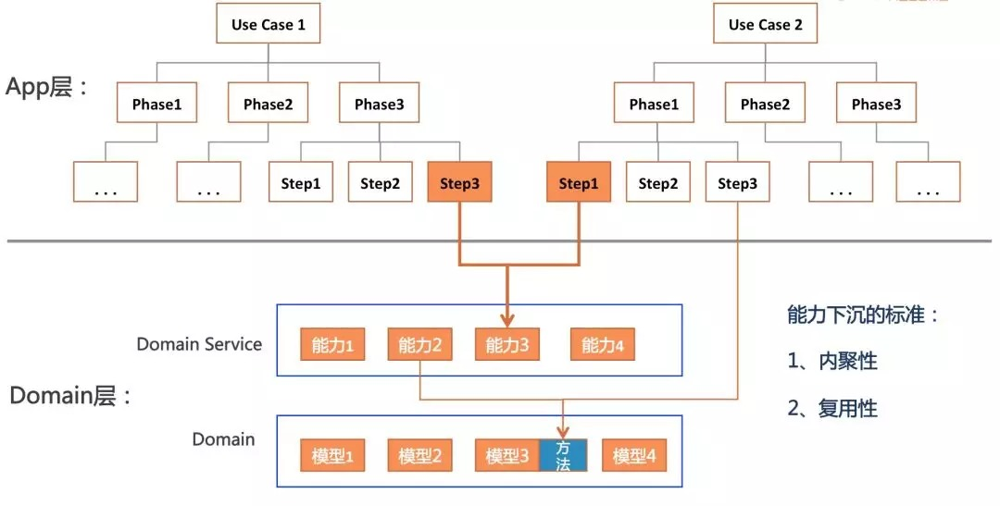

# 阿里高级技术专家方法论：如何写复杂业务代码？

> 原文地址：[阿里高级技术专家方法论：如何写复杂业务代码？](https://mp.weixin.qq.com/s?__biz=MzIzOTU0NTQ0MA==&mid=2247491068&idx=1&sn=2e724face6f7e1df5e81c377c84862a6&chksm=e92920f3de5ea9e574cdc9b183e837aab9eb032694d44f44c61b4637d8e477e0c0de831f7f51&scene=0&xtrack=1&key=32c60e053085a25a672fef3da7f5f0b0666caa58a1f830e928c40b77255c6a73bcf6acd0e1e3cfad8cf2e7c7b0e89095c6e81ea34543fa81fdffbb826f4d9dd7b8f57e090dd84e4e565000490e445567&ascene=14&uin=NzY4MDc0NTEx&devicetype=Windows+10&version=62060833&lang=zh_CN&pass_ticket=YFdki/C91SuYZ9EN4uME0o15SyEjun/i+YMf4Zcr9bJk2Sgt4KHnETaywmWxCaEh)

> 阿里妹导读：张建飞是阿里巴巴高级技术专家，一直在致力于应用架构和代码复杂度的治理。最近，他在看零售通商品域的代码。面对零售通如此复杂的业务场景，如何在架构和代码层面进行应对，是一个新课题。结合实际的业务场景，Frank 沉淀了一套“如何写复杂业务代码”的方法论，在此分享给大家，相信同样的方法论可以复制到大部分复杂业务场景。

## 一个复杂业务的处理过程
### 业务背景
简单的介绍下业务背景，零售通是给线下小店供货的B2B模式，我们希望通过数字化重构传统供应链渠道，提升供应链效率，为新零售助力。阿里在中间是一个平台角色，提供的是Bsbc中的service的功能。



商品力是零售通的核心所在，一个商品在零售通的生命周期如下图所示：


在上图中红框标识的是一个运营操作的“上架”动作，这是非常关键的业务操作。上架之后，商品就能在零售通上面对小店进行销售了。因为上架操作非常关键，所以也是商品域中最复杂的业务之一，涉及很多的数据校验和关联操作。

针对上架，一个简化的业务流程如下所示：


### 过程分解
像这么复杂的业务，我想应该没有人会写在一个service方法中吧。一个类解决不了，那就分治吧。

说实话，能想到分而治之的工程师，已经做的不错了，至少比没有分治思维要好很多。我也见过复杂程度相当的业务，连分解都没有，就是一堆方法和类的堆砌。

不过，这里存在一个问题：即很多同学过度的依赖工具或是辅助手段来实现分解。比如在我们的商品域中，类似的分解手段至少有3套以上，有自制的流程引擎，有依赖于数据库配置的流程处理：



本质上来讲，这些辅助手段做的都是一个pipeline的处理流程，没有其它。因此，我建议此处最好保持KISS（Keep It Simple and Stupid），即**最好是什么工具都不要用，次之是用一个极简的Pipeline模式，最差是使用像流程引擎这样的重方法**。

除非你的应用有极强的流程可视化和编排的诉求，否则我非常不推荐使用流程引擎等工具。第一，它会引入额外的复杂度，特别是那些需要持久化状态的流程引擎；第二，它会割裂代码，导致阅读代码的不顺畅。大胆断言一下，**全天下估计80%对流程引擎的使用都是得不偿失的**。

回到商品上架的问题，这里问题核心是工具吗？是设计模式带来的代码灵活性吗？显然不是，**问题的核心应该是如何分解问题和抽象问题**，知道金字塔原理的应该知道，此处，我们可以使用结构化分解将问题解构成一个有层级的金字塔结构：



按照这种分解写的代码，就像一本书，目录和内容清晰明了。

以商品上架为例，程序的入口是一个上架命令（OnSaleCommand）, 它由三个阶段（Phase）组成。
```java
@Command
public class OnSaleNormalItemCmdExe {

    @Resource
    private OnSaleContextInitPhase onSaleContextInitPhase;
    @Resource
    private OnSaleDataCheckPhase onSaleDataCheckPhase;
    @Resource
    private OnSaleProcessPhase onSaleProcessPhase;

    @Override
    public Response execute(OnSaleNormalItemCmd cmd) {

        OnSaleContext onSaleContext = init(cmd);

        checkData(onSaleContext);

        process(onSaleContext);

        return Response.buildSuccess();
    }

    private OnSaleContext init(OnSaleNormalItemCmd cmd) {
        return onSaleContextInitPhase.init(cmd);
    }

    private void checkData(OnSaleContext onSaleContext) {
        onSaleDataCheckPhase.check(onSaleContext);
    }

    private void process(OnSaleContext onSaleContext) {
        onSaleProcessPhase.process(onSaleContext);
    }
}
```
每个Phase又可以拆解成多个步骤（Step），以OnSaleProcessPhase为例，它是由一系列Step组成的：
```java
@Phase
public class OnSaleProcessPhase {

    @Resource
    private PublishOfferStep publishOfferStep;
    @Resource
    private BackOfferBindStep backOfferBindStep;
    //省略其它step

    public void process(OnSaleContext onSaleContext){
        SupplierItem supplierItem = onSaleContext.getSupplierItem();

        // 生成OfferGroupNo
        generateOfferGroupNo(supplierItem);

       // 发布商品
        publishOffer(supplierItem);

        // 前后端库存绑定 backoffer域
        bindBackOfferStock(supplierItem);

        // 同步库存路由 backoffer域
        syncStockRoute(supplierItem);

        // 设置虚拟商品拓展字段
        setVirtualProductExtension(supplierItem);

        // 发货保障打标 offer域
        markSendProtection(supplierItem);

        // 记录变更内容ChangeDetail
        recordChangeDetail(supplierItem);

        // 同步供货价到BackOffer
        syncSupplyPriceToBackOffer(supplierItem);

        // 如果是组合商品打标，写扩展信息
        setCombineProductExtension(supplierItem);

        // 去售罄标
        removeSellOutTag(offerId);

        // 发送领域事件
        fireDomainEvent(supplierItem);

        // 关闭关联的待办事项
        closeIssues(supplierItem);
    }
}
```
看到了吗，这就是商品上架这个复杂业务的业务流程。需要流程引擎吗？不需要，需要设计模式支撑吗？也不需要。对于这种业务流程的表达，简单朴素的组合方法模式（Composed Method）是再合适不过的了。

因此，在做过程分解的时候，我建议工程师不要把太多精力放在工具上，放在设计模式带来的灵活性上。而是应该多花时间在对问题分析，结构化分解，最后通过合理的抽象，形成合适的阶段（Phase）和步骤（Step）上。


### 过程分解后的两个问题
的确，使用过程分解之后的代码，已经比以前的代码更清晰、更容易维护了。不过，还有两个问题值得我们去关注一下：

★ 领域知识被割裂肢解

什么叫被肢解？因为我们到目前为止做的都是过程化拆解，导致没有一个聚合领域知识的地方。每个Use Case的代码只关心自己的处理流程，知识没有沉淀。

相同的业务逻辑会在多个Use Case中被重复实现，导致代码重复度高，即使有复用，最多也就是抽取一个util，代码对业务语义的表达能力很弱，从而影响代码的可读性和可理解性。

★ 代码的业务表达能力缺失

试想下，在过程式的代码中，所做的事情无外乎就是取数据–做计算–存数据，在这种情况下，要如何通过代码显性化的表达我们的业务呢？说实话，很难做到，因为我们缺失了模型，以及模型之间的关系。脱离模型的业务表达，是缺少韵律和灵魂的。

举个例子，在上架过程中，有一个校验是检查库存的，其中对于组合品（CombineBackOffer）其库存的处理会和普通品不一样。原来的代码是这么写的：
```java
boolean isCombineProduct = supplierItem.getSign().isCombProductQuote();

// supplier.usc warehouse needn't check
if (WarehouseTypeEnum.isAliWarehouse(supplierItem.getWarehouseType())) {
    // quote warehosue check
    if (CollectionUtil.isEmpty(supplierItem.getWarehouseIdList()) && !isCombineProduct) {
        throw ExceptionFactory.makeFault(ServiceExceptionCode.SYSTEM_ERROR, "亲，不能发布Offer，请联系仓配运营人员，建立品仓关系！");
    }
    // inventory amount check
    Long sellableAmount = 0L;
    if (!isCombineProduct) {
        sellableAmount = normalBiz.acquireSellableAmount(supplierItem.getBackOfferId(), supplierItem.getWarehouseIdList());
    } else {
        //组套商品
        OfferModel backOffer = backOfferQueryService.getBackOffer(supplierItem.getBackOfferId());
        if (backOffer != null) {
            sellableAmount = backOffer.getOffer().getTradeModel().getTradeCondition().getAmountOnSale();
        }
    }
    if (sellableAmount < 1) {
        throw ExceptionFactory.makeFault(ServiceExceptionCode.SYSTEM_ERROR, "亲，实仓库存必须大于0才能发布，请确认已补货.\r[id:" + supplierItem.getId() + "]");
    }
}
```
然而，如果我们在系统中引入领域模型之后，其代码会简化为如下：
```java
if(backOffer.isCloudWarehouse()){
    return;
}

if (backOffer.isNonInWarehouse()){
    throw new BizException("亲，不能发布Offer，请联系仓配运营人员，建立品仓关系！");
}

if (backOffer.getStockAmount() < 1){
    throw new BizException("亲，实仓库存必须大于0才能发布，请确认已补货.\r[id:" + backOffer.getSupplierItem().getCspuCode() + "]");
}
```
有没有发现，使用模型的表达要清晰易懂很多，而且也不需要做关于组合品的判断了，因为我们在系统中引入了更加贴近现实的对象模型（CombineBackOffer继承BackOffer），通过对象的多态可以消除我们代码中的大部分的if-else。


### 过程分解+对象模型
通过上面的案例，我们可以看到**有过程分解要好于没有分解，过程分解+对象模型要好于仅仅是过程分解**。对于商品上架这个case，如果采用过程分解+对象模型的方式，最终我们会得到一个如下的系统结构：


## 写复杂业务的方法论
通过上面案例的讲解，我想说，我已经交代了复杂业务代码要怎么写：**即自上而下的结构化分解+自下而上的面向对象分析**。

接下来，让我们把上面的案例进行进一步的提炼，形成一个可落地的方法论，从而可以泛化到更多的复杂业务场景。
### 上下结合
所谓上下结合，是指我们要**结合自上而下的过程分解和自下而上的对象建模**，螺旋式的构建我们的应用系统。这是一个动态的过程，两个步骤可以交替进行、也可以同时进行。

这两个步骤是相辅相成的，**上面的分析可以帮助我们更好的理清模型之间的关系，而下面的模型表达可以提升我们代码的复用度和业务语义表达能力**。

其过程如下图所示：



使用这种上下结合的方式，我们就有可能在面对任何复杂的业务场景，都能写出干净整洁、易维护的代码。
### 能力下沉
一般来说实践DDD有两个过程：

★ 套概念阶段：了解了一些DDD的概念，然后在代码中“使用”Aggregation Root，Bounded Context，Repository等等这些概念。更进一步，也会使用一定的分层策略。然而这种做法一般对复杂度的治理并没有多大作用。

★ 融会贯通阶段：术语已经不再重要，理解DDD的本质是统一语言、边界划分和面向对象分析的方法。

大体上而言，我大概是在1.7的阶段，因为有一个问题一直在困扰我，就是哪些能力应该放在Domain层，是不是按照传统的做法，将所有的业务都收拢到Domain上，这样做合理吗？说实话，这个问题我一直没有想清楚。

因为在现实业务中，很多的功能都是用例特有的（Use case specific）的，如果“盲目”的使用Domain收拢业务并不见得能带来多大的益处。相反，这种收拢会导致Domain层的膨胀过厚，不够纯粹，反而会影响复用性和表达能力。

鉴于此，我最近的思考是我们应该采用**能力下沉**的策略。

所谓的能力下沉，是指我们不强求一次就能设计出Domain的能力，也不需要强制要求把所有的业务功能都放到Domain层，而是采用实用主义的态度，即只对那些需要在多个场景中需要被复用的能力进行抽象下沉，而不需要复用的，就暂时放在App层的Use Case里就好了。
> 注：Use Case是《架构整洁之道》里面的术语，简单理解就是响应一个Request的处理过程。

通过实践，**我发现这种循序渐进的能力下沉策略，应该是一种更符合实际、更敏捷的方法。因为我们承认模型不是一次性设计出来的，而是迭代演化出来的**。

下沉的过程如下图所示，假设两个use case中，我们发现uc1的step3和uc2的step1有类似的功能，我们就可以考虑让其下沉到Domain层，从而增加代码的复用性。



指导下沉有两个关键指标：

- 复用性
- 内聚性

复用性是告诉我们When（什么时候该下沉了），即有重复代码的时候。内聚性是告诉我们How（要下沉到哪里），功能有没有内聚到恰当的实体上，有没有放到合适的层次上（因为Domain层的能力也是有两个层次的，一个是Domain Service这是相对比较粗的粒度，另一个是Domain的Model这个是最细粒度的复用）。

比如，在我们的商品域，经常需要判断一个商品是不是最小单位，是不是中包商品。像这种能力就非常有必要直接挂载在Model上。
```java
public class CSPU {
    private String code;
    private String baseCode;
    //省略其它属性

    /**
     * 单品是否为最小单位。
     *
     */
    public boolean isMinimumUnit(){
        return StringUtils.equals(code, baseCode);
    }

    /**
     * 针对中包的特殊处理
     *
     */
    public boolean isMidPackage(){
        return StringUtils.equals(code, midPackageCode);
    }
}
```
之前，因为老系统中没有领域模型，没有CSPU这个实体。你会发现像判断单品是否为最小单位的逻辑是以StringUtils.equals(code, baseCode)的形式散落在代码的各个角落。这种代码的可理解性是可想而知的，至少我在第一眼看到这个代码的时候，是完全不知道什么意思。
## 业务技术要怎么做
写到这里，我想顺便回答一下很多业务技术同学的困惑，也是我之前的困惑：即业务技术到底是在做业务，还是做技术？业务技术的技术性体现在哪里？

通过上面的案例，我们可以看到业务所面临的复杂性并不亚于底层技术，要想写好业务代码也不是一件容易的事情。业务技术和底层技术人员唯一的区别是他们所面临的问题域不一样。

业务技术面对的问题域变化更多、面对的人更加庞杂。而底层技术面对的问题域更加稳定、但对技术的要求更加深。比如，如果你需要去开发Pandora，你就要对Classloader有更加深入的了解才行。

但是，不管是业务技术还是底层技术人员，有一些思维和能力都是共通的。比如，**分解问题的能力，抽象思维，结构化思维等等**。


用我的话说就是：**“做不好业务开发的，也做不好技术底层开发，反之亦然”。业务开发一点都不简单，只是我们很多人把它做“简单”了**。

因此，如果从变化的角度来看，业务技术的难度一点不逊色于底层技术，其面临的挑战甚至更大。因此，我想对广大的从事业务技术开发的同学说：沉下心来，夯实自己的基础技术能力、OO能力、建模能力… 不断提升抽象思维、结构化思维、思辨思维… 持续学习精进，写好代码。我们可以在业务技术岗做的很”技术“！。
## 后记
这篇文章是我最近思考的一些总结，大部分思想是继承自我原来写的COLA架构，该架构已经开源，目前在集团内外都有比较广泛的使用。

这一篇主要是在COLA的基础上，针对复杂业务场景，做了进一步的架构落地。个人感觉可以作为COLA的最佳实践来使用。

另外，本文讨论的问题之大和篇幅之短是不成正比的。原因是我假定你已经了解了一些DDD和应用架构的基础知识。如果觉得在理解上有困难，我建议可以先看下《领域驱动设计》和《架构整洁之道》这两本书。

如果没有那么多时间，也可以快速浏览下我之前的两篇文章应用架构之道 和 领域建模去知晓一下我之前的思想脉络。
