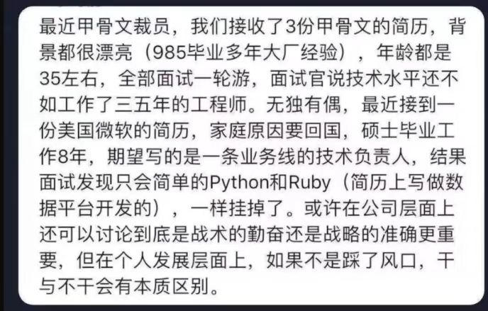
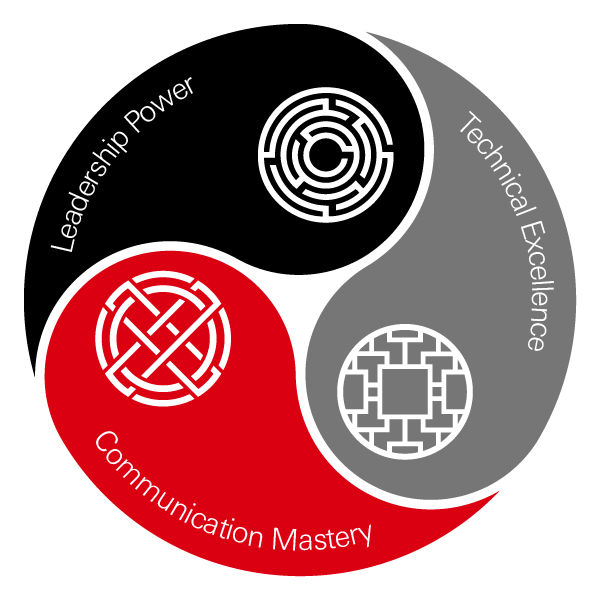

# 高级人才的价值在于管理复杂性的能力

> 原文地址：[高级人才的价值在于管理复杂性的能力](https://mp.weixin.qq.com/s/s5Xc076M0U-xmIMc-hfSxA)

前段时间，甲骨文中国的裁员事件，引发了对大龄IT人员去向的热议。我看到以下的信息：  但我的看法是，这里引用的具体事例其实是岗位错配的结果，并不代表大龄IT人员没有价值。而高级人才的价值，在于**管理复杂性的能力**。
## 01 每个知识工作者都是管理者
IT从业人员，绝大部分都是知识工作者，而**知识工作者其实都是管理者，都需要领导力**。特别是在大公司。 在大公司工作过的都知道，里面有非常复杂的流程和各种审批，完成任何一件事情，小到交付一个程序，大到完成一个项目，其实都需要与很多不同部门的人进行协作，包括求各种衙门部门的审批，是一个持续升级打怪的过程。**只要需要与人协作，就需要管理能力和领导力**。 所以，管理能力和领导人并不是带团队的管理岗位才需要。 有一个说法，美国程序员有80%的时间在开会。开会是为了干什么？搞清楚具体需求和与上下游系统协调咯。没有这些协作，你写的程序再厉害也没用。 对于公司来说，你的价值并不在于你某项单独技能有多厉害，而是你的整体交付能力。而交付过程中，需要管理各种复杂性。 老板不知道你做一件事情有多难吗？而这些难处，往往有各种历史和现实原因，或者是站在更高的层面看问题而造成的，它们不会短时间被统一消灭掉，甚至永远不会被消灭掉，而且可能越来越多。**变得复杂，恰恰是一个公司走向成熟的标志**。 这些时候，就是要靠我们去解决这些难处，把事情完成。你能完成多大的事情，也就是说你能管理多大的复杂性，你的价值就有多大。 老板对你的要求很简单，交代给你的事情，你搞掂就可以了。你更大的价值在于，老板能否放心地把整个业务或系统交给你。 而你是否能坐上老板的位置，看看老板休长假时，是否喜欢选择你做代理人就知道了。如果TA经常找你，说明TA对你很放心，TA觉得你能胜任部分或全部TA的工作，将来TA升迁了，找你做接班人就是顺理成章的事情。如果TA经常找你的同僚，你不应该庆幸自己不用多干活，而是要反省为什么老板不信任你。 所以，今天这个时代，**对通才的需求远远高于专才**，拥有某项特长而其他方面也不差的T型人才更受欢迎。时代变化很快，技术变迁也会越来越快，守着某项专业技能，大几率是很快被淘汰掉。 一个人的综合能力，也就是管理复杂性、整体交付能力，才是一个人的最大价值。 当然，你会说小公司就没有那么复杂。恰恰相反，小公司人员少，分工没有那么细，更需要一个人“一脚踢”（广东话，就是一个人包揽整件事情）的能力。
## 02 外企就是养老院吗？
甲骨文北京，被称为“中关村最大的养老院”。然后网上就有说法，外企都是养老院。 诚然，外企遵循它们在国外的价值观，一般都严格守法，不会主动违反劳动法，包括遵照每周40小时工作制，每月加班不能超过36小时的规定，加班也按规定进行补偿。外企也比较重视工作与生活平衡，年假比较多。甚至有些外企会实现弹性工作制，不需要打卡和考勤。 不像国内互联网公司以996为潜规则，甚至变成公开准则，公然违法。 但这并不代表在外企工作轻松。 首先，**知识工作者的产出本身就不应该以工作时间来衡量**。 其次，由于公司大的流程、决策往往掌握在总部，总部并不了解中国市场，这会引起很多冲突。而且由于很多职能部门分布在世界各地，**在外企要完成一件事情往往需要全球协作，也常常涉及到文化上的磨合，复杂性可能更高**。 这也是为什么在外企，高管的位置，通常会选择“世界人”——那些在多个国家工作过的人来做，因为他们有更好的文化理解和更高的视野。 而且，只要是负责一个具体项目或系统的，其实上班、下班的时间也会变得模糊。有急事的时候，你一样需要在家加班。 为了让大家对外企的复杂性有更具体的了解，我以去年做的一个项目为例子，给大家罗列一下，我们完成一个项目要打多少怪。 这是一个我们要在国内开展的新业务。这项业务在国内已经有成熟的供应商产品，因此采购供应商产品成了唯一的选择。所以这个项目，我们的主要工作是实施，自主开发的部分比较少。 但这看似简单的实施过程，却蕴藏着各种深坑。 这套供应商系统满足国内的业务需求和监管要求都没有问题，但要满足我们作为全球金融机构的全球标准，就够呛了。 我们要面对的是各种大怪：

1. 采购合同：由于是供应商产品，所以需要签署采购合同。除了要和供应商洽谈合同细节，我们也有大量的内部流程要走——要获得成本控制委员会的审批，要做技术评审，要获得采购部门和法务部门的支持，要打通复杂的付款流程。
2. 架构设计：需要集团指定的架构设计师来完成架构设计。他手头上有非常多的项目，要争取他的时间非常难。而且他是一个英国人，供应商是国内的，不懂英语，我们还要翻译各种文档以及在沟通会上做同声传译。做出来的架构设计也要过集团的审批，负责审批的都不是省油的灯。
3. 安全评审：安全是银行最重视的。安全评审、安全测试是系统上线的必要条件，而且要必须执行全球统一的安全标准。而国内对安全要求并不算高，这就导致了供应商产品和我们的全球标准存在巨大的鸿沟，需要大量整改。也需要我们在业务部门、供应商和安全部门间不断周旋。
4. 对外服务：业务部门希望能够给外部客户直接访问我们其中一个系统进行交易，并以此作为我们的竞争优势。这个需求可要了我们的亲命。首先，这个系统要接入互联网，为了防止外部攻击，需要额外的架构；其次，作为一种对外服务，集团市场部对网站的外观、用户体验和残疾人可用性都有统一的要求，而供应商的产品没有一项能达标，又衍生出大量的沟通和整改工作，期间的沟通也需要我们做翻译、传译和与各衙门部门的周旋。

我就先列举到这里。 当然，你会说，有些复杂性是多余的，确实是，但这些都不是我们这个层面能消除和绕开的，而且也可能只是从我们的视角觉得多余而已，我们只能管理和克服。
## 03 为什么管理岗能拿更多的钱？
作为一家技术公司，十年前，我们也在管理晋升路径的基础上，增加了技术专才晋升路径。两者的区别就是，一个需要带团队，一个不需要。 但是结果是，管理岗晋升路径更清晰，升迁相对容易，而技术岗的晋升路径一直很模糊，能进入高级岗位的人远远少于管理岗，长期趴窝的人非常多。 这个现象很容易理解。有个简单粗暴的角度，**管理岗的重要性，看看这个岗位下面有多少人就可以了**。人数越多，说明你管理的部门越重要，层级也越高。 而由于这个位置下面每个人的产出，分配一点就可以滋养这个岗位，这也是为什么管理岗位置越高，收入越高，因为它是带杠杆的，位置越高，下面管理的人越多，杠杆就越大。 扁平化在大公司基本是不可行的，因为每个人的管理带宽都是有限的，多层级是成熟公司不可避免的宿命。 而技术专才岗呢？我们要定义一个初级专才岗和高级专才岗的具体要求就有点难了。所以也经常看到处在初级岗的员工在做一些高级岗的事情，反过来的也有。 不是说没有厉害的技术专才值得获得更高的报酬。但我们设想一个问题，如果一个高级专才的工资是初级的4倍，那么我们是否应该期待TA一个人的产出是初级的4倍呢？这样的人有吗？有，**但极少**。 所以**通过专才路线晋升到高级岗位的人，是选择了一道窄门**。 当然，人各有志，有些人就偏爱技术，不喜欢和人打交道，也没有兴趣或能力带人，就喜欢静静地做自己的事情。这样的选择可以有吗？可以，但这些人就要忍耐工资一直涨不上去，也真的需要担心自己35岁后的命运了。因为他们的价值并不比一个只有3-5年工作经验的人大多少。 这个世界上，哪有光靠安安静静地写着程序就能拿到高工资的美差。 当我们觉得管理各种复杂性非常疲惫的时候，都会说我好想回到可以一个人写程序的时光，但大家心里都清楚，YY一下可以，那个时光是支配不起你现在的开销和欲望的。 有个英国的高管就说过，他每天需要坐一个半小时的火车上班，而他会利用这个时间写写程序，他享受这样的时间，因为回到公司就很难有这样的时间了。而这种享受，只能当兴趣，不能当饭吃。 所以，大龄程序员，确实比较担忧。 当然，专才技术岗还有一条出路，就是去做架构设计师。但架构设计师绝对不是只懂技术就可以的。我们集团的首席架构师对一个好的架构师的定义如下，我非常认同： 

1. Technical Excellence 技术牛 - 这个不用多说；
2. Communication Mastery 沟通达人 - 架构设计绝对不是画张图那么简单，你需要和不同技术团队进行深入交流，才能做出切实可行的架构方案；
3. Leadership Power 领导力 - 同理，只要需要协作，就需要领导力。你的图纸，别人不买账，就是废纸一张。
## 04 总结
说了这么多，并不是要大家一定要做管理岗，而不发展自己的专业。而是奉劝大家**不要限制自己的发展**。 管理和专才的路线其实会越来越模糊。 管理复杂性的能力，才是我们的核心价值。
