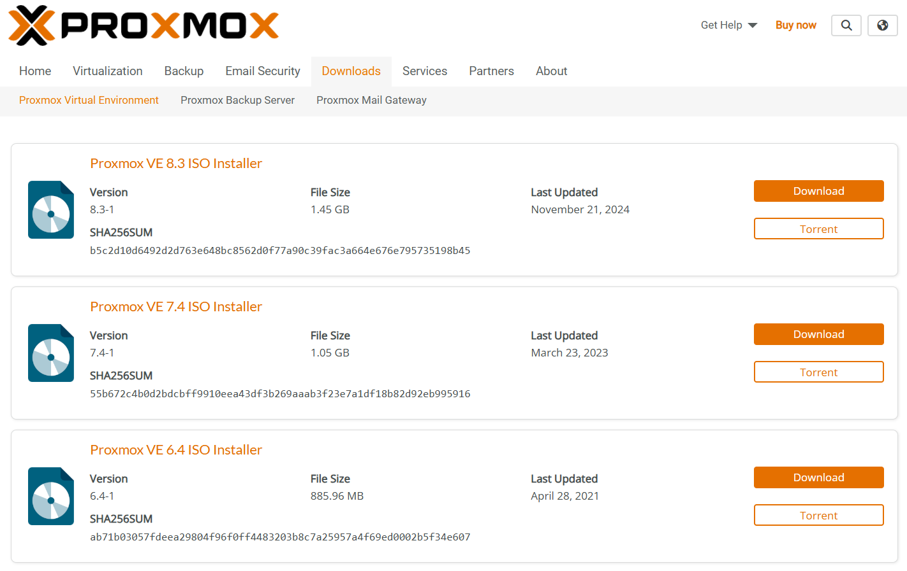
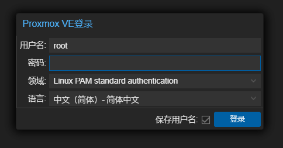

# 安装pve虚拟机系统

出于对优质网络的诉求，笔者一直想要搭建一套家用的**爱快软路由** + **iStoreOS旁路由**的环境，但是手上又没有合适的设备，于是网上购置了一个**Intel N100**的mini主机，双千兆网口，存储规格是16G内存加上512G的固态硬盘。经过调研，使用pve虚拟机系统可以很方便地完成这样一套环境的搭建工作。

以下内容介绍了在这台mini主机上安装pve虚拟机系统的过程。

## 下载pve系统镜像

进入[pve系统镜像的下载页面](https://www.proxmox.com/en/downloads/proxmox-virtual-environment/iso)，选择并下载最新版本的ISO镜像。我在安装pve的时候最新版本是8.2-2。

## 制作安装U盘

推荐使用[Ventoy](https://www.ventoy.net/cn/)制作可启动U盘，然后将下载好的pve系统ISO镜像文件拷贝到U盘的Ventoy分区。

## 安装pve系统

在pve系统[官方安装教程](https://pve.proxmox.com/wiki/Installation)的指导下完成系统安装。主要的安装步骤为：
1. 选择`Install Proxmox VE (Graphical)`进入图形界面安装
2. 选择系统要安装到哪块硬盘
3. 设置地区、时区和键盘布局
4. 设置系统管理员密码及邮箱
5. 设置系统网络信息
6. 开始安装

注意在设置系统网络信息时，需要选择pve网卡并正确填写IP地址、子网掩码和网关。

## pve管理页面

完成安装后，使用网线连接**安装时选择的mini主机网卡网口**和管理电脑（另外一台电脑）的网口，在管理电脑的浏览器中输入`http://[pve系统IP]:8006`进入pve管理页面，pve系统IP需要填写为设置的IP。使用`root`用户名和设置的管理员密码即可登录。

登录之后可以在右上角的用户菜单里设置语言和主题颜色。

在`pve -> 系统 -> 网络`中可以看到，**安装时选择的mini主机网卡**已经自动完成了桥接。

在`pve -> 系统 -> DNS`中填写有效的DNS地址，以便后续步骤能正常进行。

此时，pve系统还无法正常联网使用，建议在安装并配置爱快软路由，系统能够正常联网之后使用[pve_source工具](https://bbs.x86pi.cn/thread?topicId=20)对pve进行更多优化。

**参考资料：**
- [利用PVE虚拟机，来打造属于自己的All In One系统吧！](https://www.bilibili.com/video/BV1bc411v7A3/?vd_source=397ff4ce16ca423e318cacc40c3f4acb)
- [【小白成长记12】PVE All in one AIO iKuai iStoreOS LXC Alpine Docker TrueNAS Wins11核显直通](https://www.bilibili.com/list/watchlater?oid=706165535&bvid=BV1UQ4y1b7Nz)
