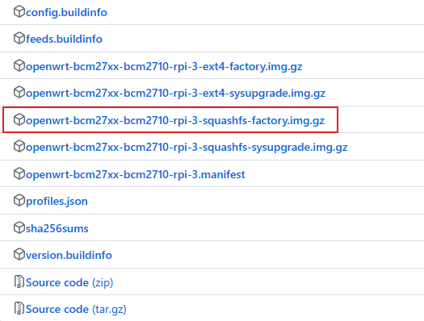
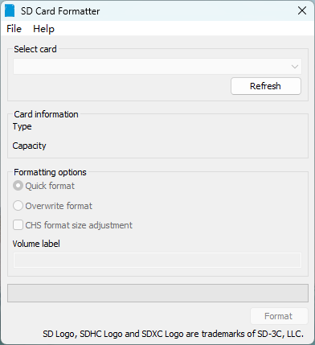
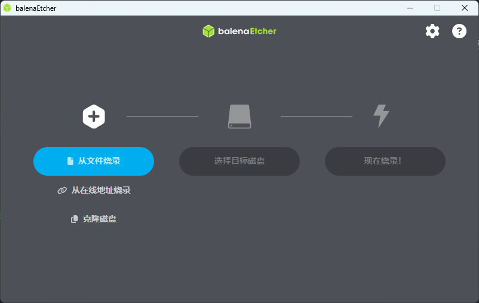
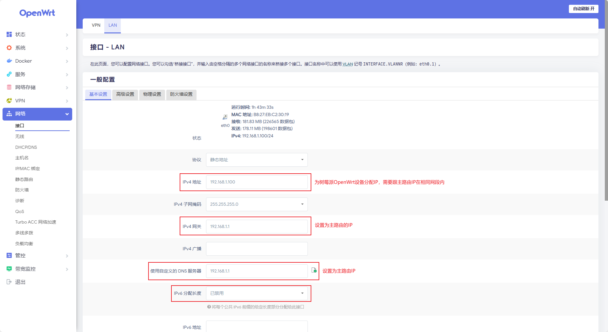
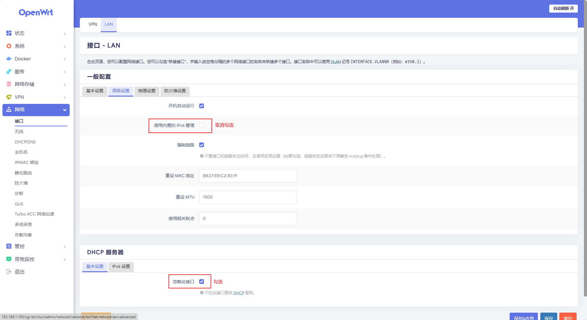
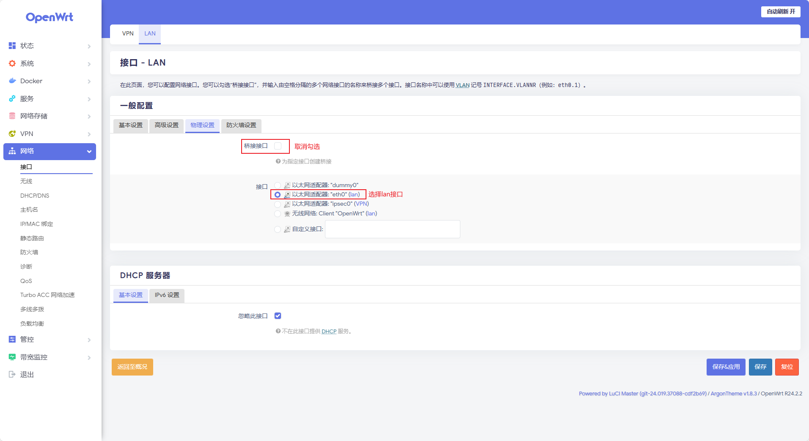
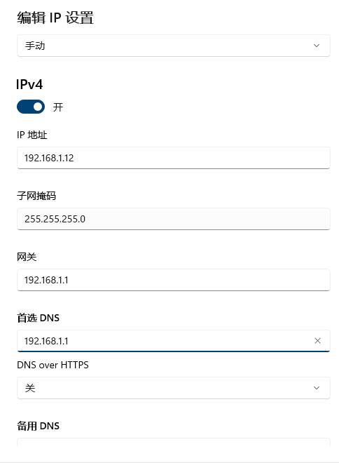
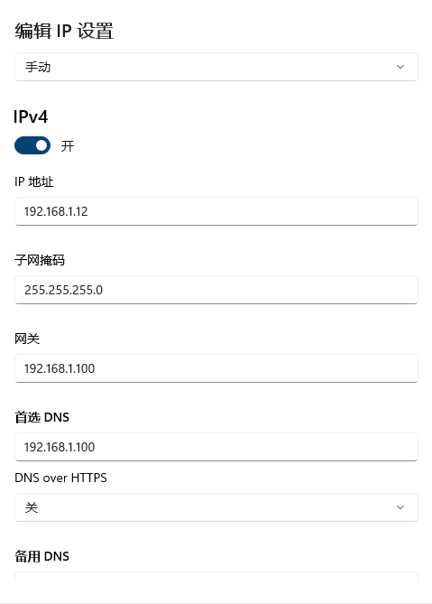

# OpenWrt系统安装及配置

OpenWrt是一个功能齐全、易于修改、高度可定制的路由器操作系统，在树莓派上安装OpenWrt系统之后可以作为软路由或者旁路由优化网络连接、扩展路由器功能。

## 准备工作

准备清单：
- 一张用于刷入固件的内存卡
- 一台可以连接树莓派的电脑
- 下载好的树莓派OpenWrt固件，这里用的是适配树莓派3B+的固件，在[下载页面](https://github.com/bigbugcc/OpenWrts/releases)中选择`squashfs-factory`固件

## 刷入固件

将内存卡插上电脑，使用 SD Card Formatter 软件对内存卡进行格式化。

格式化完成后，使用 balenaEtcher 软件将固件烧录到内存卡上。

烧录完成后，将内存卡插入树莓派，通电启动树莓派，等待30秒后，OpenWrt系统会自动完成初始化及启动。

使用网线将电脑连接上树莓派的网线接口，配置电脑的IP分配为**DHCP自动分配**，分配IP后IPv4网关地址即OpenWrt的web管理界面地址，通过浏览器打开该地址进入OpenWrt管理界面。默认的用户名为`root`，密码为`password`。

至此，完成了OpenWrt系统的安装工作。

> **注：** 如果发现刷入固件后，无法顺利获取到树莓派OpenWrt的地址，一般是内存卡格式化失败导致的，这时需要使用 SD Card Formatter 软件选择`Overwirte format`模式对内存卡进行完全覆写格式化之后，再次烧录固件即可解决。

## 旁路由配置

树莓派OpenWrt一般作为旁路由使用。

进入`网络-接口`页面，选择LAN接口点击修改，按照下图完成各项配置：

完成配置后，点击`保存&应用`使配置生效。由于树莓派OpenWrt设备地址发生更改，此时使用原来的地址已经无法进入管理界面了。

接着将电脑IP分配方式改为**手动分配**，并分配一个与树莓派OpenWrt设备在同一个网段的IP地址，如：`192.168.1.12`，随后在浏览器中输入更改后的OpenWrt地址`http://192.168.1.100`即可重新进入管理界面。

在管理界面确认之前对LAN接口的修改生效后，断开电脑与树莓派的连接的网线，然后将树莓派接入主路由，完成树莓派OpenWrt与主路由器的组网。

此时OpenWrt还不能作为旁路由发挥作用，还需要将同局域网的联网设备手动配置网关和DNS服务器为OpenWrt的IP地址后，就可以使OpenWrt真正发挥旁路由的效用。

通过在OpenWrt中配置并启用各种服务之后，就可以让连接上OpenWrt的设备享受服务提供的各种实用功能（如广告过滤、科学上网等）。

