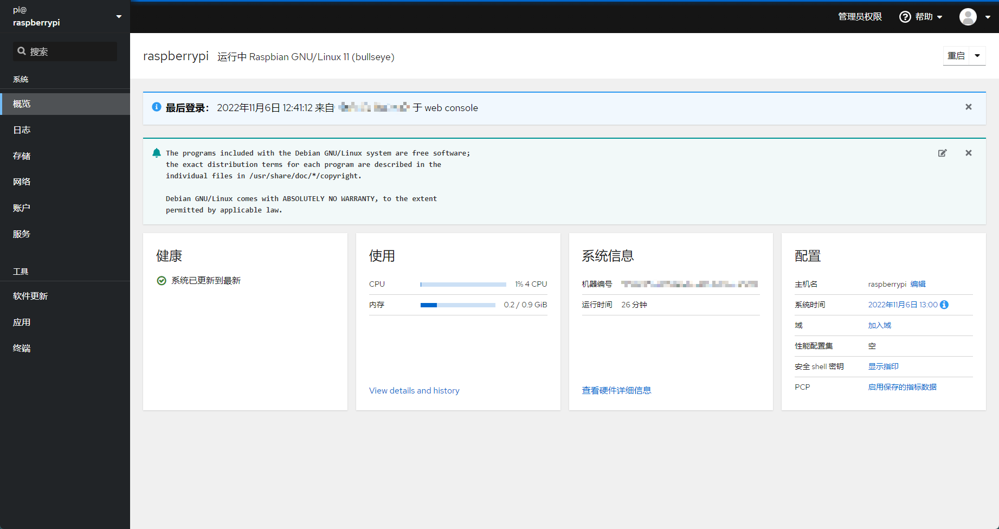
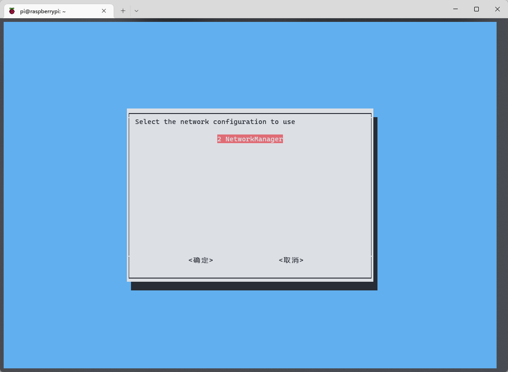

# web控制台cockpit

## 安装cockpit
使用apt安装cockpit。
```bash
sudo apt install cockpit
```
安装完成后，配置nginx反向代理。

创建并编辑 nginx 配置文件`/etc/nginx/sites-enabled/cockpit`，输入以下内容并保存：
```nginx
server {
    listen 80;
    server_name cockpit.pi.com;

    location / {
        proxy_pass http://127.0.0.1:9090;
        proxy_redirect off;
        proxy_set_header Host $host;
        proxy_set_header X-Real-IP $remote_addr;
        proxy_set_header X-Forwarded-For $proxy_add_x_forwarded_for;
        proxy_connect_timeout 60;
        proxy_send_timeout 300;
        proxy_read_timeout 300;
    }
}
```
使新增的 nginx 配置生效：`sudo nginx -s reload`。

编辑客户端的hosts文件，将`cockpit.pi.com`域名解析到树莓派的ip。

在浏览器访问`https://cockpit.pi.com:9090/`可进入cockpit的登录页面。


输入可登录树莓派系统的账户密码后，进入管理界面。


## 启用网络模块
cockpit的网络模块依赖NetworkManager服务，如果没有安装，在首次进入页面时会提示启用NetworkManager。启用之后如果出现树莓派网络连接失败的情况，需要进行如下处理：

进入控制台输入`sudo raspi-config`，选择`Advanced Options`->`Network Config`->`NetworkManager`并确定，启用NetworkManager管理网络。



如果使用WiFi连接网络，需要手动设置一次WiFi并连接，之后开机会自动连接WiFi网络。手动设置WiFi连接命令

如下：
```bash
nmcli device wifi connect <SSID|BSSID> password <password>
```
