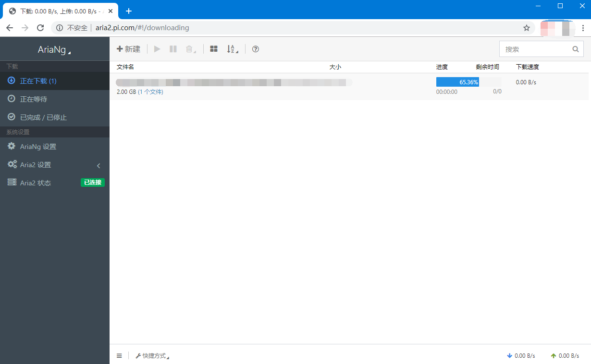
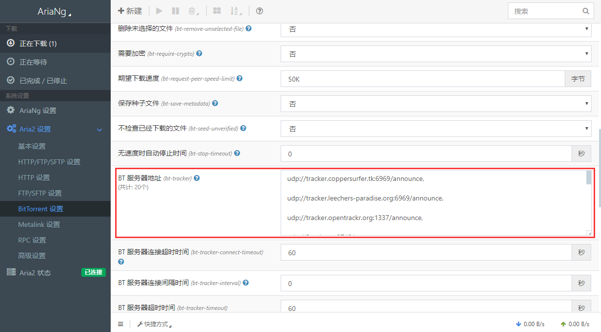

# 基于Aria2的下载机

> 参考：[树莓派3B+ 远程下载服务器（Aria2）](https://blog.csdn.net/kxwinxp/article/details/80288006)

## 安装 Aria2
使用以下命令安装 Aria2：
```bash
sudo apt install aria2
```
## 编辑 Aria2 配置文件
创建文件夹`mkdir -p ~/.config/aria2`。<br />添加一个 Aria2 配置文件`vim ~/.config/aria2/aria2.config`。
```toml
#后台运行
daemon=true
#用户名
#rpc-user=user
#密码
#rpc-passwd=passwd
#设置加密的密钥
rpc-secret=yupaits
#允许rpc
enable-rpc=true
#允许所有来源，web界面跨域权限需要设置
rpc-allow-origin-all=true
#是否启用https加密，启用之后要设置公钥、私钥的文件路径
#rpc-secure=true
#启用加密设置公钥
#rpc-certificate=/home/pi/.config/aria2/example.crt
#启用加密设置私钥
#rpc-private-key=/home/pi/.config/aria2/example.key
#允许外部访问，false的话只监听本地端口
rpc-listen-all=true
#RPC端口，仅当默认端口被占用时修改
#rpc-listen-port=6800
# BT强制加密, 默认: false
# 启用后将拒绝旧的 BT 握手协议并仅使用混淆握手及加密。可以解决部分运营商对 BT 下载的封锁，且有一定的防版权投诉与迅雷吸[># 此选项相当于后面两个选项(bt-require-crypto=true, bt-min-crypto-level=arc4)的快捷开启方式，但不会修改这两个选项的值。
bt-force-encryption=true
# 自定义 User Agent
user-agent=Mozilla/5.0 (Windows NT 10.0; Win64; x64) AppleWebKit/537.36 (KHTML, like Gecko) Chrome/93.0.4577.63 Safari/>#最大同时下载数（任务数），建议值：3
max-concurrent-downloads=5
#断点续传
continue=true
# 始终尝试断点续传，无法断点续传则终止下载，默认：true
always-resume=true
# 允许覆盖
allow-overwrite=true
#同服务器连接数
max-connection-per-server=5
#最小文件分片大小，下载线程数上限取决于能分出多少片，对于小文件重要
min-split-size=10M
#单文件最大线程数，建议值：5
split=10
#下载速度限制
max-overall-download-limit=0
#单文件下载速度限制
#max-download-limit=0
#上传速度限制
#max-overall-upload-limit=0
#单文件上传速度限制
max-download-limit=0
#断开速度过慢的连接
#lowest-speed-limit=0
#文件保存路径，默认为当前启动位置
dir=/media/nas/downloads
#文件预分配，能有效降低文件碎片，提高磁盘性能。缺点是预分配时间较长。所需时间：none < falloc ? truc << prealloc，falloc>file-allocation=none
#不进行证书验证
check-certificate=false
#保存下载会话
save-session=/home/pi/.config/aria2/aria2.session
input-file=/home/pi/.config/aria2/aria2.session
#断电续传
save-session-interval=60
# 日志文件保存路径，忽略或设置为空为不保存，默认：不保存
log=/home/pi/app/aria2/aria2.log
# 日志级别，可选 debug, info, notice, warn, error 。默认：debug
log-level=warn
# BitTorrent trackers
bt-tracker=udp://tracker.opentrackr.org:1337/announce,udp://open.tracker.cl:1337/announce,udp://tracker.torrent.eu.org:451/announce,udp://opentracker.i2p.rocks:6969/announce,udp://open.stealth.si:80/announce,udp://9.rarbg.com:2810/announce,https://opentracker.i2p.rocks:443/announce,http://tracker.openbittorrent.com:80/announce,udp://tracker.tiny-vps.com:6969/announce,udp://tracker.moeking.me:6969/announce,udp://p4p.arenabg.com:1337/announce,udp://open.demonii.com:1337/announce,udp://movies.zsw.ca:6969/announce,udp://ipv4.tracker.harry.lu:80/announce,udp://explodie.org:6969/announce,udp://exodus.desync.com:6969/announce,https://tracker.nanoha.org:443/announce,https://tracker.lilithraws.org:443/announce,https://tracker.cyber-hub.net:443/announce,https://tr.burnabyhighstar.com:443/announce
```
设置好配置之后，还要创建该会话空白文件`touch ~/.config/aria2/aria2.session`。<br />测试下 Aria2 是否启动成功`aria2c --conf-path=/home/pi/.config/aria2/aria2.config`。用`ps aux|grep aria2`看是否有进程启动，若有说明启动成功了。
## 设置 Aria2 开机启动
在`/etc/init.d`目录下增加启动脚本
```bash
sudo nano /etc/init.d/aria2c
```
`aira2c`脚本内容如下：
```shell
#!/bin/bash

### BEGIN INIT INFO
# Provides: aria2c
# Required-Start:
# Required-Stop:
# Default-Start: 2 3 4 5
# Default-Stop: 0 1 6
# Short-Description: aria2c
# Description: Aria2 service start
### END INIT INFO

case "$1" in

start)
	echo -n "Start Aria2c service"
	sudo aria2c --conf-path=/home/pi/.config/aria2/aria2.config -D
;;

stop)
	echo -n "Stop Aria2c service"
	killall aria2c
;;

restart)
	killall aria2c
	sudo aria2c --conf-path=/home/pi/.config/aria2/aria2.config -D
;;

esac
exit
```
修改启动脚本文件权限
```bash
sudo chmod 755 /etc/init.d/aria2c
```
添加aria2c服务到开机启动服务
```bash
sudo update-rc.d aria2c defaults
```
aria2c服务的管理
```bash
# 启动服务
sudo service aria2c start

# 停止服务
sudo service aria2c stop

# 重启服务
sudo service aria2c restart
```
**常见问题**<br />如果aria2c服务开机没有自动启动，则可以通过以下方式修复：
```bash
# runlevel
N 3
# cd /etc/rc3.d
# ln -s ../init.d/aria2c S40aria2c


(probably should be done for other runlevels as well)
# ls /etc/rc5.d/ | grep aria2c
S40aria2c
```
参考：[https://unix.stackexchange.com/questions/102918/service-to-start-on-boot-doesnt-work-with-update-rc-d-command](https://unix.stackexchange.com/questions/102918/service-to-start-on-boot-doesnt-work-with-update-rc-d-command)
## 部署 AriaNg Web下载管理页面
### 服务端
安装 nginx：`sudo apt install nginx`。<br />在 [AriaNg下载页面](https://github.com/mayswind/AriaNg/releases) 下载最新的`AraiNg-x.x.x-AllInOne.zip`压缩包。将压缩包内的`index.html`解压到`/var/www/html/aria-ng/`目录下。<br />创建并编辑 nginx 配置文件`/etc/nginx/sites-enabled/aria`，输入以下内容并保存：
```nginx
server {
    listen 80;
    server_name aria2.pi.com;

    location / {
        root /var/www/html/aria-ng;
        index index.html;
    }
}
```
使新增的 nginx 配置生效：`sudo nginx -s reload`。<br />设置 nginx 开机启动：`sudo systemctl enable nginx`。
### 客户端
修改客户端`hosts`文件以便使用`aria2.pi.com`域名访问AriaNg管理界面。<br />例如：`192.168.1.1 aria2.pi.com`<br /><br />首次浏览时需要进入 AriaNg设置 -> RPC，填写服务端配置信息，特别是 Aria2 RPC 地址和Aria2 RPC 密钥。正确填写之后即可连接使用树莓派上的 Aria2 服务。<br />
## 设置BT trackers 提升下载速度
trackers 清单地址：[trackerslist](https://github.com/ngosang/trackerslist)，推荐使用 **tracker_best.txt**。<br />有两种设置 trackers 的方式：

1. 客户端进入 AriaNg -> Aria2 设置 -> BitTorrent 设置 -> BT 服务器地址（bt-tracker），填写 trackers 列表地址，多个地址以逗号 , 分隔。
2. 服务端编辑`~/.config/aria2/aria2.config`配置文件中的`bt-trakcer=udp://tracker.coppersurfer.tk:6969/announce,udp://tracker.opentrackr.org:1337/announce`项，多个地址用逗号 , 分隔。
## 自动更新BT trackers
编辑脚本`/home/pi/app/aria2/trackers-list-aria2.sh`并写入内容：
```bash
#!/bin/bash
/usr/sbin/service aria2c stop
list=`wget -qO- https://raw.githubusercontent.com/ngosang/trackerslist/master/trackers_best.txt|awk NF|sed ":a;N;s/\n/,/g;ta"`
if [ -z "`grep "bt-tracker" /home/pi/.config/aria2/aria2.config`" ]; then
    sed -i '$a bt-tracker='${list} /home/pi/.config/aria2/aria2.config
    echo add......
else
    sed -i "s@bt-tracker=.*@bt-tracker=$list@g" /home/pi/.config/aria2/aria2.config
    echo update......
fi
/usr/sbin/service aria2c start
```
脚本授权：
```bash
sudo chmod +x /home/pi/app/aria2/trackers-list-aria2.sh
```
配置crontab定时任务，实现自动更新：
```bash
crontab -e
```
添加以下内容：
```bash
# 每1个小时更新tracker列表
0 */1 * * * ? /home/pi/app/aria2/trackers-list-aria2.sh

# 每10分钟启用一次aria2，防止aria2崩了
*/10 * * * ? /usr/sbin/service aria2c start
```

## 配置内网穿透
使用老牌内网穿透软件[frp](https://github.com/fatedier/frp)进行内网穿透配置。
### 服务端
首先需要准备一台拥有公网IP（`a.a.a.a`）的云服务器作为服务端。<br />在服务端下载并解压frp：
```bash
# 下载最新版本的frp(当前最新版本是0.46.1)
wget https://github.com/fatedier/frp/releases/download/v0.46.1/frp_0.46.1_linux_amd64.tar.gz
# 解压
tar -zxvf frp_0.46.1_linux_amd64.tar.gz
```
打开`/root/frp_0.46.1_linux_amd64/frps.ini`配置文件并保存以下内容：
```toml
[common]
bind_port = 7000
vhost_http_port = 8000
authentication_method = token
token = ?????
```
编辑`sudo nano /etc/systemd/system/frps.service`并写入以下内容：
```toml
[Unit]
Description=frps
After=network-online.target

[Service]
Type=simple
ExecStart=/root/frp_0.46.1_linux_amd64/frps -c /root/frp_0.46.1_linux_amd64/frps.ini

[Install]
WantedBy=default.target
```
启用frps开机启动：
```nginx
#启用开机启动
sudo systemctl enable frps

#启动、停止、重启、状态
sudo service frps start|stop|restart|status
```
### 客户端
客户端即是我们的树莓派了。<br />首先在aria2的nginx配置中添加自己的域名(这里添加的是aria2.yupaits.com)到server_name中：
```nginx
server {
    listen 80;
    server_name aria2.pi.com aria2.yupaits.com;

    location / {
        root /var/www/html/aria-ng;
        index index.html;
    }
}
```
使新增的 nginx 配置生效：`sudo nginx -s reload`。<br />下载并解压frp：
```bash
cd /home/pi/app
mkdir frp
cd frp
# 下载最新版本的frp(当前最新版本是0.46.1)
wget https://github.com/fatedier/frp/releases/download/v0.46.1/frp_0.46.1_linux_amd64.tar.gz
# 解压
tar -zxvf frp_0.46.1_linux_amd64.tar.gz
```
打开`/home/pi/frp/frp_0.46.1_linux_amd64/frpc.ini`配置文件并保存以下内容：
```toml
[common]
server_addr = a.a.a.a
server_port = 7000
authentication_method = token
token = ?????

[web]
type = http
local_port = 80
custom_domains = aria2.yupaits.com

[aria2]
type = http
local_port = 6800
custom_domains = aria2rpc.yupaits.com
```
编辑`sudo nano /etc/systemd/system/frpc.service`并写入以下内容：
```toml
[Unit]
Description=frpc
After=network-online.target

[Service]
Type=simple
ExecStart=/home/pi/frp/frp_0.46.1_linux_amd64/frps -c /home/pi/frp/frp_0.46.1_linux_amd64/frpc.ini

[Install]
WantedBy=default.target
```
启用frps开机启动：
```nginx
#启用开机启动
sudo systemctl enable frpc

#启动、停止、重启、状态
sudo service frpc start|stop|restart|status
```
### 外网访问树莓派部署的AriaNg页面
将以上域名`aria2.yupaits.com`和`aria2rpc.yupaits.com`解析到云服务器IP（`a.a.a.a`）。<br />访问`http://aria2.yupaits.com:8000/`并进入设置页面，设置Aria2 RPC地址为`http://aria2rpc.yupaits.com:8000/jsonrpc`，输入密钥并刷新页面即可成功连接，具体如下：<br />
