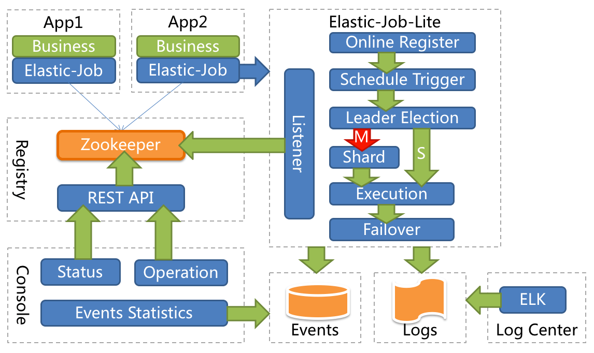
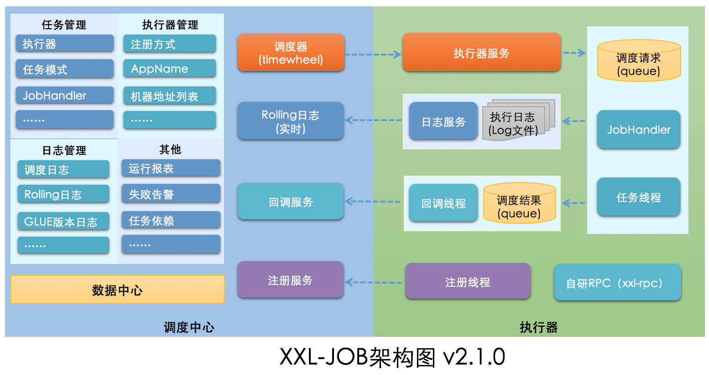
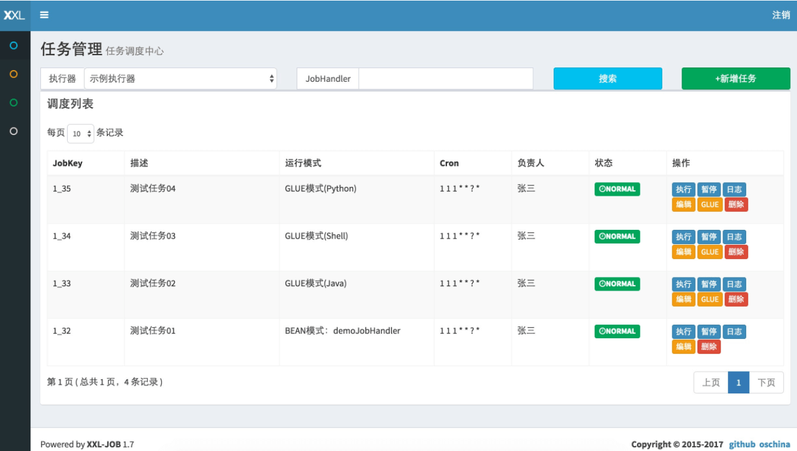

# 分布式任务调度

当我们需要支持任务在分布式场景下的分片和高可用的话，就需要用到分布式任务调度框架了。

通常情况下，一个分布式定时任务的执行往往涉及到下面这些角色：

- **任务**：即具体的业务逻辑，比如定时发送文章。
- **调度起**：调度中心主要负责任务管理，会分配任务给执行起。
- **执行起**：执行器接收调度器分派的任务并执行。

## Quartz

一个很火的开源任务调度框架，完全由Java写成。Quartz可以说是Java定时任务领域的参考标准，其他的任务调度框架基本都是基于Quartz开发的，比如当当网的`elastic-job`就是基于Quartz二次开发之后的分布式调度解决方案。

使用Quartz可以很方便地与Spring集成，并且支持动态添加任务和集群。但是，Quartz使用起来也比较麻烦，API繁琐。

并且，Quartz并没有内置UI管理控制台，不过你可以使用[quartzui]()这个开源项目来解决这个问题。

另外，Quartz虽然也支持分布式任务。但是，它是在数据库层面，通过数据库的锁机制做的，有非常多的弊端，比如系统侵入性严重、节点负载不均衡。有点伪分布式的味道。

**优缺点总结：**

- 优点：可以与Spring集成，并且支持动态添加任务和集群。
- 缺点：分布式支持不好，不支持任务可视化管理、使用麻烦（相对于其他同类型框架来说）。

## Elastic-Job

ElasticJob是当当网开源的一个面向互联网生态和海量任务的分布式调度解决方案，由两个互相独立的子项目Elastic-Lite和Elastic-Cloud组成。

Elastic-Lite和Elastic-Cloud两者的对比如下：

| 特性 | Elastic-Lite | Elastic-Cloud |
|---|---|---|
| 无中心化 | 是 | 否 |
| 资源分配 | 不支持 | 支持 |
| 作业模式 | 常驻 | 常驻 + 瞬时 |
| 部署依赖 | ZooKeeper | ZooKeeper + Mesos |

ElasticJob支持任务在分布式场景下的分片和高可用、任务可视化管理等功能。


ElasticJob-Lite的架构设计如下图所示：



从上图可以看出，Elatic-Job没有调度中心这一概念，而是使用ZooKeeper作为注册中心，注册中心负责协调分配任务到不同的节点上。

Elastic-Job中的定时调度都是由执行器自行处罚，这种设计也被称为去中心化设计（调度和处理都是执行器单独完成）。

```java
@Component
@ElasticJobConf(name = "dayJob", cron = "0/10 * * * * ?", shardingTotalCount = 2,
        shardingItemParameters = "0=AAAA,1=BBBB", description = "简单任务", failover = true)
public class TestJob implements SimpleJob {
    @Override
    public void execute(ShardingContext shardingContext) {
        log.info("TestJob任务名：【{}】, 片数：【{}】, param=【{}】", shardingContext.getJobName(), shardingContext.getShardingTotalCount(),
                shardingContext.getShardingParameter());
    }
}
```

**相关地址：**

- GitHub地址：[https://github.com/apache/shardingsphere-elasticjob](https://github.com/apache/shardingsphere-elasticjob)
- 官方地址：[https://shardingsphere.apache.org/elasticjob/index_zh.html](https://shardingsphere.apache.org/elasticjob/index_zh.html)

**优缺点总结：**

- 优点：可以与Spring集成、支持分布式、支持集群、性能不错、支持任务可视化管理。
- 缺点：依赖了额外的中间件比如ZooKeeper（复杂度增加，可靠性降低、维护成本变高）。

## XXL-JOB

`XXL-JOB`于2015年开源，是一款优秀的轻量级分布式任务调度框架，支持任务可视化管理、弹性扩容缩容、任务失败重试和警告、任务分片等功能。


根据`XXL-JOB`官网介绍，其解决了很多Quartz的不足。

> Quartz作为开源作业调度中的佼佼者，是作业调度的首选。但是集群环境中Quartz采用API的方式对任务进行管理，从而可以避免上述问题，但是同样存在以下问题：
>
>  - 问题一：调用
>  - 问题二：
>  - 问题三：
>  - 问题四：
>
> XXL-JOB弥补了Quartz的上述不足之处。

`XXL-JOB`的架构设计如下图所示：



从上图可以看出，`XXL-JOB`由 **调度中心** 和 **执行器** 两大部分组成。调度中心主要负责任务管理、执行器管理以及日志管理。执行器主要是接收调度信号并处理。另外，调度中心进行任务调度时，是通过自研RPC来实现的。

不同于Elastic-Job的去中心化设计，`XXL-JOB`的这种设计也被称为中心化设计（调度中心调度多个执行器执行任务）。

和`Quartz`类似`XXL-JOB`也是基于数据库锁调度任务，存在性能瓶颈。不过，一般在任务量不是特别大的情况下，没有什么影响的，可以满足绝大部分公司的要求。

不要被`XXL-JOB`的架构图给吓着了，实际上，我们要用`XXL-JOB`的话，只需要重写`IJobHandler`自定义任务执行逻辑就可以了，非常易用！

```java
@JobHandler(value="myApiJobHandler")
@Component
public class MyApiJobHandler extends IJobHandler {

    @Override
    public ReturnT<String> execute(String param) throws Exception {
        //......
        return ReturnT.SUCCESS;
    }
}
```

还可以直接基于注解定义任务。

```java
@XxlJob("myAnnotationJobHandler")
public ReturnT<String> myAnnotationJobHandler(String param) throws Exception {
  //......
  return ReturnT.SUCCESS;
}
```



**相关地址：**

- GitHub地址：[https://github.com/xuxueli/xxl-job/](https://github.com/xuxueli/xxl-job/)。
- 官方介绍：[https://www.xuxueli.com/xxl-job/](https://www.xuxueli.com/xxl-job/)。

**优缺点总结：**

- 优点：开箱即用（学习成本比较低）、与Spring集成、支持分布式、支持集群、支持任务可视化管理。
- 缺点：不支持动态添加任务（如果一定想要动态创建任务也是支持的，参见：[xxl-job issue277](https://github.com/xuxueli/xxl-job/issues/277)）。

## PowerJob

非常值得关注的一个分布式任务调度框架，分布式任务调度领域的新星。目前，已经有很多公司接入比如OPPO、京东、中通、思科。

这个框架的诞生也挺有意思的，PowerJob的作者当时在阿里巴巴实习过，阿里巴巴那会使用的是内部自研的SchedulerX（阿里云付费产品）。实习期满之后，PowerJob的作者离开了阿里巴巴。想着说自研一个SchedulerX，防止哪天SchedulerX满足不了需求，于是PowerJob就诞生了。

更多关于PowerJob的故事，小伙伴们可以去看看PowerJob作者的视频[《我和我的任务调度中间件》](https://www.bilibili.com/video/BV1SK411A7F3/)。简单点概括就是：“游戏没啥意思了，我要扛起新一代分布式任务调度于计算框架的大旗！”。

由于ShedulerX属于付费产品，这里就不过多介绍。PowerJob官方也对比过其和Quartz、XXL-JOB以及SchedulerX。

| 特点 | Quartz | xxl-job | SchedulerX 2.0 | PowerJob |
|---|---|---|---|---|
| 定时类型 | CRON | CRON | CRON、固定频率、固定延迟、OpenAPI | CRON、固定频率、固定延迟、OpenAPI |
| 任务类型 | 内置Java | 内Java、GLUE Java、Shell、Python等脚本 | 内置Java、外置Java（FatJar）、Shell、Python等脚本 | 内置Java、外置Java（容器）、Shell、Python等脚本 |
| 分布式计算 | 无 | 静态分片 | MapReduce动态分片 | MapReduce动态分片 |
| 在线任务治理 | 不支持 | 支持 | 支持 | 支持 |
| 日志白屏化 | 不支持 | 支持 | 不支持 | 支持 |
| 调度方式及性能 | 基于数据库锁，有性能瓶颈 | 基于数据库锁，有性能瓶颈 | 不详 | 无锁化设计，性能强劲无上限 |
| 报警监控 | 无 | 邮件 | 短信 | WebHook、邮件、钉钉与自定义扩展 |
| 系统依赖 | JDBC支持的关系型数据库（MySQL、Oracle…） | MySQL | 付费 | 任意Spring Data Jpa支持的关系型数据库（MySQL、Oracle…） |
| DAG工作流 | 不支持 | 不支持 | 支持 | 支持 |