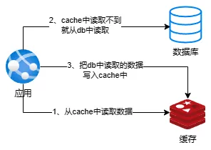
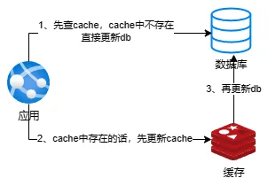
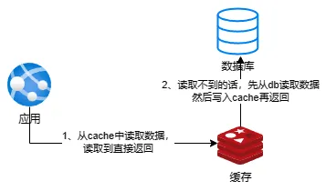
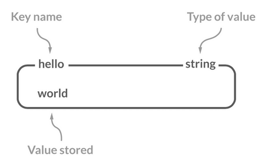
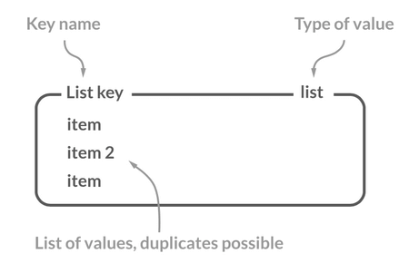

# 缓存

## 缓存的用途

- 高性能

当一个数据获取的请求查询数据库比较耗时（假设是`600ms`），并且查询出来的结果在接下来的几个小时内都不会变化，这时可以将查询的结果放在缓存里，当下次相同的请求发起时，直接从缓存中读取数据，耗时在`2ms`，性能提升300倍。像这种需要复杂操作耗时查出来的结果并且变化不大，但是有很多读请求，直接将查询结果放在缓存中，后续的查询直接查询缓存即可。

- 高并发

MySQL数据库单机大概能支撑`2000QPS`，当系统高峰期的并发量过高时，MySQL单机数据库肯定会挂掉。这时如果将数据放在缓存里，就可以支撑并发量到几万或者几十万。单机承载并发量是MySQL的几十倍。

**缓存是在内存中的，内存天然就支持高并发。**

## 3种常用的缓存读写策略

### Cache Aside Pattern（旁路缓存模式）

`Cache Aside Pattern`是我们平时使用比较多的一种缓存读写模式，比较适合读请求比较多的场景。

`Cache Aside Pattern`中服务端需要同时维系`db`和`cache`，并且是以db的结果为准。

这个模式下的缓存读写步骤如下。

- 写：
  - 先更新`db`
  - 然后直接删除`cache`

  

- 读：
  - 从`cache`中读取数据，读取到就直接返回
  - `cache`中读取不到的话，就从`db`中读取数据返回
  - 再把数据放到`cache`中
  

- 场景一：在写数据的过程中，可以先删除cache，后更新db吗？

肯定是不行的，因为这样可能会造成**数据库（db）和缓存（cache）数据不一致**的问题。

举例：请求1先写数据A，请求2随后读数据A的话，就很有可能产生数据不一致的问题。

这个过程可以简单描述为：

> 请求1先把cache中的A数据删除 -> 请求2从db中读取数据 -> 请求1再把db中的A数据更新

- 场景二：在写数据的过程中，先更新db，后删除cache就没有问题了吗？

理论上来说还是可能会出现数据不一致的问题，不过概率非常小，因为缓存的写入速度是比数据库的写入速度快很多的。

举例：请求1先读数据A，请求2随后写数据A，并且数据A在请求1请求之前不在缓存中的话，也可能产生数据不一致的问题。

这个过程可以简单描述为：

> 请求1从db读数据A -> 请求2更新db中的数据A（此时缓存中无数据A，故不用执行删除缓存的操作）-> 请求1将数据A写入cache

- 缺陷

1. 首次请求数据一定不在cache的问题

    解决办法：可以将热点数据提前放入`cache`中。

2. 写操作比较频繁的话导致`cache`中的数据会频繁被删除，这样会影响缓存命中率

    解决办法：
      - 数据库和缓存数据强一致场景：更新db的时候同样更新cache，不过我们需要加一个锁/分布式锁来保证更新cache的时候不存在线程安全问题。
      - 可以短暂地允许数据库和缓存数据不一致的场景：更新db的时候同样更新cache，但是给缓存加一个比较短的过期时间，这样的话就可以保证即使数据不一致的话影响也比较小。

### Read/Write Through Pattern（读写穿透）

`Read/Write Through Pattern`中服务端把`cache`视为主要的数据存储，从中读取数据并将数据写入其中。`cache`服务负责将此数据读取和写入`db`，从而减轻了应用程序的职责。

这种缓存读写策略在平时开发过程中非常少见。抛去性能方面的影响，大概率是因为我们经常使用的分布式缓存`Redis`并没有提供`cache`将数据写入`db`的功能。

- 写（Write Through）：
  - 先查`cache`，`cache`中不存在，直接更新`db`
  - `cache`中存在，则先更新`cache`，然后`cache`服务自己更新`db`（同步更新`cache`和`db`）
  

- 读（Read Through）：
  - 从`cache`中读取数据，读取到就直接返回
  - 读取不到的话，先从`db`加载，写入到`cache`后返回响应
  

`Read/Write Through Pattern`实际上只是在`Cache Aside Pattern`之上进行了封装。在`Cache Aside Pattern`下，发生读请求的时候，如果`cache`中不存在对应的数据，是由客户端自己负责把数据写入`cache`，而`Read/Write Through Pattern`则是`cache`服务自己来写入缓存的，这对客户端是透明的。

和`Cache Aside Pattern`一样，`Read/Write Through Pattern`也有首次请求数据一定不再`cache`的问题，对于热点数据可以提前放入缓存中。

### Write Behind Pattern（异步缓存写入）

`Write Behind Pattern`和`Read/Write Through Pattern`很相似，两者都是由`cache`服务来负责`cache`和`db`的读写。

但是，两个又有很大的不同：`Read/Write Through Pattern`是同步更新`cache`和`db`，而`Write Behind Pattern`则是只更新缓存，不直接更新`db`，而是改为异步批量的方式来更新`db`。

很明显，这种方式对数据一致性带来了更大的挑战，比如`cache`数据可能还没异步更新`db`的话，`cache`服务可能就挂掉了。

这种策略在我们平时开发过程中也非常非常少见，但不代表它的应用场景少，比如消息队列中消息的异步写入磁盘、MySQL的`Innodb Buffer Pool`机制都用了这种策略。

`Write Behind Pattern`下`db`的写性能非常高，非常适合一些数据经常变化又对数据一致性要求没那么高的场景，比如浏览量、点赞量。

## Redis
### Redis的特性

1. 支持复杂的数据结构

Redis拥有多种数据结构，能支持更丰富的数据操作。如果需要缓存能够支持更复杂的结构和操作，Redis会是不错的选择。

2. 原生支持集群模式

在Redis 3.x版本中，就能支持`cluster`模式。

3. 性能

由于Redis只使用单核，在每一个核上存储小于`100k`的小数据时，性能较高。

### Redis的线程模型

Redis内部使用文件事件处理器`file event handler`，这个文件事件处理器是单线程的，所以Redis才叫做单线程的模型。它采用IO多路复用机制同时监听多个socket，将产生事件的socket压入内存队列中，事件分派器根据socket上的事件类型来选择对应的事件处理器进行处理。

文件事件处理器的结构包含4个部分：

- 多个socket
- IO多路复用工具
- 文件事件分派器
- 事件处理器（连接应答处理器、命令请求处理器、命令回复处理器）

多个socket可能会并发产生不同的操作，每个操作对应不同的文件事件，但是IO多路复用程序会监听多个socket，会将产生事件的socket放入队列中排队，事件分派器每次从队列中取出一个socket，根据socket的事件类型交给对应的事件处理器进行处理。

来看客户端与Redis的一次通信过程：


通信是通过socket来完成的。

首先，Redis服务端进程初始化的时候，会将server socket的`AE_READABLE`事件与连接应答处理器关联。

客户端socket01向Redis进程的server socket请求建立连接，此时server socket会产生一个`AE_READAblE`事件，IO多路复用程序监听到server socket产生的事件后，将该socket压入队列中。文件事件分派器从队列中获取socket，交给连接应答处理器。连接应答处理器会创建一个能与客户端通信的socket01，并将改socket01的`AE_READABLE`事件与命令请求处理器关联。

假设此时客户端发送了一个`set key value`请求，此时Redis中的socket01会产生`AE_READABLE`事件，IO多路复用程序将socket01压入队列，此时事件分派器从队列中获取到socket01产生的`AE_READABLE`事件，由于前面socket01的`AE_READABLE`事件已经与命令请求处理器关联，因此事件分派器将事件交给命令请求处理器来处理。命令请求处理器读取socket01的`key value`并在自己内存中完成`key value`的设置。操作完成后，它会将socket01的`AE_WRITABLE`事件与命令回复处理器关联。

如果此时客户端准备好接收返回结果了，那么Redis中的socket01会产生一个`AE_WRITABLE`事件，同样压入队列中，事件分派器找到相关联的命令回复处理器，由命令回复处理器对socket01输入本次操作的一个结果，比如ok，之后解除socket01的`AE_WRITABLE`事件与命令回复处理器的关联。
这样便完成了一次通信。

### Redis单线程模型效率高的原因

- 纯内存操作
- 核心是基于非阻塞的IO多路复用机制
- C语言实现，一般来说，C语言实现的程序“距离”操作系统更近，执行速度相对会更快
- 单线程反而避免了多线程的频繁上下文切换问题，预防了多线程可能产生的竞争问题

### Redis 6.0开始引入多线程

**注意！** Redis 6.0之后的版本抛弃了单线程模型这一设计，原本使用单线程运行的Redis也开始选择性地使用多线程模型。

前面还在强调Redis单线程模型的高效性，现在为什么又要引入多线程？这其实说明Redis在有些方面，单线程已经不具备优势了。因为读写网络的Read/Write系统调用在Redis执行期间占用了大部分CPU时间，如果把对网络读写做成多线程的方式对性能会有很大提升。

**Redis的多线程部分只是用来处理网络数据的读写和协议解析，执行命令仍然是单线程。** 之所以这么设计是不想Redis因为多线程而变得复杂，需要去控制key、lua、事务、LPUSH/LPOP等等的并发问题。

Reids选择使用单线程模型处理客户端的请求主要还是因为CPU不是Redis服务器的瓶颈，所以使用多线程模型带来的性能提升并不能抵消它带来的开发成本和维护成本，系统的性能瓶颈也主要在网络I/O操作上；而Redis引入多线程操作也是出于性能上的考虑，对于一些大键值对的删除操作，通过多线程非阻塞地释放内存空间（释放操作不会阻塞网络IO读写，因为网络IO读写与释放的命令执行不是同一个线程）也能减少对Redis主线程阻塞的时间，提高执行的效率。

### Redis 5种基本数据类型

Redis共有5种基本类型：String（字符串）、List（列表）、Set（集合）、Hash（散列）、Zset（有序集合）。

这5种数据类型是直接提供给用户使用的，是数据的保存形式，其底层实现主要依赖这8种数据结构：简单动态字符串（SDS）、LinkedList（双向链表）、Dict（哈希表/字典）、SkipList（跳跃表）、Intset（整数集合）、ZipList（压缩列表）、QuickList（快速列表）。

Redis 5种基本数据类型对应的底层数据结构实现如下表所示：

| String | List | Hash | Set | Zset |
|---|---|---|---|---|
| SDS | LinkedList/ZipList/QuickList | Dict、ZipList | Dict、Intset | ZipList、SkipList |

Redis 3.2之前，List底层实现是LinkedList或者ZipList。Redis 3.2之后，引入了LinkedList和ZipList的结合QuickList，List的底层实现变为QuickList。从Redis 7.0开始，ZipList被ListPack取代。

可以在Redis官网上找到Redis数据类型/结构非常详细的介绍：

- [Redis Data Structures](https://redis.com/redis-enterprise/data-structures/)
- [Redis Data types tutorial](https://redis.io/docs/manual/data-types/data-types-tutorial/)

#### String（字符串）

String是Redis中最简单同时也是最常用的一个数据类型。

String是一种二进制安全的数据类型，可以用来存储任何类型的数据比如字符串、整数、浮点数、图片（图片的base64编码或者解码或者图片的路径）、序列化后的对象。



虽然Redis是用C语言写的，但是Redis并没有使用C的字符串表示，而是自己构建了一种**简单动态字符串**（Simple Dynamic String，**SDS**）。相比于C的原生字符串，Redis的SDS不光可以保存文本数据还可以保存二进制数据，并且获取字符串长度复杂度为O(1)（C字符串为O(N)），除此之外，Redis的SDS API是安全的，不会造成缓冲区溢出。

##### 常用命令

| 命令 | 介绍 |
|---|---|
| SET key value | 设置指定key的值 |
| SETNX key value | 只有在key不存在时设置key的值 |
| GET key | 获取指定key的值 |
| MSET key1 value1 key2 value2 …… | 设置一个或多个指定key的值 |
| MGET key1 key2 … | 获取一个或多个指定key的值 |
| STRLEN key | 返回key所储存的字符串值的长度 |
| INCR key | 将key中储存的数字值增一 |
| DECR key | 将key中储存的数字值减一 |
| EXISTS key | 判断指定key是否存在 |
| DEL key（通用） | 删除指定的key |
| EXPIRE key seconds（通用） | 给指定key设置过期时间 |

更多Redis String命令以及详细使用指南，请查看Redis官网对应的介绍：[https://redis.io/commands/?group=string](https://redis.io/commands/?group=string)

**基本操作：**

```bash
> SET key value
OK
> GET key
"value"
> EXISTS key
(integer) 1
> STRLEN key
(integer) 5
> DEL key
(integer) 1
> GET key
(nil)
```

**批量设置：**

```bash
> MSET key1 value1 key2 value2
OK
> MGET key1 key2 # 批量获取多个 key 对应的 value
1) "value1"
2) "value2"
```

**计数器（字符串的内容为整数的时候可以使用）：**

```java
> SET number 1
OK
> INCR number # 将 key 中储存的数字值增一
(integer) 2
> GET number
"2"
> DECR number # 将 key 中储存的数字值减一
(integer) 1
> GET number
"1"
```

**设置过期时间（默认为永不过期）：**

```java
> EXPIRE key 60
(integer) 1
> SETEX key 60 value # 设置值并设置过期时间
OK
> TTL key
(integer) 56
```

##### 应用场景

- 需要存储常规数据的场景

  - 举例：缓存Session、Token、图片地址、序列化后的对象（相比较于Hash存储更节省内存）。
  - 相关命令：`SET`、`GET`。

- 需要计数的场景

  - 举例：用户单位时间的请求数（简单限流可以用到）、页面单位时间的访问数。
  - 相关命令：`SET`、`GET`、`INCR`、`DECR`。

- 分布式锁

  利用`SETNX key value`命令可以实现一个简易的分布式锁（存在一些缺陷，通常不建议这样实现分布式锁）。

#### List（列表）

Redis中的List其实就是链表数据结构的实现。

许多高级编程语言都内置了链表的实现，比如Java中的`LinkedList`，但是C语言并没有实现链表，所以Redis实现了自己的链表数据结构。Redis的List的实现为一个**双向链表**，既可以支持反向查找和遍历，更方便操作，不过带来了部分额外的内存开销。



##### 常用命令

|命令|介绍|
|---|---|
| RPUSH key value1 value2 … | 在指定列表的尾部（右边）添加一个或多个元素 |
| LPUSH key value1 value2 … | 在指定列表的头部（左边）添加一个或多个元素 |
| LSET key index value | 将指定列表索引index位置的值设置为value |
| LPOP key | 移除并获取指定列表的第一个元素（最左边） |
| RPOP key | 移除并获取指定列表的最后一个元素（最右边） |
| LLEN key | 获取列表元素数量 |
| LRANGE key start end | 获取列表start和end之间的元素 |

更多Redis List命令以及详细使用指南，请查看Redis官网对应的介绍：[https://redis.io/commands/?group=list](https://redis.io/commands/?group=list)

**通过`RPUSH/LPOP`或者`LPUSH/RPOP`实现队列：**

```bash
> RPUSH myList value1
(integer) 1
> RPUSH myList value2 value3
(integer) 3
> LPOP myList
"value1"
> LRANGE myList 0 1
1) "value2"
2) "value3"
> LRANGE myList 0 -1
1) "value2"
2) "value3"
```

**通过`RPUSH/RPOP`或者`LPUSH/LPOP`实现栈：**

```bash
> RPUSH myList2 value1 value2 value3
(integer) 3
> RPOP myList2 # 将 list的最右边的元素取出
"value3"
```

以下是`RPUSH、LPOP、LPUSH、RPOP命令的示意图：


**通过`LRANGE`查看对应下标范围的列表元素：**

```bash
> RPUSH myList value1 value2 value3
(integer) 3
> LRANGE myList 0 1
1) "value1"
2) "value2"
> LRANGE myList 0 -1
1) "value1"
2) "value2"
3) "value3"
```

通过`LRANGE`命令，可以基于List实现分页查询，性能非常高！

**通过`LLEN`查看链表长度：**

```bash
> LLEN myList
(integer) 3
```

##### 应用场景

- 信息流展示

  - 举例：最新文章、最新动态。
  - 相关命令：`LPUSH`、`LRANGE`。

- 消息队列

  `List`可以用来做消息队列，只是功能过于简单且存在很多缺陷，不建议这样做。

  相对来说，Redis 5.0新增加的一个数据结构`Stream`更适合做消息队列，只是功能依然非常简陋。和专业的消息队列相比，还是有甚多欠缺的地方比如消息丢失和堆积问题不好解决。

#### Hash（哈希）

Redis中的Hash是一个String类型的field-value（键值对）映射表，特别适合用于存储对象，后续操作的时候，你可以直接修改这个对象中的某些字段的值。

Hash类似于JDK 1.8前的`HashMap`，内部实现也差不多（数组 + 链表）。不过，Redis的Hash做了更多优化。


##### 常用命令

|命令|介绍|
|---|---|
| HSET key field value | 设置指定哈希表中指定字段的值 |
| HSETNX key field value | 只有指定字段不存在时设置指定字段的值 |
| HMSET key field1 value1 field2 value2 …… | 同时将一个或多个field-value（域-值）对设置到指定哈希表中 |
| HGET key field | 获取指定哈希表中指定字段的值 |
| HMGET key field1 field2 … | 获取指定哈希表中一个或者多个指定字段的值 |
| HGETALL key | 获取指定哈希表中所有的键值对 |
| HEXISTS key field | 查看指定哈希表中指定的字段是否存在 |
| HDEL key field1 field2 … | 删除一个或多个哈希表字段 |
| HLEN key | 获取指定哈希表中字段的数量 |
| HINCRBY key field increment | 对指定哈希中的指定字段做运算操作（正数为加，负数为减） |

更多Redis Hash命令以及详细使用指南，请查看Redis官网对应的介绍：[https://redis.io/commands/?group=hash](https://redis.io/commands/?group=hash)

**模拟对象数据存储：**

```bash
> HMSET userInfoKey name "guide" description "dev" age 24
OK
> HEXISTS userInfoKey name # 查看 key 对应的 value中指定的字段是否存在。
(integer) 1
> HGET userInfoKey name # 获取存储在哈希表中指定字段的值。
"guide"
> HGET userInfoKey age
"24"
> HGETALL userInfoKey # 获取在哈希表中指定 key 的所有字段和值
1) "name"
2) "guide"
3) "description"
4) "dev"
5) "age"
6) "24"
> HSET userInfoKey name "GuideGeGe"
> HGET userInfoKey name
"GuideGeGe"
> HINCRBY userInfoKey age 2
(integer) 26
```

##### 应用场景

- 对象数据存储场景

  - 举例：用户信息、商品信息、文章信息、购物车信息。
  - 相关命令：`HSET`（设置单个字段的值）、`HMSET`（设置多个字段的值）、`HGET`（获取单个字段的值）、`HMGET`（获取多个字段的值）。

#### Set（集合）

Redis中的Set类型是一种无序集合，集合中的元素没有先后顺序但都唯一，有点类似于Java中的`HashSet`。当你需要存储一个列表数据，又不希望出现重复数据时，Set是一个很好的选择，并且Set提供了判断某个元素是否在一个Set集合内的重要接口，这个也是List所不能提供的。

你可以基于Set轻易实现交集、并集、差集的操作，比如你可以将一个用户所有关注人存在一个集合中，将其所有粉丝存在一个集合。这样的话，Set可以非常方便的实现如共同关注、共同粉丝、共同喜好等功能。这个过程也就是求交集的过程。


##### 常用命令

|命令|介绍|
|---|---|
| SADD key member1 member2 … | 向指定集合添加一个或多个元素 |
| SMEMBERS key | 获取指定集合中的所有元素 |
| SCARD key | 获取指定集合的元素数量 |
| SISMEMBER key member | 判断指定元素是否在指定集合中 |
| SINTER key1 key2 … | 获取给定所有集合的交集 |
| SINTERSTORE destination key1 key2 … | 将给定所有集合的交集存储在destination中 |
| SUNION key1 key2 … | 获取给定所有集合的并集 |
| SUNIONSTORE destination key1 key2 … | 将给定所有集合的并集存储在destination中 |
| SDIFF key1 key2 … | 获取给定所有集合的差集 |
| SDIFFSTORE destination key1 key2 … | 获取给定所有集合的差集存储在destination中 |
| SPOP key count | 随机移除并获取指定集合中一个或多个元素 |
| SRANDMEMBER key count | 随机获取指定集合中指定数量的元素 |

更多Redis Set命令以及详细使用指南，请查看Redis官网对应的介绍：[https://redis.io/commands/?group=set](https://redis.io/commands/?group=set)。

**基本操作：**

```bash
> SADD mySet value1 value2
(integer) 2
> SADD mySet value1 # 不允许有重复元素，因此添加失败
(integer) 0
> SMEMBERS mySet
1) "value1"
2) "value2"
> SCARD mySet
(integer) 2
> SISMEMBER mySet value1
(integer) 1
> SADD mySet2 value2 value3
(integer) 2
```

- `mySet`: `value1`、`value2`。
- `mySet2`: `value2`、`value3`。

**求交集：**

```bash
> SINTERSTORE mySet3 mySet mySet2
(integer) 1
> SMEMBERS mySet3
1) "value2"
```

**求并集：**

```bash
> SUNION mySet mySet2
1) "value3"
2) "value2"
3) "value1"
```

**求差集：**

```bash
> SDIFF mySet mySet2 # 差集是由所有属于 mySet 但不属于 A 的元素组成的集合
1) "value1"
```

##### 应用场景

- 需要存放的数据不能重复的场景

  - 举例：网站UV统计（数据量巨大的场景还是`HyperLogLog`更适合一些）、文章点赞、动态点赞等场景。
  - 相关命令：`SCARD`（获取集合数量）。

- 需要获取多个数据源交集、并集和差集的场景

  - 举例：共同好友（交集）、共同粉丝（交集）、共同关注（交集）、好友推荐（差集）、音乐推荐（差集）、订阅号推荐（差集 + 交集）等场景。
  - 相关命令：`SINTER`（交集）、`SINTERSTORE`（交集）、`SUNION`（并集）、`SUNIONSTORE`（并集）、`SDIFF`（差集）、`SDIFFSTORE`（差集）。

- 需要随机获取数据源中的元素的场景

  - 举例：抽奖系统、随机点名等场景。
  - 相关命令：`SPOP`（随机获取集合中的元素并移除，适合不允许重复中奖的场景）、`SRANDMEMBER`（随机获取集合中的元素，适合允许重复中奖的场景）。

#### Sorted Set（有序集合）

##### 常用命令

##### 应用场景

#### 总结

| 数据类型 | 说明 |
|---|---|
| String | 一种二进制安全的数据类型，可以用来存储任何类型的数据比如字符串、整数、浮点数、图片（图片的base64编码或者解码或者图片的路径）、序列化后的对象。 |
| List | Redis的List的实现为一个双向链表，即可以支持反向查找和遍历，更方便操作，不过带来了部分额外的内存开销。 |
| Hash | 一个String类型的field-value（键值对）的映射表，特别适合用于存储对象，后续操作的时候，你可以直接修改这个对象中的某些字段的值。 |
| Set | 无序集合，集合中的元素没有先后顺序但都唯一，有点类似于Java中的`HashSet`。 |
| Zset | 和Set相比，Sorted Set增加了一个权重参数`score`，使得集合中的元素能够按`score`进行有序排列，还可以通过`score`的范围来获取元素的列表。有点像是Java中`HashMap`和`TreeSet`的结合体。 |

### Redis 3种特殊数据类型

### Redis持久化机制

### Redis内存管理

### Redis常见阻塞原因总结

### Redis性能优化
