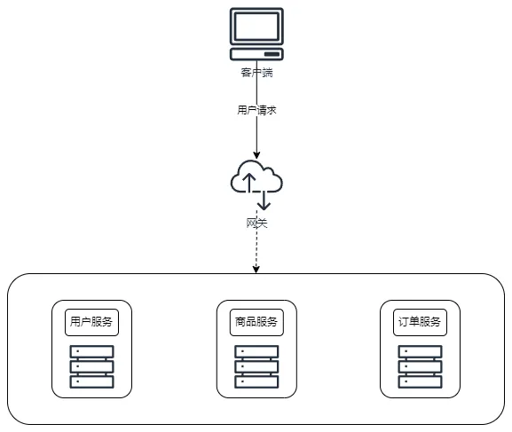
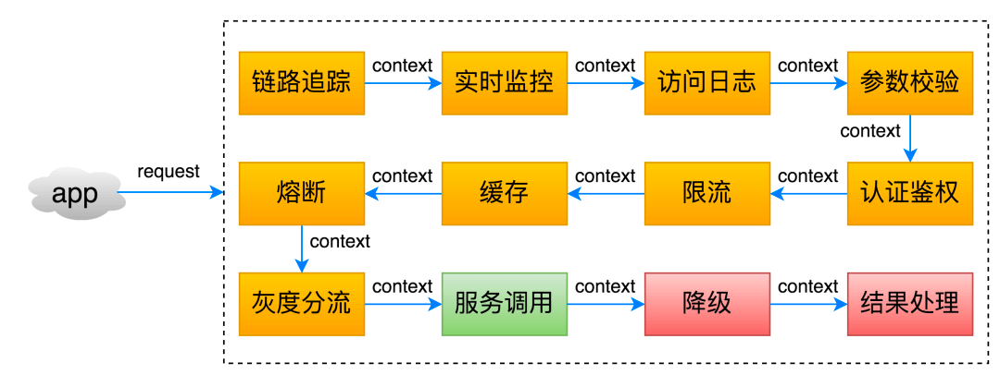

# API网关

## 什么是网关？

微服务背景下，一个系统被拆分为多个服务，但是像安全认证，流量控制，日志，监控等功能是每个服务都需要的，没有网关的话，我们就需要在每个服务中单独实现，这使得我们做了很多重复的事情并且没有一个全局的视图来统一管理这些功能。

一般情况下，网关可以为我们提供请求转发、安全认证（身份/权限认证）、流量控制、负载均衡、降级熔断、日志、监控、参数校验、协议转换等功能。

上面介绍了这么多功能，实际上，网关主要做了两件事情：**请求转发** + **请求过滤**。

由于引入网关之后，会多一步网络转发，因此性能会有一点影响（几乎可以忽略不计，尤其是内网访问的情况下）。 另外，我们需要保障网关服务的高可用，避免单点风险。

如下图所示，网关服务外层通过 Nginx（其他负载均衡设备/软件也行） 进⾏负载转发以达到⾼可⽤。Nginx 在部署的时候，尽量也要考虑高可用，避免单点风险。

## 网关能提供哪些功能？

绝大部分网关可以提供下面这些功能（有一些功能需要借助其他框架或者中间件）：
- **请求转发**：将请求转发到目标微服务。
- **负载均衡**：根据各个微服务实例的负载情况或者具体的负载均衡策略配置对请求实现动态的负载均衡。
- **安全认证**：对用户请求进行身份验证并仅允许可信客户端访问 API，并且还能够使用类似 RBAC 等方式来授权。
- **参数校验**：支持参数映射与校验逻辑。
- **日志记录**：记录所有请求的行为日志供后续使用。
- **监控告警**：从业务指标、机器指标、JVM 指标等方面进行监控并提供配套的告警机制。
- **流量控制**：对请求的流量进行控制，也就是限制某一时刻内的请求数。
- **熔断降级**：实时监控请求的统计信息，达到配置的失败阈值后，自动熔断，返回默认值。
- **响应缓存**：当用户请求获取的是一些静态的或更新不频繁的数据时，一段时间内多次请求获取到的数据很可能是一样的。对于这种情况可以将响应缓存起来。这样用户请求可以直接在网关层得到响应数据，无需再去访问业务服务，减轻业务服务的负担。
- **响应聚合**：某些情况下用户请求要获取的响应内容可能会来自于多个业务服务。网关作为业务服务的调用方，可以把多个服务的响应整合起来，再一并返回给用户。
- **灰度发布**：将请求动态分流到不同的服务版本（最基本的一种灰度发布）。
- **异常处理**：对于业务服务返回的异常响应，可以在网关层在返回给用户之前做转换处理。这样可以把一些业务侧返回的异常细节隐藏，转换成用户友好的错误提示返回。
- **API 文档**： 如果计划将 API 暴露给组织以外的开发人员，那么必须考虑使用 API 文档，例如 Swagger 或 OpenAPI。
- **协议转换**：通过协议转换整合后台基于 REST、AMQP、Dubbo 等不同风格和实现技术的微服务，面向 Web Mobile、开放平台等特定客户端提供统一服务。
- **证书管理**：将 SSL 证书部署到 API 网关，由一个统一的入口管理接口，降低了证书更换时的复杂度。

下图来源于[百亿规模 API 网关服务 Shepherd 的设计与实现 - 美团技术团队 - 2021](https://mp.weixin.qq.com/s/iITqdIiHi3XGKq6u6FRVdg)这篇文章。

## 有哪些常见的网关系统？

### Netflix Zuul

- GitHub 地址： [https://github.com/Netflix/zuul](https://github.com/Netflix/zuul)
- 官方 Wiki： [https://github.com/Netflix/zuul/wiki](https://github.com/Netflix/zuul/wiki)

### Spring Cloud Gateway

- Github 地址： [https://github.com/spring-cloud/spring-cloud-gateway](https://github.com/spring-cloud/spring-cloud-gateway)
- 官网： [https://spring.io/projects/spring-cloud-gateway](https://spring.io/projects/spring-cloud-gateway)

### OpenRestry

- Github 地址： [https://github.com/openresty/openresty](https://github.com/openresty/openresty)
官网地址： [https://openresty.org/](https://openresty.org/)

### Kong

- Github 地址： [https://github.com/Kong/kong](https://github.com/Kong/kong)
- 官网地址： [https://konghq.com/kong](https://konghq.com/kong)

### APISIX

- Github 地址：[https://github.com/apache/apisix](https://github.com/apache/apisix)
- 官网地址： [https://apisix.apache.org/zh/](https://apisix.apache.org/zh/)

### Shenyu

- Github 地址： [https://github.com/apache/incubator-shenyu](https://github.com/apache/incubator-shenyu)
- 官网地址： [https://shenyu.apache.org/](https://shenyu.apache.org/)