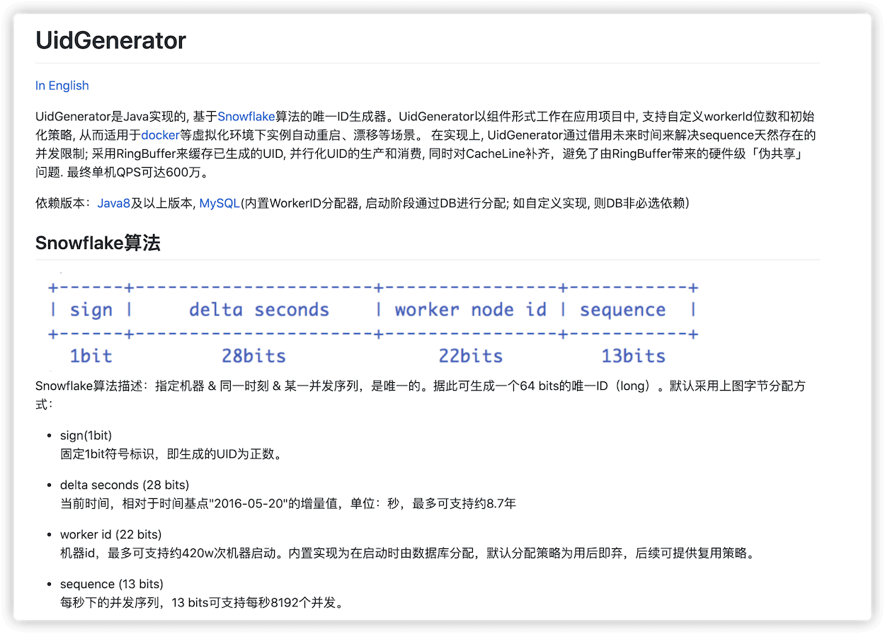
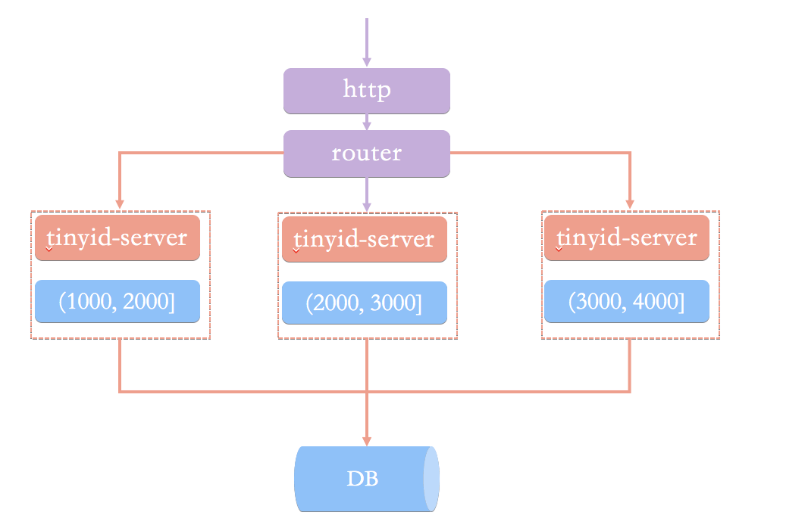
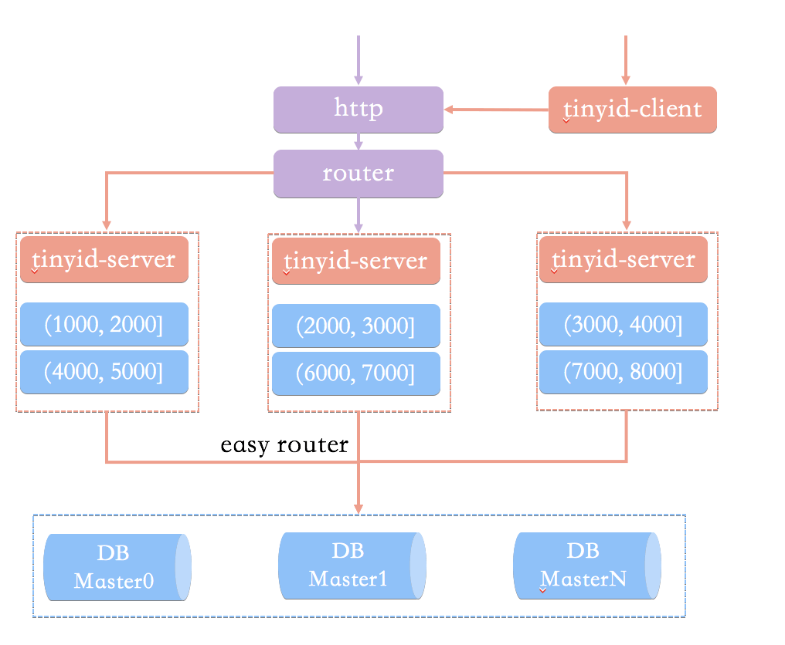
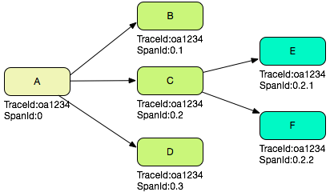
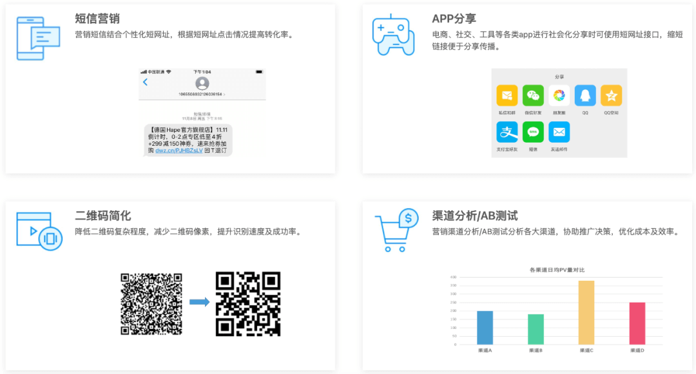

# 分布式ID

## 分布式ID介绍

### 什么是ID？

日常开发中，我们需要对系统中的各种数据使用 ID 唯一表示，比如用户 ID 对应且仅对应一个人，商品 ID 对应且仅对应一件商品，订单 ID 对应且仅对应一个订单。

我们现实生活中也有各种 ID，比如身份证 ID 对应且仅对应一个人、地址 ID 对应且仅对应。

简单来说，**ID 就是数据的唯一标识**。

### 什么是分布式ID？

分布式 ID 是分布式系统下的 ID。分布式 ID 不存在与现实生活中，属于计算机系统中的一个概念。

这里举一个分库分表的例子，假设一个项目，刚开始使用的是单机 MySQL 。但是，没想到的是，项目上线一个月之后，随着使用人数越来越多，整个系统的数据量将越来越大。单机 MySQL 已经没办法支撑了，需要进行分库分表（推荐 Sharding-JDBC）。

在分库之后， 数据遍布在不同服务器上的数据库，数据库的自增主键已经没办法满足生成的主键唯一了。**我们如何为不同的数据节点生成全局唯一主键呢？**

这个时候就需要生成**分布式 ID**了。

### 分布式ID需要满足哪些要求？

分布式 ID 作为分布式系统中必不可少的一环，很多地方都要用到分布式 ID。

一个最基本的分布式 ID 需要满足下面这些要求：
- **全局唯一**：ID 的全局唯一性肯定是首先要满足的！
- **高性能**：分布式 ID 的生成速度要快，对本地资源消耗要小。
- **高可用**：生成分布式 ID 的服务要保证可用性无限接近于 100%。
- **方便易用**：拿来即用，使用方便，快速接入！

除了这些之外，一个比较好的分布式 ID 还应保证：
- **安全**：ID 中不包含敏感信息。
- **有序递增**：如果要把 ID 存放在数据库的话，ID 的有序性可以提升数据库写入速度。并且，很多时候 ，我们还很有可能会直接通过 ID 来进行排序。
- **有具体的业务含义**：生成的 ID 如果能有具体的业务含义，可以让定位问题以及开发更透明化（通过 ID 就能确定是哪个业务）。
- **独立部署**：也就是分布式系统单独有一个发号器服务，专门用来生成分布式 ID。这样就生成 ID 的服务可以和业务相关的服务解耦。不过，这样同样带来了网络调用消耗增加的问题。总的来说，如果需要用到分布式 ID 的场景比较多的话，独立部署的发号器服务还是很有必要的。

## 分布式ID常见解决方案

### 数据库

#### 数据库主键自增

这种方式就比较简单直白了，就是通过关系型数据库的自增主键产生来唯一的 ID。

以 MySQL 举例，我们通过下面的方式即可。

1.创建一个数据库表。

```sql
CREATE TABLE `sequence_id` (
  `id` bigint(20) unsigned NOT NULL AUTO_INCREMENT,
  `stub` char(10) NOT NULL DEFAULT '',
  PRIMARY KEY (`id`),
  UNIQUE KEY `stub` (`stub`)
) ENGINE=InnoDB DEFAULT CHARSET=utf8mb4;
```

`stub` 字段无意义，只是为了占位，便于我们插入或者修改数据。并且，给 stub 字段创建了唯一索引，保证其唯一性。

2.通过 `replace into` 来插入数据。

```sql
BEGIN;
REPLACE INTO sequence_id (stub) VALUES ('stub');
SELECT LAST_INSERT_ID();
COMMIT;
```

插入数据这里，我们没有使用 `insert into` 而是使用 `replace into` 来插入数据，具体步骤是这样的：
- 第一步：尝试把数据插入到表中。
- 第二步：如果主键或唯一索引字段出现重复数据错误而插入失败时，先从表中删除含有重复关键字值的冲突行，然后再次尝试把数据插入到表中。

这种方式的优缺点也比较明显：
- 优点：实现起来比较简单、ID 有序递增、存储消耗空间小
- 缺点：支持的并发量不大、存在数据库单点问题（可以使用数据库集群解决，不过增加了复杂度）、ID 没有具体业务含义、安全问题（比如根据订单 ID 的递增规律就能推算出每天的订单量，商业机密啊！ ）、每次获取 ID 都要访问一次数据库（增加了对数据库的压力，获取速度也慢）

#### 数据库号段模式

数据库主键自增这种模式，每次获取 ID 都要访问一次数据库，ID 需求比较大的时候，肯定是不行的。

如果我们可以批量获取，然后存在在内存里面，需要用到的时候，直接从内存里面拿就舒服了！这也就是我们说的 **基于数据库的号段模式来生成分布式 ID**。

数据库的号段模式也是目前比较主流的一种分布式 ID 生成方式。像滴滴开源的[Tinyid](https://github.com/didi/tinyid/wiki/tinyid%E5%8E%9F%E7%90%86%E4%BB%8B%E7%BB%8D) 就是基于这种方式来做的。不过，TinyId 使用了双号段缓存、增加多 db 支持等方式来进一步优化。

以 MySQL 举例，我们通过下面的方式即可。

1. 创建一个数据库表。

```sql
CREATE TABLE `sequence_id_generator` (
  `id` int(10) NOT NULL,
  `current_max_id` bigint(20) NOT NULL COMMENT '当前最大id',
  `step` int(10) NOT NULL COMMENT '号段的长度',
  `version` int(20) NOT NULL COMMENT '版本号',
  `biz_type`    int(20) NOT NULL COMMENT '业务类型',
   PRIMARY KEY (`id`)
) ENGINE=InnoDB DEFAULT CHARSET=utf8mb4;
```

`current_max_id` 字段和`step`字段主要用于获取批量 ID，获取的批量 id `为：current_max_id` ~ `current_max_id+step`。

`version` 字段主要用于解决并发问题（乐观锁）,`biz_type` 主要用于表示业务类型。

2. 先插入一行数据。

```sql
INSERT INTO `sequence_id_generator` (`id`, `current_max_id`, `step`, `version`, `biz_type`)
VALUES
 (1, 0, 100, 0, 101);
```

3. 通过 SELECT 获取指定业务下的批量唯一 ID

```sql
SELECT `current_max_id`, `step`,`version` FROM `sequence_id_generator` where `biz_type` = 101;
```

结果：

```sql
id current_max_id step version biz_type
1 0 100 0 101
```

4. 不够用的话，更新之后重新 SELECT 即可。

```sql
UPDATE sequence_id_generator SET current_max_id = 0+100, version=version+1 WHERE version = 0  AND `biz_type` = 101;
SELECT `current_max_id`, `step`,`version` FROM `sequence_id_generator` where `biz_type` = 101;
```

结果：

```sql
id current_max_id step version biz_type
1 100 100 1 101
```

相比于数据库主键自增的方式，**数据库的号段模式对于数据库的访问次数更少，数据库压力更小**。

另外，为了避免单点问题，你可以从使用主从模式来提高可用性。

数据库号段模式的优缺点:
- 优点：ID 有序递增、存储消耗空间小
- 缺点：存在数据库单点问题（可以使用数据库集群解决，不过增加了复杂度）、ID 没有具体业务含义、安全问题（比如根据订单 ID 的递增规律就能推算出每天的订单量，商业机密啊！ ）

#### NoSQL

一般情况下，NoSQL 方案使用 Redis 多一些。我们通过 Redis 的 incr 命令即可实现对 id 原子顺序递增。

```sh
127.0.0.1:6379> set sequence_id_biz_type 1
OK
127.0.0.1:6379> incr sequence_id_biz_type
(integer) 2
127.0.0.1:6379> get sequence_id_biz_type
"2"
```

为了提高可用性和并发，我们可以使用 Redis Cluster。Redis Cluster 是 Redis 官方提供的 Redis 集群解决方案（3.0+版本）。

除了 Redis Cluster 之外，你也可以使用开源的 Redis 集群方案[Codis](https://github.com/CodisLabs/codis) （大规模集群比如上百个节点的时候比较推荐）。

除了高可用和并发之外，我们知道 Redis 基于内存，我们需要持久化数据，避免重启机器或者机器故障后数据丢失。Redis 支持两种不同的持久化方式：**快照（snapshotting，RDB）**、**只追加文件（append-only file, AOF）**。 并且，Redis 4.0 开始支持 **RDB 和 AOF 的混合持久化**（默认关闭，可以通过配置项 `aof-use-rdb-preamble` 开启）。

Redis 方案的优缺点：
- 优点：性能不错并且生成的 ID 是有序递增的
- 缺点：和数据库主键自增方案的缺点类似

除了 Redis 之外，MongoDB ObjectId 经常也会被拿来当做分布式 ID 的解决方案。


MongoDB ObjectId 一共需要 12 个字节存储：
- 0~3：时间戳
- 3~6：代表机器 ID
- 7~8：机器进程 ID
- 9~11：自增值

MongoDB 方案的优缺点：
- 优点：性能不错并且生成的 ID 是有序递增的
- 缺点：需要解决重复 ID 问题（当机器时间不对的情况下，可能导致会产生重复 ID）、有安全性问题（ID 生成有规律性）

### 算法

#### UUID

UUID 是 Universally Unique Identifier（通用唯一标识符） 的缩写。UUID 包含 32 个 16 进制数字（8-4-4-4-12）。

JDK 就提供了现成的生成 UUID 的方法，一行代码就行了。

```java
//输出示例：cb4a9ede-fa5e-4585-b9bb-d60bce986eaa
UUID.randomUUID()
```

[RFC 4122](https://tools.ietf.org/html/rfc4122) 中关于 UUID 的示例是这样的：


我们这里重点关注一下这个 Version(版本)，不同的版本对应的 UUID 的生成规则是不同的。

5 种不同的 Version(版本)值分别对应的含义（参考[维基百科对于 UUID 的介绍](https://zh.wikipedia.org/wiki/%E9%80%9A%E7%94%A8%E5%94%AF%E4%B8%80%E8%AF%86%E5%88%AB%E7%A0%81)）：
- 版本 1 : UUID 是根据时间和节点 ID（通常是 MAC 地址）生成；
- 版本 2 : UUID 是根据标识符（通常是组或用户 ID）、时间和节点 ID 生成；
- 版本 3、版本 5 : 版本 5 - 确定性 UUID 通过散列（hashing）名字空间（namespace）标识符和名称生成；
- 版本 4 : UUID 使用[随机性](https://zh.wikipedia.org/wiki/%E9%9A%8F%E6%9C%BA%E6%80%A7)或[伪随机性](https://zh.wikipedia.org/wiki/%E4%BC%AA%E9%9A%8F%E6%9C%BA%E6%80%A7)生成。

下面是 Version 1 版本下生成的 UUID 的示例：


JDK 中通过 `UUID` 的 `randomUUID()` 方法生成的 UUID 的版本默认为 4。

```java
UUID uuid = UUID.randomUUID();
int version = uuid.version();// 4
```

另外，Variant(变体)也有 4 种不同的值，这种值分别对应不同的含义。

从上面的介绍中可以看出，UUID 可以保证唯一性，因为其生成规则包括 MAC 地址、时间戳、名字空间（Namespace）、随机或伪随机数、时序等元素，计算机基于这些规则生成的 UUID 是肯定不会重复的。

虽然，UUID 可以做到全局唯一性，但是，我们一般很少会使用它。

比如使用 UUID 作为 MySQL 数据库主键的时候就非常不合适：
- 数据库主键要尽量越短越好，而 UUID 的消耗的存储空间比较大（32 个字符串，128 位）。
- UUID 是无顺序的，InnoDB 引擎下，数据库主键的无序性会严重影响数据库性能。

最后，我们再简单分析一下 UUID 的优缺点:
- 优点：生成速度比较快、简单易用
- 缺点：存储消耗空间大（32 个字符串，128 位）、 不安全（基于 MAC 地址生成 UUID 的算法会造成 MAC 地址泄露)、无序（非自增）、没有具体业务含义、需要解决重复 ID 问题（当机器时间不对的情况下，可能导致会产生重复 ID）

#### Snowflake（雪花算法）

Snowflake 是 Twitter 开源的分布式 ID 生成算法。Snowflake 由 64 bit 的二进制数字组成，这 64bit 的二进制被分成了几部分，每一部分存储的数据都有特定的含义：

- sign(1bit):符号位（标识正负），始终为 0，代表生成的 ID 为正数。
- timestamp (41 bits):一共 41 位，用来表示时间戳，单位是毫秒，可以支撑 2 ^41 毫秒（约 69 年）
- datacenter id + worker id (10 bits):一般来说，前 5 位表示机房 ID，后 5 位表示机器 ID（实际项目中可以根据实际情况调整）。这样就可以区分不同集群/机房的节点。
- sequence (12 bits):一共 12 位，用来表示序列号。 序列号为自增值，代表单台机器每毫秒能够产生的最大 ID 数(2^12 = 4096),也就是说单台机器每毫秒最多可以生成 4096 个 唯一 ID。

在实际项目中，我们一般也会对 Snowflake 算法进行改造，最常见的就是在 Snowflake 算法生成的 ID 中加入业务类型信息。

我们再来看看 Snowflake 算法的优缺点：
- 优点：生成速度比较快、生成的 ID 有序递增、比较灵活（可以对 Snowflake 算法进行简单的改造比如加入业务 ID）
- 缺点：需要解决重复 ID 问题（ID 生成依赖时间，在获取时间的时候，可能会出现时间回拨的问题，也就是服务器上的时间突然倒退到之前的时间，进而导致会产生重复 ID）、依赖机器 ID 对分布式环境不友好（当需要自动启停或增减机器时，固定的机器 ID 可能不够灵活）。

如果你想要使用 Snowflake 算法的话，一般不需要你自己再造轮子。有很多基于 Snowflake 算法的开源实现比如美团 的 Leaf、百度的 UidGenerator（后面会提到），并且这些开源实现对原有的 Snowflake 算法进行了优化，性能更优秀，还解决了 Snowflake 算法的时间回拨问题和依赖机器 ID 的问题。

并且，Seata 还提出了“改良版雪花算法”，针对原版雪花算法进行了一定的优化改良，解决了时间回拨问题，大幅提高的 QPS。具体介绍和改进原理，可以参考下面这两篇文章：

- [Seata 基于改良版雪花算法的分布式 UUID 生成器分析](https://seata.io/zh-cn/blog/seata-analysis-UUID-generator.html)
- [在开源项目中看到一个改良版的雪花算法，现在它是你的了](https://www.cnblogs.com/thisiswhy/p/17611163.html)

### 开源框架

#### UidGenerator（百度）

[UidGenerator](https://github.com/baidu/uid-generator) 是百度开源的一款基于 Snowflake(雪花算法)的唯一 ID 生成器。

不过，UidGenerator 对 Snowflake(雪花算法)进行了改进，生成的唯一 ID 组成如下：

- sign(1bit):符号位（标识正负），始终为 0，代表生成的 ID 为正数。
- delta seconds (28 bits):当前时间，相对于时间基点"2016-05-20"的增量值，单位：秒，最多可支持约 8.7 年
- worker id (22 bits):机器 id，最多可支持约 420w 次机器启动。内置实现为在启动时由数据库分配，默认分配策略为用后即弃，后续可提供复用策略。
- sequence (13 bits):每秒下的并发序列，13 bits 可支持每秒 8192 个并发。

可以看出，和原始 Snowflake(雪花算法)生成的唯一 ID 的组成不太一样。并且，上面这些参数我们都可以自定义。

UidGenerator 官方文档中的介绍如下：



自 18 年后，UidGenerator 就基本没有再维护了，我这里也不过多介绍。想要进一步了解的朋友，可以看看 [UidGenerator 的官方介绍](https://github.com/baidu/uid-generator/blob/master/README.zh_cn.md)。

#### Leaf（美团）

[Leaf](https://github.com/Meituan-Dianping/Leaf) 是美团开源的一个分布式 ID 解决方案 。这个项目的名字 Leaf（树叶） 起源于德国哲学家、数学家莱布尼茨的一句话：“There are no two identical leaves in the world”（世界上没有两片相同的树叶） 。

Leaf 提供了 **号段模式** 和 **Snowflake(雪花算法)** 这两种模式来生成分布式 ID。并且，它支持双号段，还解决了雪花 ID 系统时钟回拨问题。不过，时钟问题的解决需要弱依赖于 Zookeeper（使用 Zookeeper 作为注册中心，通过在特定路径下读取和创建子节点来管理 workId） 。

Leaf 的诞生主要是为了解决美团各个业务线生成分布式 ID 的方法多种多样以及不可靠的问题。

Leaf 对原有的号段模式进行改进，比如它这里增加了双号段避免获取 DB 在获取号段的时候阻塞请求获取 ID 的线程。简单来说，就是我一个号段还没用完之前，我自己就主动提前去获取下一个号段（图片来自于美团官方文章：[《Leaf——美团点评分布式 ID 生成系统》](https://tech.meituan.com/2017/04/21/mt-leaf.html)）。


根据项目 README 介绍，在 4C8G VM 基础上，通过公司 RPC 方式调用，QPS 压测结果近 5w/s，TP999 1ms。

#### Tinyid（滴滴）

[Tinyid](https://github.com/didi/tinyid) 是滴滴开源的一款基于数据库号段模式的唯一 ID 生成器。

数据库号段模式的原理我们在上面已经介绍过了。Tinyid 有哪些亮点呢？

为了搞清楚这个问题，我们先来看看基于数据库号段模式的简单架构方案。（图片来自于 Tinyid 的官方 wiki:[《Tinyid 原理介绍》](https://github.com/didi/tinyid/wiki/tinyid%E5%8E%9F%E7%90%86%E4%BB%8B%E7%BB%8D)）



在这种架构模式下，我们通过 HTTP 请求向发号器服务申请唯一 ID。负载均衡 router 会把我们的请求送往其中的一台 tinyid-server。

这种方案有什么问题呢？在我看来（Tinyid 官方 wiki 也有介绍到），主要由下面这 2 个问题：
- 获取新号段的情况下，程序获取唯一 ID 的速度比较慢。
- 需要保证 DB 高可用，这个是比较麻烦且耗费资源的。

除此之外，HTTP 调用也存在网络开销。

Tinyid 的原理比较简单，其架构如下图所示：



相比于基于数据库号段模式的简单架构方案，Tinyid 方案主要做了下面这些优化：
- 双号段缓存：为了避免在获取新号段的情况下，程序获取唯一 ID 的速度比较慢。 Tinyid 中的号段在用到一定程度的时候，就会去异步加载下一个号段，保证内存中始终有可用号段。
- 增加多 db 支持：支持多个 DB，并且，每个 DB 都能生成唯一 ID，提高了可用性。
- 增加 tinyid-client：纯本地操作，无 HTTP 请求消耗，性能和可用性都有很大提升。

Tinyid 的优缺点这里就不分析了，结合数据库号段模式的优缺点和 Tinyid 的原理就能知道。

#### IdGenerator（个人）

和 UidGenerator、Leaf 一样，[IdGenerator](https://github.com/yitter/IdGenerator) 也是一款基于 Snowflake(雪花算法)的唯一 ID 生成器。

IdGenerator 有如下特点：
- 生成的唯一 ID 更短；
- 兼容所有雪花算法（号段模式或经典模式，大厂或小厂）；
- 原生支持 C#/Java/Go/C/Rust/Python/Node.js/PHP(C 扩展)/SQL/ 等语言，并提供多线程安全调用动态库（FFI）；
- 解决了时间回拨问题，支持手工插入新 ID（当业务需要在历史时间生成新 ID 时，用本算法的预留位能生成 5000 个每秒）；
- 不依赖外部存储系统;
- 默认配置下，ID 可用 71000 年不重复。

IdGenerator 生成的唯一 ID 组成如下：
- timestamp (位数不固定):时间差，是生成 ID 时的系统时间减去 BaseTime(基础时间，也称基点时间、原点时间、纪元时间，默认值为 2020 年) 的总时间差（毫秒单位）。初始为 5bits，随着运行时间而增加。如果觉得默认值太老，你可以重新设置，不过要注意，这个值以后最好不变。
- worker id (默认 6 bits):机器 id，机器码，最重要参数，是区分不同机器或不同应用的唯一 ID，最大值由 `WorkerIdBitLength`（默认 6）限定。如果一台服务器部署多个独立服务，需要为每个服务指定不同的 WorkerId。
- sequence (默认 6 bits):序列数，是每毫秒下的序列数，由参数中的 `SeqBitLength`（默认 6）限定。增加 `SeqBitLength` 会让性能更高，但生成的 ID 也会更长。

Java 语言使用示例：[https://github.com/yitter/idgenerator/tree/master/Java](https://github.com/yitter/idgenerator/tree/master/Java)

## 分布式ID的使用场景

### 场景一：订单系统

#### 1. 一码付

我们常见的一码付，指的是一个二维码可以使用支付宝或者微信进行扫码支付。

二维码的本质是一个字符串。聚合码的本质就是一个链接地址。用户使用支付宝微信直接扫一个码付钱，不用担心拿支付宝扫了微信的收款码或者用微信扫了支付宝的收款码，这极大减少了用户扫码支付的时间。

实现原理是当客户用 APP 扫码后，网站后台就会判断客户的扫码环境。（微信、支付宝、QQ 钱包、京东支付、云闪付等）。

判断扫码环境的原理就是根据打开链接浏览器的 HTTP header。任何浏览器打开 http 链接时，请求的 header 都会有 User-Agent(UA、用户代理)信息。

UA 是一个特殊字符串头，服务器依次可以识别出客户使用的操作系统及版本、CPU 类型、浏览器及版本、浏览器渲染引擎、浏览器语言、浏览器插件等很多信息。

各渠道对应支付产品的名称不一样，一定要仔细看各支付产品的 API 介绍。
- 微信支付：JSAPI 支付
- 支付宝：手机网站支付
- QQ 钱包：公众号支付

其本质均为在 APP 内置浏览器中实现 HTML5 支付。


文库的研发同学在这个思路上，做了优化迭代。动态生成一码付的二维码预先绑定用户所选的商品信息和价格，根据用户所选的商品动态更新。这样不仅支持一码多平台调起支付，而且不用用户选择商品输入金额，即可完成订单支付的功能，很丝滑。用户在真正扫码后，服务端才通过前端获取用户 UID，结合二维码绑定的商品信息，真正的生成订单，发送支付信息到第三方（qq、微信、支付宝），第三方生成支付订单推给用户设备，从而调起支付。

区别于固定的一码付，在文库的应用中，使用到了动态二维码，二维码本质是一个短网址，ID 服务提供短网址的唯一标志参数。唯一的短网址映射的 ID 绑定了商品的订单信息，技术和业务的深度结合，缩短了支付流程，提升用户的支付体验。

#### 2. 订单号

订单号在实际的业务过程中作为一个订单的唯一标识码存在，一般实现以下业务场景：
1. 用户订单遇到问题，需要找客服进行协助；
2. 对订单进行操作，如线下收款，订单核销；
3. 下单，改单，成单，退单，售后等系统内部的订单流程处理和跟进。

很多时候搜索订单相关信息的时候都是以订单 ID 作为唯一标识符，这是由于订单号的生成规则的唯一性决定的。从技术角度看，除了 ID 服务必要的特性之外，在订单号的设计上需要体现几个特性：

**（1）信息安全**

编号不能透露公司的运营情况，比如日销、公司流水号等信息，以及商业信息和用户手机号，身份证等隐私信息。并且不能有明显的整体规律（可以有局部规律），任意修改一个字符就能查询到另一个订单信息，这也是不允许的。

类比于我们高考时候的考生编号的生成规则，一定不能是连号的，否则只需要根据顺序往下查询就能搜索到别的考生的成绩，这是绝对不可允许。

**（2）部分可读**

位数要便于操作，因此要求订单号的位数适中，且局部有规律。这样可以方便在订单异常，或者退货时客服查询。

过长的订单号或易读性差的订单号会导致客服输入困难且易错率较高，影响用户体验的售后体验。因此在实际的业务场景中，订单号的设计通常都会适当携带一些允许公开的对使用场景有帮助的信息，如时间，星期，类型等等，这个主要根据所涉及的编号对应的使用场景来。

而且像时间、星期这些自增长的属于作为订单号的设计的一部分元素，有助于解决业务累积而导致的订单号重复的问题。

**（3）查询效率**

常见的电商平台订单号大多是纯数字组成，兼具可读性的同时，int 类型相对 varchar 类型的查询效率更高，对在线业务更加友好。

#### 3. 优惠券和兑换券

优惠券、兑换券是运营推广最常用的促销工具之一，合理使用它们，可以让买家得到实惠，商家提升商品销量。常见场景有：
1. 在文库购买【文库 VIP+QQ 音乐年卡】联合商品，支付成功后会得到 QQ 音乐年卡的兑换码，可以去 QQ 音乐 App 兑换音乐会员年卡；
2. 疫情期间，部分地方政府发放的消费券；
3. 瓶装饮料经常会出现输入优惠编码兑换奖品。


从技术角度看，有些场景适合 ID 即时生成，比如电商平台购物领取的优惠券，只需要在用户领取时分配优惠券信息即可。有些线上线下结合的场景，比如疫情优惠券，瓶盖开奖，京东卡，超市卡这种，则需要预先生成，预先生成的券码具备以下特性：
1. 预先生成，在活动正式开始前提供出来进行活动预热；
2. 优惠券体量大，以万为单位，通常在 10 万级别以上；
3. 不可破解、仿制券码；
4. 支持用后核销；
5. 优惠券、兑换券属于广撒网的策略，所以利用率低，也就不适合使用数据库进行存储 **（占空间，有效的数据又少）**。

设计思路上，需要设计一种有效的兑换码生成策略，支持预先生成，支持校验，内容简洁，生成的兑换码都具有唯一性，那么这种策略就是一种特殊的编解码策略，按照约定的编解码规则支撑上述需求。

既然是一种编解码规则，那么需要约定编码空间(也就是用户看到的组成兑换码的字符)，编码空间由字符 a-z,A-Z,数字 0-9 组成，为了增强兑换码的可识别度，剔除大写字母 O 以及 I,可用字符如下所示，共 60 个字符：

`abcdefghijklmnopqrstuvwxyzABCDEFGHJKLMNPQRSTUVWXZY0123456789`

之前说过，兑换码要求近可能简洁，那么设计时就需要考虑兑换码的字符数，假设上限为 12 位，而字符空间有 60 位，那么可以表示的空间范围为 60^12=130606940160000000000000(也就是可以 12 位的兑换码可以生成天量,应该够运营同学挥霍了)，转换成 2 进制：

`1001000100000000101110011001101101110011000000000000000000000`(61 位)

**兑换码组成成分分析**

兑换码可以预先生成，并且不需要额外的存储空间保存这些信息，每一个优惠方案都有独立的一组兑换码(指运营同学组织的每一场运营活动都有不同的兑换码,不能混合使用, 例如双 11 兑换码不能使用在双 12 活动上)，每个兑换码有自己的编号，防止重复，为了保证兑换码的有效性，对兑换码的数据需要进行校验，当前兑换码的数据组成如下所示：

优惠方案 ID + 兑换码序列号 i + 校验码

**编码方案**

1. 兑换码序列号 i，代表当前兑换码是当前活动中第 i 个兑换码，兑换码序列号的空间范围决定了优惠活动可以发行的兑换码数目，当前采用 30 位 bit 位表示，可表示范围：1073741824（10 亿个券码）。
2. 优惠方案 ID, 代表当前优惠方案的 ID 号，优惠方案的空间范围决定了可以组织的优惠活动次数，当前采用 15 位表示，可以表示范围：32768（考虑到运营活动的频率，以及 ID 的初始值 10000，15 位足够，365 天每天有运营活动，可以使用 54 年）。
3. 校验码，校验兑换码是否有效，主要为了快捷的校验兑换码信息的是否正确，其次可以起到填充数据的目的，增强数据的散列性，使用 13 位表示校验位，其中分为两部分，前 6 位和后 7 位。

深耕业务还会有区分通用券和单独券的情况，分别具备以下特点，技术实现需要因地制宜地思考。

1. 通用券：多个玩家都可以输入兑换，然后有总量限制，期限限制。
2. 单独券：运营同学可以在后台设置兑换码的奖励物品、期限、个数，然后由后台生成兑换码的列表，兑换之后核销。

### 场景二：Tracing

#### 1. 日志追踪

在分布式服务架构下，一个 Web 请求从网关流入，有可能会调用多个服务对请求进行处理，拿到最终结果。这个过程中每个服务之间的通信又是单独的网络请求，无论请求经过的哪个服务出了故障或者处理过慢都会对前端造成影响。

处理一个 Web 请求要调用的多个服务，为了能更方便的查询哪个环节的服务出现了问题，现在常用的解决方案是为整个系统引入分布式链路跟踪。



在分布式链路跟踪中有两个重要的概念：跟踪（trace）和 跨度（span）。trace 是请求在分布式系统中的整个链路视图，span 则代表整个链路中不同服务内部的视图，span 组合在一起就是整个 trace 的视图。

在整个请求的调用链中，请求会一直携带 traceid 往下游服务传递，每个服务内部也会生成自己的 spanid 用于生成自己的内部调用视图，并和 traceid 一起传递给下游服务。

#### 2. TraceId生成规则

这种场景下，生成的 ID 除了要求唯一之外，还要求生成的效率高、吞吐量大。traceid 需要具备接入层的服务器实例自主生成的能力，如果每个 trace 中的 ID 都需要请求公共的 ID 服务生成，纯纯的浪费网络带宽资源。且会阻塞用户请求向下游传递，响应耗时上升，增加了没必要的风险。所以需要服务器实例最好可以自行计算 tracid，spanid，避免依赖外部服务。

产生规则：服务器 IP + ID 产生的时间 + 自增序列 + 当前进程号 ，比如：

`0ad1348f1403169275002100356696`

前 8 位 0ad1348f 即产生 TraceId 的机器的 IP，这是一个十六进制的数字，每两位代表 IP 中的一段，我们把这个数字，按每两位转成 10 进制即可得到常见的 IP 地址表示方式 10.209.52.143，您也可以根据这个规律来查找到请求经过的第一个服务器。

后面的 13 位 1403169275002 是产生 TraceId 的时间。之后的 4 位 1003 是一个自增的序列，从 1000 涨到 9000，到达 9000 后回到 1000 再开始往上涨。最后的 5 位 56696 是当前的进程 ID，为了防止单机多进程出现 TraceId 冲突的情况，所以在 TraceId 末尾添加了当前的进程 ID。

#### 3. SpanId生成规则

span 是层的意思，比如在第一个实例算是第一层， 请求代理或者分流到下一个实例处理，就是第二层，以此类推。通过层，SpanId 代表本次调用在整个调用链路树中的位置。

假设一个 服务器实例 A 接收了一次用户请求，代表是整个调用的根节点，那么 A 层处理这次请求产生的非服务调用日志记录 spanid 的值都是 0，A 层需要通过 RPC 依次调用 B、C、D 三个服务器实例，那么在 A 的日志中，SpanId 分别是 0.1，0.2 和 0.3，在 B、C、D 中，SpanId 也分别是 0.1，0.2 和 0.3；如果 C 系统在处理请求的时候又调用了 E，F 两个服务器实例，那么 C 系统中对应的 spanid 是 0.2.1 和 0.2.2，E、F 两个系统对应的日志也是 0.2.1 和 0.2.2。

根据上面的描述可以知道，如果把一次调用中所有的 SpanId 收集起来，可以组成一棵完整的链路树。

**spanid 的生成本质：在跨层传递透传的同时，控制大小版本号的自增来实现的。**

### 场景三：短网址

短网址主要功能包括网址缩短与还原两大功能。相对于长网址，短网址可以更方便地在电子邮件，社交网络，微博和手机上传播，例如原来很长的网址通过短网址服务即可生成相应的短网址，避免折行或超出字符限制。



常用的 ID 生成服务比如：MySQL ID 自增、 Redis 键自增、号段模式，生成的 ID 都是一串数字。

短网址服务把客户的长网址转换成短网址，实际是在 [dwz.cn](http://dwz.cn/) 域名后面拼接新产生的数字类型 ID，直接用数字 ID，网址长度也有些长，服务可以通过数字 ID 转更高进制的方式压缩长度。这种算法在短网址的技术实现上越来越多了起来，它可以进一步压缩网址长度。

转进制的压缩算法在生活中有广泛的应用场景，举例：
- 客户的长网址：https://wenku.baidu.com/ndbusiness/browse/wenkuvipcashier?cashier_code=PCoperatebanner 
- ID映射的短网址：https://dwz.cn/2047601319t66 (演示使用，可能无法正确打开)
- 转进制后的短网址：https://dwz.cn/2ezwDJ0 (演示使用，可能无法正确打开)