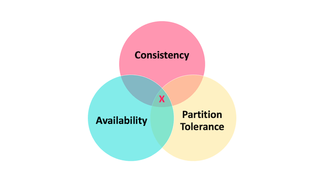
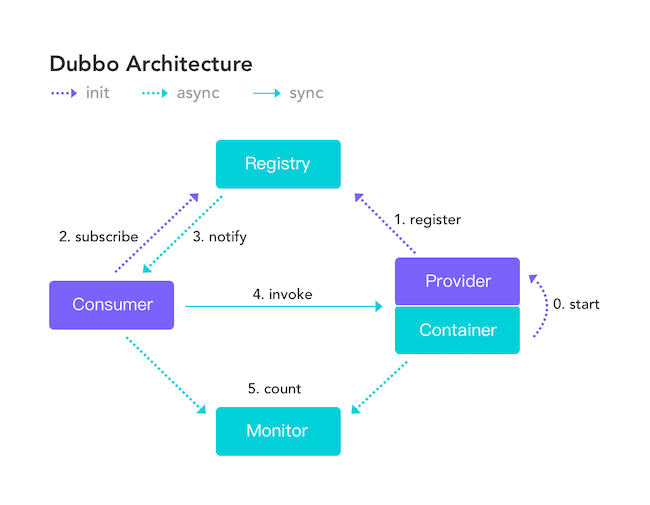
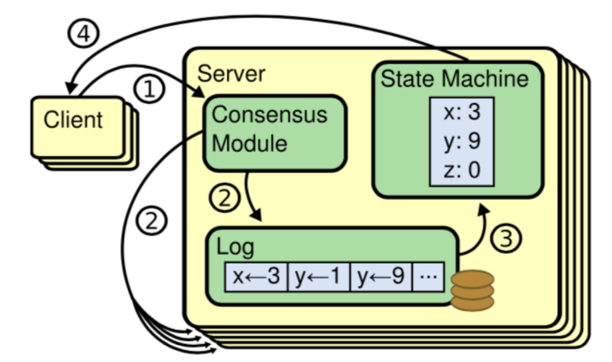
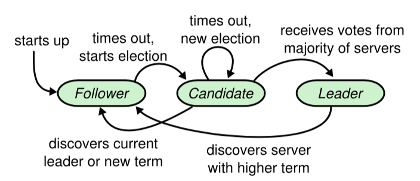
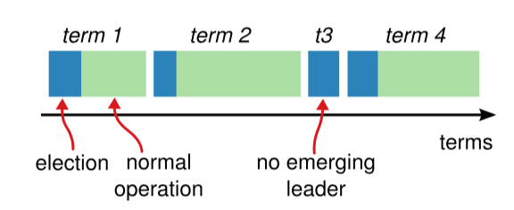
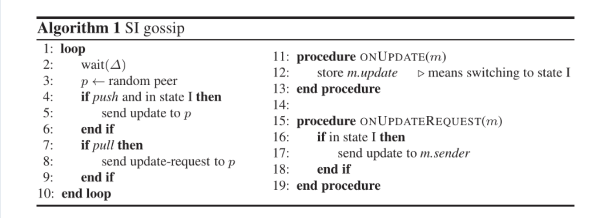
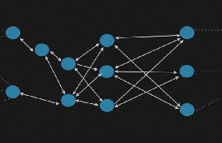
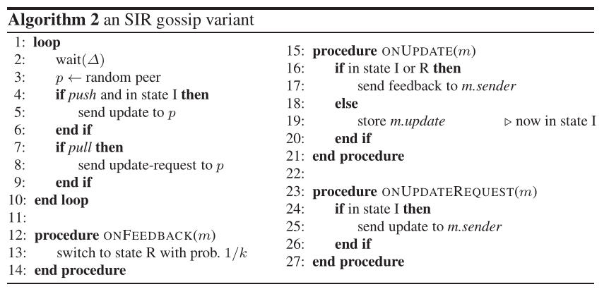

# 理论&算法&协议

## CAP & BASE理论

### CAP理论

[CAP 理论/定理](https://zh.wikipedia.org/wiki/CAP%E5%AE%9A%E7%90%86) 起源于 2000 年，由加州大学伯克利分校的 Eric Brewer 教授在分布式计算原理研讨会（PODC）上提出，因此 CAP 定理又被称作 布鲁尔定理（Brewer’s theorem）。

2 年后，麻省理工学院的 Seth Gilbert 和 Nancy Lynch 发表了布鲁尔猜想的证明，CAP 理论正式成为分布式领域的定理。

#### 简介

**CAP** 也就是 **Consistency（一致性）、Availability（可用性）、Partition Tolerance（分区容错性）** 这三个单词首字母组合。

CAP 理论的提出者布鲁尔在提出 CAP 猜想的时候，并没有详细定义 Consistency、Availability、Partition Tolerance 三个单词的明确定义。因此，对于 CAP 的民间解读有很多，一般比较被大家推荐的是下面 👇 这种版本的解读。在理论计算机科学中，CAP 定理（CAP theorem）指出对于一个分布式系统来说，当设计读写操作时，只能同时满足以下三点中的两个：

- **一致性（Consistency）**：所有节点访问同一份最新的数据副本。
- **可用性（Availability）**：非故障的节点在合理的时间内返回合理的响应（不是错误或者超时的响应）。
- **分区容错性（Partition Tolerance）**：分布式系统出现网络分区的时候，仍然能够对外提供服务。

什么是网络分区？

分布式系统中，多个节点之间的网络本来是连通的，但是因为某些故障（比如部分节点网络出了问题）某些节点之间不连通了，整个网络就分成了几块区域，这就叫 **网络分区**。

#### CAP "3选2"

大部分人解释这一定律时，常常简单的表述为：“一致性、可用性、分区容忍性三者你只能同时达到其中两个，不可能同时达到”。实际上这是一个非常具有误导性质的说法，而且在 CAP 理论诞生 12 年之后，CAP 之父也在 2012 年重写了之前的论文。

> **当发生网络分区的时候，如果我们要继续服务，那么强一致性和可用性只能 2 选 1。也就是说当网络分区之后 P 是前提，决定了 P 之后才有 C 和 A 的选择。也就是说分区容错性（Partition tolerance）我们是必须要实现的。**
>
> 简而言之就是：CAP 理论中分区容错性 P 是一定要满足的，在此基础上，只能满足可用性 A 或者一致性 C。

因此，**分布式系统理论上不可能选择 CA 架构，只能选择 CP 或者 AP 架构。** 比如 ZooKeeper、HBase 就是 CP 架构，Cassandra、Eureka 就是 AP 架构，Nacos 不仅支持 CP 架构也支持 AP 架构。

**为啥不可能选择 CA 架构呢？** 举个例子：若系统出现“分区”，系统中的某个节点在进行写操作。为了保证 C， 必须要禁止其他节点的读写操作，这就和 A 发生冲突了。

如果为了保证 A，其他节点的读写操作正常的话，那就和 C 发生冲突了。

**选择 CP 还是 AP 的关键在于当前的业务场景，没有定论，比如对于需要确保强一致性的场景如银行一般会选择保证 CP** 。

另外，需要补充说明的一点是：**如果网络分区正常的话（系统在绝大部分时候所处的状态），也就说不需要保证 P 的时候，C 和 A 能够同时保证**。

#### CAP实际应用案例

我这里以注册中心来探讨一下 CAP 的实际应用。考虑到很多小伙伴不知道注册中心是干嘛的，这里简单以 Dubbo 为例说一说。

下图是 Dubbo 的架构图。**注册中心 Registry 在其中扮演了什么角色呢？提供了什么服务呢？**

注册中心负责服务地址的注册与查找，相当于目录服务，服务提供者和消费者只在启动时与注册中心交互，注册中心不转发请求，压力较小。

常见的可以作为注册中心的组件有：ZooKeeper、Eureka、Nacos...。

- **ZooKeeper 保证的是 CP。** 对 ZooKeeper 的读请求能得到一致性的结果，但是， ZooKeeper 不保证每次请求的可用性比如在 Leader 选举过程中或者半数以上的机器不可用的时候服务就是不可用的。
- **Eureka 保证的则是 AP。** Eureka 在设计的时候就是优先保证 A （可用性）。在 Eureka 中不存在什么 Leader 节点，每个节点都是一样的、平等的。因此 Eureka 不会像 ZooKeeper 那样出现选举过程中或者半数以上的机器不可用的时候服务就是不可用的情况。 Eureka 保证即使大部分节点挂掉也不会影响正常提供服务，只要有一个节点是可用的就行了。只不过这个节点上的数据可能并不是最新的。
- **Nacos 不仅支持 CP 也支持 AP。**

ZooKeeper 通过可线性化（Linearizable）写入、全局 FIFO 顺序访问等机制来保障数据一致性。多节点部署的情况下， ZooKeeper 集群处于 Quorum 模式。Quorum 模式下的 ZooKeeper 集群， 是一组 ZooKeeper 服务器节点组成的集合，其中大多数节点必须同意任何变更才能被视为有效。

由于 Quorum 模式下的读请求不会触发各个 ZooKeeper 节点之间的数据同步，因此在某些情况下还是可能会存在读取到旧数据的情况，导致不同的客户端视图上看到的结果不同，这可能是由于网络延迟、丢包、重传等原因造成的。ZooKeeper 为了解决这个问题，提供了 Watcher 机制和版本号机制来帮助客户端检测数据的变化和版本号的变更，以保证数据的一致性。

#### 总结

在进行分布式系统设计和开发时，我们不应该仅仅局限在CAP问题上，还要关注系统的扩展性、可用性等等。在系统发生“分区”的情况下，CAP理论只能满足CP或者AP。要注意的是，这里的前提是系统发生了“分区”，如果系统没有发生“分区”的话，节点间的网络连接通信正常的话，也就不存在P了。这个时候，我们就可以同时保证C和A了。

总结：**如果系统发生“分区”，我们要考虑选择CP还是AP。如果系统没有发生“分区”的话，我们要思考如何保证CA。**

推荐阅读：

- [CAP 定理简化](https://medium.com/@ravindraprasad/cap-theorem-simplified-28499a67eab4) （英文，有趣的案例）
- [神一样的 CAP 理论被应用在何方](https://juejin.im/post/6844903936718012430) （中文，列举了很多实际的例子）
- [请停止呼叫数据库 CP 或 AP](https://martin.kleppmann.com/2015/05/11/please-stop-calling-databases-cp-or-ap.html) （英文，带给你不一样的思考）

### BASE理论

[BASE 理论](https://dl.acm.org/doi/10.1145/1394127.1394128)起源于 2008 年， 由 eBay 的架构师 Dan Pritchett 在 ACM 上发表。

#### 简介

**BASE 是 Basically Available（基本可用）、Soft-state（软状态） 和 Eventually Consistent（最终一致性）** 三个短语的缩写。BASE 理论是对 CAP 中一致性 C 和可用性 A 权衡的结果，其来源于对大规模互联网系统分布式实践的总结，是基于 CAP 定理逐步演化而来的，它大大降低了我们对系统的要求。

#### BASE理论的核心思想

即使无法做到强一致性，但每个应用都可以根据自身业务特点，采用适当的方式来使系统达到最终一致性。

> 也就是牺牲数据的一致性来满足系统的高可用性，系统中一部分数据不可用或者不一致时，仍需要保持系统整体“主要可用”。

**BASE 理论本质上是对 CAP 的延伸和补充，更具体地说，是对 CAP 中 AP 方案的一个补充。**

为什么这样说呢？

CAP 理论这节我们也说过了：

> 如果系统没有发生“分区”的话，节点间的网络连接通信正常的话，也就不存在 P 了。这个时候，我们就可以同时保证 C 和 A 了。因此，如果系统发生“分区”，我们要考虑选择 CP 还是 AP。**如果系统没有发生“分区”的话，我们要思考如何保证 CA 。**

因此，AP 方案只是在系统发生分区的时候放弃一致性，而不是永远放弃一致性。在分区故障恢复后，系统应该达到最终一致性。这一点其实就是 BASE 理论延伸的地方。

#### BASE理论三要素

##### 1. 基本可用

基本可用是指分布式系统在出现不可预知故障的时候，允许损失部分可用性。但是，这绝不等价于系统不可用。

什么叫允许损失部分可用性呢？

- **响应时间上的损失**：正常情况下，处理用户请求需要 0.5s 返回结果，但是由于系统出现故障，处理用户请求的时间变为 3 s。
- **系统功能上的损失**：正常情况下，用户可以使用系统的全部功能，但是由于系统访问量突然剧增，系统的部分非核心功能无法使用。

##### 2. 软状态

软状态指允许系统中的数据存在中间状态（**CAP 理论中的数据不一致**），并认为该中间状态的存在不会影响系统的整体可用性，即允许系统在不同节点的数据副本之间进行数据同步的过程存在延时。

##### 3. 最终一致性

最终一致性强调的是系统中所有的数据副本，在经过一段时间的同步后，最终能够达到一个一致的状态。因此，最终一致性的本质是需要系统保证最终数据能够达到一致，而不需要实时保证系统数据的强一致性。

> 分布式一致性的 3 种级别：
>
> - **强一致性**：系统写入了什么，读出来的就是什么。
> - **弱一致性**：不一定可以读取到最新写入的值，也不保证多少时间之后读取到的数据是最新的，只是会尽量保证某个时刻达到数据一致的状态。
> - **最终一致性**：弱一致性的升级版，系统会保证在一定时间内达到数据一致的状态。
>
> **业界比较推崇是最终一致性级别，但是某些对数据一致要求十分严格的场景比如银行转账还是要保证强一致性。**

那实现最终一致性的具体方式是什么呢? [《分布式协议与算法实战》](http://gk.link/a/10rZM)中是这样介绍：

> - **读时修复**：在读取数据时，检测数据的不一致，进行修复。比如 Cassandra 的 Read Repair 实现，具体来说，在向 Cassandra 系统查询数据的时候，如果检测到不同节点的副本数据不一致，系统就自动修复数据。
> - **写时修复**：在写入数据，检测数据的不一致时，进行修复。比如 Cassandra 的 Hinted Handoff 实现。具体来说，Cassandra 集群的节点之间远程写数据的时候，如果写失败 就将数据缓存下来，然后定时重传，修复数据的不一致性。
> - **异步修复**：这个是最常用的方式，通过定时对账检测副本数据的一致性，并修复。

比较推荐 **写时修复**，这种方式对性能消耗比较低。

#### 总结

**ACID 是数据库事务完整性的理论，CAP 是分布式系统设计理论，BASE 是 CAP 理论中 AP 方案的延伸。**

## Paxos算法

Paxos 算法是 Leslie Lamport（莱斯利·兰伯特open in new window）在 1990 年提出了一种分布式系统 **共识** 算法。这也是第一个被证明完备的共识算法（前提是不存在拜占庭将军问题，也就是没有恶意节点）。

### 介绍

Paxos 算法是第一个被证明完备的分布式系统共识算法。共识算法的作用是让分布式系统中的多个节点之间对某个提案（Proposal）达成一致的看法。提案的含义在分布式系统中十分宽泛，像哪一个节点是 Leader 节点、多个事件发生的顺序等等都可以是一个提案。

兰伯特当时提出的 Paxos 算法主要包含 2 个部分:
- **Basic Paxos 算法**：描述的是多节点之间如何就某个值(提案 Value)达成共识。
- **Multi-Paxos 思想**：描述的是执行多个 Basic Paxos 实例，就一系列值达成共识。Multi-Paxos 说白了就是执行多次 Basic Paxos ，核心还是 Basic Paxos 。

由于 Paxos 算法在国际上被公认的非常难以理解和实现，因此不断有人尝试简化这一算法。到了 2013 年才诞生了一个比 Paxos 算法更易理解和实现的共识算法—[Raft 算法](https://javaguide.cn/distributed-system/theorem&algorithm&protocol/raft-algorithm.html)。更具体点来说，Raft 是 Multi-Paxos 的一个变种，其简化了 Multi-Paxos 的思想，变得更容易被理解以及工程实现。

针对没有恶意节点的情况，除了 Raft 算法之外，当前最常用的一些共识算法比如 **ZAB 协议、 Fast Paxos 算法** 都是基于 Paxos 算法改进的。

针对存在恶意节点的情况，一般使用的是 **工作量证明（POW，Proof-of-Work）、 权益证明（PoS，Proof-of-Stake ）** 等共识算法。这类共识算法最典型的应用就是区块链，就比如说前段时间以太坊官方宣布其共识机制正在从工作量证明(PoW)转变为权益证明(PoS)。

区块链系统使用的共识算法需要解决的核心问题是 **拜占庭将军问题** ，这和我们日常接触到的 ZooKeeper、Etcd、Consul 等分布式中间件不太一样。

下面我们来对 Paxos 算法的定义做一个总结：
- Paxos 算法是兰伯特在 1990 年提出了一种分布式系统共识算法。
- 兰伯特当时提出的 Paxos 算法主要包含 2 个部分: Basic Paxos 算法和 Multi-Paxos 思想。
- Raft 算法、ZAB 协议、 Fast Paxos 算法都是基于 Paxos 算法改进而来。

### Basic Paxos算法

Basic Paxos 中存在 3 个重要的角色：

1. **提议者（Proposer）**：也可以叫做协调者（coordinator），提议者负责接受客户端的请求并发起提案。提案信息通常包括提案编号 (Proposal ID) 和提议的值 (Value)。
2. **接受者（Acceptor）**：也可以叫做投票员（voter），负责对提议者的提案进行投票，同时需要记住自己的投票历史；
3. **学习者（Learner）**：如果有超过半数接受者就某个提议达成了共识，那么学习者就需要接受这个提议，并就该提议作出运算，然后将运算结果返回给客户端。

为了减少实现该算法所需的节点数，一个节点可以身兼多个角色。并且，一个提案被选定需要被半数以上的 Acceptor 接受。这样的话，Basic Paxos 算法还具备容错性，在少于一半的节点出现故障时，集群仍能正常工作。

### Multi Paxos思想

Basic Paxos 算法的仅能就单个值达成共识，为了能够对一系列的值达成共识，我们需要用到 Basic Paxos 思想。

⚠️注意：Multi-Paxos 只是一种思想，这种思想的核心就是通过多个 Basic Paxos 实例就一系列值达成共识。也就是说，Basic Paxos 是 Multi-Paxos 思想的核心，Multi-Paxos 就是多执行几次 Basic Paxos。由于兰伯特提到的 Multi-Paxos 思想缺少代码实现的必要细节(比如怎么选举领导者)，所以在理解和实现上比较困难。

不过，也不需要担心，我们并不需要自己实现基于 Multi-Paxos 思想的共识算法，业界已经有了比较出名的实现。像 Raft 算法就是 Multi-Paxos 的一个变种，其简化了 Multi-Paxos 的思想，变得更容易被理解以及工程实现，实际项目中可以优先考虑 Raft 算法。

## Raft算法

### 背景

当今的数据中心和应用程序在高度动态的环境中运行，为了应对高度动态的环境，它们通过额外的服务器进行横向扩展，并且根据需求进行扩展和收缩。同时，服务器和网络故障也很常见。

因此，系统必须在正常操作期间处理服务器的上下线。它们必须对变故做出反应并在几秒钟内自动适应；对客户来说的话，明显的中断通常是不可接受的。

幸运的是，分布式共识可以帮助应对这些挑战。

#### 拜占庭将军

在介绍共识算法之前，先介绍一个简化版拜占庭将军的例子来帮助理解共识算法。

> 假设多位拜占庭将军中没有叛军，信使的信息可靠但有可能被暗杀的情况下，将军们如何达成是否要进攻的一致性决定？

解决方案大致可以理解成：先在所有的将军中选出一个大将军，用来做出所有的决定。

举例如下：假如现在一共有 3 个将军 A，B 和 C，每个将军都有一个随机时间的倒计时器，倒计时一结束，这个将军就把自己当成大将军候选人，然后派信使传递选举投票的信息给将军 B 和 C，如果将军 B 和 C 还没有把自己当作候选人（自己的倒计时还没有结束），并且没有把选举票投给其他人，它们就会把票投给将军 A，信使回到将军 A 时，将军 A 知道自己收到了足够的票数，成为大将军。在有了大将军之后，是否需要进攻就由大将军 A 决定，然后再去派信使通知另外两个将军，自己已经成为了大将军。如果一段时间还没收到将军 B 和 C 的回复（信使可能会被暗杀），那就再重派一个信使，直到收到回复。

#### 共识算法

共识是可容错系统中的一个基本问题：即使面对故障，服务器也可以在共享状态上达成一致。

共识算法允许一组节点像一个整体一样一起工作，即使其中的一些节点出现故障也能够继续工作下去，其正确性主要是源于复制状态机的性质：一组Server的状态机计算相同状态的副本，即使有一部分的Server宕机了它们仍然能够继续运行。

一般通过使用复制日志来实现复制状态机。每个`Server`存储着一份包括命令序列的日志文件，状态机会按顺序执行这些命令。因为每个日志包含相同的命令，并且顺序也相同，所以每个状态机处理相同的命令序列。由于状态机是确定性的，所以处理相同的状态，得到相同的输出。

因此共识算法的工作就是保持复制日志的一致性。服务器上的共识模块从客户端接收命令并将它们添加到日志中。它与其他服务器上的共识模块通信，以确保即使某些服务器发生故障。每个日志最终包含相同顺序的请求。一旦命令被正确地复制，它们就被称为已提交。每个服务器的状态机按照日志顺序处理已提交的命令，并将输出返回给客户端，因此，这些服务器形成了一个单一的、高度可靠的状态机。

适用于实际系统的共识算法通常具有以下特性：
- 安全。确保在非拜占庭条件（也就是上文中提到的简易版拜占庭）下的安全性，包括网络延迟、分区、包丢失、复制和重新排序。
- 高可用。只要大多数服务器都是可操作的，并且可以相互通信，也可以与客户端进行通信，那么这些服务器就可以看作完全功能可用的。因此，一个典型的由五台服务器组成的集群可以容忍任何两台服务器端故障。假设服务器因停止而发生故障；它们稍后可能会从稳定存储上的状态中恢复并重新加入集群。
- 一致性不依赖时序。错误的时钟和极端的消息延迟，在最坏的情况下也只会造成可用性问题，而不会产生一致性问题。
- 在集群中大多数服务器响应，命令就可以完成，不会被少数运行缓慢的服务器来影响整体系统性能。

### 基础

#### 节点类型

一个 Raft 集群包括若干服务器，以典型的 5 服务器集群举例。在任意的时间，每个服务器一定会处于以下三个状态中的一个：
- Leader：负责发起心跳，响应客户端，创建日志，同步日志。
- Candidate：Leader 选举过程中的临时角色，由 Follower 转化而来，发起投票参与竞选。
- Follower：接受 Leader 的心跳和日志同步数据，投票给 Candidate。

在正常的情况下，只有一个服务器是 Leader，剩下的服务器是 Follower。Follower 是被动的，它们不会发送任何请求，只是响应来自 Leader 和 Candidate 的请求。

#### 任期

raft 算法将时间划分为任意长度的任期（term），任期用连续的数字表示，看作当前 term 号。每一个任期的开始都是一次选举，在选举开始时，一个或多个 Candidate 会尝试成为 Leader。如果一个 Candidate 赢得了选举，它就会在该任期内担任 Leader。如果没有选出 Leader，将会开启另一个任期，并立刻开始下一次选举。raft 算法保证在给定的一个任期最少要有一个 Leader。

每个节点都会存储当前的 term 号，当服务器之间进行通信时会交换当前的 term 号；如果有服务器发现自己的 term 号比其他人小，那么他会更新到较大的 term 值。如果一个 Candidate 或者 Leader 发现自己的 term 过期了，他会立即退回成 Follower。如果一台服务器收到的请求的 term 号是过期的，那么它会拒绝此次请求。

#### 日志

- `entry`：每一个事件成为 entry，只有 Leader 可以创建 entry。entry 的内容为`<term,index,cmd>`其中 cmd 是可以应用到状态机的操作。
- `log`：由 entry 构成的数组，每一个 entry 都有一个表明自己在 log 中的 index。只有 Leader 才可以改变其他节点的 log。entry 总是先被 Leader 添加到自己的 log 数组中，然后再发起共识请求，获得同意后才会被 Leader 提交给状态机。Follower 只能从 Leader 获取新日志和当前的 commitIndex，然后把对应的 entry 应用到自己的状态机中。

### 领导人选举

raft 使用心跳机制来触发 Leader 的选举。

如果一台服务器能够收到来自 Leader 或者 Candidate 的有效信息，那么它会一直保持为 Follower 状态，并且刷新自己的 electionElapsed，重新计时。

Leader 会向所有的 Follower 周期性发送心跳来保证自己的 Leader 地位。如果一个 Follower 在一个周期内没有收到心跳信息，就叫做选举超时，然后它就会认为此时没有可用的 Leader，并且开始进行一次选举以选出一个新的 Leader。

为了开始新的选举，Follower 会自增自己的 term 号并且转换状态为 Candidate。然后他会向所有节点发起 RequestVoteRPC 请求， Candidate 的状态会持续到以下情况发生：
- 赢得选举
- 其他节点赢得选举
- 一轮选举结束，无人胜出

赢得选举的条件是：一个 Candidate 在一个任期内收到了来自集群内的多数选票`（N/2+1）`，就可以成为 Leader。

在 Candidate 等待选票的时候，它可能收到其他节点声明自己是 Leader 的心跳，此时有两种情况：
- 该 Leader 的 term 号大于等于自己的 term 号，说明对方已经成为 Leader，则自己回退为 Follower。
- 该 Leader 的 term 号小于自己的 term 号，那么会拒绝该请求并让该节点更新 term。

由于可能同一时刻出现多个 Candidate，导致没有 Candidate 获得大多数选票，如果没有其他手段来重新分配选票的话，那么可能会无限重复下去。

raft 使用了随机的选举超时时间来避免上述情况。每一个 Candidate 在发起选举后，都会随机化一个新的选举超时时间，这种机制使得各个服务器能够分散开来，在大多数情况下只有一个服务器会率先超时；它会在其他服务器超时之前赢得选举。

### 日志复制

一旦选出了 Leader，它就开始接受客户端的请求。每一个客户端的请求都包含一条需要被复制状态机（`Replicated State Machine`）执行的命令。

Leader 收到客户端请求后，会生成一个 entry，包含`<index,term,cmd>`，再将这个 entry 添加到自己的日志末尾后，向所有的节点广播该 entry，要求其他服务器复制这条 entry。

如果 Follower 接受该 entry，则会将 entry 添加到自己的日志后面，同时返回给 Leader 同意。

如果 Leader 收到了多数的成功响应，Leader 会将这个 entry 应用到自己的状态机中，之后可以成为这个 entry 是 committed 的，并且向客户端返回执行结果。

raft 保证以下两个性质：
- 在两个日志里，有两个 entry 拥有相同的 index 和 term，那么它们一定有相同的 cmd
- 在两个日志里，有两个 entry 拥有相同的 index 和 term，那么它们前面的 entry 也一定相同

通过“仅有 Leader 可以生成 entry”来保证第一个性质，第二个性质需要一致性检查来进行保证。

一般情况下，Leader 和 Follower 的日志保持一致，然后，Leader 的崩溃会导致日志不一样，这样一致性检查会产生失败。Leader 通过强制 Follower 复制自己的日志来处理日志的不一致。这就意味着，在 Follower 上的冲突日志会被领导者的日志覆盖。

为了使得 Follower 的日志和自己的日志一致，Leader 需要找到 Follower 与它日志一致的地方，然后删除 Follower 在该位置之后的日志，接着把这之后的日志发送给 Follower。

`Leader` 给每一个`Follower` 维护了一个 `nextIndex`，它表示 `Leader` 将要发送给该追随者的下一条日志条目的索引。当一个 `Leader` 开始掌权时，它会将 `nextIndex` 初始化为它的最新的日志条目索引数+1。如果一个 `Follower` 的日志和 `Leader` 的不一致，`AppendEntries` 一致性检查会在下一次 `AppendEntries RPC` 时返回失败。在失败之后，`Leader` 会将 `nextIndex` 递减然后重试 `AppendEntries RPC`。最终 `nextIndex` 会达到一个 `Leader` 和 `Follower` 日志一致的地方。这时，`AppendEntries` 会返回成功，`Follower` 中冲突的日志条目都被移除了，并且添加所缺少的上了 `Leader` 的日志条目。一旦 `AppendEntries` 返回成功，`Follower` 和 `Leader` 的日志就一致了，这样的状态会保持到该任期结束。

### 安全性

#### 选举限制

Leader 需要保证自己存储全部已经提交的日志条目。这样才可以使日志条目只有一个流向：从 Leader 流向 Follower，Leader 永远不会覆盖已经存在的日志条目。

每个 Candidate 发送 RequestVoteRPC 时，都会带上最后一个 entry 的信息。所有节点收到投票信息时，会对该 entry 进行比较，如果发现自己的更新，则拒绝投票给该 Candidate。

判断日志新旧的方式：如果两个日志的 term 不同，term 大的更新；如果 term 相同，更长的 index 更新。

#### 节点崩溃

如果 Leader 崩溃，集群中的节点在 electionTimeout 时间内没有收到 Leader 的心跳信息就会触发新一轮的选主，在选主期间整个集群对外是不可用的。

如果 Follower 和 Candidate 崩溃，处理方式会简单很多。之后发送给它的 RequestVoteRPC 和 AppendEntriesRPC 会失败。由于 raft 的所有请求都是幂等的，所以失败的话会无限的重试。如果崩溃恢复后，就可以收到新的请求，然后选择追加或者拒绝 entry。

#### 时间与可用性

raft 的要求之一就是安全性不依赖于时间：系统不能仅仅因为一些事件发生的比预想的快一些或者慢一些就产生错误。为了保证上述要求，最好能满足以下的时间条件：

`broadcastTime << electionTimeout << MTBF`

- `broadcastTime`：向其他节点并发发送消息的平均响应时间；
- `electionTimeout`：选举超时时间；
- `MTBF(mean time between failures)`：单台机器的平均健康时间；

`broadcastTime`应该比`electionTimeout`小一个数量级，为的是使`Leader`能够持续发送心跳信息（heartbeat）来阻止`Follower`开始选举。

electionTimeout也要比MTBF小几个数量级，为的是使得系统稳定运行。当Leader崩溃时，大约会在整个electionTimeout的时间内不可用；我们希望这种情况仅占全部时间的很小一部分。

由于`broadcastTime`和`MTBF`是由系统决定的属性，因此需要决定`electionTimeout`的时间。

一般来说，broadcastTime 一般为 `0.5～20ms`，electionTimeout 可以设置为 `10～500ms`，MTBF 一般为一两个月。

## Gossip协议

### 背景

在分布式系统中，不同的节点进行数据/信息共享是一个基本的需求。

一种比较简单粗暴的方法就是 **集中式发散消息**，简单来说就是一个主节点同时共享最新信息给其他所有节点，比较适合中心化系统。这种方法的缺陷也很明显，节点多的时候不光同步消息的效率低，还太依赖与中心节点，存在单点风险问题。

于是，**分散式发散消息** 的 **Gossip 协议** 就诞生了。

### Gossip协议介绍

Gossip 直译过来就是闲话、流言蜚语的意思。流言蜚语有什么特点呢？容易被传播且传播速度还快，你传我我传他，然后大家都知道了。

**Gossip 协议** 也叫 Epidemic 协议（流行病协议）或者 Epidemic propagation 算法（疫情传播算法），别名很多。不过，这些名字的特点都具有 **随机传播特性** （联想一下病毒传播、癌细胞扩散等生活中常见的情景），这也正是 Gossip 协议最主要的特点。

Gossip 协议最早是在 ACM 上的一篇 1987 年发表的论文 [《Epidemic Algorithms for Replicated Database Maintenance》](https://dl.acm.org/doi/10.1145/41840.41841)中被提出的。根据论文标题，我们大概就能知道 Gossip 协议当时提出的主要应用是在分布式数据库系统中各个副本节点同步数据。

正如 Gossip 协议其名一样，这是一种随机且带有传染性的方式将信息传播到整个网络中，并在一定时间内，使得系统内的所有节点数据一致。

在 Gossip 协议下，没有所谓的中心节点，每个节点周期性地随机找一个节点互相同步彼此的信息，理论上来说，各个节点的状态最终会保持一致。

下面我们来对 Gossip 协议的定义做一个总结：**Gossip 协议是一种允许在分布式系统中共享状态的去中心化通信协议，通过这种通信协议，我们可以将信息传播给网络或集群中的所有成员。**

### Gossip协议应用

NoSQL 数据库 Redis 和 Apache Cassandra、服务网格解决方案 Consul 等知名项目都用到了 Gossip 协议，学习 Gossip 协议有助于我们搞清很多技术的底层原理。

我们这里以 Redis Cluster 为例说明 Gossip 协议的实际应用。

我们经常使用的分布式缓存 Redis 的官方集群解决方案（3.0 版本引入） Redis Cluster 就是基于 Gossip 协议来实现集群中各个节点数据的最终一致性。

Redis Cluster 是一个典型的分布式系统，分布式系统中的各个节点需要互相通信。既然要相互通信就要遵循一致的通信协议，Redis Cluster 中的各个节点基于 **Gossip 协议** 来进行通信共享信息，每个 Redis 节点都维护了一份集群的状态信息。

Redis Cluster 的节点之间会相互发送多种 Gossip 消息：
- **MEET**：在 Redis Cluster 中的某个 Redis 节点上执行 CLUSTER MEET ip port 命令，可以向指定的 Redis 节点发送一条 MEET 信息，用于将其添加进 Redis Cluster 成为新的 Redis 节点。
- **PING/PONG**：Redis Cluster 中的节点都会定时地向其他节点发送 PING 消息，来交换各个节点状态信息，检查各个节点状态，包括在线状态、疑似下线状态 PFAIL 和已下线状态 FAIL。
- **FAIL**：Redis Cluster 中的节点 A 发现 B 节点 PFAIL ，并且在下线报告的有效期限内集群中半数以上的节点将 B 节点标记为 PFAIL，节点 A 就会向集群广播一条 FAIL 消息，通知其他节点将故障节点 B 标记为 FAIL 。
- ……

下图就是主从架构的 Redis Cluster 的示意图，图中的虚线代表的就是各个节点之间使用 Gossip 进行通信 ，实线表示主从复制。

有了 Redis Cluster 之后，不需要专门部署 Sentinel 集群服务了。Redis Cluster 相当于是内置了 Sentinel 机制，Redis Cluster 内部的各个 Redis 节点通过 Gossip 协议互相探测健康状态，在故障时可以自动切换。

### Gossip协议消息传播模式

Gossip 设计了两种可能的消息传播模式：**反熵（Anti-Entropy）** 和 **传谣（Rumor-Mongering）**。

#### 反熵（Anti-entropy）

根据维基百科：

> 熵的概念最早起源于物理学，用于度量一个热力学系统的混乱程度。熵最好理解为不确定性的量度而不是确定性的量度，因为越随机的信源的熵越大。

在这里，你可以把反熵中的熵理解为节点之间数据的混乱程度/差异性，反熵就是指消除不同节点中数据的差异，提升节点间数据的相似度，从而降低熵值。

具体是如何反熵的呢？集群中的节点，每隔段时间就随机选择某个其他节点，然后通过互相交换自己的所有数据来消除两者之间的差异，实现数据的最终一致性。

在实现反熵的时候，主要有推、拉和推拉三种方式：
- 推方式，就是将自己的所有副本数据，推给对方，修复对方副本中的熵。
- 拉方式，就是拉取对方的所有副本数据，修复自己副本中的熵。
- 推拉就是同时修复自己副本和对方副本中的熵。

伪代码如下：

在我们实际应用场景中，一般不会采用随机的节点进行反熵，而是需要可以的设计一个闭环。这样的话，我们能够在一个确定的时间范围内实现各个节点数据的最终一致性，而不是基于随机的概率。像 InfluxDB 就是这样来实现反熵的。

1. 节点 A 推送数据给节点 B，节点 B 获取到节点 A 中的最新数据。
2. 节点 B 推送数据给 C，节点 C 获取到节点 A，B 中的最新数据。
3. 节点 C 推送数据给 A，节点 A 获取到节点 B，C 中的最新数据。
4. 节点 A 再推送数据给 B 形成闭环，这样节点 B 就获取到节点 C 中的最新数据。

虽然反熵很简单实用，但是，节点过多或者节点动态变化的话，反熵就不太适用了。这个时候，我们想要实现最终一致性就要靠 **谣言传播(Rumor mongering)** 。

#### 谣言传播（Rumor mongering）

谣言传播指的是分布式系统中的一个节点一旦有了新数据之后，就会变为活跃节点，活跃节点会周期性地联系其他节点向其发送新数据，直到所有的节点都存储了该新数据。

如下图所示：

伪代码如下：

谣言传播比较适合节点数量比较多的情况，不过，这种模式下要尽量避免传播的信息包不能太大，避免网络消耗太大。

#### 总结

- 反熵（Anti-Entropy）会传播节点的所有数据，而谣言传播（Rumor-Mongering）只会传播节点新增的数据。
- 我们一般会给反熵设计一个闭环。
- 谣言传播（Rumor-Mongering）比较适合节点数量比较多或者节点动态变化的场景。

### Gossip协议优势和缺陷

**优势：**

1. 相比于其他分布式协议/算法来说，Gossip 协议理解起来非常简单。
2. 能够容忍网络上节点的随意地增加或者减少，宕机或者重启，因为 Gossip 协议下这些节点都是平等的，去中心化的。新增加或者重启的节点在理想情况下最终是一定会和其他节点的状态达到一致。
3. 速度相对较快。节点数量比较多的情况下，扩散速度比一个主节点向其他节点传播信息要更快（多播）。

**缺陷：**

1. 消息需要通过多个传播的轮次才能传播到整个网络中，因此，必然会出现各节点状态不一致的情况。毕竟，Gossip 协议强调的是最终一致，至于达到各个节点的状态一致需要多长时间，谁也无从得知。
2. 由于拜占庭将军问题，不允许存在恶意节点。
3. 可能会出现消息冗余的问题。由于消息传播的随机性，同一个节点可能会重复收到相同的消息。

### 总结

- Gossip 协议是一种允许在分布式系统中共享状态的通信协议，通过这种通信协议，我们可以将信息传播给网络或集群中的所有成员。
- Gossip 协议被 Redis、Apache Cassandra、Consul 等项目应用。
- 谣言传播（Rumor-Mongering）比较适合节点数量比较多或者节点动态变化的场景。