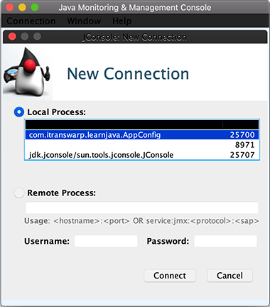
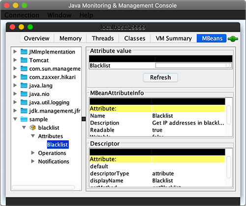
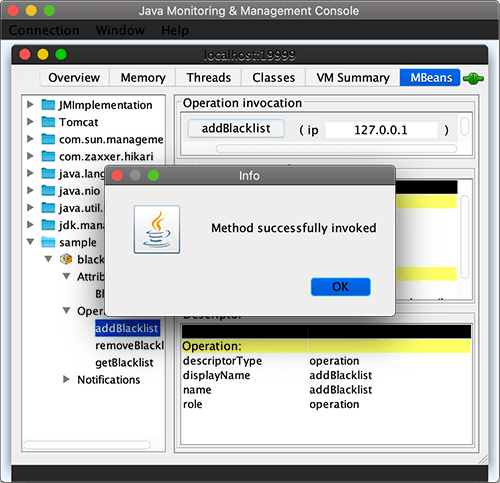

# 集成第三方组件

Spring框架不仅提供了标准的IoC容器、AOP支持、数据库访问以及WebMVC等标准功能，还可以非常方便地集成许多常用的第三方组件：

- 可以集成JavaMail发送邮件；
- 可以集成JMS消息服务；
- 可以集成Quartz实现定时任务；
- 可以集成Redis等服务。

本章我们介绍如何在Spring中简单快捷地集成这些第三方组件。

## 集成JavaMail

我们在[发送Email](https://www.liaoxuefeng.com/wiki/1252599548343744/1319099923693601)和[接收Email](https://www.liaoxuefeng.com/wiki/1252599548343744/1319099948859426)中已经介绍了如何通过JavaMail来收发电子邮件。在Spring中，同样可以集成JavaMail。

因为在服务器端，主要以发送邮件为主，例如在注册成功、登录时、购物付款后通知用户，基本上不会遇到接收用户邮件的情况，所以本节我们只讨论如何在Spring中发送邮件。

在Spring中，发送邮件最终也是需要JavaMail，Spring只对JavaMail做了一点简单的封装，目的是简化代码。为了在Spring中集成JavaMail，我们在`pom.xml`中添加以下依赖：

- org.springframework:spring-context-support:5.2.0.RELEASE
- javax.mail:javax.mail-api:1.6.2
- com.sun.mail:javax.mail:1.6.2

以及其他Web相关依赖。

我们希望用户在注册成功后能收到注册邮件，为此，我们先定义一个`JavaMailSender`的Bean：
```java
@Bean
JavaMailSender createJavaMailSender(
        // smtp.properties:
        @Value("${smtp.host}") String host,
        @Value("${smtp.port}") int port,
        @Value("${smtp.auth}") String auth,
        @Value("${smtp.username}") String username,
        @Value("${smtp.password}") String password,
        @Value("${smtp.debug:true}") String debug)
{
    var mailSender = new JavaMailSenderImpl();
    mailSender.setHost(host);
    mailSender.setPort(port);
    mailSender.setUsername(username);
    mailSender.setPassword(password);
    Properties props = mailSender.getJavaMailProperties();
    props.put("mail.transport.protocol", "smtp");
    props.put("mail.smtp.auth", auth);
    if (port == 587) {
        props.put("mail.smtp.starttls.enable", "true");
    }
    if (port == 465) {
        props.put("mail.smtp.socketFactory.port", "465");
        props.put("mail.smtp.socketFactory.class", "javax.net.ssl.SSLSocketFactory");
    }
    props.put("mail.debug", debug);
    return mailSender;
}
```
这个`JavaMailSender`接口的实现类是`JavaMailSenderImpl`，初始化时，传入的参数与JavaMail是完全一致的。

另外注意到需要注入的属性是从`smtp.properties`中读取的，因此，`AppConfig`导入的就不止一个`.properties`文件，可以导入多个：
```java
@Configuration
@ComponentScan
@EnableWebMvc
@EnableTransactionManagement
@PropertySource({ "classpath:/jdbc.properties", "classpath:/smtp.properties" })
public class AppConfig {
    ...
}
```
下一步是封装一个`MailService`，并定义`sendRegistrationMail()`方法：
```java
@Component
public class MailService {
    @Value("${smtp.from}")
    String from;

    @Autowired
    JavaMailSender mailSender;

    public void sendRegistrationMail(User user) {
        try {
            MimeMessage mimeMessage = mailSender.createMimeMessage();
            MimeMessageHelper helper = new MimeMessageHelper(mimeMessage, "utf-8");
            helper.setFrom(from);
            helper.setTo(user.getEmail());
            helper.setSubject("Welcome to Java course!");
            String html = String.format("<p>Hi, %s,</p><p>Welcome to Java course!</p><p>Sent at %s</p>", user.getName(), LocalDateTime.now());
            helper.setText(html, true);
            mailSender.send(mimeMessage);
        } catch (MessagingException e) {
            throw new RuntimeException(e);
        }
    }
}
```
观察上述代码，`MimeMessage`是JavaMail的邮件对象，而`MimeMessageHelper`是Spring提供的用于简化设置MimeMessage的类，比如我们设置HTML邮件就可以直接调用`setText(String text, boolean html)`方法，而不必再调用比较繁琐的JavaMail接口方法。

最后一步是调用`JavaMailSender.send()`方法把邮件发送出去。

在MVC的某个Controller方法中，当用户注册成功后，我们就启动一个新线程来异步发送邮件：
```java
User user = userService.register(email, password, name);
logger.info("user registered: {}", user.getEmail());
// send registration mail:
new Thread(() -> {
    mailService.sendRegistrationMail(user);
}).start();
```
因为发送邮件是一种耗时的任务，从几秒到几分钟不等，因此，异步发送是保证页面能快速显示的必要措施。这里我们直接启动了一个新的线程，但实际上还有更优化的方法，我们在下一节讨论。

### 小结

Spring可以集成JavaMail，通过简单的封装，能简化邮件发送代码。其核心是定义一个`JavaMailSender`的Bean，然后调用其`send()`方法。

## 集成JMS

JMS即Java Message Service，是JavaEE的消息服务接口。JMS主要有两个版本：1.1和2.0。2.0和1.1相比，主要是简化了收发消息的代码。

所谓消息服务，就是两个进程之间，通过消息服务器传递消息：
```

┌────────┐    ┌──────────────┐    ┌────────┐
│Producer│───>│Message Server│───>│Consumer│
└────────┘    └──────────────┘    └────────┘
```
使用消息服务，而不是直接调用对方的API，它的好处是：

- 双方各自无需知晓对方的存在，消息可以异步处理，因为消息服务器会在Consumer离线的时候自动缓存消息；
- 如果Producer发送的消息频率高于Consumer的处理能力，消息可以积压在消息服务器，不至于压垮Consumer；
- 通过一个消息服务器，可以连接多个Producer和多个Consumer。

因为消息服务在各类应用程序中非常有用，所以JavaEE专门定义了JMS规范。注意到JMS是一组接口定义，如果我们要使用JMS，还需要选择一个具体的JMS产品。常用的JMS服务器有开源的[ActiveMQ](https://activemq.apache.org/)，商业服务器如WebLogic、WebSphere等也内置了JMS支持。这里我们选择开源的ActiveMQ作为JMS服务器，因此，在开发JMS之前我们必须首先安装ActiveMQ。

现在问题来了：从官网下载ActiveMQ时，蹦出一个页面，让我们选择ActiveMQ Classic或者ActiveMQ Artemis，这两个是什么关系，又有什么区别？

实际上ActiveMQ Classic原来就叫ActiveMQ，是Apache开发的基于JMS 1.1的消息服务器，目前稳定版本号是5.x，而ActiveMQ Artemis是由RedHat捐赠的[HornetQ](https://hornetq.jboss.org/)服务器代码的基础上开发的，目前稳定版本号是2.x。和ActiveMQ Classic相比，Artemis版的代码与Classic完全不同，并且，它支持JMS 2.0，使用基于Netty的异步IO，大大提升了性能。此外，Artemis不仅提供了JMS接口，它还提供了AMQP接口，STOMP接口和物联网使用的MQTT接口。选择Artemis，相当于一鱼四吃。

所以，我们这里直接选择ActiveMQ Artemis。从官网[下载](https://activemq.apache.org/components/artemis/download/)最新的2.x版本，解压后设置环境变量`ARTEMIS_HOME`，指向Artemis根目录，例如`C:\Apps\artemis`，然后，把`ARTEMIS_HOME/bin`加入PATH环境变量：

- Windows下添加`%ARTEMIS_HOME%\bin`到Path路径；
- Mac和Linux下添加`$ARTEMIS_HOME/bin`到PATH路径。

Artemis有个很好的设计，就是它把程序和数据完全分离了。我们解压后的`ARTEMIS_HOME`目录是程序目录，要启动一个Artemis服务，还需要创建一个数据目录。我们把数据目录直接设定在项目`spring-integration-jms`的`jms-data`目录下。执行命令`artemis create jms-data`：
```bash
$ pwd
/Users/liaoxuefeng/workspace/spring-integration-jms

$ artemis create jms-data
Creating ActiveMQ Artemis instance at: /Users/liaoxuefeng/workspace/spring-integration-jms/jms-data

--user: is a mandatory property!
Please provide the default username:
admin

--password: is mandatory with this configuration:
Please provide the default password:
********

--allow-anonymous | --require-login: is a mandatory property!
Allow anonymous access?, valid values are Y,N,True,False
N

Auto tuning journal ...
done! Your system can make 0.09 writes per millisecond, your journal-buffer-timeout will be 11392000

You can now start the broker by executing:  

   "/Users/liaoxuefeng/workspace/spring-integration-jms/jms-data/bin/artemis" run

Or you can run the broker in the background using:

   "/Users/liaoxuefeng/workspace/spring-integration-jms/jms-data/bin/artemis-service" start
```
在创建过程中，会要求输入连接用户和口令，这里我们设定`admin`和`password`，以及是否允许匿名访问（这里选择`N`）。

此数据目录`jms-data`不仅包含消息数据、日志，还自动创建了两个启动服务的命令`bin/artemis`和`bin/artemis-service`，前者在前台启动运行，按Ctrl+C结束，后者会一直在后台运行。

我们把目录切换到`jms-data/bin`，直接运行`artemis run`即可启动Artemis服务：
```bash
$ ./artemis run
     _        _               _
    / \  ____| |_  ___ __  __(_) _____
   / _ \|  _ \ __|/ _ \  \/  | |/  __/
  / ___ \ | \/ |_/  __/ |\/| | |\___ \
 /_/   \_\|   \__\____|_|  |_|_|/___ /
 Apache ActiveMQ Artemis 2.13.0

...

2020-06-02 07:50:21,718 INFO  [org.apache.activemq.artemis] AMQ241001: HTTP Server started at http://localhost:8161
2020-06-02 07:50:21,718 INFO  [org.apache.activemq.artemis] AMQ241002: Artemis Jolokia REST API available at http://localhost:8161/console/jolokia
2020-06-02 07:50:21,719 INFO  [org.apache.activemq.artemis] AMQ241004: Artemis Console available at http://localhost:8161/console
```
启动成功后，Artemis提示可以通过URL`http://localhost:8161/console`访问管理后台。注意_不要关闭命令行窗口_。

在编写JMS代码之前，我们首先得理解JMS的消息模型。JMS把生产消息的一方称为Producer，处理消息的一方称为Consumer。有两种类型的消息通道，一种是Queue：
```

┌────────┐    ┌────────┐    ┌────────┐
│Producer│───>│ Queue  │───>│Consumer│
└────────┘    └────────┘    └────────┘
```
一种是Topic：
```

                            ┌────────┐
                         ┌─>│Consumer│
                         │  └────────┘
┌────────┐    ┌────────┐ │  ┌────────┐
│Producer│───>│ Topic  │─┼─>│Consumer│
└────────┘    └────────┘ │  └────────┘
                         │  ┌────────┐
                         └─>│Consumer│
                            └────────┘
```
它们的区别在于，Queue是一种一对一的通道，如果Consumer离线无法处理消息时，Queue会把消息存起来，等Consumer再次连接的时候发给它。设定了持久化机制的Queue不会丢失消息。如果有多个Consumer接入同一个Queue，那么它们等效于以集群方式处理消息，例如，发送方发送的消息是A，B，C，D，E，F，两个Consumer可能分别收到A，C，E和B，D，F，即每个消息只会交给其中一个Consumer处理。

Topic则是一种一对多通道。一个Producer发出的消息，会被多个Consumer同时收到，即每个Consumer都会收到一份完整的消息流。那么问题来了：如果某个Consumer暂时离线，过一段时间后又上线了，那么在它离线期间产生的消息还能不能收到呢？

这取决于消息服务器对Topic类型消息的持久化机制。如果消息服务器不存储Topic消息，那么离线的Consumer会丢失部分离线时期的消息，如果消息服务器存储了Topic消息，那么离线的Consumer可以收到自上次离线时刻开始后产生的所有消息。JMS规范通过Consumer指定一个持久化订阅可以在上线后收取所有离线期间的消息，如果指定的是非持久化订阅，那么离线期间的消息会全部丢失。

细心的童鞋可以看出来，如果一个Topic的消息全部都持久化了，并且只有一个Consumer，那么它和Queue其实是一样的。实际上，很多消息服务器内部都只有Topic类型的消息架构，Queue可以通过Topic“模拟”出来。

无论是Queue还是Topic，对Producer没有什么要求。多个Producer也可以写入同一个Queue或者Topic，此时消息服务器内部会自动排序确保消息总是有序的。

以上是消息服务的基本模型。具体到某个消息服务器时，Producer和Consumer通常是通过TCP连接消息服务器，在编写JMS程序时，又会遇到`ConnectionFactory`、`Connection`、`Session`等概念，其实这和JDBC连接是类似的：

- ConnectionFactory：代表一个到消息服务器的连接池，类似JDBC的DataSource；
- Connection：代表一个到消息服务器的连接，类似JDBC的Connection；
- Session：代表一个经过认证后的连接会话；
- Message：代表一个消息对象。

在JMS 1.1中，发送消息的典型代码如下：
```java
try {
    Connection connection = null;
    try {
        // 创建连接:
        connection = connectionFactory.createConnection();
        // 创建会话:
        Session session = connection.createSession(false,Session.AUTO_ACKNOWLEDGE);
        // 创建一个Producer并关联到某个Queue:
        MessageProducer messageProducer = session.createProducer(queue);
        // 创建一个文本消息:
        TextMessage textMessage = session.createTextMessage(text);
        // 发送消息:
        messageProducer.send(textMessage);
    } finally {
        // 关闭连接:
        if (connection != null) {
            connection.close();
        }
    }
} catch (JMSException ex) {
    // 处理JMS异常
}
```
JMS 2.0改进了一些API接口，发送消息变得更简单：
```java
try (JMSContext context = connectionFactory.createContext()) {
    context.createProducer().send(queue, text);
}
```
`JMSContext`实现了`AutoCloseable`接口，可以使用`try(resource)`语法，代码更简单。

有了以上预备知识，我们就可以开始开发JMS应用了。

首先，我们在`pom.xml`中添加如下依赖：

- org.springframework:spring-jms:5.2.0.RELEASE
- javax.jms:javax.jms-api:2.0.1
- org.apache.activemq:artemis-jms-client:2.13.0
- io.netty:netty-handler-proxy:4.1.45.Final

在AppConfig中，通过`@EnableJms`让Spring自动扫描JMS相关的Bean，并加载JMS配置文件`jms.properties`：
```java
@Configuration
@ComponentScan
@EnableWebMvc
@EnableJms // 启用JMS
@EnableTransactionManagement
@PropertySource({ "classpath:/jdbc.properties", "classpath:/jms.properties" })
public class AppConfig {
    ...
}
```
首先要创建的Bean是ConnectionFactory，即连接消息服务器的连接池：
```java
@Bean
ConnectionFactory createJMSConnectionFactory(
    @Value("${jms.uri:tcp://localhost:61616}") String uri,
    @Value("${jms.username:admin}") String username,
    @Value("${jms.password:password}") String password)
{
    return new ActiveMQJMSConnectionFactory(uri, username, password);
}
```
因为我们使用的消息服务器是ActiveMQ Artemis，所以`ConnectionFactory`的实现类就是消息服务器提供的`ActiveMQJMSConnectionFactory`，它需要的参数均由配置文件读取后传入，并设置了默认值。

我们再创建一个`JmsTemplate`，它是Spring提供的一个工具类，和`JdbcTemplate`类似，可以简化发送消息的代码：
```java
@Bean
JmsTemplate createJmsTemplate(@Autowired ConnectionFactory connectionFactory) {
    return new JmsTemplate(connectionFactory);
}
```
下一步要创建的是`JmsListenerContainerFactory`，
```java
@Bean("jmsListenerContainerFactory")
DefaultJmsListenerContainerFactory createJmsListenerContainerFactory(@Autowired ConnectionFactory connectionFactory) {
    var factory = new DefaultJmsListenerContainerFactory();
    factory.setConnectionFactory(connectionFactory);
    return factory;
}
```
除了必须指定Bean的名称为`jmsListenerContainerFactory`外，这个Bean的作用是处理和Consumer相关的Bean。我们先跳过它的原理，继续编写`MessagingService`来发送消息：
```java
@Component
public class MessagingService {
    @Autowired ObjectMapper objectMapper;
    @Autowired JmsTemplate jmsTemplate;

    public void sendMailMessage(MailMessage msg) throws Exception {
        String text = objectMapper.writeValueAsString(msg);
        jmsTemplate.send("jms/queue/mail", new MessageCreator() {
            public Message createMessage(Session session) throws JMSException {
                return session.createTextMessage(text);
            }
        });
    }
}
```
JMS的消息类型支持以下几种：

- TextMessage：文本消息；
- BytesMessage：二进制消息；
- MapMessage：包含多个Key-Value对的消息；
- ObjectMessage：直接序列化Java对象的消息；
- StreamMessage：一个包含基本类型序列的消息。

最常用的是发送基于JSON的文本消息，上述代码通过`JmsTemplate`创建一个`TextMessage`并发送到名称为`jms/queue/mail`的Queue。

注意：Artemis消息服务器默认配置下会自动创建Queue，因此不必手动创建一个名为`jms/queue/mail`的Queue，但不是所有的消息服务器都会自动创建Queue，生产环境的消息服务器通常会关闭自动创建功能，需要手动创建Queue。

再注意到`MailMessage`是我们自己定义的一个JavaBean，真正的JMS消息是创建的`TextMessage`，它的内容是JSON。

当用户注册成功后，我们就调用`MessagingService.sendMailMessage()`发送一条JMS消息，此代码十分简单，这里不再贴出。

下面我们要详细讨论的是如何处理消息，即编写Consumer。从理论上讲，可以创建另一个Java进程来处理消息，但对于我们这个简单的Web程序来说没有必要，直接在同一个Web应用中接收并处理消息即可。

处理消息的核心代码是编写一个Bean，并在处理方法上标注`@JmsListener`：
```java
@Component
public class MailMessageListener {
    final Logger logger = LoggerFactory.getLogger(getClass());

    @Autowired ObjectMapper objectMapper;
    @Autowired MailService mailService;

    @JmsListener(destination = "jms/queue/mail", concurrency = "10")
    public void onMailMessageReceived(Message message) throws Exception {
        logger.info("received message: " + message);
        if (message instanceof TextMessage) {
            String text = ((TextMessage) message).getText();
            MailMessage mm = objectMapper.readValue(text, MailMessage.class);
            mailService.sendRegistrationMail(mm);
        } else {
            logger.error("unable to process non-text message!");
        }
    }
}
```
注意到`@JmsListener`指定了Queue的名称，因此，凡是发到此Queue的消息都会被这个`onMailMessageReceived()`方法处理，方法参数是JMS的`Message`接口，我们通过强制转型为`TextMessage`并提取JSON，反序列化后获得自定义的JavaBean，也就获得了发送邮件所需的所有信息。

下面问题来了：Spring处理JMS消息的流程是什么？

如果我们直接调用JMS的API来处理消息，那么编写的代码大致如下：
```java
// 创建JMS连接:
Connection connection = connectionFactory.createConnection();
// 创建会话:
Session session = connection.createSession(false, Session.AUTO_ACKNOWLEDGE);
// 创建一个Consumer:
MessageConsumer consumer = session.createConsumer(queue);
// 为Consumer指定一个消息处理器:
consumer.setMessageListener(new MessageListener() { 
    public void onMessage(Message message) {
        // 在此处理消息... 
    }
});
// 启动接收消息的循环:
connection.start();
```
我们自己编写的`MailMessageListener.onMailMessageReceived()`相当于消息处理器：
```java
consumer.setMessageListener(new MessageListener() { 
    public void onMessage(Message message) {
        mailMessageListener.onMailMessageReceived(message); 
    }
});
```
所以，Spring根据`AppConfig`的注解`@EnableJms`自动扫描带有`@JmsListener`的Bean方法，并为其创建一个`MessageListener`把它包装起来。

注意到前面我们还创建了一个`JmsListenerContainerFactory`的Bean，它的作用就是为每个`MessageListener`创建`MessageConsumer`并启动消息接收循环。

再注意到`@JmsListener`还有一个`concurrency`参数，10表示可以最多同时并发处理10个消息，`5-10`表示并发处理的线程可以在5~10之间调整。

因此，Spring在通过`MessageListener`接收到消息后，并不是直接调用`mailMessageListener.onMailMessageReceived()`，而是用线程池调用，因此，要时刻牢记，`onMailMessageReceived()`方法可能被多线程并发执行，一定要保证线程安全。

我们总结一下Spring接收消息的步骤：

通过`JmsListenerContainerFactory`配合`@EnableJms`扫描所有`@JmsListener`方法，自动创建`MessageConsumer`、`MessageListener`以及线程池，启动消息循环接收处理消息，最终由我们自己编写的`@JmsListener`方法处理消息，可能会由多线程同时并发处理。

要验证消息发送和处理，我们注册一个新用户，可以看到如下日志输出：
```java
2020-06-02 08:04:27 INFO  c.i.learnjava.web.UserController - user registered: bob@example.com
2020-06-02 08:04:27 INFO  c.i.l.service.MailMessageListener - received message: ActiveMQMessage[ID:9fc5...]:PERSISTENT/ClientMessageImpl[messageID=983, durable=true, address=jms/queue/mail, ...]]
2020-06-02 08:04:27 INFO  c.i.learnjava.service.MailService - [send mail] sending registration mail to bob@example.com...
2020-06-02 08:04:30 INFO  c.i.learnjava.service.MailService - [send mail] registration mail was sent to bob@example.com.
```
可见，消息被成功发送到Artemis，然后在很短的时间内被接收处理了。

使用消息服务对发送Email进行改造的好处是，发送Email的能力通常是有限的，通过JMS消息服务，如果短时间内需要给大量用户发送Email，可以先把消息堆积在JMS服务器上慢慢发送，对于批量发送邮件、短信等尤其有用。

### 小结

JMS是Java消息服务，可以通过JMS服务器实现消息的异步处理。

消息服务主要解决Producer和Consumer生产和处理速度不匹配的问题。

## 使用Scheduler

在很多应用程序中，经常需要执行定时任务。例如，每天或每月给用户发送账户汇总报表，定期检查并发送系统状态报告，等等。

定时任务我们在[使用线程池](https://www.liaoxuefeng.com/wiki/1252599548343744/1306581130018849)一节中已经讲到了，Java标准库本身就提供了定时执行任务的功能。在Spring中，使用定时任务更简单，不需要手写线程池相关代码，只需要两个注解即可。

我们还是以实际代码为例，建立工程`spring-integration-schedule`，无需额外的依赖，我们可以直接在`AppConfig`中加上`@EnableScheduling`就开启了定时任务的支持：
```java
@Configuration
@ComponentScan
@EnableWebMvc
@EnableScheduling
@EnableTransactionManagement
@PropertySource({ "classpath:/jdbc.properties", "classpath:/task.properties" })
public class AppConfig {
    ...
}
```
接下来，我们可以直接在一个Bean中编写一个`public void`无参数方法，然后加上`@Scheduled`注解：
```java
@Component
public class TaskService {
    final Logger logger = LoggerFactory.getLogger(getClass());

    @Scheduled(initialDelay = 60_000, fixedRate = 60_000)
    public void checkSystemStatusEveryMinute() {
        logger.info("Start check system status...");
    }
}
```
上述注解指定了启动延迟60秒，并以60秒的间隔执行任务。现在，我们直接运行应用程序，就可以在控制台看到定时任务打印的日志：
```java
2020-06-03 18:47:32 INFO  [pool-1-thread-1] c.i.learnjava.service.TaskService - Start check system status...
2020-06-03 18:48:32 INFO  [pool-1-thread-1] c.i.learnjava.service.TaskService - Start check system status...
2020-06-03 18:49:32 INFO  [pool-1-thread-1] c.i.learnjava.service.TaskService - Start check system status...
```
如果没有看到定时任务的日志，需要检查：

- 是否忘记了在`AppConfig`中标注`@EnableScheduling`；
- 是否忘记了在定时任务的方法所在的class标注`@Component`。

除了可以使用`fixedRate`外，还可以使用`fixedDelay`，两者的区别我们已经在[使用线程池](https://www.liaoxuefeng.com/wiki/1252599548343744/1306581130018849)一节中讲过，这里不再重复。

有的童鞋在实际开发中会遇到一个问题，因为Java的注解全部是常量，写死了`fixedDelay=30000`，如果根据实际情况要改成60秒怎么办，只能重新编译？

我们可以把定时任务的配置放到配置文件中，例如`task.properties`：
```properties
task.checkDiskSpace=30000
```
这样就可以随时修改配置文件而无需动代码。但是在代码中，我们需要用`fixedDelayString`取代`fixedDelay`：
```java
@Component
public class TaskService {
    ...

    @Scheduled(initialDelay = 30_000, fixedDelayString = "${task.checkDiskSpace:30000}")
    public void checkDiskSpaceEveryMinute() {
        logger.info("Start check disk space...");
    }
}
```
注意到上述代码的注解参数`fixedDelayString`是一个属性占位符，并配有默认值30000，Spring在处理`@Scheduled`注解时，如果遇到`String`，会根据占位符自动用配置项替换，这样就可以灵活地修改定时任务的配置。

此外，`fixedDelayString`还可以使用更易读的`Duration`，例如：
```java
@Scheduled(initialDelay = 30_000, fixedDelayString = "${task.checkDiskSpace:PT2M30S}")
```
以字符串`PT2M30S`表示的`Duration`就是2分30秒，请参考[LocalDateTime](https://www.liaoxuefeng.com/wiki/1252599548343744/1303871087444002)一节的Duration相关部分。

多个`@Scheduled`方法完全可以放到一个Bean中，这样便于统一管理各类定时任务。

### 使用Cron任务

还有一类定时任务，它不是简单的重复执行，而是按时间触发，我们把这类任务称为Cron任务，例如：

- 每天凌晨2:15执行报表任务；
- 每个工作日12:00执行特定任务；
- ……

Cron源自Unix/Linux系统自带的crond守护进程，以一个简洁的表达式定义任务触发时间。在Spring中，也可以使用Cron表达式来执行Cron任务，在Spring中，它的格式是：
```
秒 分 小时 天 月份 星期 年
```
年是可以忽略的，通常不写。每天凌晨2:15执行的Cron表达式就是：
```
0 15 2 * * *
```
每个工作日12:00执行的Cron表达式就是：
```
0 0 12 * * MON-FRI
```
每个月1号，2号，3号和10号12:00执行的Cron表达式就是：
```
0 0 12 1-3,10 * *
```
在Spring中，我们定义一个每天凌晨2:15执行的任务：
```java
@Component
public class TaskService {
    ...

    @Scheduled(cron = "${task.report:0 15 2 * * *}")
    public void cronDailyReport() {
        logger.info("Start daily report task...");
    }
}
```
Cron任务同样可以使用属性占位符，这样修改起来更加方便。

Cron表达式还可以表达每10分钟执行，例如：
```
0 */10 * * * *
```
这样，在每个小时的0:00，10:00，20:00，30:00，40:00，50:00均会执行任务，实际上它可以取代`fixedRate`类型的定时任务。

### 集成Quartz

在Spring中使用定时任务和Cron任务都十分简单，但是要注意到，这些任务的调度都是在每个JVM进程中的。如果在本机启动两个进程，或者在多台机器上启动应用，这些进程的定时任务和Cron任务都是独立运行的，互不影响。

如果一些定时任务要以集群的方式运行，例如每天23:00执行检查任务，只需要集群中的一台运行即可，这个时候，可以考虑使用[Quartz](https://www.quartz-scheduler.org/)。

Quartz可以配置一个JDBC数据源，以便存储所有的任务调度计划以及任务执行状态。也可以使用内存来调度任务，但这样配置就和使用Spring的调度没啥区别了，额外集成Quartz的意义就不大。

Quartz的JDBC配置比较复杂，Spring对其也有一定的支持。要详细了解Quartz的集成，请参考[Spring的文档](https://docs.spring.io/spring/docs/current/spring-framework-reference/integration.html#scheduling-quartz)。

思考：如果不使用Quartz的JDBC配置，多个Spring应用同时运行时，如何保证某个任务只在某一台机器执行？

### 小结

Spring内置定时任务和Cron任务的支持，编写调度任务十分方便。

## 集成JMX

在Spring中，可以方便地集成JMX。

那么第一个问题来了：什么是JMX？

JMX是Java Management Extensions，它是一个Java平台的管理和监控接口。为什么要搞JMX呢？因为在所有的应用程序中，对运行中的程序进行监控都是非常重要的，Java应用程序也不例外。我们肯定希望知道Java应用程序当前的状态，例如，占用了多少内存，分配了多少内存，当前有多少活动线程，有多少休眠线程等等。如何获取这些信息呢？

为了标准化管理和监控，Java平台使用JMX作为管理和监控的标准接口，任何程序，只要按JMX规范访问这个接口，就可以获取所有管理与监控信息。

实际上，常用的运维监控如Zabbix、Nagios等工具对JVM本身的监控都是通过JMX获取的信息。

因为JMX是一个标准接口，不但可以用于管理JVM，还可以管理应用程序自身。下图是JMX的架构：
```

    ┌─────────┐  ┌─────────┐
    │jconsole │  │   Web   │
    └─────────┘  └─────────┘
         │            │
┌ ─ ─ ─ ─│─ ─ ─ ─ ─ ─ ┼ ─ ─ ─ ─
 JVM     ▼            ▼        │
│   ┌─────────┐  ┌─────────┐
  ┌─┤Connector├──┤ Adaptor ├─┐ │
│ │ └─────────┘  └─────────┘ │
  │       MBeanServer        │ │
│ │ ┌──────┐┌──────┐┌──────┐ │
  └─┤MBean1├┤MBean2├┤MBean3├─┘ │
│   └──────┘└──────┘└──────┘
 ─ ─ ─ ─ ─ ─ ─ ─ ─ ─ ─ ─ ─ ─ ─ ┘
```
JMX把所有被管理的资源都称为MBean（Managed Bean），这些MBean全部由MBeanServer管理，如果要访问MBean，可以通过MBeanServer对外提供的访问接口，例如通过RMI或HTTP访问。

注意到使用JMX不需要安装任何额外组件，也不需要第三方库，因为MBeanServer已经内置在JavaSE标准库中了。JavaSE还提供了一个jconsole程序，用于通过RMI连接到MBeanServer，这样就可以管理整个Java进程。

除了JVM会把自身的各种资源以MBean注册到JMX中，我们自己的配置、监控信息也可以作为MBean注册到JMX，这样，管理程序就可以直接控制我们暴露的MBean。因此，应用程序使用JMX，只需要两步：

1. 编写MBean提供管理接口和监控数据；
2. 注册MBean。

在Spring应用程序中，使用JMX只需要一步：

1. 编写MBean提供管理接口和监控数据。

第二步注册的过程由Spring自动完成。我们以实际工程为例，首先在`AppConfig`中加上`@EnableMBeanExport`注解，告诉Spring自动注册MBean：
```java
@Configuration
@ComponentScan
@EnableWebMvc
@EnableMBeanExport // 自动注册MBean
@EnableTransactionManagement
@PropertySource({ "classpath:/jdbc.properties" })
public class AppConfig {
    ...
}
```
剩下的全部工作就是编写MBean。我们以实际问题为例，假设我们希望给应用程序添加一个IP黑名单功能，凡是在黑名单中的IP禁止访问，传统的做法是定义一个配置文件，启动的时候读取：
```bash
## blacklist.txt
1.2.3.4
5.6.7.8
2.2.3.4
...
```
如果要修改黑名单怎么办？修改配置文件，然后重启应用程序。

但是每次都重启应用程序实在是太麻烦了，能不能不重启应用程序？可以自己写一个定时读取配置文件的功能，检测到文件改动时自动重新读取。

上述需求本质上是在应用程序运行期间对参数、配置等进行热更新并要求尽快生效。如果以JMX的方式实现，我们不必自己编写自动重新读取等任何代码，只需要提供一个符合JMX标准的MBean来存储配置即可。

还是以IP黑名单为例，JMX的MBean通常以MBean结尾，因此我们遵循标准命名规范，首先编写一个`BlacklistMBean`：
```java
public class BlacklistMBean {
    private Set<String> ips = new HashSet<>();

    public String[] getBlacklist() {
        return ips.toArray(String[]::new);
    }

    public void addBlacklist(String ip) {
        ips.add(ip);
    }

    public void removeBlacklist(String ip) {
        ips.remove(ip);
    }

    public boolean shouldBlock(String ip) {
        return ips.contains(ip);
    }
}
```
这个MBean没什么特殊的，它的逻辑和普通Java类没有任何区别。

下一步，我们要使用JMX的客户端来实时热更新这个MBean，所以要给它加上一些注解，让Spring能根据注解自动把相关方法注册到MBeanServer中：
```java
@Component
@ManagedResource(objectName = "sample:name=blacklist", description = "Blacklist of IP addresses")
public class BlacklistMBean {
    private Set<String> ips = new HashSet<>();

    @ManagedAttribute(description = "Get IP addresses in blacklist")
    public String[] getBlacklist() {
        return ips.toArray(String[]::new);
    }

    @ManagedOperation
    @ManagedOperationParameter(name = "ip", description = "Target IP address that will be added to blacklist")
    public void addBlacklist(String ip) {
        ips.add(ip);
    }

    @ManagedOperation
    @ManagedOperationParameter(name = "ip", description = "Target IP address that will be removed from blacklist")
    public void removeBlacklist(String ip) {
        ips.remove(ip);
    }

    public boolean shouldBlock(String ip) {
        return ips.contains(ip);
    }
}
```
观察上述代码，`BlacklistMBean`首先是一个标准的Spring管理的Bean，其次，添加了`@ManagedResource`表示这是一个MBean，将要被注册到JMX。objectName指定了这个MBean的名字，通常以`company:name=Xxx`来分类MBean。

对于属性，使用`@ManagedAttribute`注解标注。上述MBean只有get属性，没有set属性，说明这是一个只读属性。

对于操作，使用`@ManagedOperation`注解标准。上述MBean定义了两个操作：`addBlacklist()`和`removeBlacklist()`，其他方法如`shouldBlock()`不会被暴露给JMX。

使用MBean和普通Bean是完全一样的。例如，我们在`BlacklistInterceptor`对IP进行黑名单拦截：
```java
@Order(1)
@Component
public class BlacklistInterceptor implements HandlerInterceptor {
    final Logger logger = LoggerFactory.getLogger(getClass());

    @Autowired
    BlacklistMBean blacklistMBean;

    @Override
    public boolean preHandle(HttpServletRequest request, HttpServletResponse response, Object handler)
            throws Exception {
        String ip = request.getRemoteAddr();
        logger.info("check ip address {}...", ip);
        // 是否在黑名单中:
        if (blacklistMBean.shouldBlock(ip)) {
            logger.warn("will block ip {} for it is in blacklist.", ip);
            // 发送403错误响应:
            response.sendError(403);
            return false;
        }
        return true;
    }
}
```
下一步就是正常启动Web应用程序，不要关闭它，我们打开另一个命令行窗口，输入`jconsole`启动JavaSE自带的一个JMX客户端程序：



通过jconsole连接到一个Java进程最简单的方法是直接在Local Process中找到正在运行的`AppConfig`，点击Connect即可连接到我们当前正在运行的Web应用，在jconsole中可直接看到内存、CPU等资源的监控。

我们点击MBean，左侧按分类列出所有MBean，可以在`java.lang`查看内存等信息：


细心的童鞋可以看到HikariCP连接池也是通过JMX监控的。

在`sample`中可以看到我们自己的MBean，点击可查看属性`blacklist`：



点击`Operations-addBlacklist`，可以填入`127.0.0.1`并点击`addBlacklist`按钮，相当于jconsole通过JMX接口，调用了我们自己的`BlacklistMBean`的`addBlacklist()`方法，传入的参数就是填入的`127.0.0.1`：



再次查看属性`blacklist`，可以看到结果已经更新了：


我们可以在浏览器中测试一下黑名单功能是否已生效：


可见，`127.0.0.1`确实被添加到了黑名单，后台日志打印如下：
```java
2020-06-06 20:22:12 INFO  c.i.l.web.BlacklistInterceptor - check ip address 127.0.0.1...
2020-06-06 20:22:12 WARN  c.i.l.web.BlacklistInterceptor - will block ip 127.0.0.1 for it is in blacklist.
```
注意：如果使用IPv6，那么需要把`0:0:0:0:0:0:0:1`这个本机地址加到黑名单。

如果从jconsole中调用`removeBlacklist`移除`127.0.0.1`，刷新浏览器可以看到又允许访问了。

使用jconsole直接通过Local Process连接JVM有个限制，就是jconsole和正在运行的JVM必须在同一台机器。如果要远程连接，首先要打开JMX端口。我们在启动`AppConfig`时，需要传入以下JVM启动参数：

- -Dcom.sun.management.jmxremote.port=19999
- -Dcom.sun.management.jmxremote.authenticate=false
- -Dcom.sun.management.jmxremote.ssl=false

第一个参数表示在19999端口监听JMX连接，第二个和第三个参数表示无需验证，不使用SSL连接，在开发测试阶段比较方便，生产环境必须指定验证方式并启用SSL。详细参数可参考Oracle[官方文档](https://docs.oracle.com/javase/8/docs/technotes/guides/management/agent.html#gdeum)。这样jconsole可以用`ip:19999`的远程方式连接JMX。连接后的操作是完全一样的。

许多JavaEE服务器如JBoss的管理后台都是通过JMX提供管理接口，并由Web方式访问，对用户更加友好。

### 练习

编写一个MBean统计当前注册用户数量，并在jconsole中查看

### 小结

在Spring中使用JMX需要：

- 通过`@EnableMBeanExport`启用自动注册MBean；
- 编写MBean并实现管理属性和管理操作。
