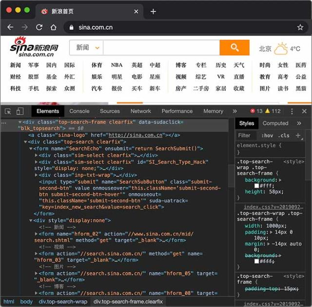
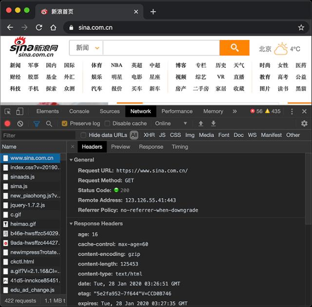
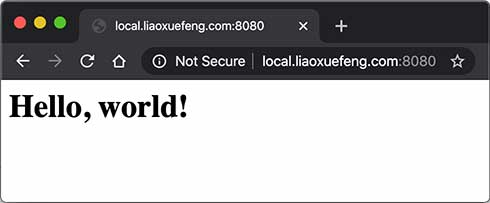

# Web基础

从本章开始，我们就正式进入到JavaEE的领域。

什么是JavaEE？JavaEE是Java Platform Enterprise Edition的缩写，即Java企业平台。我们前面介绍的所有基于标准JDK的开发都是JavaSE，即Java Platform Standard Edition。此外，还有一个小众不太常用的JavaME：Java Platform Micro Edition，是Java移动开发平台（非Android），它们三者关系如下：
```

┌────────────────┐
│     JavaEE     │
│┌──────────────┐│
││    JavaSE    ││
││┌────────────┐││
│││   JavaME   │││
││└────────────┘││
│└──────────────┘│
└────────────────┘
```
JavaME是一个裁剪后的“微型版”JDK，现在使用很少，我们不用管它。JavaEE也不是凭空冒出来的，它实际上是完全基于JavaSE，只是多了一大堆服务器相关的库以及API接口。所有的JavaEE程序，仍然是运行在标准的JavaSE的虚拟机上的。

最早的JavaEE的名称是J2EE：Java 2 Platform Enterprise Edition，后来改名为JavaEE。由于Oracle将JavaEE移交给[Eclipse](https://www.eclipse.org/)开源组织时，不允许他们继续使用Java商标，所以JavaEE再次改名为[Jakarta EE](https://jakarta.ee/)。因为这个拼写比较复杂而且难记，所以我们后面还是用JavaEE这个缩写。

JavaEE并不是一个软件产品，它更多的是一种软件架构和设计思想。我们可以把JavaEE看作是在JavaSE的基础上，开发的一系列基于服务器的组件、API标准和通用架构。

JavaEE最核心的组件就是基于Servlet标准的Web服务器，开发者编写的应用程序是基于Servlet API并运行在Web服务器内部的：
```

┌─────────────┐
│┌───────────┐│
││ User App  ││
│├───────────┤│
││Servlet API││
│└───────────┘│
│ Web Server  │
├─────────────┤
│   JavaSE    │
└─────────────┘
```
此外，JavaEE还有一系列技术标准：

- EJB：Enterprise JavaBean，企业级JavaBean，早期经常用于实现应用程序的业务逻辑，现在基本被轻量级框架如Spring所取代；
- JAAS：Java Authentication and Authorization Service，一个标准的认证和授权服务，常用于企业内部，Web程序通常使用更轻量级的自定义认证；
- JCA：JavaEE Connector Architecture，用于连接企业内部的EIS系统等；
- JMS：Java Message Service，用于消息服务；
- JTA：Java Transaction API，用于分布式事务；
- JAX-WS：Java API for XML Web Services，用于构建基于XML的Web服务；
- ...

目前流行的基于Spring的轻量级JavaEE开发架构，使用最广泛的是Servlet和JMS，以及一系列开源组件。本章我们将详细介绍基于Servlet的Web开发。
今天我们访问网站，使用App时，都是基于Web这种Browser/Server模式，简称BS架构，它的特点是，客户端只需要浏览器，应用程序的逻辑和数据都存储在服务器端。浏览器只需要请求服务器，获取Web页面，并把Web页面展示给用户即可。

Web页面具有极强的交互性。由于Web页面是用HTML编写的，而HTML具备超强的表现力，并且，服务器端升级后，客户端无需任何部署就可以使用到新的版本，因此，BS架构升级非常容易。

## HTTP协议

在Web应用中，浏览器请求一个URL，服务器就把生成的HTML网页发送给浏览器，而浏览器和服务器之间的传输协议是HTTP，所以：

- HTML是一种用来定义网页的文本，会HTML，就可以编写网页；
- HTTP是在网络上传输HTML的协议，用于浏览器和服务器的通信。

HTTP协议是一个基于TCP协议之上的请求-响应协议，它非常简单，我们先使用Chrome浏览器查看新浪首页，然后选择View - Developer - Inspect Elements就可以看到HTML：



切换到Network，重新加载页面，可以看到浏览器发出的每一个请求和响应：



> 使用Chrome浏览器可以方便地调试Web应用程序。

对于Browser来说，请求页面的流程如下：

1. 与服务器建立TCP连接；
2. 发送HTTP请求；
3. 收取HTTP响应，然后把网页在浏览器中显示出来。

浏览器发送的HTTP请求如下：
```
GET / HTTP/1.1
Host: www.sina.com.cn
User-Agent: Mozilla/5.0 xxx
Accept: */*
Accept-Language: zh-CN,zh;q=0.9,en-US;q=0.8
```
其中，第一行表示使用`GET`请求获取路径为/的资源，并使用`HTTP/1.1`协议，从第二行开始，每行都是以`Header: Value`形式表示的HTTP头，比较常用的HTTP Header包括：

- Host: 表示请求的主机名，因为一个服务器上可能运行着多个网站，因此，Host表示浏览器正在请求的域名；
- User-Agent: 标识客户端本身，例如Chrome浏览器的标识类似`Mozilla/5.0 ... Chrome/79`，IE浏览器的标识类似`Mozilla/5.0 (Windows NT ...) like Gecko`；
- Accept：表示浏览器能接收的资源类型，如`text/*`，`image/*`或者`*/*`表示所有；
- Accept-Language：表示浏览器偏好的语言，服务器可以据此返回不同语言的网页；
- Accept-Encoding：表示浏览器可以支持的压缩类型，例如`gzip, deflate, br`。

服务器的响应如下：
```
HTTP/1.1 200 OK
Content-Type: text/html
Content-Length: 21932
Content-Encoding: gzip
Cache-Control: max-age=300

<html>...网页数据...
```
服务器响应的第一行总是版本号+空格+数字+空格+文本，数字表示响应代码，其中`2xx`表示成功，`3xx`表示重定向，`4xx`表示客户端引发的错误，`5xx`表示服务器端引发的错误。数字是给程序识别，文本则是给开发者调试使用的。常见的响应代码有：

- 200 OK：表示成功；
- 301 Moved Permanently：表示该URL已经永久重定向；
- 302 Found：表示该URL需要临时重定向；
- 304 Not Modified：表示该资源没有修改，客户端可以使用本地缓存的版本；
- 400 Bad Request：表示客户端发送了一个错误的请求，例如参数无效；
- 401 Unauthorized：表示客户端因为身份未验证而不允许访问该URL；
- 403 Forbidden：表示服务器因为权限问题拒绝了客户端的请求；
- 404 Not Found：表示客户端请求了一个不存在的资源；
- 500 Internal Server Error：表示服务器处理时内部出错，例如因为无法连接数据库；
- 503 Service Unavailable：表示服务器此刻暂时无法处理请求。

从第二行开始，服务器每一行均返回一个HTTP头。服务器经常返回的HTTP Header包括：

- Content-Type：表示该响应内容的类型，例如`text/html`，`image/jpeg`；
- Content-Length：表示该响应内容的长度（字节数）；
- Content-Encoding：表示该响应压缩算法，例如`gzip`；
- Cache-Control：指示客户端应如何缓存，例如`max-age=300`表示可以最多缓存300秒。

HTTP请求和响应都由HTTP Header和HTTP Body构成，其中HTTP Header每行都以`\r\n`结束。如果遇到两个连续的`\r\n`，那么后面就是HTTP Body。浏览器读取HTTP Body，并根据Header信息中指示的`Content-Type`、`Content-Encoding`等解压后显示网页、图像或其他内容。

通常浏览器获取的第一个资源是HTML网页，在网页中，如果嵌入了JavaScript、CSS、图片、视频等其他资源，浏览器会根据资源的URL再次向服务器请求对应的资源。

关于HTTP协议的详细内容，请参考[HTTP权威指南](https://www.amazon.cn/dp/B00M2DKYRC/)一书，或者[Mozilla开发者网站](https://developer.mozilla.org/zh-CN/docs/Web/HTTP)。

我们在前面介绍的[HTTP编程](https://www.liaoxuefeng.com/wiki/1252599548343744/1319099982413858)是以客户端的身份去请求服务器资源。现在，我们需要以服务器的身份响应客户端请求，编写服务器程序来处理客户端请求通常就称之为Web开发。

## 编写HTTP Server

我们来看一下如何编写HTTP Server。一个HTTP Server本质上是一个TCP服务器，我们先用[TCP编程](https://www.liaoxuefeng.com/wiki/1252599548343744/1305207629676577)的多线程实现的服务器端框架：
```java
public class Server {
    public static void main(String[] args) throws IOException {
        ServerSocket ss = new ServerSocket(8080); // 监听指定端口
        System.out.println("server is running...");
        for (;;) {
            Socket sock = ss.accept();
            System.out.println("connected from " + sock.getRemoteSocketAddress());
            Thread t = new Handler(sock);
            t.start();
        }
    }
}

class Handler extends Thread {
    Socket sock;

    public Handler(Socket sock) {
        this.sock = sock;
    }

    public void run() {
        try (InputStream input = this.sock.getInputStream()) {
            try (OutputStream output = this.sock.getOutputStream()) {
                handle(input, output);
            }
        } catch (Exception e) {
            try {
                this.sock.close();
            } catch (IOException ioe) {
            }
            System.out.println("client disconnected.");
        }
    }

    private void handle(InputStream input, OutputStream output) throws IOException {
        var reader = new BufferedReader(new InputStreamReader(input, StandardCharsets.UTF_8));
        var writer = new BufferedWriter(new OutputStreamWriter(output, StandardCharsets.UTF_8));
        // TODO: 处理HTTP请求
    }
}
```
只需要在`handle()`方法中，用Reader读取HTTP请求，用Writer发送HTTP响应，即可实现一个最简单的HTTP服务器。编写代码如下：
```java
private void handle(InputStream input, OutputStream output) throws IOException {
    System.out.println("Process new http request...");
    var reader = new BufferedReader(new InputStreamReader(input, StandardCharsets.UTF_8));
    var writer = new BufferedWriter(new OutputStreamWriter(output, StandardCharsets.UTF_8));
    // 读取HTTP请求:
    boolean requestOk = false;
    String first = reader.readLine();
    if (first.startsWith("GET / HTTP/1.")) {
        requestOk = true;
    }
    for (;;) {
        String header = reader.readLine();
        if (header.isEmpty()) { // 读取到空行时, HTTP Header读取完毕
            break;
        }
        System.out.println(header);
    }
    System.out.println(requestOk ? "Response OK" : "Response Error");
    if (!requestOk) {
        // 发送错误响应:
        writer.write("HTTP/1.0 404 Not Found\r\n");
        writer.write("Content-Length: 0\r\n");
        writer.write("\r\n");
        writer.flush();
    } else {
        // 发送成功响应:
        String data = "<html><body><h1>Hello, world!</h1></body></html>";
        int length = data.getBytes(StandardCharsets.UTF_8).length;
        writer.write("HTTP/1.0 200 OK\r\n");
        writer.write("Connection: close\r\n");
        writer.write("Content-Type: text/html\r\n");
        writer.write("Content-Length: " + length + "\r\n");
        writer.write("\r\n"); // 空行标识Header和Body的分隔
        writer.write(data);
        writer.flush();
    }
}
```
这里的核心代码是，先读取HTTP请求，这里我们只处理`GET /`的请求。当读取到空行时，表示已读到连续两个`\r\n`，说明请求结束，可以发送响应。发送响应的时候，首先发送响应代码`HTTP/1.0 200 OK`表示一个成功的200响应，使用`HTTP/1.0`协议，然后，依次发送Header，发送完Header后，再发送一个空行标识Header结束，紧接着发送HTTP Body，在浏览器输入`http://local.liaoxuefeng.com:8080/`就可以看到响应页面：



HTTP目前有多个版本，`1.0`是早期版本，浏览器每次建立TCP连接后，只发送一个HTTP请求并接收一个HTTP响应，然后就关闭TCP连接。由于创建TCP连接本身就需要消耗一定的时间，因此，HTTP 1.1允许浏览器和服务器在同一个TCP连接上反复发送、接收多个HTTP请求和响应，这样就大大提高了传输效率。

我们注意到HTTP协议是一个请求-响应协议，它总是发送一个请求，然后接收一个响应。能不能一次性发送多个请求，然后再接收多个响应呢？HTTP 2.0可以支持浏览器同时发出多个请求，但每个请求需要唯一标识，服务器可以不按请求的顺序返回多个响应，由浏览器自己把收到的响应和请求对应起来。可见，HTTP 2.0进一步提高了传输效率，因为浏览器发出一个请求后，不必等待响应，就可以继续发下一个请求。

HTTP 3.0为了进一步提高速度，将抛弃TCP协议，改为使用无需创建连接的UDP协议，目前HTTP 3.0仍然处于实验阶段。

## 小结

使用B/S架构时，总是通过HTTP协议实现通信；

Web开发通常是指开发服务器端的Web应用程序。
