# 堆

## 什么是堆

堆是一种满足以下条件的树：

堆中的每一个节点值都大于等于（或小于等于）子树中所有节点的值。或者说，任意一个节点的值都大于等于（或小于等于）所有子节点的值。

- **堆不一定是完全二叉树**，只是为了方便存储和索引，我们通常用完全二叉树的形式来表示堆，事实上，广为人知的斐波那契堆和二项堆就不是完全二叉树,它们甚至都不是二叉树。
- （二叉）堆是一个数组，它可以被看成是一个 **近似的完全二叉树**。——《算法导论》第三版

大家可以尝试判断下面给出的图是否是堆？

第 1 个和第 2 个是堆。第 1 个是最大堆，每个节点都比子树中所有节点大。第 2 个是最小堆，每个节点都比子树中所有节点小。

第 3 个不是，第三个中，根结点 1 比 2 和 15 小，而 15 却比 3 大，19 比 5 大，不满足堆的性质。

## 堆的用途

当我们只关心所有数据中的最大值或者最小值，存在多次获取最大值或者最小值，多次插入或删除数据时，就可以使用堆。

有小伙伴可能会想到用有序数组，初始化一个有序数组时间复杂度是 `O(nlog(n))`，查找最大值或者最小值时间复杂度都是 `O(1)`，但是，涉及到更新（插入或删除）数据时，时间复杂度为 `O(n)`，即使是使用复杂度为 `O(log(n))` 的二分法找到要插入或者删除的数据，在移动数据时也需要 `O(n)` 的时间复杂度。

**相对于有序数组而言，堆的主要优势在于插入和删除数据效率较高。** 因为堆是基于完全二叉树实现的，所以在插入和删除数据时，只需要在二叉树中上下移动节点，时间复杂度为 `O(log(n))`，相比有序数组的 `O(n)`，效率更高。

不过，需要注意的是：Heap 初始化的时间复杂度为 `O(n)`，而非`O(nlogn)`。

## 堆的分类

堆分为 **最大堆** 和 **最小堆**。二者的区别在于节点的排序方式。
- 最大堆：堆中的每一个节点的值都大于等于子树中所有节点的值
- 最小堆：堆中的每一个节点的值都小于等于子树中所有节点的值

如下图所示，图 1 是最大堆，图 2 是最小堆

## 堆的存储

之前介绍树的时候说过，由于完全二叉树的优秀性质，利用数组存储二叉树即节省空间，又方便索引（若根结点的序号为 1，那么对于树中任意节点 i，其左子节点序号为 `2*i`，右子节点序号为 `2*i+1`）。

为了方便存储和索引，（二叉）堆可以用完全二叉树的形式进行存储。存储的方式如下图所示：

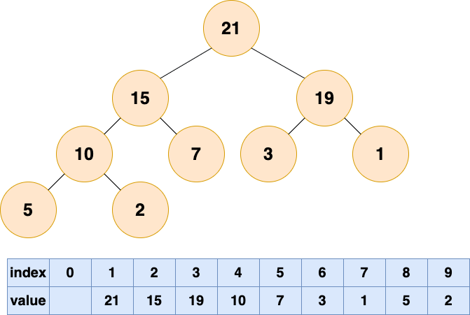

## 堆的操作

堆的更新操作主要包括两种 : **插入元素** 和 **删除堆顶元素**。操作过程需要着重掌握和理解。

### 插入元素

1. 将要插入的元素放到最后

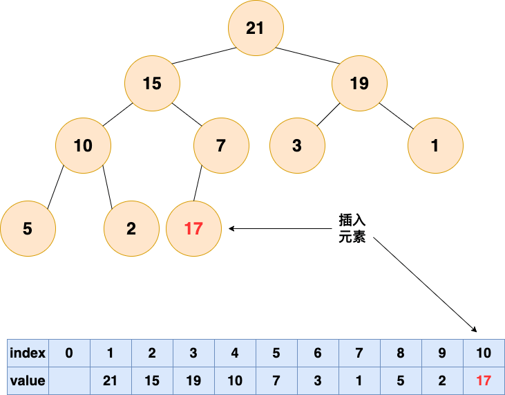

2. 从底向上，如果父结点比该元素小，则该节点和父结点交换，直到无法交换

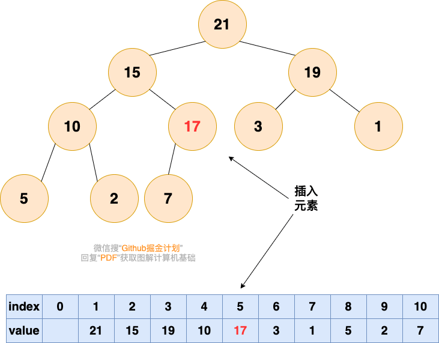
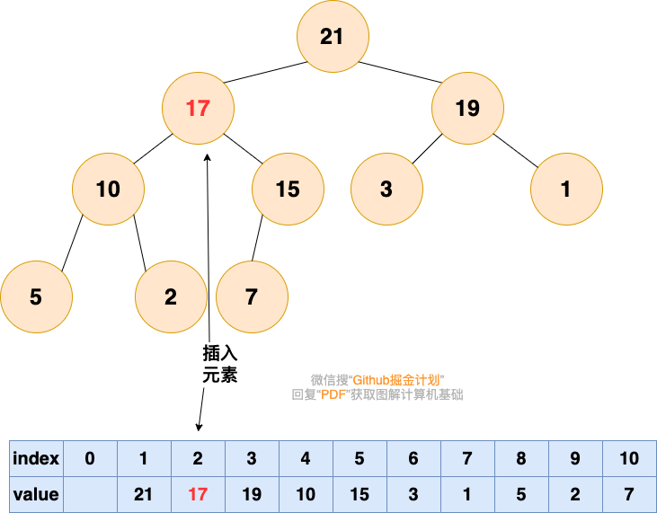

### 删除堆顶元素

根据堆的性质可知，最大堆的堆顶元素为所有元素中最大的，最小堆的堆顶元素是所有元素中最小的。当我们需要多次查找最大元素或者最小元素的时候，可以利用堆来实现。

删除堆顶元素后，为了保持堆的性质，需要对堆的结构进行调整，我们将这个过程称之为"堆化"，堆化的方法分为两种：
- 一种是自底向上的堆化，上述的插入元素所使用的就是自底向上的堆化，元素从最底部向上移动。
- 另一种是自顶向下堆化，元素由最顶部向下移动。

1. 自底向上堆化

首先删除堆顶元素，使得数组中下标为 1 的位置空出。

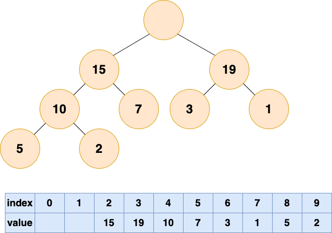

比较根结点的左子节点和右子节点，也就是下标为 2,3 的数组元素，将较大的元素填充到根结点(下标为 1)的位置。

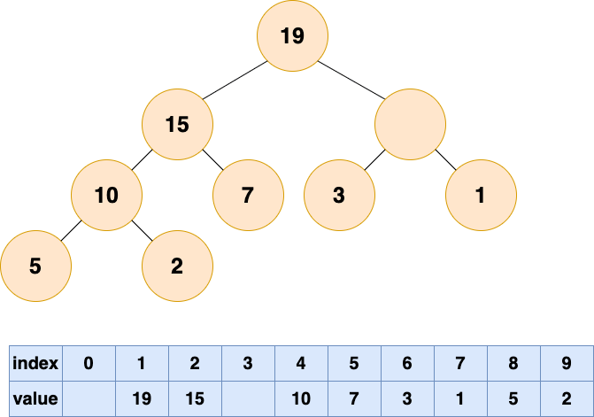

一直循环比较空出位置的左右子节点，并将较大者移至空位，直到堆的最底部

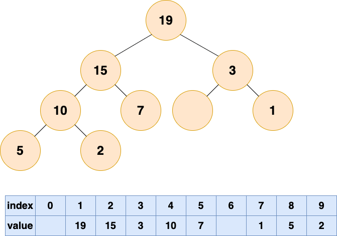

这个时候已经完成了自底向上的堆化，没有元素可以填补空缺了，但是，我们可以看到数组中出现了“气泡”，这会导致存储空间的浪费。接下来我们试试自顶向下堆化。

2. 自顶向下堆化

自顶向下的堆化用一个词形容就是“石沉大海”，那么第一件事情，就是把石头抬起来，从海面扔下去。这个石头就是堆的最后一个元素，我们将最后一个元素移动到堆顶。

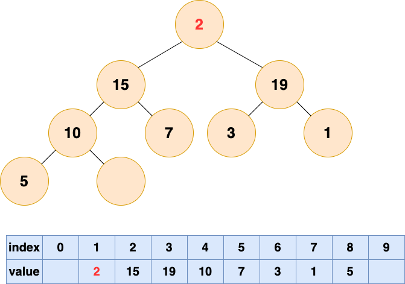

然后开始将这个石头沉入海底，不停与左右子节点的值进行比较，和较大的子节点交换位置，直到无法交换位置。

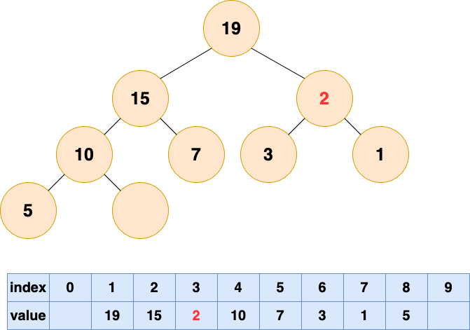
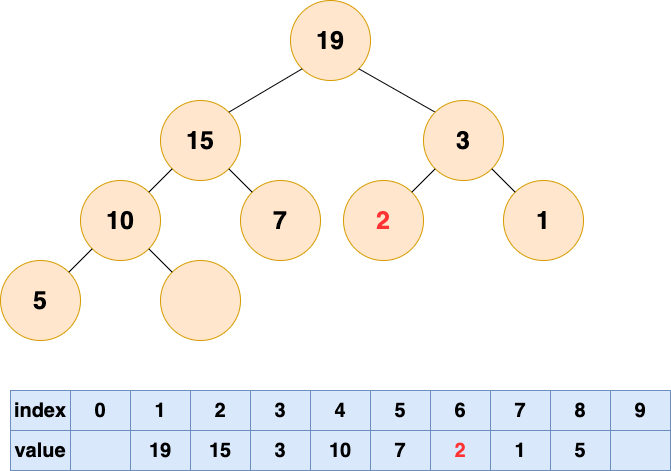

### 堆的操作总结

- 插入元素：先将元素放至数组末尾，再自底向上堆化，将末尾元素上浮
- 删除堆顶元素：删除堆顶元素，将末尾元素放至堆顶，再自顶向下堆化，将堆顶元素下沉。也可以自底向上堆化，只是会产生“气泡”，浪费存储空间。最好采用自顶向下堆化的方式。

## 堆排序

堆排序的过程分为两步：
- 第一步是建堆，将一个无序的数组建立为一个堆
- 第二步是排序，将堆顶元素取出，然后对剩下的元素进行堆化，反复迭代，直到所有元素被取出为止。

### 建堆

如果你已经足够了解堆化的过程，那么建堆的过程掌握起来就比较容易了。建堆的过程就是一个对所有非叶节点的自顶向下堆化过程。

首先要了解哪些是非叶节点，最后一个节点的父结点及它之前的元素，都是非叶节点。也就是说，如果节点个数为 n，那么我们需要对 n/2 到 1 的节点进行自顶向下（沉底）堆化。

具体过程如下图：

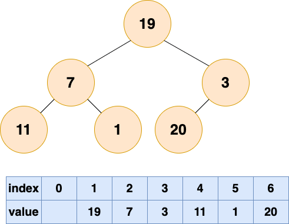

将初始的无序数组抽象为一棵树，图中的节点个数为 6，所以 4,5,6 节点为叶节点，1,2,3 节点为非叶节点，所以要对 1-3 号节点进行自顶向下（沉底）堆化，注意，顺序是从后往前堆化，从 3 号节点开始，一直到 1 号节点。

3 号节点堆化结果：

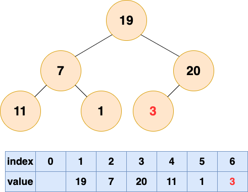

2 号节点堆化结果：

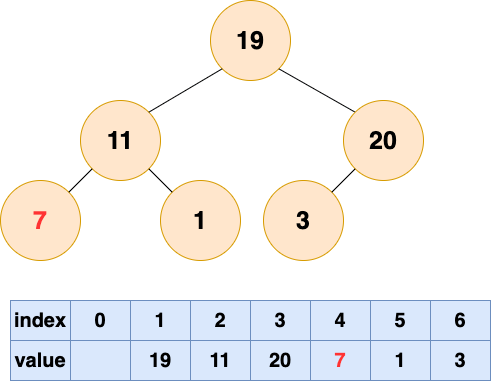

1 号节点堆化结果：

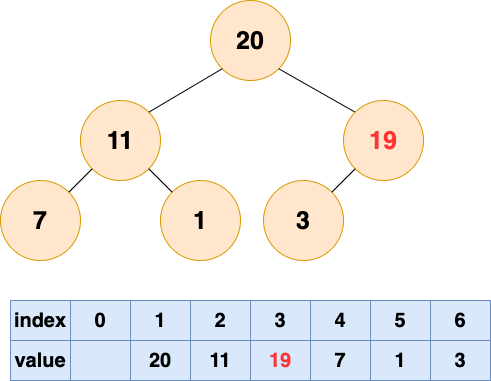

至此，数组所对应的树已经成为了一个最大堆，建堆完成！

### 排序

由于堆顶元素是所有元素中最大的，所以我们重复取出堆顶元素，将这个最大的堆顶元素放至数组末尾，并对剩下的元素进行堆化即可。

现在思考两个问题：
- 删除堆顶元素后需要执行自顶向下（沉底）堆化还是自底向上（上浮）堆化？
- 取出的堆顶元素存在哪，新建一个数组存？

先回答第一个问题，我们需要执行自顶向下（沉底）堆化，这个堆化一开始要将末尾元素移动至堆顶，这个时候末尾的位置就空出来了，由于堆中元素已经减小，这个位置不会再被使用，所以我们可以将取出的元素放在末尾。

机智的小伙伴已经发现了，这其实是做了一次交换操作，将堆顶和末尾元素调换位置，从而将取出堆顶元素和堆化的第一步(将末尾元素放至根结点位置)进行合并。

详细过程如下图所示：

取出第一个元素并堆化：

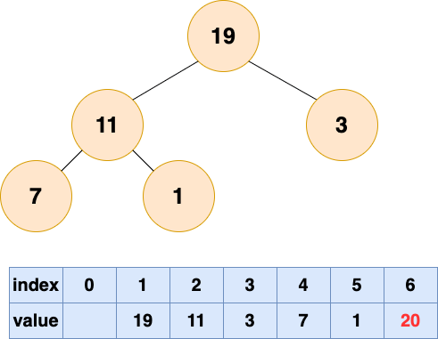

取出第二个元素并堆化：

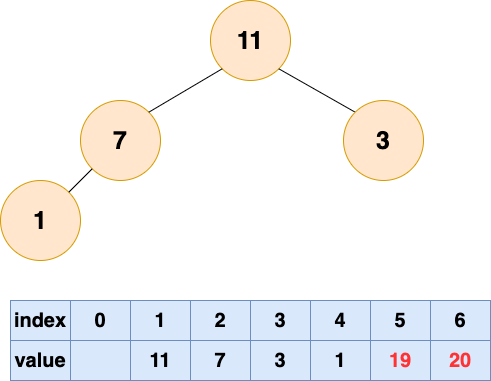

取出第三个元素并堆化：

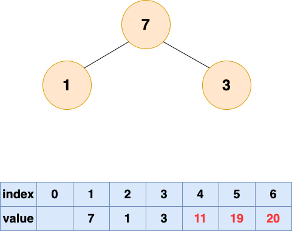

取出第四个元素并堆化：

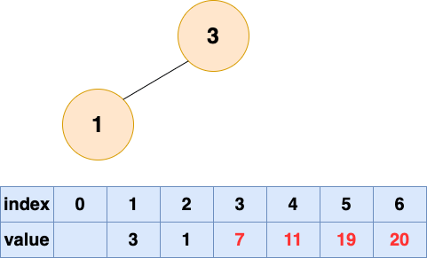

取出第五个元素并堆化：

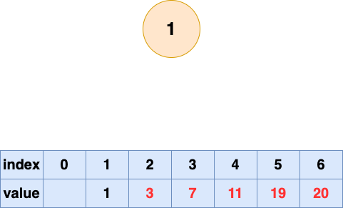

取出第六个元素并堆化：

堆排序完成！
