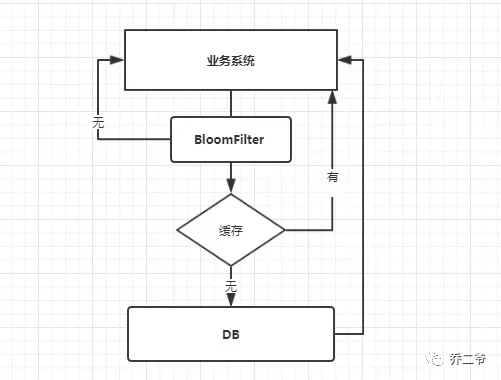
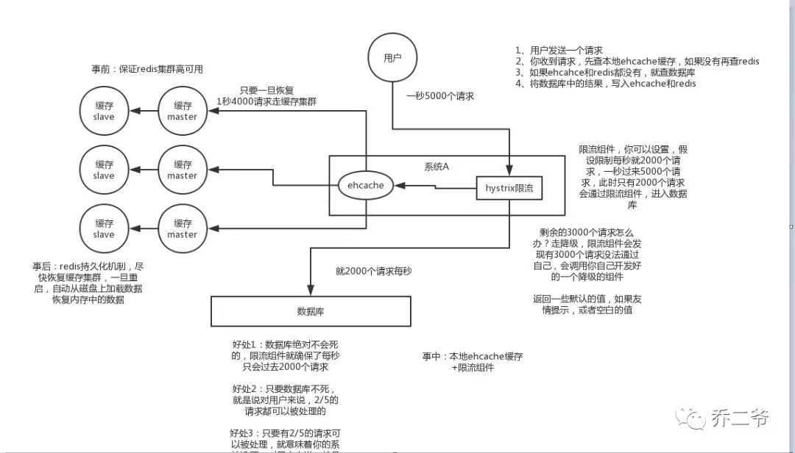

# 基础组件设计核心思路

## 1、ORM组件设计
### 核心功能

- 根据ID获取Entity
- 根据QueryWrapper获取第一个Entity
- 根据ID集合获取Entity列表
- 获取所有Entity列表
- 根据QueryWrapper获取Entity列表
- 根据IPage分页查询对象获取Entity分页数据
- 根据IPage分页查询对象和QueryWrapper获取Entity分页数据
- 保存Entity（ID不存在插入记录，ID存在更新记录）
- 批量保存Entity
- 根据ID删除Entity
- 根据ID集合批量删除Entity
- 根据Entity集合批量删除Entity
- 根据ID获取Vo
- 根据QueryWrapper获取第一个Vo
- 根据ID集合获取Vo列表
- 获取所有Vo列表
- 根据QueryWrapper获取Vo列表
- 根据IPage分页查询对象获取Vo分页数据
- 根据IPage分页查询对象和QueryWrapper获取Vo分页数据
- 保存Dto（ID不存在插入记录，ID存在更新记录）
- 批量保存Dto
- 根据ID集合统计数量
- 根据QueryWrapper统计数量
- 资源访问鉴权
### 关键实现逻辑

1.  逻辑删除 
   - 解决思路：增加is_deleted字段
   - 具体实现：使用Mybatis-Plus的@TableLogic注解修饰实体类的deleted字段，然后通过Mybatis-Plus自带方法删除和查找会自动附带逻辑删除功能（自己写的xml不会）。3.1.1之前的版本还需要注入 LogicSqlInjector。
2.  乐观锁实现 
   - 解决思路：增加version字段
   - 具体实现：使用Mybatis-Plus的@Version注解修饰实体类的version字段，并注入 OptimisticLockerInterceptor。
3.  数据库的唯一索引、联合唯一索引与逻辑删除的兼容性问题 
   - 解决思路：定义逻辑唯一索引和逻辑联合索引
   - 具体实现：在Dto基类中定义 uniqueFields 和 unionKeyFields 方法用来标识逻辑唯一索引和联合唯一索引。Dto类按需重写这两个方法进行标识。
4.  并发场景下的批量数据更新操作可能导致的死锁问题 
   - 解决思路：批量待更新数据排序之后再执行更新操作
   - 具体实现：Dto基类中定义 comparator 方法返回Dto对象的默认 Comparator 实现。Dto类按需重写该方法以实现排序时的比较逻辑。
5.  逻辑删除导致的数据更新查重问题 
   - 解决思路：在代码层面使用逻辑查重
   - 具体实现：根据 uniqueFields 和 unionKeyFields 进行逻辑查重，从而避免数据库唯一索引或者唯一联合索引导致的数据更新冲突。
6.  批量更新时的数据去重 
   - 解决思路：在代码层面使用逻辑去重
   - 具体实现：根据 uniqueFields 和 unionKeyFields 进行Dto集合的逻辑去重。
7.  审计功能 
   - 解决思路：使用框架自带的字段填充功能或者hook方法写入
   - 具体实现：使用Mybatis-Plus的@TableField注解并结合自定义的 MetaObjectHandler 实现指定字段自动填充。
8.  审计日志 
   - 解决思路：在数据更新逻辑中增加 hook 方法
   - 具体实现：定义AuditLogger接口，并在数据更新逻辑中调用 AuditLogger的 log 方法。配置不同实体类与 AuditLogger实现的对应关系，或者使用全局 AuditLogger。
## 2、缓存服务设计
### 核心功能

- 缓存数据设置
- 缓存数据获取
- 本地-分布式 两级缓存结构
- 根据待缓存数据自动选择合适的缓存数据类型进行存储
- 业务层与缓存层解耦
- 缓存管理和监控平台，方便的查询、管理和监控线上缓存数据
### 关键实现逻辑

1.  本地-分布式 两级缓存结构的兼容策略 
   - 解决思路：优先级 本地 > 分布式
   - 具体实现： 
      - 更新操作： 
         - 更新数据库；
         - 删除本地缓存和分布式缓存。
      - 查询操作： 
         - 查询本地缓存；
         - 本地缓存命中，返回缓存数据；
         - 本地缓存未命中，查询分布式缓存；
         - 分布式缓存命中，更新本地缓存，返回缓存数据；
         - 分布式缓存未命中，查询数据库，更新本地缓存和分布式缓存，返回数据。
2.  缓存数据类型自动适配 
   - 解决思路：约定不同平台数据类型的对应关系
   - 具体实现：约定 Java 中的数据类型与 Redis 数据类型的对应关系，如 Java 中的 List 对应 Redis 中的 List。
3.  业务层与缓存层解耦 
   - 解决思路：业务层中配置是否启用缓存功能以及相应的缓存策略
   - 具体实现： 
      - 业务层的缓存配置信息的设置可以使用配置文件和自定义注解进行实现。
      - 使用 Spring Boot Starter 技术根据配置信息（如是否启用缓存功能）自动装配缓存配置 Configuration 类，Configuration 类中按需注入相关 Bean。
      - 在切面中编写缓存数据设置及获取的具体实现逻辑。
4.  缓存穿透 
   -  解决思路：BloomFilter（布隆过滤）+ 缓存空值 
   -  具体实现： 
      - BloomFilter：BloomFilter 类似于一个 hbase set 用来判断某个元素（key）是否存在于某个集合中。这种方式在大数据场景应用比较多，比如 Hbase 中使用它去判断数据是否在磁盘上。还有在爬虫场景判断 url 是否已经被爬取过。这种方案可以加在第一种方案中，在缓存之前在加一层 BloomFilter ，在查询的时候先去 BloomFilter 去查询 key 是否存在，如果不存在就直接返回，存在再走查缓存 -> 查 DB。
      - 缓存空值：之所以会发生穿透，就是因为缓存中没有存储这些空数据的 key。从而导致每次查询都到数据库去了。那么我们就可以为这些 key 对应的值设置为 null 丢到缓存里面去。后面再出现查询这个 key 的请求的时候，直接返回null 。这样，就不用在到数据库中去走一圈了，但是别忘了设置过期时间。
      - 流程图：

5.  缓存雪崩 
   - 解决思路：互斥锁
   - 具体实现：多个线程同时去查询数据库的某条数据，那么我们可以在第一个查询数据的请求上使用一个互斥锁来锁住它。其他的线程走到这一步拿不到锁就等着，等第一个线程查询到了数据，然后做缓存。后面的线程进来发现已经有缓存了，就直接走缓存。
6.  缓存击穿 
   -  解决思路： 
      - 事前：使用缓存集群，保证缓存服务的高可用
      - 事中：本地缓存 + 限流&降级
      - 事后：开启Redis持久化机制，尽快恢复缓存集群
   -  具体实现： 
      - 事前：搭建Redis集群实现Redis服务的高可用
      - 事中：在Redis集群完全不可用的时候，使用本地缓存还能够支撑一阵。使用限流&降级，保证数据库在面对大量请求还能提供服务。
      - 事后：一旦重启，就能从磁盘上自动加载数据恢复内存中的数据。
      - 流程图：

7.  根据Key前缀模糊删除 
   - 解决思路：模糊查找 + 批量删除key
   - 具体实现：先根据Key前缀进行模糊查找，批量删除匹配到的Key。
## 3、任务调度服务设计
### 核心功能

- 任务管理 
   - 执行器
- 执行器管理
- 日志管理 
   - 调度日志
   - 执行日志
- 运行报表
- 失败告警
- 调度中心 
   - 数据中心
   - 调度器
   - 任务回调处理
- 执行器 
   - 调度请求
   - JobHandler
   - 任务回调
## 4、数据权限设计
### 核心功能

- 部门权限过滤 
   - 权限范围（设置到员工，默认是员工所属部门及下属部门） 
      - 仅自己（部门权限内且创建人是自己的）
      - 指定部门（按分配的部门用in过滤，不包含下级）
      - 指定部门及下属部门（按分配的部门用in过滤，包含下级部门）
      - 所有部门（可查看所有部门）
- 特殊对象权限过滤 
   - 指定对象 
      - 用户（可多个）
      - 角色（可多个）
   - 权限范围（同上述的部门权限范围）
- 业务关联对象权限过滤 
   - 门店权限过滤
   - 仓库权限过滤
### 关键实现逻辑

1.  过滤策略的存储 
   - 解决思路：数据库 + 缓存
   - 具体实现：对象的权限范围信息保存至数据库，不同对象按照权限范围查询出相关参数并保存到缓存，更新对象的过滤策略时自动更新相应缓存。
2.  权限过滤的具体实现 
   - 解决思路：权限过滤注解 + 查询方法切面
   - 具体实现：在业务ServiceImpl类上添加自定义权限过滤注解 [@AuthFilter(name ](/AuthFilter(name ) = "entity")（注解中的name参数用于将数据库中的过滤策略与实体类关联起来），在 AuthFilterAspect 切面的 before 增强中获取过滤策略并转成查询条件存入 ThreadLocal 变量中，查询方法执行实际的业务逻辑从 ThreadLocal 中获取查询条件转换并拼接至 QueryWrapper 对象，使用拼接后的 QueryWrapper 对象进行查询。 
## 5、推送服务设计
### 核心功能

- 移动APP通知推送
- Web网页消息推送
- 短信发送
- 短信回复统一处理
- 邮件发送
### 关键实现逻辑

1.  批量消息并行推送 
   - 解决思路：多线程 + 消息队列
   - 具体实现：使用多线程将批量消息打入消息队列，消息队列监听端接收消息后使用多线程执行具体的消息推送逻辑。
2.  消息多渠道推送 
   - 解决思路：PushProps设置多个推送渠道（如短信、邮件）
   - 具体实现：同一条消息根据PushProps中设置的多个推送渠道分别进行推送。
3.  延迟（定时）推送 
   - 解决思路：延迟队列
   - 具体实现：PushProps设置延迟推送相关参数，使用延迟队列实现延迟消息推送。
## 6、文件服务设计
### 核心功能

- 上传文件
- 下载文件
- 防盗链：通过设置Policy，将对象的访问权限限制在某些网站，或者某些IP段，从而对数据起到保护作用，防止对象被过度下载，以保护客户利益。
- 租户隔离：支持创建多个子租户，每个子租户都有独立的访问口令，并且只能访问属于自己的存储空间，实现数据访问隔离。
- 日志记录：记录访问请求的信息，包括请求时间、数据量大小、对象名称等。通过分析日志得到有价值的业务信息，如用户来源、使用习惯、恶意攻击等。
- 图片处理：可以对存储的图片进行处理，例如图片缩略、格式转换、裁剪、缩放、水印等。
### 关键实现逻辑

1.  用户访问权限控制 
   - 解决思路：访问文件时先进行鉴权
   - 具体实现：定义文件访问权限信息并进行持久化，向指定目标用户执行授权操作。用户访问文件时先通过 checkAccess 方法进行鉴权。
2.  防盗链 
   - 解决思路：增加IP白名单过滤
   - 具体实现：访问文件时在文件服务的拦截器中进行访问IP的白名单校验，校验通过才允许进行访问。
3.  租户隔离 
   - 解决思路：指定租户对应的fastdfs的store_group
   - 具体实现：上传文件、访问文件时在文件服务的拦截器中指定租户的store_group。
4.  图片尺寸转换 
   - 解决思路：访问时转换图片尺寸
   - 具体实现：访问图片文件时如果指定了图片尺寸参数（长和宽），则从fastdfs取到图片后通过图片工具转换成指定的尺寸之后再返回。
## 7、消息队列服务设计
### 核心功能

- 消息发布
- 消息订阅
- 延迟队列
- 重试队列
- 顺序队列
### 关键实现逻辑

1.  延迟队列 
   - 解决思路：使用RabbitMQ死信队列
   - 具体实现：Queue中配置参数 `x-dead-letter-exchange`、`x-dead-letter-routing-key`，发送消息时给消息设置延迟毫秒值 `message.getMessageProperties().setExpiration(delayMillis);`
2.  重试队列 
   - 解决思路：缓存 + RabbitMQ confirmCallback
   - 具体实现：发送可重试消息时缓存 `message` 和 `retryProps`，消息接收成功删除相关缓存，消费接收失败则读取缓存中的 `message` 和 `retryProps` 并执行重试操作。
